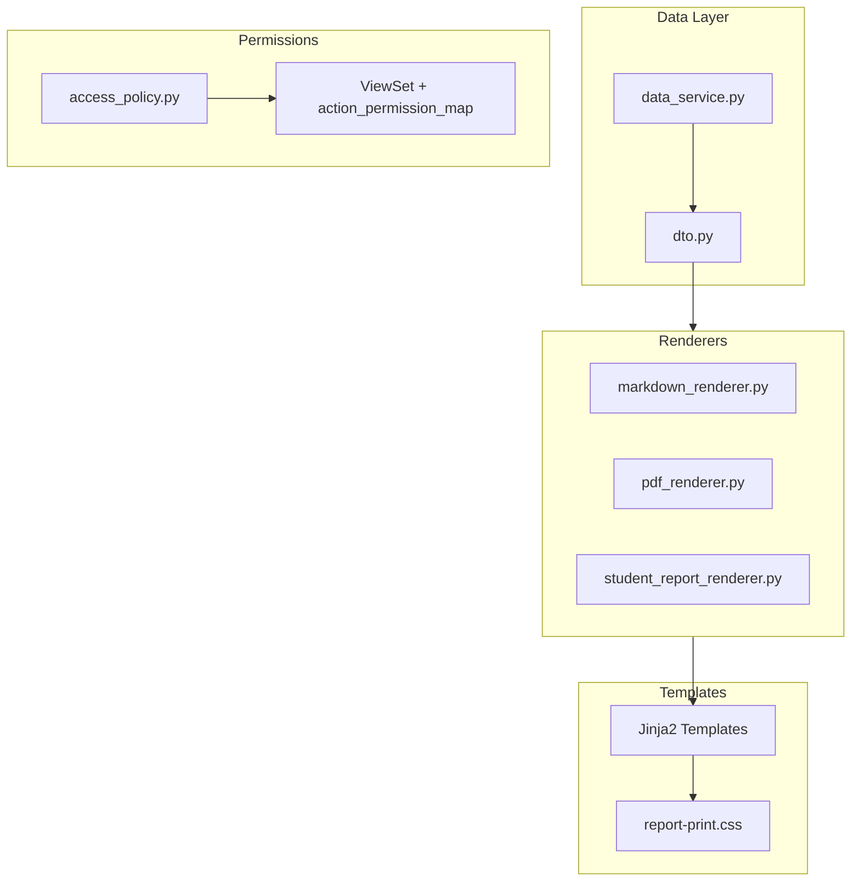
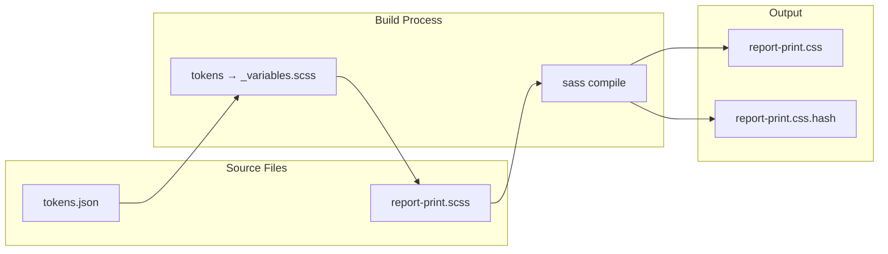
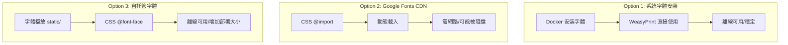

# Exporters 與權限系統重構計畫

## 現況問題

- `exporters.py` 共 2,642 行，職責混雜：資料查詢、CSS 樣式、圖表 SVG、HTML 渲染、i18n 條件判斷
- CSS 內嵌為 Python f-string（約 600 行），難以維護與版本控管
- i18n 分散為 `if lang.startswith('zh')` 條件式
- `views.py` 權限檢查混用 `IsContestOwnerOrAdmin` 與手寫 `request.user` 判斷

## 重構架構



## PR1: 基礎拆分 - Data Service / DTO / Utils

### 新增檔案結構

```
backend/apps/contests/exporters/
├── __init__.py          # 暴露工廠函數
├── data_service.py      # 資料查詢與彙總
├── dto.py               # dataclass 定義
├── utils.py             # markdown helper、圖表生成
├── locales/
│   ├── __init__.py
│   ├── zh_tw.py         # 中文字串映射
│   └── en_us.py         # 英文字串映射
└── renderers/
    ├── __init__.py
    ├── base.py          # 基礎渲染器
    ├── markdown.py      # Markdown 渲染
    └── pdf.py           # PDF 渲染
```

### data_service.py 職責

```python
# 從現有 ContestExporter、StudentReportExporter 抽取
class ContestDataService:
    def get_contest_problems(self) -> List[ContestProblemDTO]
    def get_participants(self) -> List[ParticipantDTO]
    def get_submissions(self, user_id=None) -> List[SubmissionDTO]
    def calculate_standings() -> StandingsDTO
    def get_difficulty_stats(user_id) -> DifficultyStatsDTO
```

### dto.py 定義

```python
@dataclass
class ContestDTO:
    id: int
    name: str
    description: str
    rules: str
    start_time: datetime
    end_time: datetime
    exam_mode_enabled: bool

@dataclass
class ProblemDTO:
    id: int
    label: str
    title: str
    description: str
    # ... 其他欄位

@dataclass
class StandingsDTO:
    rank: int
    total_participants: int
    user_stats: dict
    standings: List[dict]
```

### 遷移策略與 API 相容性

1. 先建立新模組，從舊檔案 import 現有函數
2. 逐步將查詢邏輯搬到 `data_service.py`
3. 保持 `exporters.py` 的公開 API 不變（透過 `__init__.py` 暴露）

### API 相容層（Shim）

在 `exporters/__init__.py` 保留原有介面，提供向後相容：

```python
# exporters/__init__.py
"""
Backward-compatible exports.
新代碼請直接從子模組 import。
"""

# 舊介面 -> 新位置的別名
from .renderers.markdown import MarkdownRenderer as MarkdownExporter
from .renderers.pdf import PDFRenderer as PDFExporter
from .renderers.student_report import StudentReportRenderer as StudentReportExporter
from .utils import sanitize_filename

# 明確標示為 deprecated
import warnings

def _deprecated_alias(old_name, new_path):
    warnings.warn(
        f"{old_name} is deprecated, import from {new_path} instead",
        DeprecationWarning,
        stacklevel=3
    )

# 若需要完全相容舊 class 名稱
__all__ = [
    'MarkdownExporter',
    'PDFExporter',
    'StudentReportExporter',
    'sanitize_filename',
]
```

### 遷移指引

| 舊位置 | 新位置 | 備註 |

|--------|--------|------|

| `exporters.MarkdownExporter` | `exporters.renderers.markdown.MarkdownRenderer` | 介面不變 |

| `exporters.PDFExporter` | `exporters.renderers.pdf.PDFRenderer` | 介面不變 |

| `exporters.StudentReportExporter` | `exporters.renderers.student_report.StudentReportRenderer` | 介面不變 |

| `exporters.sanitize_filename` | `exporters.utils.sanitize_filename` | 純函數 |

| `exporters.render_markdown` | `exporters.utils.render_markdown` | 純函數 |

| `exporters.inline_markdown` | `exporters.utils.inline_markdown` | 純函數 |

| (內部) `ContestExporter` | `exporters.data_service.ContestDataService` | 資料層 |

| (內部) `get_contest_problems` | `ContestDataService.get_contest_problems()` | 回傳 DTO |

| (內部) `calculate_standings` | `ContestDataService.calculate_standings()` | 回傳 DTO |

---

## PR2: 模板化渲染與樣式外部化

### 模板結構

```
backend/templates/exports/
├── contest.md.j2           # Markdown 模板
├── contest.html.j2         # PDF HTML 模板
├── student_report.html.j2  # 學生報告模板
└── partials/
    ├── problem_card.html.j2
    ├── sample_case.html.j2
    └── score_cards.html.j2
```

### Design Tokens / SCSS 編譯管線



### 樣式檔案結構

```
backend/
├── styles/
│   ├── tokens.json              # Design tokens 定義
│   ├── _variables.scss          # 從 tokens 生成
│   ├── _base.scss               # 基礎樣式
│   ├── _components.scss         # 元件樣式
│   └── report-print.scss        # 主入口
├── static/
│   └── exports/
│       ├── report-print.css     # 編譯產物（git tracked）
│       └── report-print.css.hash # 版本 hash
└── scripts/
    └── build_styles.py          # 編譯腳本
```

### 編譯腳本

```python
# scripts/build_styles.py
"""
Design tokens → SCSS variables → CSS 編譯管線
"""
import json
import hashlib
import subprocess
from pathlib import Path

BASE_DIR = Path(__file__).resolve().parent.parent
STYLES_DIR = BASE_DIR / 'styles'
OUTPUT_DIR = BASE_DIR / 'static' / 'exports'

def load_tokens() -> dict:
    """載入 design tokens"""
    with open(STYLES_DIR / 'tokens.json') as f:
        return json.load(f)

def generate_scss_variables(tokens: dict) -> str:
    """將 tokens 轉換為 SCSS 變數"""
    lines = ['// Auto-generated from tokens.json - DO NOT EDIT\n']

    for category, values in tokens.items():
        lines.append(f'// {category}')
        for name, value in values.items():
            scss_name = f"${category}-{name}".replace('_', '-')
            lines.append(f'{scss_name}: {value};')
        lines.append('')

    return '\n'.join(lines)

def compile_scss() -> str:
    """使用 sass 編譯 SCSS"""
    result = subprocess.run(
        ['sass', '--style=compressed',
         str(STYLES_DIR / 'report-print.scss')],
        capture_output=True, text=True, check=True
    )
    return result.stdout

def compute_hash(content: str) -> str:
    """計算 CSS 內容 hash"""
    return hashlib.sha256(content.encode()).hexdigest()[:12]

def main():
    # 1. 載入 tokens
    tokens = load_tokens()

    # 2. 生成 SCSS 變數
    variables = generate_scss_variables(tokens)
    (STYLES_DIR / '_variables.scss').write_text(variables)

    # 3. 編譯 SCSS
    css = compile_scss()

    # 4. 輸出 CSS 與 hash
    OUTPUT_DIR.mkdir(parents=True, exist_ok=True)
    (OUTPUT_DIR / 'report-print.css').write_text(css)

    css_hash = compute_hash(css)
    (OUTPUT_DIR / 'report-print.css.hash').write_text(css_hash)

    print(f"Built report-print.css (hash: {css_hash})")

if __name__ == '__main__':
    main()
```

### Design Tokens 範例

```json
// styles/tokens.json
{
  "color": {
    "primary": "#0f62fe",
    "text": "#161616",
    "text_secondary": "#525252",
    "border": "#e0e0e0",
    "background": "#f4f4f4",
    "success": "#24a148",
    "warning": "#f1c21b",
    "error": "#da1e28"
  },
  "spacing": {
    "xs": "4px",
    "sm": "8px",
    "md": "12px",
    "lg": "16px",
    "xl": "24px"
  },
  "font": {
    "family_sans": "\"IBM Plex Sans\", \"Noto Sans TC\", system-ui, sans-serif",
    "family_mono": "\"IBM Plex Mono\", \"SF Mono\", monospace",
    "size_base": "14px",
    "size_h1": "32px",
    "size_h2": "28px",
    "size_h3": "20px"
  }
}
```

### CSS 載入方式（使用 Django staticfiles）

```python
# renderers/pdf.py
from django.contrib.staticfiles import finders
from django.template.loader import render_to_string
from pathlib import Path

class PDFRenderer:
    # CSS 變數值（scale 相關）
    CSS_VARIABLES = {
        'scale': 1.0,
        'page_margin': '1.5cm',
    }

    def __init__(self, contest, language='zh-TW', scale=1.0, layout='normal'):
        self.contest = contest
        self.language = language
        self.scale = max(0.5, min(2.0, scale))
        self.layout = layout

    def get_css_content(self) -> str:
        """
        使用 Django staticfiles finder 載入 CSS
        確保開發與部署環境一致
        """
        # 使用 finders 而非直接讀 STATIC_ROOT
        css_path = finders.find('exports/report-print.css')
        if not css_path:
            raise FileNotFoundError(
                "report-print.css not found. Run 'python scripts/build_styles.py'"
            )

        base_css = Path(css_path).read_text()

        # 動態變數透過 CSS custom properties 注入
        # 而非 Python .format()
        css_variables = self._generate_css_variables()

        return f"{css_variables}\n{base_css}"

    def _generate_css_variables(self) -> str:
        """生成 CSS custom properties 用於動態值"""
        scale = self.scale
        is_compact = self.layout == 'compact'
        spacing_mult = 0.65 if is_compact else 1.0

        return f"""
        :root {{
            --scale: {scale};
            --page-margin: {'1.0cm' if is_compact else '1.5cm'};
            --spacing-mult: {spacing_mult};
            --base-font-size: {14 * scale}px;
            --h1-size: {32 * scale}px;
            --h2-size: {28 * scale}px;
            --h3-size: {20 * scale}px;
        }}
        """

    def render_html(self) -> str:
        """使用 Jinja2/Django 模板渲染 HTML"""
        from .data_service import ContestDataService

        data_service = ContestDataService(self.contest, self.language)
        context = {
            'contest': data_service.get_contest_dto(),
            'problems': data_service.get_contest_problems(),
            'css_content': self.get_css_content(),
            'labels': get_labels(self.language),
        }

        return render_to_string('exports/contest.html.j2', context)
```

### CI 整合 - 樣式編譯

```yaml
# .github/workflows/unit-tests.yml
jobs:
  test:
    steps:
      - name: Install sass
        run: npm install -g sass

      - name: Build styles
        run: python scripts/build_styles.py

      - name: Check styles are up-to-date
        run: |
          git diff --exit-code static/exports/report-print.css || \
            (echo "CSS is out of date. Run 'python scripts/build_styles.py'" && exit 1)
```

### i18n 集中化

```python
# locales/__init__.py
from typing import Dict
from .zh_tw import LABELS as ZH_TW_LABELS
from .en_us import LABELS as EN_US_LABELS

_LABEL_REGISTRY: Dict[str, Dict[str, str]] = {
    'zh-TW': ZH_TW_LABELS,
    'zh': ZH_TW_LABELS,  # alias
    'en': EN_US_LABELS,
    'en-US': EN_US_LABELS,
}

# 所有支援的 keys（用於測試覆蓋率）
REQUIRED_KEYS = {
    'score', 'solved', 'rank', 'submissions', 'description',
    'input_description', 'output_description', 'hint',
    'sample_cases', 'difficulty', 'time_limit', 'memory_limit',
    'easy', 'medium', 'hard', 'ac', 'wa', 'pending',
    'contest_rules', 'problem_structure', 'exam_time',
    # ... 完整列表
}

def get_labels(language: str) -> Dict[str, str]:
    """取得指定語言的標籤字典"""
    # 嘗試精確匹配
    if language in _LABEL_REGISTRY:
        return _LABEL_REGISTRY[language]

    # 嘗試語言前綴匹配
    prefix = language.split('-')[0].lower()
    if prefix in _LABEL_REGISTRY:
        return _LABEL_REGISTRY[prefix]

    # 預設英文
    return EN_US_LABELS

def validate_labels(labels: Dict[str, str]) -> list:
    """驗證標籤字典是否包含所有必要 keys"""
    missing = REQUIRED_KEYS - set(labels.keys())
    return list(missing)
```
```python
# locales/zh_tw.py
LABELS = {
    # 分數相關
    'score': '總分',
    'solved': '解題數',
    'rank': '排名',
    'submissions': '提交次數',

    # 題目相關
    'description': '題目描述',
    'input_description': '輸入說明',
    'output_description': '輸出說明',
    'hint': '提示',
    'sample_cases': '範例測試',

    # 難度
    'difficulty': '難度',
    'easy': '簡單',
    'medium': '中等',
    'hard': '困難',

    # 狀態
    'ac': 'AC',
    'wa': 'WA',
    'pending': '評測中',

    # 比賽
    'contest_rules': '競賽規則',
    'problem_structure': '題目結構',
    'exam_time': '考試時間',
    'time_limit': '時間限制',
    'memory_limit': '記憶體限制',

    # ... 其他
}
```

取代現有散佈的條件判斷：

```python
# 現有
score_label = '得分' if lang.startswith('zh') else 'Score'

# 重構後
from .locales import get_labels
labels = get_labels(lang)
score_label = labels['score']
```

---

## PR3: StudentReport 重構

### 圖表生成集中到 utils.py

從 `StudentReportExporter` 抽取：

```python
# utils.py
def generate_scatter_chart_svg(submissions, contest_problems, scale) -> str
def generate_cumulative_chart_svg(submissions, scale) -> str
def highlight_code(code, language) -> str
```

### 排名計算移到 data_service.py

現有 `calculate_standings()` 約 100 行的邏輯，移到 `ContestDataService`。

---

## PR4: 權限策略導入

### 設計原則

1. **統一錯誤格式**：所有 403 回應使用一致的 JSON 結構
2. **上下文感知權限**：不僅考慮角色，還需考慮 contest 狀態、時間、scoreboard 設定
3. **404 假遮蔽**：對無權限查看的資源回傳 404（而非 403）以避免資訊洩漏

### 定義角色-動作-狀態矩陣

```python
# access_policy.py

# 統一錯誤回應格式
class PermissionError:
    """標準化權限錯誤回應"""
    @staticmethod
    def forbidden(code: str, message: str) -> Response:
        return Response({
            'error': {
                'code': code,
                'message': message,
                'type': 'permission_denied'
            }
        }, status=status.HTTP_403_FORBIDDEN)

    @staticmethod
    def not_found(code: str = 'not_found') -> Response:
        """用於 404 假遮蔽 - 無權限時回傳 404"""
        return Response({
            'error': {
                'code': code,
                'message': 'Resource not found',
                'type': 'not_found'
            }
        }, status=status.HTTP_404_NOT_FOUND)

# 錯誤代碼常數
class ErrorCodes:
    CONTEST_INACTIVE = 'contest_inactive'
    CONTEST_ARCHIVED = 'contest_archived'
    CONTEST_NOT_STARTED = 'contest_not_started'
    CONTEST_ENDED = 'contest_ended'
    SCOREBOARD_HIDDEN = 'scoreboard_hidden'
    NOT_PARTICIPANT = 'not_participant'
    EXAM_NOT_SUBMITTED = 'exam_not_submitted'
    INSUFFICIENT_ROLE = 'insufficient_role'

# 基礎角色權限（不考慮狀態）
BASE_ROLE_PERMISSIONS = {
    'admin': {
        'manage_contest', 'manage_participants', 'manage_problems',
        'view_scoreboard_full', 'view_report', 'export_report',
        'submit', 'view_inactive', 'view_archived'
    },
    'teacher': {
        'manage_contest', 'manage_participants', 'manage_problems',
        'view_scoreboard_full', 'view_report', 'export_report',
        'submit', 'view_inactive'
    },
    'student': {
        'view_scoreboard_limited', 'submit', 'view_own_report'
    },
    'anonymous': {
        'view_public_contest'
    }
}

# 狀態相關的權限限制
STATUS_RESTRICTIONS = {
    'inactive': {
        # inactive 狀態下，只有 admin/teacher 可存取
        'requires_permission': 'view_inactive',
        'error_code': ErrorCodes.CONTEST_INACTIVE,
        'error_message': 'Contest is not active'
    },
    'archived': {
        # archived 狀態下，只有 admin 可存取
        'requires_permission': 'view_archived',
        'error_code': ErrorCodes.CONTEST_ARCHIVED,
        'error_message': 'Contest has been archived'
    }
}
```

### ContestAccessPolicy 完整實作

```python
class ContestAccessPolicy(permissions.BasePermission):
    """
    統一的 Contest 權限策略

    權限判斷順序：
    1. 檢查 contest 狀態（active/inactive/archived）
    2. 檢查時間範圍（start_time/end_time）
    3. 檢查角色基礎權限
    4. 檢查上下文特定條件（如 scoreboard_visible_during_contest）
    """

    # Action 到權限的映射
    action_permission_map = {
        # 匯出相關
        'download': 'export_report',
        'participant_report': 'view_report',
        'my_report': 'view_own_report',

        # 排行榜
        'standings': 'view_scoreboard',
        'export_results': 'export_report',

        # 管理
        'toggle_status': 'manage_contest',
        'archive': 'manage_contest',
        'add_problem': 'manage_problems',
        'reorder_problems': 'manage_problems',
        'participants': 'manage_participants',
        'unlock_participant': 'manage_participants',
    }

    # 需要 404 假遮蔽的 action（無權限時回傳 404 而非 403）
    mask_as_404 = {
        'retrieve',      # 查看 contest 詳情
        'participant_report',  # 查看學生報告
    }

    def has_permission(self, request, view):
        return True  # 延遲到 has_object_permission

    def has_object_permission(self, request, view, obj):
        contest = obj if isinstance(obj, Contest) else getattr(obj, 'contest', None)
        if not contest:
            return True

        user = request.user
        action = view.action
        role = get_user_role_in_contest(user, contest)

        # 1. 檢查 contest 狀態
        status_check = self._check_contest_status(contest, role, action)
        if status_check is not None:
            request._permission_error = status_check
            return False

        # 2. 檢查角色基礎權限
        required_permission = self.action_permission_map.get(action)
        if required_permission:
            if required_permission not in BASE_ROLE_PERMISSIONS.get(role, set()):
                request._permission_error = self._get_error_response(
                    action, ErrorCodes.INSUFFICIENT_ROLE,
                    'You do not have permission to perform this action'
                )
                return False

        # 3. 檢查上下文特定條件
        context_check = self._check_context_conditions(
            contest, user, role, action, request
        )
        if context_check is not None:
            request._permission_error = context_check
            return False

        return True

    def _check_contest_status(self, contest, role, action):
        """檢查 contest 狀態是否允許存取"""
        if contest.status in STATUS_RESTRICTIONS:
            restriction = STATUS_RESTRICTIONS[contest.status]
            required = restriction['requires_permission']

            if required not in BASE_ROLE_PERMISSIONS.get(role, set()):
                return self._get_error_response(
                    action,
                    restriction['error_code'],
                    restriction['error_message']
                )
        return None

    def _check_context_conditions(self, contest, user, role, action, request):
        """檢查上下文特定條件（scoreboard 設定、參與者狀態等）"""

        # Scoreboard 可見性
        if action == 'standings' and role == 'student':
            if not contest.scoreboard_visible_during_contest:
                # 檢查 contest 是否已結束
                if contest.status != 'inactive':
                    return self._get_error_response(
                        action,
                        ErrorCodes.SCOREBOARD_HIDDEN,
                        'Scoreboard is not visible during contest'
                    )

        # 學生自己的報告：需要已繳交
        if action == 'my_report':
            try:
                participant = ContestParticipant.objects.get(
                    contest=contest, user=user
                )
                if participant.exam_status != ExamStatus.SUBMITTED:
                    return self._get_error_response(
                        action,
                        ErrorCodes.EXAM_NOT_SUBMITTED,
                        'You can only view your report after submitting the exam'
                    )
            except ContestParticipant.DoesNotExist:
                return self._get_error_response(
                    action,
                    ErrorCodes.NOT_PARTICIPANT,
                    'You are not a participant in this contest'
                )

        return None

    def _get_error_response(self, action, code, message):
        """根據 action 決定回傳 403 或 404"""
        if action in self.mask_as_404:
            return PermissionError.not_found(code)
        return PermissionError.forbidden(code, message)
```

### ViewSet 整合

```python
class ContestViewSet(viewsets.ModelViewSet):
    permission_classes = [ContestAccessPolicy]

    def permission_denied(self, request, message=None, code=None):
        """覆寫以使用統一的錯誤格式"""
        if hasattr(request, '_permission_error'):
            raise exceptions.PermissionDenied(
                detail=request._permission_error.data
            )
        super().permission_denied(request, message, code)
```

### 權限測試矩陣

```python
# tests_access_policy.py
@pytest.mark.parametrize('role,action,contest_status,scoreboard_visible,expected_status', [
    # Admin 可存取所有狀態
    ('admin', 'standings', 'active', False, 200),
    ('admin', 'standings', 'inactive', False, 200),
    ('admin', 'standings', 'archived', False, 200),

    # Teacher 可存取 active/inactive
    ('teacher', 'download', 'active', False, 200),
    ('teacher', 'download', 'inactive', False, 200),
    ('teacher', 'download', 'archived', False, 403),

    # Student - scoreboard 依設定
    ('student', 'standings', 'active', True, 200),
    ('student', 'standings', 'active', False, 403),
    ('student', 'standings', 'inactive', False, 200),  # 結束後可看

    # 404 假遮蔽
    ('student', 'retrieve', 'inactive', False, 404),  # 非 owner 看 inactive
    ('anonymous', 'retrieve', 'inactive', False, 404),
])
def test_permission_matrix(role, action, contest_status, scoreboard_visible, expected_status):
    # ...
```

---

## 落地步驟與里程碑

| PR | 內容 | 交付物 |

|----|------|--------|

| PR1 | 基礎拆分 | `data_service.py`, `dto.py`, `utils.py`, `locales/` |

| PR2 | 模板化渲染 | Jinja2 templates, `report-print.css`, renderer 重構 |

| PR3 | StudentReport 重構 | 圖表 utils, 報告模板化 |

| PR4 | 權限策略 | `access_policy.py`, ViewSet 重構, 權限測試 |

---

## 測試策略

### HTML Snapshot 測試（PR2/PR3）

測試 HTML 輸出而非 PDF 二進制，確保模板渲染正確：

```python
# tests_exporters.py
import pytest
from pathlib import Path

SNAPSHOT_DIR = Path(__file__).parent / 'snapshots'

class TestMarkdownExporter:
    """Markdown 輸出 snapshot 測試"""

    def test_markdown_export_snapshot(self, contest_with_problems):
        exporter = MarkdownExporter(contest_with_problems, 'zh-TW')
        content = exporter.export()

        snapshot_file = SNAPSHOT_DIR / 'markdown_zh_tw.md'
        if snapshot_file.exists():
            expected = snapshot_file.read_text()
            assert content == expected, "Markdown output has changed"
        else:
            # 首次執行時生成 snapshot
            snapshot_file.write_text(content)
            pytest.skip("Snapshot created, re-run to verify")

    def test_markdown_export_english(self, contest_with_problems):
        """確保英文版本也能正確渲染"""
        exporter = MarkdownExporter(contest_with_problems, 'en')
        content = exporter.export()

        # 基本結構檢查
        assert '## Problems' in content
        assert 'Problem A' in content


class TestPDFExporterHTML:
    """PDF HTML 輸出 snapshot 測試（不測 PDF 二進制）"""

    def test_pdf_html_snapshot(self, contest_with_problems):
        exporter = PDFRenderer(contest_with_problems, 'zh-TW')
        html = exporter.render_html()  # 只測 HTML，不呼叫 export()

        snapshot_file = SNAPSHOT_DIR / 'pdf_html_zh_tw.html'
        if snapshot_file.exists():
            expected = snapshot_file.read_text()
            # 忽略動態內容（時間戳等）
            html_normalized = normalize_html(html)
            expected_normalized = normalize_html(expected)
            assert html_normalized == expected_normalized
        else:
            snapshot_file.write_text(html)
            pytest.skip("Snapshot created")

    def test_html_contains_required_elements(self, contest_with_problems):
        """確保 HTML 包含必要元素"""
        exporter = PDFRenderer(contest_with_problems, 'zh-TW')
        html = exporter.render_html()

        # 結構檢查
        assert '<style>' in html or 'css_content' in html
        assert 'Problem A' in html or '題目 A' in html
        assert 'class="problem-section"' in html


class TestStudentReportHTML:
    """學生報告 HTML snapshot 測試"""

    def test_student_report_html_snapshot(self, contest_with_submissions, student):
        exporter = StudentReportRenderer(contest_with_submissions, student, 'zh-TW')
        html = exporter.render_html()

        snapshot_file = SNAPSHOT_DIR / 'student_report_zh_tw.html'
        # ... similar to above

    def test_report_contains_charts(self, contest_with_submissions, student):
        """確保報告包含圖表 SVG"""
        exporter = StudentReportRenderer(contest_with_submissions, student)
        html = exporter.render_html()

        assert '<svg' in html
        assert 'class="score-cards"' in html


def normalize_html(html: str) -> str:
    """移除動態內容以便比較"""
    import re
    # 移除時間戳
    html = re.sub(r'\d{4}[-/]\d{2}[-/]\d{2}', 'DATE', html)
    html = re.sub(r'\d{2}:\d{2}(:\d{2})?', 'TIME', html)
    # 正規化空白
    html = re.sub(r'\s+', ' ', html)
    return html.strip()
```

### CSS Hash/版本測試

確保 CSS 編譯產物與 hash 一致：

```python
# tests_styles.py
import hashlib
from pathlib import Path
from django.contrib.staticfiles import finders

class TestStylesIntegrity:
    """CSS 樣式完整性測試"""

    def test_css_file_exists(self):
        """確保 CSS 檔案存在"""
        css_path = finders.find('exports/report-print.css')
        assert css_path is not None, (
            "report-print.css not found. Run 'python scripts/build_styles.py'"
        )

    def test_css_hash_matches(self):
        """確保 CSS hash 與內容一致"""
        css_path = finders.find('exports/report-print.css')
        hash_path = finders.find('exports/report-print.css.hash')

        if hash_path is None:
            pytest.skip("Hash file not found")

        css_content = Path(css_path).read_text()
        expected_hash = Path(hash_path).read_text().strip()
        actual_hash = hashlib.sha256(css_content.encode()).hexdigest()[:12]

        assert actual_hash == expected_hash, (
            f"CSS hash mismatch. Expected {expected_hash}, got {actual_hash}. "
            "Run 'python scripts/build_styles.py' to rebuild."
        )

    def test_css_contains_required_classes(self):
        """確保 CSS 包含必要的 class"""
        css_path = finders.find('exports/report-print.css')
        css_content = Path(css_path).read_text()

        required_classes = [
            '.problem-section',
            '.score-cards',
            '.sample-case',
            '.container-card',
            '.highlight',  # code highlighting
        ]

        for cls in required_classes:
            assert cls in css_content, f"Missing CSS class: {cls}"
```

### i18n Key 覆蓋率測試

確保所有語言檔案包含完整的 key：

```python
# tests_locales.py
import pytest
from apps.contests.exporters.locales import (
    get_labels, validate_labels, REQUIRED_KEYS,
    ZH_TW_LABELS, EN_US_LABELS
)

class TestI18nCoverage:
    """i18n 標籤覆蓋率測試"""

    @pytest.mark.parametrize('language,labels', [
        ('zh-TW', ZH_TW_LABELS),
        ('en-US', EN_US_LABELS),
    ])
    def test_all_required_keys_present(self, language, labels):
        """確保所有必要的 key 都存在"""
        missing = validate_labels(labels)
        assert not missing, f"{language} missing keys: {missing}"

    @pytest.mark.parametrize('language,labels', [
        ('zh-TW', ZH_TW_LABELS),
        ('en-US', EN_US_LABELS),
    ])
    def test_no_empty_values(self, language, labels):
        """確保沒有空值"""
        empty_keys = [k for k, v in labels.items() if not v or not v.strip()]
        assert not empty_keys, f"{language} has empty values for: {empty_keys}"

    def test_get_labels_fallback(self):
        """測試語言 fallback 機制"""
        # 精確匹配
        assert get_labels('zh-TW') == ZH_TW_LABELS

        # 前綴匹配
        assert get_labels('zh-CN') == ZH_TW_LABELS  # fallback to zh

        # 未知語言 fallback 到英文
        assert get_labels('fr-FR') == EN_US_LABELS

    def test_labels_used_in_templates(self):
        """確保模板中使用的 key 都有定義"""
        from pathlib import Path
        import re

        template_dir = Path('templates/exports')
        label_pattern = re.compile(r"\{\{\s*labels\.(\w+)\s*\}\}")

        used_keys = set()
        for template_file in template_dir.glob('**/*.j2'):
            content = template_file.read_text()
            used_keys.update(label_pattern.findall(content))

        # 所有使用的 key 都應該在 REQUIRED_KEYS 中
        undefined = used_keys - REQUIRED_KEYS
        assert not undefined, f"Templates use undefined keys: {undefined}"
```

### 權限測試 - action_permission_map 參數化

完整的權限矩陣測試：

```python
# tests_access_policy.py
import pytest
from rest_framework.test import APIClient
from apps.contests.models import Contest, ContestParticipant, ExamStatus
from apps.users.models import User

class TestContestAccessPolicy:
    """ContestAccessPolicy 參數化測試"""

    @pytest.fixture
    def setup_contest(self, db):
        """建立測試用 contest 與各角色使用者"""
        admin = User.objects.create_superuser('admin', 'admin@test.com', 'pass')
        teacher = User.objects.create_user('teacher', 'teacher@test.com', 'pass')
        student = User.objects.create_user('student', 'student@test.com', 'pass')
        anon_client = APIClient()

        contest = Contest.objects.create(
            name='Test Contest',
            owner=teacher,
            status='active',
            scoreboard_visible_during_contest=False,
        )

        # 註冊學生
        ContestParticipant.objects.create(
            contest=contest, user=student, exam_status=ExamStatus.SUBMITTED
        )

        return {
            'contest': contest,
            'admin': admin,
            'teacher': teacher,
            'student': student,
        }

    # ==================== 角色 × 動作 × 預期 ====================

    @pytest.mark.parametrize('role,action,expected_status', [
        # 匯出報告
        ('admin', 'download', 200),
        ('teacher', 'download', 200),
        ('student', 'download', 403),
        ('anonymous', 'download', 401),

        # 查看學生報告
        ('admin', 'participant_report', 200),
        ('teacher', 'participant_report', 200),
        ('student', 'participant_report', 404),  # 404 假遮蔽

        # 排行榜（scoreboard_visible=False）
        ('admin', 'standings', 200),
        ('teacher', 'standings', 200),
        ('student', 'standings', 403),  # 比賽中不可見

        # 管理參與者
        ('admin', 'participants', 200),
        ('teacher', 'participants', 200),
        ('student', 'participants', 403),
    ])
    def test_action_permission_active_contest(
        self, setup_contest, role, action, expected_status
    ):
        """測試 active 狀態下的權限"""
        contest = setup_contest['contest']
        client = APIClient()

        if role != 'anonymous':
            user = setup_contest[role]
            client.force_authenticate(user=user)

        url = self._get_action_url(contest.id, action)
        response = client.get(url)

        assert response.status_code == expected_status, (
            f"{role} -> {action}: expected {expected_status}, "
            f"got {response.status_code}"
        )

    # ==================== 角色 × 動作 × Contest 狀態 ====================

    @pytest.mark.parametrize('role,action,contest_status,expected_status', [
        # inactive 狀態
        ('admin', 'retrieve', 'inactive', 200),
        ('teacher', 'retrieve', 'inactive', 200),
        ('student', 'retrieve', 'inactive', 404),  # 404 假遮蔽

        # archived 狀態
        ('admin', 'retrieve', 'archived', 200),
        ('teacher', 'retrieve', 'archived', 403),  # teacher 不能看 archived
        ('student', 'retrieve', 'archived', 404),

        # inactive 時 scoreboard 變可見
        ('student', 'standings', 'inactive', 200),  # 結束後可看
    ])
    def test_action_permission_by_status(
        self, setup_contest, role, action, contest_status, expected_status
    ):
        """測試不同 contest 狀態下的權限"""
        contest = setup_contest['contest']
        contest.status = contest_status
        contest.save()

        client = APIClient()
        if role != 'anonymous':
            user = setup_contest[role]
            client.force_authenticate(user=user)

        url = self._get_action_url(contest.id, action)
        response = client.get(url)

        assert response.status_code == expected_status

    # ==================== Scoreboard 設定測試 ====================

    @pytest.mark.parametrize('scoreboard_visible,role,expected_status', [
        (True, 'student', 200),   # 開啟時可看
        (False, 'student', 403),  # 關閉時不可看
        (True, 'teacher', 200),   # teacher 不受影響
        (False, 'teacher', 200),
    ])
    def test_scoreboard_visibility_setting(
        self, setup_contest, scoreboard_visible, role, expected_status
    ):
        """測試 scoreboard_visible_during_contest 設定"""
        contest = setup_contest['contest']
        contest.scoreboard_visible_during_contest = scoreboard_visible
        contest.save()

        client = APIClient()
        user = setup_contest[role]
        client.force_authenticate(user=user)

        url = f'/api/v1/contests/{contest.id}/standings/'
        response = client.get(url)

        assert response.status_code == expected_status

    # ==================== 學生自己報告的特殊條件 ====================

    @pytest.mark.parametrize('exam_status,expected_status', [
        (ExamStatus.SUBMITTED, 200),    # 已繳交可看
        (ExamStatus.IN_PROGRESS, 403),  # 進行中不可看
        (ExamStatus.PAUSED, 403),
        (ExamStatus.LOCKED, 403),
    ])
    def test_my_report_requires_submitted(
        self, setup_contest, exam_status, expected_status
    ):
        """測試 my_report 需要 exam_status=SUBMITTED"""
        contest = setup_contest['contest']
        student = setup_contest['student']

        participant = ContestParticipant.objects.get(contest=contest, user=student)
        participant.exam_status = exam_status
        participant.save()

        client = APIClient()
        client.force_authenticate(user=student)

        url = f'/api/v1/contests/{contest.id}/my_report/'
        response = client.get(url)

        assert response.status_code == expected_status

    # ==================== 錯誤格式一致性測試 ====================

    def test_403_error_format(self, setup_contest):
        """測試 403 回應格式一致性"""
        contest = setup_contest['contest']
        student = setup_contest['student']

        client = APIClient()
        client.force_authenticate(user=student)

        url = f'/api/v1/contests/{contest.id}/download/'
        response = client.get(url)

        assert response.status_code == 403
        assert 'error' in response.json()
        error = response.json()['error']
        assert 'code' in error
        assert 'message' in error
        assert 'type' in error
        assert error['type'] == 'permission_denied'

    def _get_action_url(self, contest_id, action):
        """根據 action 取得對應 URL"""
        action_urls = {
            'retrieve': f'/api/v1/contests/{contest_id}/',
            'download': f'/api/v1/contests/{contest_id}/download/',
            'participant_report': f'/api/v1/contests/{contest_id}/participants/1/report/',
            'standings': f'/api/v1/contests/{contest_id}/standings/',
            'participants': f'/api/v1/contests/{contest_id}/participants/',
            'my_report': f'/api/v1/contests/{contest_id}/my_report/',
        }
        return action_urls.get(action, f'/api/v1/contests/{contest_id}/{action}/')
```

### action_permission_map 完整性測試

確保所有 ViewSet action 都有對應的權限定義：

```python
# tests_access_policy.py (continued)

class TestActionPermissionMapCompleteness:
    """確保 action_permission_map 涵蓋所有 action"""

    def test_all_viewset_actions_have_permission_mapping(self):
        """檢查所有 ContestViewSet action 都有權限映射"""
        from apps.contests.views import ContestViewSet
        from apps.contests.access_policy import ContestAccessPolicy

        # 取得 ViewSet 的所有 action
        viewset_actions = set()
        for attr_name in dir(ContestViewSet):
            attr = getattr(ContestViewSet, attr_name)
            if hasattr(attr, 'detail') or hasattr(attr, 'url_path'):
                viewset_actions.add(attr_name)

        # 加入標準 CRUD actions
        viewset_actions.update(['list', 'create', 'retrieve', 'update',
                                'partial_update', 'destroy'])

        # 取得 action_permission_map 的 keys
        mapped_actions = set(ContestAccessPolicy.action_permission_map.keys())

        # 檢查未映射的 action
        unmapped = viewset_actions - mapped_actions

        # 某些 action 可能不需要特殊權限（使用預設）
        allowed_unmapped = {'list', 'create'}  # 公開或用 IsAuthenticated

        unexpected_unmapped = unmapped - allowed_unmapped
        assert not unexpected_unmapped, (
            f"Actions without permission mapping: {unexpected_unmapped}. "
            "Add them to ContestAccessPolicy.action_permission_map"
        )
```

---

## 字體與部署策略

### 所需字體

PDF/print 渲染需要以下字體以確保中英文正確顯示：

| 字體 | 用途 | 權重 |

| ------------- | ---------- | -------- |

| IBM Plex Sans | 英文主字體 | 400, 600 |

| IBM Plex Mono | 程式碼字體 | 400 |

| Noto Sans TC | 繁體中文 | 400, 600 |

### 部署選項比較



### 建議方案：系統字體安裝（Option 1）

**Dockerfile 修改：**

```dockerfile
# backend/Dockerfile
FROM python:3.11-slim

# 安裝 WeasyPrint 依賴與字體
RUN apt-get update && apt-get install -y \
    # WeasyPrint 系統依賴
    libpango-1.0-0 \
    libpangocairo-1.0-0 \
    libcairo2 \
    libgdk-pixbuf2.0-0 \
    libffi-dev \
    shared-mime-info \
    # 字體工具
    fontconfig \
    && rm -rf /var/lib/apt/lists/*

# 安裝 Google Fonts
RUN mkdir -p /usr/share/fonts/truetype/google-fonts

# IBM Plex Sans
ADD https://github.com/IBM/plex/releases/download/v6.4.0/TrueType.zip /tmp/plex.zip
RUN unzip -j /tmp/plex.zip "*/IBM-Plex-Sans/*.ttf" -d /usr/share/fonts/truetype/google-fonts/ \
    && unzip -j /tmp/plex.zip "*/IBM-Plex-Mono/*.ttf" -d /usr/share/fonts/truetype/google-fonts/ \
    && rm /tmp/plex.zip

# Noto Sans TC
ADD https://github.com/notofonts/noto-cjk/releases/download/Sans2.004/03_NotoSansCJK-OTC.zip /tmp/noto.zip
RUN unzip -j /tmp/noto.zip "*.ttc" -d /usr/share/fonts/truetype/google-fonts/ \
    && rm /tmp/noto.zip

# 更新字體快取
RUN fc-cache -fv
```

**docker-compose.yml 字體卷（開發環境）：**

```yaml
services:
  backend:
    volumes:
      # 開發時可掛載本機字體（macOS/Linux）
      - /usr/share/fonts:/usr/share/fonts:ro
      # 或 macOS
      - /System/Library/Fonts:/System/Library/Fonts:ro
      - ~/Library/Fonts:/root/.local/share/fonts:ro
```

### CSS 字體宣告

```css
/* report-print.css */

/* 字體堆疊：優先使用系統安裝，fallback 到通用 */
body {
  font-family: "IBM Plex Sans", /* 首選 */ "Noto Sans TC", /* 中文 */
      "Microsoft JhengHei", /* Windows 中文 fallback */ "PingFang TC", /* macOS 中文 fallback */
      system-ui, -apple-system, sans-serif;
}

code,
pre {
  font-family: "IBM Plex Mono", "SF Mono", "Monaco", "Consolas", monospace;
}

/* 不使用 @import CDN - WeasyPrint 在離線環境可能失敗 */
/* 若需 CDN fallback，應在 HTML <head> 中條件載入 */
```

### 字體驗證腳本

```python
# scripts/check_fonts.py
"""驗證 PDF 所需字體是否可用"""

import subprocess
import sys

REQUIRED_FONTS = [
    'IBM Plex Sans',
    'IBM Plex Mono',
    'Noto Sans CJK TC',  # 或 'Noto Sans TC'
]

def check_fonts():
    result = subprocess.run(['fc-list'], capture_output=True, text=True)
    installed = result.stdout.lower()

    missing = []
    for font in REQUIRED_FONTS:
        if font.lower() not in installed:
            missing.append(font)

    if missing:
        print(f"Missing fonts: {', '.join(missing)}")
        print("\nInstall with:")
        print("  apt-get install fonts-ibm-plex fonts-noto-cjk")
        sys.exit(1)
    else:
        print("All required fonts installed")

if __name__ == '__main__':
    check_fonts()
```

### CI 整合

```yaml
# .github/workflows/unit-tests.yml
jobs:
  test:
    steps:
      - name: Install fonts
        run: |
          sudo apt-get update
          sudo apt-get install -y fonts-noto-cjk
          # IBM Plex 需手動安裝或使用上述 Dockerfile 方式

      - name: Verify fonts
        run: python scripts/check_fonts.py
```

### 文件說明

在 `backend/RUN_TESTS.md` 或 README 中加入：

```markdown
## PDF 匯出字體需求

PDF 報告匯出使用 WeasyPrint，需要系統安裝以下字體：

- **IBM Plex Sans** - 英文主字體
- **IBM Plex Mono** - 程式碼字體
- **Noto Sans TC** - 繁體中文字體

### 安裝方式

**Ubuntu/Debian:**
sudo apt-get install fonts-noto-cjk

# IBM Plex 需從 GitHub releases 下載

**Docker:**
字體已包含在 Dockerfile 中，無需額外安裝。

**macOS (開發):**
brew install --cask font-ibm-plex font-noto-sans-cjk-tc

**驗證:**
python scripts/check_fonts.py
```

---

## 風險與緩解

| 風險 | 緩解措施 |

| ----------------------- | ------------------------------------------ |

| 大量搬移觸發回歸 | 先做接口保持的拆分，加 snapshot 測試 |

| CSS 同步風險 | 使用單一來源（SCSS 或 CSS 變數），版本鎖定 |

| 性能：WeasyPrint 冷啟 | 快取 data_service 結果，考慮資源池化 |

| 字體缺失導致 PDF 亂碼 | CI 加入字體驗證步驟，Dockerfile 預裝字體 |

| CDN 字體被阻擋/離線失效 | 使用系統安裝字體，不依賴 CDN |

---

## 重要檔案參考

- 現有 exporters：[`backend/apps/contests/exporters.py`](backend/apps/contests/exporters.py) (2,642 行)
- 現有 views：[`backend/apps/contests/views.py`](backend/apps/contests/views.py) (2,040 行)
- 現有 permissions：[`backend/apps/contests/permissions.py`](backend/apps/contests/permissions.py) (140 行)
- 現有測試：[`backend/apps/contests/tests_exporters.py`](backend/apps/contests/tests_exporters.py)