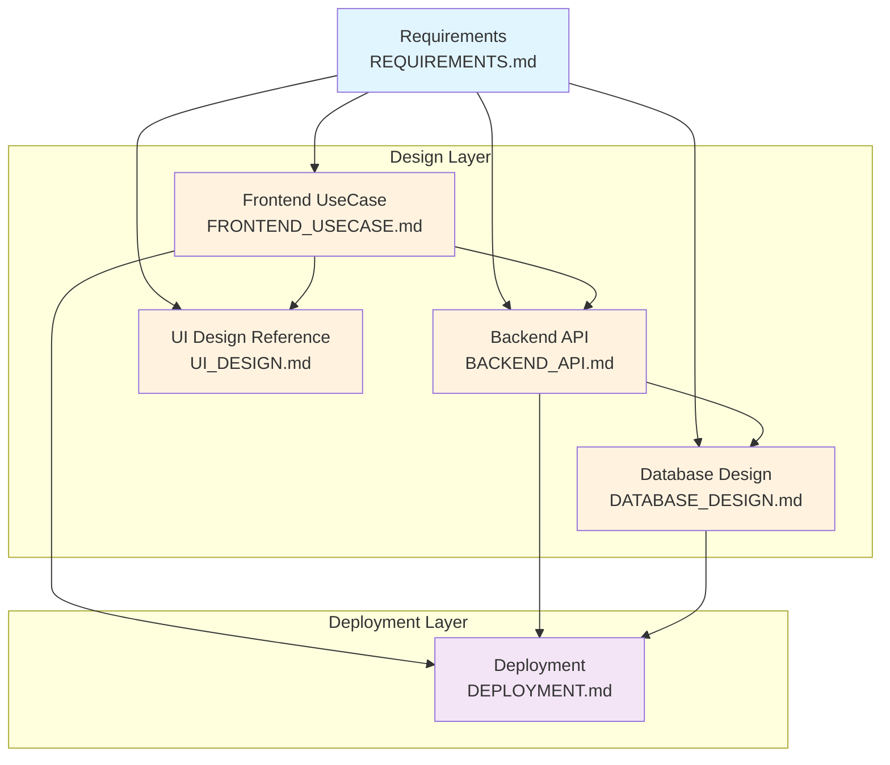

# OJ Platform Agent Development Guide

## Documentation Overview

This guide provides complete documentation usage instructions for AI Agents and the development team, including document relationships, development workflows, Prompt examples, and document synchronization strategies.

**Target Audience**: AI Agents, Developers, Project Managers

---

## 1. Documentation Architecture

### 1.1 Document Relationship Diagram



### 1.2 Document List

| Document Name | Type | Purpose | Dependencies |
|---------|------|------|------|
| `REQUIREMENTS.md` | Requirements | MVP scope, tech stack, timeline | - |
| `FRONTEND_USECASE.md` | Design | User flows, UI components, routing | REQUIREMENTS.md |
| `BACKEND_API.md` | Design | API endpoints, TDD flow, auth strategy | REQUIREMENTS.md |
| `DATABASE_DESIGN.md` | Design | Schema, relationships, indexes, optimization | REQUIREMENTS.md, BACKEND_API.md |
| `UI_DESIGN.md` | Design | NYCU brand, Carbon components, colors | REQUIREMENTS.md, FRONTEND_USECASE.md |
| `DEPLOYMENT.md` | Operations | Docker Compose, CI/CD, monitoring | All Design Docs |

---

## 2. Document Usage Guide

### 2.1 Requirements Document (REQUIREMENTS.md)

**Purpose**:
- 📋 Define MVP feature scope
- 🛠️ Confirm tech stack (React, Django, PostgreSQL)
- ⏱️ Plan development timeline (2-4 weeks)
- 🎯 Clarify core feature priorities

**When to Reference**:
- Project kickoff to understand overall goals
- Before feature development to check MVP scope
- Assessing impact of requirement changes

**Key Sections**:
- `2. Functional Requirements` - Complete feature list
- `3. Tech Stack` - Technology decisions
- `4. Implementation Plan` - Development phases and timeline

---

### 2.2 Frontend UseCase Design (FRONTEND_USECASE.md)

**Purpose**:
- 🎭 Define user interaction flows
- 🎨 Select UI components (Carbon Design System)
- 🗺️ Plan page routing
- 📊 Design state management strategy

**When to Reference**:
- Before developing frontend pages
- Designing user interaction flows
- Selecting UI components

**Relationships**:
- ➡️ **BACKEND_API.md**: API calls in use cases must match backend endpoints
- ➡️ **UI_DESIGN.md**: Component selection must follow NYCU brand guidelines
- ➡️ **REQUIREMENTS.md**: Use Cases must cover required features

**Development Prompt Example**:
```
Based on "FRONTEND_USECASE.md" UC-2.2 (View Problem Details), implement the problem details page:
1. Use Carbon DataTable to display problem info
2. Integrate Monaco Editor as code editor
3. Call GET /api/v1/problems/:id API to fetch data
4. Follow NYCU color guidelines in UI_DESIGN.md

Use TDD approach, write tests before code.
```

---

### 2.3 Backend API Design (BACKEND_API.md)

**Purpose**:
- 🔌 Define all API endpoint specs
- 🧪 Provide TDD workflow and test examples
- 🔐 Design authentication and authorization strategy
- 📝 Standardize error handling and response formats

**When to Reference**:
- Before developing backend APIs
- Integrating APIs in frontend
- Writing API tests

**Relationships**:
- ➡️ **DATABASE_DESIGN.md**: API data operations must match DB schema
- ➡️ **FRONTEND_USECASE.md**: APIs must satisfy frontend use case needs
- ➡️ **REQUIREMENTS.md**: API features must match requirement scope

**Development Prompt Example**:
```
Based on "BACKEND_API.md", implement the following APIs:
- POST /api/v1/auth/email/register (Section 1.4)
- POST /api/v1/auth/email/login (Section 1.3)

Requirements:
1. Follow TDD flow (write tests first)
2. Use pytest and factory-boy
3. Use bcrypt hashing for passwords
4. Include Email verification mechanism
5. Response format must match API standards

Refer to "TDD Development Flow Example" section in the doc.
```

---

### 2.4 Database Design Document (DATABASE_DESIGN.md)

**Purpose**:
- 🗄️ Define complete database Schema
- 🔗 Explain table relationships
- ⚡ Provide indexing and query optimization strategies
- 🔧 Include views, triggers, and functions

**When to Reference**:
- Before writing database migrations
- Implementing complex queries
- Performance optimization

**Relationships**:
- ➡️ **BACKEND_API.md**: API operations correspond to tables and fields
- ➡️ **REQUIREMENTS.md**: Data structure supports all required features

**Development Prompt Example**:
```
Based on "DATABASE_DESIGN.md", create the following tables:
- users (Section 3.1.1)
- submissions (Section 3.3.1)
- submission_results (Section 3.3.2)

Requirements:
1. Use Django Migrations
2. Include all foreign key constraints
3. Create indexes specified in doc
4. Implement update_updated_at_column trigger

Run python manage.py migrate to verify.
```

---

### 2.5 UI Design Reference (UI_DESIGN.md)

**Purpose**:
- 🎨 Provide NYCU brand design guidelines
- 🖼️ NYCU Portal actual examples
- 🧩 IBM Carbon Design System integration guide
- 🌈 Color system and font specifications

**When to Reference**:
- Designing UI interfaces
- Choosing colors and fonts
- Ensuring brand consistency

**Relationships**:
- ➡️ **FRONTEND_USECASE.md**: UI component choices must follow design specs
- ➡️ **REQUIREMENTS.md**: Visual design reflects brand spirit

**Development Prompt Example**:
```
Based on "UI_DESIGN.md", design the login page:
1. Use NYCU Ultramarine #0033A1 as primary color
2. Split layout (refer to 1.1 NYCU Portal login example)
3. Use Carbon Button (primary variant)
4. Use Noto Sans TC font
5. Support dark mode toggle

Ensure compliance with NYCU Brand Design Guidelines in Chapter 1.
```

---

### 2.6 Deployment Document (DEPLOYMENT.md)

**Purpose**:
- 🐳 Docker Compose deployment config
- 🔄 GitHub Actions CI/CD flow
- 📊 Monitoring, logging, and backup strategies
- 🛠️ Troubleshooting guide

**When to Reference**:
- Setting up dev environment
- Deploying to production
- Configuring CI/CD

**Development Prompt Example**:
```
Based on "DEPLOYMENT.md", set up local dev environment:
1. Execute backend setup in Section 2.2
2. Execute frontend setup in Section 2.3
3. Start services using docker-compose.yml from Section 3.3
4. Verify all services are running

If issues arise, refer to Section 8 Troubleshooting.
```

---

## 3. Development Workflow and Scenarios

### 3.1 Scenario 1: New Feature

**Example**: Add "Favorite Problems" feature

**Steps**:

1. **Update Requirements** ✏️
   ```
   Add to "REQUIREMENTS.md" under "Future Extensions":
   - Problem Favorite feature (Students can favorite problems for later practice)
   ```

2. **Design Backend API** 🔌
   ```
   Add to "BACKEND_API.md":
   
   ### 2.X Favorite Problem
   POST /api/v1/problems/:id/favorite
   DELETE /api/v1/problems/:id/favorite
   GET /api/v1/users/me/favorites
   ```

3. **Design Database** 🗄️
   ```
   Add to "DATABASE_DESIGN.md":
   
   CREATE TABLE problem_favorites (
       id BIGSERIAL PRIMARY KEY,
       user_id BIGINT REFERENCES users(id),
       problem_id BIGINT REFERENCES problems(id),
       created_at TIMESTAMP DEFAULT NOW(),
       UNIQUE(user_id, problem_id)
   );
   ```

4. **Design Frontend UseCase** 🎭
   ```
   Add to "FRONTEND_USECASE.md":
   
   ### UC-2.X Favorite/Unfavorite Problem
   **Flow**:
   1. Student clicks "Favorite" button on problem list or detail page
   2. Call POST /api/v1/problems/:id/favorite
   3. Button state changes to "Favorited"
   ```

5. **Implementation** 💻
   ```
   Develop using TDD:
   1. Write API tests (Backend)
   2. Implement API endpoints
   3. Write frontend component tests
   4. Implement frontend features
   ```

---

### 3.2 Scenario 2: Modify Existing Feature

**Example**: Change submission limit from "Contest Settings" to "Problem Settings"

**Documents to Update**:

1. ✅ **REQUIREMENTS.md** → Modify feature description
2. ✅ **BACKEND_API.md** → Update request/response formats
3. ✅ **DATABASE_DESIGN.md** → Adjust table structure (add fields or modify relations)
4. ✅ **FRONTEND_USECASE.md** → Update user flows

**Checklist**:
```markdown
- [ ] REQUIREMENTS.md: Feature description updated
- [ ] BACKEND_API.md: Affected endpoints modified
- [ ] DATABASE_DESIGN.md: Schema and Migrations updated
- [ ] FRONTEND_USECASE.md: User flows adjusted
- [ ] DEPLOYMENT.md: Updated if env vars changed
```

---

### 3.3 Scenario 3: Tech Stack Change

**Example**: Switch from MinIO to AWS S3

**Documents to Update**:

1. ✅ **REQUIREMENTS.md** → Tech stack section
2. ✅ **BACKEND_API.md** → File upload implementation details
3. ✅ **DEPLOYMENT.md** → Docker Compose config, environment variables
4. ⚠️ **DATABASE_DESIGN.md** → Usually no update (unless storage method changes)

---

## 4. Document Sync Strategy

### 4.1 Change Impact Matrix

| Change Type | REQ | FE | BE | DB | UI | DEPLOY |
|---------|---------|--------|---------|--------|--------|------|
| **New Feature** | ✅ | ✅ | ✅ | ✅ | ⚠️ | ⚠️ |
| **Modify Feature** | ✅ | ✅ | ✅ | ⚠️ | ❌ | ❌ |
| **UI Adjustment** | ⚠️ | ✅ | ❌ | ❌ | ✅ | ❌ |
| **API Adjustment** | ⚠️ | ✅ | ✅ | ⚠️ | ❌ | ❌ |
| **DB Adjustment** | ⚠️ | ❌ | ✅ | ✅ | ❌ | ⚠️ |
| **Tech Change** | ✅ | ⚠️ | ⚠️ | ⚠️ | ❌ | ✅ |

Legend:
- ✅ Must update
- ⚠️ May need update (context dependent)
- ❌ Usually no update

---

### 4.2 Sync Checklist

#### When Adding/Modifying Features

```markdown
□ Step 1: Requirements (REQUIREMENTS.md)
  - [ ] Feature description updated
  - [ ] MVP scope adjusted
  - [ ] Timeline re-evaluated

□ Step 2: API Design (BACKEND_API.md)
  - [ ] Add/Modify related API endpoints
  - [ ] Request/Response formats defined
  - [ ] Error handling explained
  - [ ] TDD test examples provided

□ Step 3: Database Design (DATABASE_DESIGN.md)
  - [ ] Add/Modify tables
  - [ ] Foreign keys updated
  - [ ] Indexing strategy adjusted
  - [ ] Migration scripts prepared

□ Step 4: Frontend UseCase (FRONTEND_USECASE.md)
  - [ ] User flows defined
  - [ ] UI components selected
  - [ ] API calls annotated
  - [ ] State management strategy explained

□ Step 5: UI Design (UI_DESIGN.md) (If UI changes)
  - [ ] New components follow NYCU brand
  - [ ] Colors used correctly
  - [ ] Carbon components selected appropriately

□ Step 6: Deployment (DEPLOYMENT.md) (If env changes)
  - [ ] Env vars updated
  - [ ] Docker Compose config adjusted
  - [ ] CI/CD flow updated
```

---

### 4.3 Consistency Verification

**Automated Checks** (Scripting recommended):

1. **API Endpoint Consistency**
   ```python
   # Check if APIs called in FRONTEND_USECASE.md are defined in BACKEND_API.md
   frontend_apis = extract_api_calls_from_usecase()
   backend_apis = extract_api_endpoints_from_design()
   missing_apis = frontend_apis - backend_apis
   if missing_apis:
       print(f"Warning: Frontend uses undefined APIs: {missing_apis}")
   ```

2. **DB Field Consistency**
   ```python
   # Check if fields used in BACKEND_API.md exist in DATABASE_DESIGN.md
   api_fields = extract_fields_from_api_responses()
   db_fields = extract_fields_from_schema()
   missing_fields = api_fields - db_fields
   ```

**Manual Checks**:

1. **Feature Completeness**
   - Does every feature in REQUIREMENTS.md have corresponding API, UseCase, and Table?

2. **Naming Consistency**
   - Do API endpoint names match DB table names?
   - Do Frontend UseCase terms match Requirements?

3. **Version Consistency**
   - Are tech stack versions consistent across all docs?
   - E.g., PostgreSQL 15, Python 3.11, Node.js 18

---

## 5. AI Agent Usage Guide

### 5.1 Standard Development Flow Prompt

#### Full Prompt for New Feature

```
【Task】: Develop "Problem Tag Management" feature

【Steps】:
1. Read "REQUIREMENTS.md" to confirm MVP scope
2. Add related API endpoints in "BACKEND_API.md" (follow existing format)
3. Add/Modify tables in "DATABASE_DESIGN.md"
4. Add user flows in "FRONTEND_USECASE.md"
5. Develop using TDD (refer to TDD section in "BACKEND_API.md")

【Requirements】:
- All APIs follow RESTful standards
- DB design follows 3NF
- UI components use Carbon Design System
- Code must have 80%+ test coverage
- Update all related docs upon completion

【Output】:
- Updated docs (highlight changes)
- Implementation code
- Test code
- Migration scripts
```

---

### 5.2 Bug Fix Prompt

```
【Issue】: User cannot view submission history in exam

【Debug Steps】:
1. Check UC-X.X (View Submissions in Exam) in "FRONTEND_USECASE.md"
2. Check corresponding API definition in "BACKEND_API.md"
3. Check permission design in "DATABASE_DESIGN.md"
4. Locate root cause (Frontend? Backend? DB?)

【Fix Requirements】:
- Write test case to reproduce issue
- Fix code
- Ensure tests pass
- Update docs if design flaw found

【Output】:
- Bug analysis report
- Fix code
- Test cases
- Updated docs (if any)
```

---

### 5.3 Refactor Prompt

```
【Task】: Refactor Auth Module to support multiple login methods

【Reference Docs】:
- "BACKEND_API.md" Chapter 1: Auth APIs
- "DATABASE_DESIGN.md" Section 3.1: Users Table

【Refactor Goals】:
- Implement Strategy Pattern for auth methods
- Keep API interface unchanged
- Improve code testability

【Requirements】:
- All existing tests must pass
- Add tests for new auth strategies
- Update architecture description in "BACKEND_API.md"

【Output】:
- Refactored code
- Updated tests
- Architecture description doc
```

---

## 6. FAQ

### Q1: How to ensure doc consistency?

**A**: 
1. Use "Sync Checklist" (Section 4.2)
2. Require doc review in Pull Requests
3. Regular doc review meetings
4. Use automated check scripts (Section 4.3)

---

### Q2: What if docs are outdated?

**A**:
1. Update outdated docs immediately
2. Tag `[DOC]` prefix in Git Commit Message
3. Notify team members
4. Check if other related docs need sync

---

### Q3: How to handle Doc vs Implementation mismatch?

**A**:
Priority: **Correct Implementation > Update Doc**

1. Implementation correct, doc wrong: Update doc
2. Doc correct, implementation wrong: Fix implementation
3. Both unsure: Hold technical discussion

---

### Q4: Which doc should new developers read first?

**A**:
Recommended order:
1. **REQUIREMENTS.md** - Project goals & scope
2. **DATABASE_DESIGN.md** - Data structure
3. **BACKEND_API.md** - API specs & TDD
4. **FRONTEND_USECASE.md** - User flows
5. **UI_DESIGN.md** - Design guidelines
6. **DEPLOYMENT.md** - Dev env setup

---

## 7. Document Version Control

### 7.1 Versioning Rules

All docs use Git, but mark version info at top:

```markdown
# OJ Platform XXX Document

**Version**: v1.2.0
**Last Updated**: 2025-01-26
**Change Summary**: Added Problem Tag feature design
```

Format: `vMAJOR.MINOR.PATCH`
- **MAJOR**: Major architecture change (e.g., tech stack)
- **MINOR**: New feature
- **PATCH**: Fixes or doc improvements

---

### 7.2 Change Log

Maintain change log at bottom of each doc:

```markdown
## Change History

### v1.2.0 (2025-01-26)
- Added: Problem Tag API (Section 3.X)
- Modified: Problem table, added tags field
- Optimized: Query performance notes

### v1.1.0 (2025-01-20)
- Added: Email/Password login
- Modified: Auth architecture for multi-login support
```

---

## 8. Best Practices

### 8.1 Writing Principles

1. **Clear & Concise**: Avoid verbosity, use tables/charts
2. **Specific**: Provide code examples, not abstract descriptions
3. **Keep Updated**: Update docs immediately upon code change
4. **Cross-Reference**: Link docs to each other
5. **Executable**: Example code should be runnable

---

### 8.2 AI Agent Collaboration Tips

**Instructions for AI Agent**:

```
During development, follow these principles:

1. 【Read Docs】
   - Read related docs before starting any task
   - Understand existing design and constraints

2. 【Follow Specs】
   - Strictly follow specs defined in docs
   - Use naming conventions from docs
   - Maintain consistent code style

3. 【TDD Development】
   - Write tests first, then code
   - Refer to test examples in "BACKEND_API.md"
   - Ensure > 80% test coverage

4. 【Update Docs】
   - Sync all related docs when adding features
   - Check if docs need adjustment when modifying implementation
   - Mark doc changes in Commit Message

5. 【Verify Consistency】
   - Use Checklist in Section 4.3
   - Ensure consistency across docs
   - Report inconsistencies immediately

6. 【Communicate】
   - Ask human developers when unsure
   - Provide clear implementation notes
   - Record important design decisions
```

---

## 9. Tools & Resources

### 9.1 Recommended Tools

1. **Doc Editing**
   - VS Code + Markdown Preview
   - Obsidian (Visual links)

2. **Diagrams**
   - Mermaid (Embedded in Markdown)
   - draw.io

3. **API Testing**
   - Postman
   - httpie

4. **Database Management**
   - DBeaver
   - pgAdmin

---

### 9.2 Useful Resources

- [NYCU OAuth Docs](https://id.nycu.edu.tw/docs/)
- [IBM Carbon Design System](https://carbondesignsystem.com/)
- [Django REST Framework](https://www.django-rest-framework.org/)
- [PostgreSQL Official Docs](https://www.postgresql.org/docs/)
- [pytest Docs](https://docs.pytest.org/)

---

## 10. Summary

This Agent Development Guide provides:

✅ **Complete Doc Architecture** - 6 core docs & relationships
✅ **Usage Instructions** - Purpose & timing for each doc
✅ **Development Workflows** - New feature, modification, bug fix
✅ **Sync Strategy** - Impact matrix & checklists
✅ **AI Agent Guide** - Standard Prompts & best practices

**Core Principles**:
1. 📚 Docs are development guides, not afterthoughts
2. 🔄 Keep docs synced with code
3. 🤝 Docs bridge team communication
4. ✨ Clear docs = Efficient development

**Remember**: Good documentation enables efficient collaboration between AI Agents and the development team!
