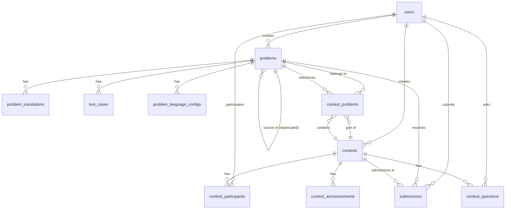

# 資料庫設計文檔 (Database Design)

## 文檔說明

本文檔定義 OJ 平台的 PostgreSQL 資料庫架構，**基於實際 Django models 的最新狀態**。

**資料庫系統**：PostgreSQL 15+  
**ORM**：Django 4.2+

---

## 1. 資料庫設計原則

- **正規化**：3NF
- **命名規範**：snake_case (e.g., `user_id`, `created_at`)
- **主鍵**：Django 預設 `id BIGINT AUTO_INCREMENT PRIMARY KEY`
- **通用欄位**：`created_at TIMESTAMP`, `updated_at TIMESTAMP`

---

## 2. 核心資料表

### 2.1 使用者管理 (Users)

#### `users` (Django: `apps.users.User`)

| Column | Type | Constraints | Description |
|--------|------|-------------|-------------|
| id | BIGINT | PK | Django AutoField |
| username | VARCHAR(150) | UNIQUE, NOT NULL | 使用者名稱 |
| email | VARCHAR(254) | UNIQUE, NOT NULL | 電子郵件 |
| password | VARCHAR(128) | NOT NULL | Django 加密密碼 |
| first_name | VARCHAR(150) | | 名字 |
| last_name | VARCHAR(150) | | 姓氏 |
| role | VARCHAR(20) | DEFAULT 'student' | 'student', 'teacher', 'admin' |
| is_staff | BOOLEAN | DEFAULT FALSE | Django admin 權限 |
| is_active | BOOLEAN | DEFAULT TRUE | 帳號啟用狀態 |
| is_superuser | BOOLEAN | DEFAULT FALSE | 超級使用者 |
| date_joined | TIMESTAMP | DEFAULT NOW() | 註冊時間 |
| last_login | TIMESTAMP | NULL | 最後登入時間 |

**索引**：
- `username` (UNIQUE)
- `email` (UNIQUE)
- `role`

---

### 2.2 題目管理 (Problems)

#### `problems` (Django: `apps.problems.Problem`)

| Column | Type | Constraints | Description |
|--------|------|-------------|-------------|
| id | BIGINT | PK | |
| title | VARCHAR(255) | NOT NULL | 題目標題 |
| slug | VARCHAR(255) | UNIQUE | URL slug |
| display_id | VARCHAR(20) | UNIQUE, NULL | 顯示編號 (P001, Q001) |
| difficulty | VARCHAR(10) | DEFAULT 'medium' | 'easy', 'medium', 'hard' |
| time_limit | INTEGER | DEFAULT 1000 | 時間限制 (ms) |
| memory_limit | INTEGER | DEFAULT 128 | 記憶體限制 (MB) |
| is_visible | BOOLEAN | DEFAULT TRUE | 是否可見 |
| order | INTEGER | DEFAULT 0 | 排序 |
| created_by_id | BIGINT | FK(users), NULL | 建立者 |
| **is_contest_only** | BOOLEAN | DEFAULT FALSE | 僅限競賽 (deprecated) |
| **source_problem_id** | BIGINT | FK(problems), NULL | 來源題目 (deprecated) |
| **contest_id** | BIGINT | FK(contests), NULL | 所屬競賽 (deprecated) |
| submission_count | INTEGER | DEFAULT 0 | 提交次數 (denormalized) |
| accepted_count | INTEGER | DEFAULT 0 | 通過次數 (denormalized) |
| created_at | TIMESTAMP | AUTO | 建立時間 |
| updated_at | TIMESTAMP | AUTO | 更新時間 |

**索引**：
- `difficulty`
- `is_visible`
- `display_id` (UNIQUE)
- `slug` (UNIQUE)

**注意**：
- `acceptance_rate` 為 computed property，非資料庫欄位
- 標記 deprecated 的欄位將在新版 MVP 中由新欄位取代

#### `problem_translations` (Django: `apps.problems.ProblemTranslation`)

| Column | Type | Constraints | Description |
|--------|------|-------------|-------------|
| id | BIGINT | PK | |
| problem_id | BIGINT | FK(problems) CASCADE | 所屬題目 |
| language | VARCHAR(10) | NOT NULL | 語言代碼 ('zh-hant', 'en') |
| title | VARCHAR(255) | NOT NULL | 翻譯後標題 |
| description | TEXT | NOT NULL | 題目描述 |
| input_description | TEXT | NOT NULL | 輸入說明 |
| output_description | TEXT | NOT NULL | 輸出說明 |
| hint | TEXT | | 提示 |

**唯一約束**：`(problem_id, language)`

#### `test_cases` (Django: `apps.problems.TestCase`)

| Column | Type | Constraints | Description |
|--------|------|-------------|-------------|
| id | BIGINT | PK | |
| problem_id | BIGINT | FK(problems) CASCADE | 所屬題目 |
| input_data | TEXT | NOT NULL | 輸入資料 |
| output_data | TEXT | NOT NULL | 輸出資料 |
| is_sample | BOOLEAN | DEFAULT FALSE | 是否為範例 |
| score | INTEGER | DEFAULT 0 | 分數 |
| order | INTEGER | DEFAULT 0 | 排序 |
| is_hidden | BOOLEAN | DEFAULT FALSE | 是否隱藏 |

**排序**：`order ASC`, `id ASC`

#### `problem_language_configs` (Django: `apps.problems.LanguageConfig`)

| Column | Type | Constraints | Description |
|--------|------|-------------|-------------|
| id | BIGINT | PK | |
| problem_id | BIGINT | FK(problems) CASCADE | 所屬題目 |
| language | VARCHAR(20) | NOT NULL | 'cpp', 'python', 'java', 'javascript' |
| template_code | TEXT | | 範本程式碼 |
| is_enabled | BOOLEAN | DEFAULT TRUE | 啟用 |
| order | INTEGER | DEFAULT 0 | 排序 |

**唯一約束**：`(problem_id, language)`

---

### 2.3 考試系統 (Contests)

#### `contests` (Django: `apps.contests.Contest`)

| Column | Type | Constraints | Description |
|--------|------|-------------|-------------|
| id | BIGINT | PK | |
| title | VARCHAR(255) | NOT NULL | 標題 |
| description | TEXT | | 描述 |
| rules | TEXT | | 競賽規定 |
| start_time | TIMESTAMP | NOT NULL | 開始時間 |
| end_time | TIMESTAMP | NOT NULL | 結束時間 |
| creator_id | BIGINT | FK(users) CASCADE | 建立者 |
| is_public | BOOLEAN | DEFAULT TRUE | 是否公開 |
| password | VARCHAR(255) | NULL | 密碼 (私密比賽) |
| allow_view_results | BOOLEAN | DEFAULT TRUE | 允許查看結果 |
| allow_multiple_joins | BOOLEAN | DEFAULT FALSE | 允許多次加入 |
| ban_tab_switching | BOOLEAN | DEFAULT FALSE | 禁止切換分頁 |
| created_at | TIMESTAMP | AUTO | 建立時間 |
| updated_at | TIMESTAMP | AUTO | 更新時間 |

**索引**：
- `start_time`
- `end_time`
- `creator_id`

**排序**：`-start_time` (最新的在前)

**注意**：
- `status` 為 computed property (基於 start_time, end_time)
- `participant_count` 為 annotated field (非資料庫欄位)

#### `contest_problems` (Django: `apps.contests.ContestProblem`)

| Column | Type | Constraints | Description |
|--------|------|-------------|-------------|
| id | BIGINT | PK | |
| contest_id | BIGINT | FK(contests) CASCADE | 所屬競賽 |
| problem_id | BIGINT | FK(problems) CASCADE | 關聯題目 |
| order | INTEGER | DEFAULT 0 | 排序 (A, B, C...) |
| score | INTEGER | DEFAULT 100 | 分數 |

**唯一約束**：`(contest_id, problem_id)`  
**排序**：`order ASC`

#### `contest_participants` (Django: `apps.contests.ContestParticipant`)

| Column | Type | Constraints | Description |
|--------|------|-------------|-------------|
| id | BIGINT | PK | |
| contest_id | BIGINT | FK(contests) CASCADE | 所屬競賽 |
| user_id | BIGINT | FK(users) CASCADE | 參與者 |
| score | INTEGER | DEFAULT 0 | 總分 |
| rank | INTEGER | NULL | 排名 |
| joined_at | TIMESTAMP | AUTO | 加入時間 |
| left_at | TIMESTAMP | NULL | 離開時間 |

**唯一約束**：`(contest_id, user_id)`

#### `contest_questions` (Django: `apps.contests.ContestQuestion`)

| Column | Type | Constraints | Description |
|--------|------|-------------|-------------|
| id | BIGINT | PK | |
| contest_id | BIGINT | FK(contests) CASCADE | 所屬競賽 |
| user_id | BIGINT | FK(users) CASCADE | 提問者 |
| title | VARCHAR(255) | NOT NULL | 標題 |
| content | TEXT | NOT NULL | 內容 |
| reply | TEXT | | 回覆 |
| replied_by_id | BIGINT | FK(users) SET_NULL, NULL | 回覆者 |
| replied_at | TIMESTAMP | NULL | 回覆時間 |
| created_at | TIMESTAMP | AUTO | 提問時間 |
| updated_at | TIMESTAMP | AUTO | 更新時間 |

**排序**：`created_at ASC`

#### `contest_announcements` (Django: `apps.contests.ContestAnnouncement`)

| Column | Type | Constraints | Description |
|--------|------|-------------|-------------|
| id | BIGINT | PK | |
| contest_id | BIGINT | FK(contests) CASCADE | 所屬競賽 |
| title | VARCHAR(255) | NOT NULL | 標題 |
| content | TEXT | NOT NULL | 內容 |
| created_by_id | BIGINT | FK(users) SET_NULL, NULL | 發布者 |
| created_at | TIMESTAMP | AUTO | 發布時間 |
| updated_at | TIMESTAMP | AUTO | 更新時間 |

**排序**：`-created_at` (最新的在前)

---

### 2.4 提交與評測 (Submissions)

#### `submissions` (Django: `apps.submissions.Submission`)

基於實際 codebase，此表結構需要檢視實際 models.py 來確認。典型欄位包括：

| Column | Type | Constraints | Description |
|--------|------|-------------|-------------|
| id | BIGINT | PK | |
| user_id | BIGINT | FK(users) | 提交者 |
| problem_id | BIGINT | FK(problems) | 題目 |
| contest_id | BIGINT | FK(contests), NULL | 競賽 (NULL 為練習) |
| language | VARCHAR(20) | NOT NULL | 程式語言 |
| code | TEXT | NOT NULL | 程式碼 |
| status | VARCHAR(20) | DEFAULT 'pending' | 'AC', 'WA', 'TLE', 'MLE', 'RE', 'CE' |
| score | INTEGER | | 總分 |
| exec_time | DECIMAL | | 最大執行時間 (ms) |
| memory_usage | INTEGER | | 最大記憶體使用 (KB) |
| submitted_at | TIMESTAMP | DEFAULT NOW() | 提交時間 |

**索引**：
- `user_id`, `problem_id`, `contest_id`
- `status`
- `submitted_at` (DESC)

---

## 3. 關聯圖



---

## 4. 索引與優化策略

### 4.1 主要索引

- **users**: `username`, `email` (UNIQUE), `role`
- **problems**: `display_id` (UNIQUE), `slug` (UNIQUE), `difficulty`, `is_visible`
- **contests**: `start_time`, `end_time`, `creator_id`
- **submissions**: `(user_id, problem_id)`, `(contest_id, user_id)`, `status`, `submitted_at DESC`
- **contest_participants**: `(contest_id, user_id)` (UNIQUE)

### 4.2 查詢優化

1. **練習題列表**：
   ```sql
   SELECT * FROM problems 
   WHERE is_visible = TRUE 
   ORDER BY order, id;
   ```

2. **競賽排名**：
   ```sql
   SELECT cp.*, u.username 
   FROM contest_participants cp
   JOIN users u ON cp.user_id = u.id
   WHERE cp.contest_id = ?
   ORDER BY cp.score DESC, cp.joined_at ASC;
   ```

3. **使用者提交紀錄**：
   ```sql
   SELECT s.* FROM submissions s
   WHERE s.user_id = ? AND s.problem_id = ?
   ORDER BY s.submitted_at DESC;
   ```

---

## 5. 資料完整性約束

### 5.1 Foreign Key Constraints

- `problems.created_by_id` → `users.id` (SET_NULL)
- `problems.source_problem_id` → `problems.id` (SET_NULL) - deprecated
- `problems.contest_id` → `contests.id` (SET_NULL) - deprecated
- `contest_problems.contest_id` → `contests.id` (CASCADE)
- `contest_problems.problem_id` → `problems.id` (CASCADE)
- `submissions.user_id` → `users.id` (CASCADE)
- `submissions.problem_id` → `problems.id` (CASCADE)
- `submissions.contest_id` → `contests.id` (SET_NULL)

### 5.2 Unique Constraints

- `problems`: `(slug)`, `(display_id)`
- `problem_translations`: `(problem_id, language)`
- `problem_language_configs`: `(problem_id, language)`
- `contest_problems`: `(contest_id, problem_id)`
- `contest_participants`: `(contest_id, user_id)`

---

## 6. Triggers 與自動化

### 6.1 Django 自動管理

- `created_at`: 使用 `auto_now_add=True`
- `updated_at`: 使用 `auto_now=True`

### 6.2 統計欄位更新

- `Problem.submission_count`, `Problem.accepted_count` 需要透過 Django signals 或 Celery tasks 更新
- `ContestParticipant.score`, `ContestParticipant.rank` 需要定期重新計算

---

## 7. 備份與維護策略

### 7.1 備份策略

- **每日全量備份**：`pg_dump` 完整資料庫
- **保留期限**：7 天
- **備份加密**：使用 GPG 加密備份檔案

### 7.2 維護作業

- **Vacuum**：每週執行 `VACUUM ANALYZE`
- **重建索引**：每月執行 `REINDEX DATABASE`
- **統計資訊更新**：Django management command 定期更新 denormalized fields

---

## 8. 待實作的 MVP 變更

根據新的產品需求，將新增以下欄位（詳見 implementation_plan.md）：

### 新增欄位
- `Problem.is_practice_visible` (BooleanField, default=False)
- `Problem.created_in_contest_id` (ForeignKey to Contest, nullable)
- `Contest.is_ended` (BooleanField, default=False)

### Deprecated 欄位
- `Problem.is_contest_only` → 由 `is_practice_visible` 取代
- `Problem.source_problem` → 移除複製邏輯
- `Problem.contest` → 由 `created_in_contest` 取代

---

**文檔版本**：v2.0  
**最後更新**：2025-11-30  
**基於 Codebase 版本**：實際 Django models（backend/apps/*/models.py）
