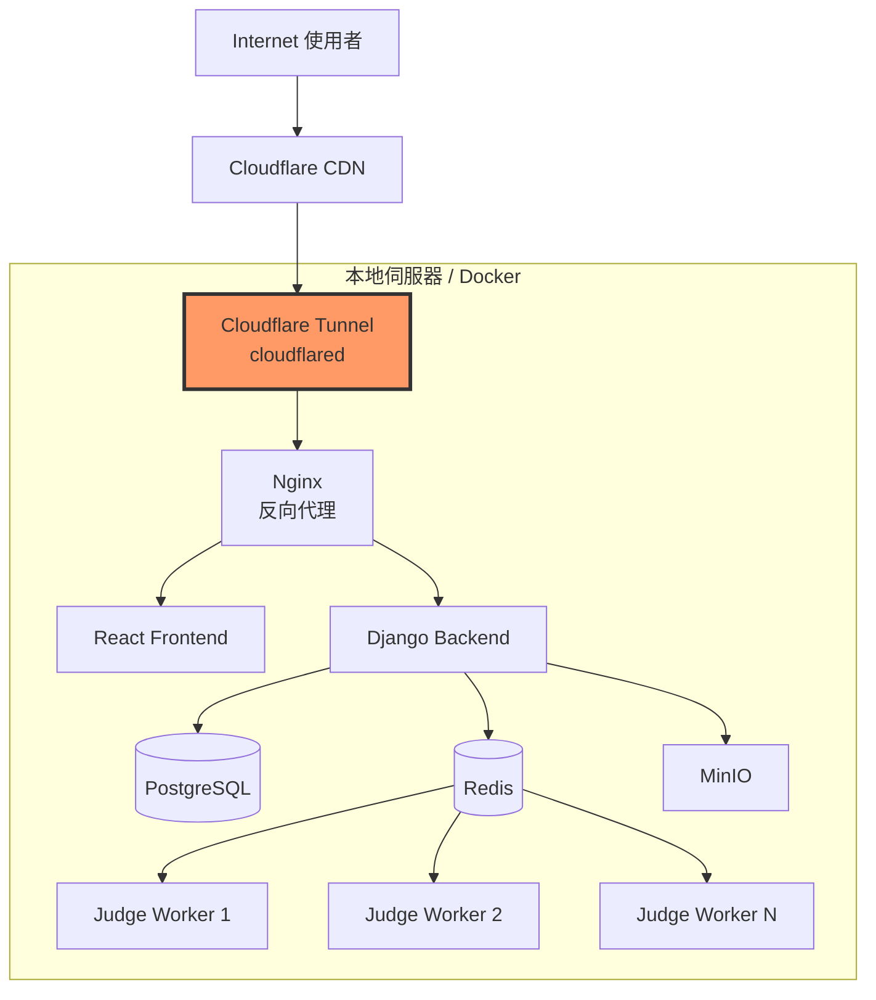

# OJ 平台部署文檔（Cloudflare Tunnel 版本）

## 文檔說明

本文檔提供 OJ 平台的完整部署指引，使用 **Cloudflare Tunnel** 進行安全的網路連接，無需開放公網 IP 和端口。

**域名配置**：
- Production: `q-judge.quan.wtf`
- Development: `q-judge-dev.quan.wtf`

**技術棧**：Django + React + PostgreSQL + Redis + Cloudflare Tunnel

---

## 1. 技術架構概述



**Cloudflare Tunnel 優勢**：
- ✅ 無需開放任何入站端口（防火牆友善）
- ✅ 自動 SSL/TLS 加密
- ✅ DDoS 防護
- ✅ 全球 CDN 加速
- ✅ 零配置 Let's Encrypt（Cloudflare 自動管理）

---

## 2. 本地開發環境設置

### 2.1 環境需求

```bash
# 必要軟體
- Node.js 18+
- Python 3.11+
- Docker 24+
- PostgreSQL 15+
- Redis 7+

# 開發工具
- Git
- VS Code (推薦)
```

### 2.2 後端設置

```bash
# 1. Clone 專案
git clone https://github.com/your-org/oj-platform.git
cd oj-platform/backend

# 2. 創建虛擬環境
python -m venv venv
source venv/bin/activate  # Linux/Mac
# venv\Scripts\activate    # Windows

# 3. 安裝依賴
pip install -r requirements.txt

# 4. 環境變數設定
cp .env.example .env
# 編輯 .env 填入必要設定

# 5. 資料庫遷移
python manage.py migrate

# 6. 創建超級使用者
python manage.py createsuperuser

# 7. 啟動開發伺服器
python manage.py runserver
```

**`.env` 檔案範例**：
```env
# Django
SECRET_KEY=your-secret-key-here
DEBUG=True
ALLOWED_HOSTS=localhost,127.0.0.1,q-judge.quan.wtf,q-judge-dev.quan.wtf

# Database
DB_NAME=oj_platform
DB_USER=postgres
DB_PASSWORD=postgres
DB_HOST=localhost
DB_PORT=5432

# Redis
REDIS_URL=redis://localhost:6379/0

# NYCU OAuth
NYCU_OAUTH_CLIENT_ID=your_client_id
NYCU_OAUTH_CLIENT_SECRET=your_client_secret
NYCU_OAUTH_REDIRECT_URI=https://q-judge.quan.wtf/oauth/callback

# JWT
JWT_SECRET_KEY=your-jwt-secret-key
JWT_ALGORITHM=HS256
JWT_EXPIRATION_DELTA=3600

# Object Storage (開發環境可用 MinIO)
STORAGE_TYPE=minio
MINIO_ENDPOINT=localhost:9000
MINIO_ACCESS_KEY=minioadmin
MINIO_SECRET_KEY=minioadmin
MINIO_BUCKET_NAME=oj-platform
```

### 2.3 前端設置

```bash
# 1. 進入前端目錄
cd oj-platform/frontend

# 2. 安裝依賴
npm install

# 3. 環境變數設定
cp .env.example .env.local
# 編輯 .env.local

# 4. 啟動開發伺服器
npm run dev
```

**`.env.local` 檔案範例**：
```env
# For Production
VITE_API_BASE_URL=https://q-judge.quan.wtf/api/v1
VITE_WS_BASE_URL=wss://q-judge.quan.wtf/ws

# For Development
# VITE_API_BASE_URL=https://q-judge-dev.quan.wtf/api/v1
# VITE_WS_BASE_URL=wss://q-judge-dev.quan.wtf/ws
VITE_NYCU_OAUTH_CLIENT_ID=your_client_id
VITE_NYCU_OAUTH_AUTHORIZE_URL=https://id.nycu.edu.tw/o/authorize/
```

### 2.4 評測系統設置

```bash
# 使用 Docker 啟動評測沙箱
cd oj-platform/judge

# 構建 Docker 映像
docker build -t oj-judge:latest .

# 啟動 Celery Worker
celery -A backend worker -l info -Q judge
```

---

## 3. Docker 容器化部署

### 3.1 專案結構

```
oj-platform/
├── frontend/
│   ├── Dockerfile
│   └── nginx.conf
├── backend/
│   ├── Dockerfile
│   └── requirements.txt
├── judge/
│   └── Dockerfile
├── nginx/
│   └── nginx.conf
├── cloudflare/
│   └── config.yml
├── docker-compose.yml
└── docker-compose.prod.yml
```

### 3.2 Dockerfile 範例

#### 前端 Dockerfile
```dockerfile
# frontend/Dockerfile
FROM node:18-alpine AS builder

WORKDIR /app
COPY package*.json ./
RUN npm ci

COPY . .
ENV VITE_API_BASE_URL=https://q-judge.quan.wtf/api/v1
ENV VITE_WS_BASE_URL=wss://q-judge.quan.wtf/ws
RUN npm run build

# Production stage
FROM nginx:alpine

COPY --from=builder /app/dist /usr/share/nginx/html
COPY nginx.conf /etc/nginx/conf.d/default.conf

EXPOSE 80
CMD ["nginx", "-g", "daemon off;"]
```

#### 後端 Dockerfile
```dockerfile
# backend/Dockerfile
FROM python:3.11-slim

WORKDIR /app

# 安裝系統依賴
RUN apt-get update && apt-get install -y \
    gcc \
    postgresql-client \
    && rm -rf /var/lib/apt/lists/*

# 安裝 Python 依賴
COPY requirements.txt .
RUN pip install --no-cache-dir -r requirements.txt

# 複製應用程式
COPY . .

# 收集靜態文件
RUN python manage.py collectstatic --noinput

# 創建非 root 使用者
RUN useradd -m -u 1000 appuser && chown -R appuser:appuser /app
USER appuser

EXPOSE 8000

CMD ["gunicorn", "--bind", "0.0.0.0:8000", "--workers", "4", "backend.wsgi:application"]
```

#### 評測系統 Dockerfile
```dockerfile
# judge/Dockerfile
FROM ubuntu:22.04

# 安裝編譯器和執行環境
RUN apt-get update && apt-get install -y \
    g++ \
    gcc \
    python3 \
    python3-pip \
    openjdk-17-jdk \
    && rm -rf /var/lib/apt/lists/*

# 安裝 Python 依賴
COPY requirements.txt .
RUN pip3 install --no-cache-dir -r requirements.txt

COPY . /app
WORKDIR /app

# 設定資源限制
RUN ulimit -s unlimited

CMD ["celery", "-A", "backend", "worker", "-l", "info", "-Q", "judge", "--concurrency=4"]
```

### 3.3 Docker Compose 配置

#### 開發環境 (`docker-compose.yml`)
```yaml
version: '3.8'

services:
  db:
    image: postgres:15-alpine
    environment:
      POSTGRES_DB: oj_platform
      POSTGRES_USER: postgres
      POSTGRES_PASSWORD: postgres
    volumes:
      - postgres_data:/var/lib/postgresql/data
    ports:
      - "5432:5432"

  redis:
    image: redis:7-alpine
    ports:
      - "6379:6379"
    volumes:
      - redis_data:/data

  minio:
    image: minio/minio:latest
    command: server /data --console-address ":9001"
    environment:
      MINIO_ROOT_USER: minioadmin
      MINIO_ROOT_PASSWORD: minioadmin
    ports:
      - "9000:9000"
      - "9001:9001"
    volumes:
      - minio_data:/data

  backend:
    build: ./backend
    command: python manage.py runserver 0.0.0.0:8000
    volumes:
      - ./backend:/app
    ports:
      - "8000:8000"
    env_file:
      - ./backend/.env
    depends_on:
      - db
      - redis
      - minio

  frontend:
    build: ./frontend
    volumes:
      - ./frontend:/app
      - /app/node_modules
    ports:
      - "3000:5173"
    environment:
      - VITE_API_BASE_URL=http://localhost:8000/api/v1
    depends_on:
      - backend

  judge:
    build: ./judge
    command: celery -A backend worker -l info -Q judge --concurrency=2
    volumes:
      - ./backend:/app
    env_file:
      - ./backend/.env
    depends_on:
      - redis
      - backend
    privileged: true  # 需要特權模式執行沙箱

volumes:
  postgres_data:
  redis_data:
  minio_data:
```

#### 生產環境 (`docker-compose.prod.yml`)
```yaml
version: '3.8'

services:
  # Cloudflare Tunnel
  cloudflared:
    image: cloudflare/cloudflared:latest
    restart: unless-stopped
    command: tunnel --no-autoupdate run
    environment:
      - TUNNEL_TOKEN=${CLOUDFLARE_TUNNEL_TOKEN}
    networks:
      - oj-network

  # Nginx 反向代理
  nginx:
    image: nginx:alpine
    restart: always
    volumes:
      - ./nginx/nginx.conf:/etc/nginx/nginx.conf:ro
      - static_files:/static:ro
    depends_on:
      - frontend
      - backend
    networks:
      - oj-network

  frontend:
    build:
      context: ./frontend
      dockerfile: Dockerfile
    restart: always
    networks:
      - oj-network

  backend:
    build:
      context: ./backend
      dockerfile: Dockerfile
    restart: always
    env_file:
      - ./backend/.env.prod
    volumes:
      - static_files:/app/staticfiles
    depends_on:
      - db
      - redis
    networks:
      - oj-network

  judge:
    build: ./judge
    restart: always
    deploy:
      replicas: 4  # 4 個評測 Worker
    env_file:
      - ./backend/.env.prod
    depends_on:
      - redis
      - backend
    networks:
      - oj-network

  db:
    image: postgres:15-alpine
    restart: always
    env_file:
      - ./backend/.env.prod
    volumes:
      - postgres_data:/var/lib/postgresql/data
    networks:
      - oj-network
    # 不對外暴露端口（安全性考量）

  redis:
    image: redis:7-alpine
    restart: always
    volumes:
      - redis_data:/data
    command: redis-server --appendonly yes
    networks:
      - oj-network

  minio:
    image: minio/minio:latest
    restart: always
    command: server /data --console-address ":9001"
    environment:
      MINIO_ROOT_USER: ${MINIO_ROOT_USER}
      MINIO_ROOT_PASSWORD: ${MINIO_ROOT_PASSWORD}
    volumes:
      - minio_data:/data
    networks:
      - oj-network

volumes:
  postgres_data:
  redis_data:
  static_files:
  minio_data:

networks:
  oj-network:
    driver: bridge
```

---

## 4. Cloudflare Tunnel 設置

### 4.1 前置準備

1. **Cloudflare 帳號**：註冊 https://dash.cloudflare.com/
2. **域名**：將 `quan.wtf` 加入 Cloudflare DNS 管理
3. **安裝 cloudflared**（本地測試用）：
   ```bash
   # macOS
   brew install cloudflare/cloudflare/cloudflared
   
   # Linux
   wget -q https://github.com/cloudflare/cloudflared/releases/latest/download/cloudflared-linux-amd64.deb
   sudo dpkg -i cloudflared-linux-amd64.deb
   ```

### 4.2 創建 Tunnel

```bash
# 1. 登入 Cloudflare
cloudflared tunnel login

# 2. 創建 Tunnel
cloudflared tunnel create q-judge

# 3. 記錄 Tunnel ID 和生成的憑證檔案路徑
# 憑證檔案: ~/.cloudflared/<TUNNEL-ID>.json
```

### 4.3 配置 Tunnel

創建 `cloudflare/config.yml`：

```yaml
tunnel: q-judge
credentials-file: /etc/cloudflared/cert.json

ingress:
  # Production Site
  - hostname: q-judge.quan.wtf
    service: http://nginx:80
    originRequest:
      noTLSVerify: true
  
  # Development Site
  - hostname: q-judge-dev.quan.wtf
    service: http://nginx:80
    originRequest:
      noTLSVerify: true
  
  # API Endpoint (optional)
  - hostname: api.q-judge.quan.wtf
    service: http://backend:8000
  
  # MinIO Console (if external access needed)
  - hostname: storage.q-judge.quan.wtf
    service: http://minio:9001
  
  # Catch-all 規則
  - service: http_status:404
```

### 4.4 設置 DNS 記錄

在 Cloudflare Dashboard 中設置 DNS：

```bash
# 使用 cloudflared CLI 自動設置
# Production
cloudflared tunnel route dns q-judge q-judge.quan.wtf

# Development
cloudflared tunnel route dns q-judge q-judge-dev.quan.wtf

# 或手動在 Dashboard 中添加 CNAME 記錄：
# Production:
# 類型: CNAME
# 名稱: q-judge
# 目標: <TUNNEL-ID>.cfargotunnel.com
# Proxy: 已啟用（橙色雲朵）

# Development:
# 類型: CNAME
# 名稱: q-judge-dev
# 目標: <TUNNEL-ID>.cfargotunnel.com
# Proxy: 已啟用（橙色雲朵）
```

### 4.5 取得 Tunnel Token

```bash
# 方法 1: 使用 CLI
cloudflared tunnel token q-judge

# 方法 2: 在 Cloudflare Dashboard
# Zero Trust > Access > Tunnels > 選擇 Tunnel > Configure > 複製 Token
```

將 Token 加入 `.env.prod`：
```env
CLOUDFLARE_TUNNEL_TOKEN=your_tunnel_token_here
```

### 4.6 啟動 Tunnel

#### 方式一：使用 Docker Compose（推薦）

```bash
# 已包含在 docker-compose.prod.yml 中
docker-compose -f docker-compose.prod.yml up -d cloudflared
```

#### 方式二：獨立運行

```bash
# 使用 Token
cloudflared tunnel --no-autoupdate run --token <YOUR_TOKEN>

# 或使用配置檔案
cloudflared tunnel --config cloudflare/config.yml run
```

---

## 5. 生產環境部署

### 5.1 伺服器初始化設定

```bash
# 1. 更新系統
sudo apt update && sudo apt upgrade -y

# 2. 安裝 Docker
curl -fsSL https://get.docker.com -o get-docker.sh
sudo sh get-docker.sh
sudo usermod -aG docker $USER

# 3. 安裝 Docker Compose
sudo curl -L "https://github.com/docker/compose/releases/latest/download/docker-compose-$(uname -s)-$(uname -m)" -o /usr/local/bin/docker-compose
sudo chmod +x /usr/local/bin/docker-compose

# 4. 安裝其他必要工具
sudo apt install -y git

# 5. 創建專案目錄
sudo mkdir -p /opt/oj-platform
sudo chown $USER:$USER /opt/oj-platform
```

### 5.2 部署步驟

#### Step 1: Clone 專案並配置

```bash
cd /opt/oj-platform
git clone https://github.com/your-org/oj-platform.git .

# 設定環境變數
cp backend/.env.example backend/.env.prod
nano backend/.env.prod  # 編輯配置

# 設定 Cloudflare Tunnel Token
echo "CLOUDFLARE_TUNNEL_TOKEN=your_token_here" >> backend/.env.prod
```

#### Step 2: 配置 Nginx

```nginx
# nginx/nginx.conf
upstream backend {
    server backend:8000;
}

upstream frontend {
    server frontend:80;
}

server {
    listen 80;
    server_name _;
    
    # 前端靜態文件
    location / {
        proxy_pass http://frontend;
        proxy_set_header Host $host;
        proxy_set_header X-Real-IP $remote_addr;
        proxy_set_header X-Forwarded-For $proxy_add_x_forwarded_for;
        proxy_set_header X-Forwarded-Proto $scheme;
    }

    # 後端 API
    location /api {
        proxy_pass http://backend;
        proxy_set_header Host $host;
        proxy_set_header X-Real-IP $remote_addr;
        proxy_set_header X-Forwarded-For $proxy_add_x_forwarded_for;
        proxy_set_header X-Forwarded-Proto $scheme;
        
        # CORS (如需要)
        add_header Access-Control-Allow-Origin * always;
    }

    # WebSocket
    location /ws {
        proxy_pass http://backend;
        proxy_http_version 1.1;
        proxy_set_header Upgrade $http_upgrade;
        proxy_set_header Connection "upgrade";
        proxy_set_header Host $host;
        proxy_set_header X-Real-IP $remote_addr;
    }

    # 靜態文件 (Django)
    location /static {
        alias /static;
    }

    # 上傳大小限制
    client_max_body_size 50M;
}
```

#### Step 3: 啟動服務

```bash
# 構建並啟動所有服務
docker-compose -f docker-compose.prod.yml up -d

# 查看日誌
docker-compose -f docker-compose.prod.yml logs -f

# 執行資料庫遷移
docker-compose -f docker-compose.prod.yml exec backend python manage.py migrate

# 創建超級使用者
docker-compose -f docker-compose.prod.yml exec backend python manage.py createsuperuser

# 收集靜態文件
docker-compose -f docker-compose.prod.yml exec backend python manage.py collectstatic --noinput
```

#### Step 4: 驗證部署

```bash
# 1. 檢查所有服務狀態
docker-compose -f docker-compose.prod.yml ps

# 2. 測試 Tunnel 連接
# Production
curl https://q-judge.quan.wtf

# Development
curl https://q-judge-dev.quan.wtf

# 3. 檢查 API
curl https://q-judge.quan.wtf/api/v1/health

# 4. 檢查 Cloudflare Tunnel 狀態
docker-compose -f docker-compose.prod.yml logs cloudflared
```

### 5.3 Cloudflare 額外配置（可選）

#### 5.3.1 啟用 WAF（Web Application Firewall）

在 Cloudflare Dashboard：
1. Security > WAF
2. 啟用 Managed Rules
3. 設定 Rate Limiting

#### 5.3.2 設定快取規則

Page Rules:
```
URL: q-judge.quan.wtf/static/*
Cache Level: Cache Everything
Edge Cache TTL: 1 month
```

#### 5.3.3 啟用 Bot Protection

Security > Bots > Configure

---

## 6. GitHub CI/CD 自動化流程

### 6.1 GitHub Actions 配置

```yaml
# .github/workflows/deploy.yml
name: Deploy to Production

on:
  push:
    branches: [ main ]

env:
  REGISTRY: ghcr.io
  IMAGE_NAME: ${{ github.repository }}

jobs:
  test:
    runs-on: ubuntu-latest
    steps:
      - uses: actions/checkout@v3
      
      - name: Run Backend Tests
        run: |
          cd backend
          pip install -r requirements.txt
          pytest --cov=. --cov-report=xml
      
      - name: Run Frontend Tests
        run: |
          cd frontend
          npm ci
          npm test

  build-and-push:
    needs: test
    runs-on: ubuntu-latest
    permissions:
      contents: read
      packages: write
    
    steps:
      - uses: actions/checkout@v3
      
      - name: Login to GitHub Container Registry
        uses: docker/login-action@v2
        with:
          registry: ${{ env.REGISTRY }}
          username: ${{ github.actor }}
          password: ${{ secrets.GITHUB_TOKEN }}
      
      - name: Build and Push Images
        run: |
          docker build -t ${{ env.REGISTRY }}/${{ env.IMAGE_NAME }}-frontend:latest ./frontend
          docker build -t ${{ env.REGISTRY }}/${{ env.IMAGE_NAME }}-backend:latest ./backend
          docker build -t ${{ env.REGISTRY }}/${{ env.IMAGE_NAME }}-judge:latest ./judge
          
          docker push ${{ env.REGISTRY }}/${{ env.IMAGE_NAME }}-frontend:latest
          docker push ${{ env.REGISTRY }}/${{ env.IMAGE_NAME }}-backend:latest
          docker push ${{ env.REGISTRY }}/${{ env.IMAGE_NAME }}-judge:latest

  deploy:
    needs: build-and-push
    runs-on: ubuntu-latest
    steps:
      - name: Deploy to Server
        uses: appleboy/ssh-action@v0.1.10
        with:
          host: ${{ secrets.SERVER_HOST }}
          username: ${{ secrets.SERVER_USER }}
          key: ${{ secrets.SSH_PRIVATE_KEY }}
          script: |
            cd /opt/oj-platform
            git pull origin main
            docker-compose -f docker-compose.prod.yml pull
            docker-compose -f docker-compose.prod.yml up -d
            docker-compose -f docker-compose.prod.yml exec -T backend python manage.py migrate
```

### 6.2 GitHub Secrets 設定

在 Repository Settings > Secrets 中添加：
```
SERVER_HOST: 你的伺服器 IP
SERVER_USER: SSH 使用者名稱
SSH_PRIVATE_KEY: SSH 私鑰
CLOUDFLARE_TUNNEL_TOKEN: Cloudflare Tunnel Token
```

---

## 7. 監控和日誌

### 7.1 Cloudflare Analytics

在 Cloudflare Dashboard 查看：
- 流量統計
- 請求/回應時間
- 錯誤率
- 地理分布

### 7.2 應用監控（可選）

添加 Prometheus + Grafana：

```yaml
# docker-compose.monitoring.yml
services:
  prometheus:
    image: prom/prometheus:latest
    volumes:
      - ./monitoring/prometheus.yml:/etc/prometheus/prometheus.yml
      - prometheus_data:/prometheus
    ports:
      - "9090:9090"

  grafana:
    image: grafana/grafana:latest
    volumes:
      - grafana_data:/var/lib/grafana
    ports:
      - "3001:3000"
    environment:
      - GF_SECURITY_ADMIN_PASSWORD=admin
```

### 7.3 查看日誌

```bash
# 所有服務日誌
docker-compose -f docker-compose.prod.yml logs -f

# 特定服務日誌
docker-compose -f docker-compose.prod.yml logs -f backend
docker-compose -f docker-compose.prod.yml logs -f cloudflared

# Cloudflare Tunnel 日誌
docker-compose -f docker-compose.prod.yml exec cloudflared cloudflared tunnel info
```

---

## 8. 故障排除

### 8.1 Cloudflare Tunnel 問題

**問題：Tunnel 無法連接**
```bash
# 檢查 Tunnel 狀態
docker-compose -f docker-compose.prod.yml logs cloudflared

# 驗證 Token
echo $CLOUDFLARE_TUNNEL_TOKEN

# 重啟 Tunnel
docker-compose -f docker-compose.prod.yml restart cloudflared
```

**問題：502 Bad Gateway**
```bash
# 檢查 Nginx 配置
docker-compose -f docker-compose.prod.yml exec nginx nginx -t

# 檢查後端服務
docker-compose -f docker-compose.prod.yml ps backend

# 查看後端日誌
docker-compose -f docker-compose.prod.yml logs backend
```

### 8.2 資料庫連接問題

```bash
# 檢查資料庫狀態
docker-compose -f docker-compose.prod.yml exec db pg_isready

# 檢查連接字串
docker-compose -f docker-compose.prod.yml exec backend env | grep DATABASE_URL
```

### 8.3 評測系統無回應

```bash
# 檢查 Celery Worker
docker-compose -f docker-compose.prod.yml logs judge

# 檢查 Redis 隊列
docker-compose -f docker-compose.prod.yml exec redis redis-cli
> LLEN judge
```

---

## 9. 效能優化

### 9.1 Cloudflare 優化

1. **啟用 Argo Smart Routing**（付費）
2. **啟用 HTTP/3 和 QUIC**
3. **設定適當的快取策略**
4. **壓縮資源**（Brotli）

### 9.2 Docker 優化

```bash
# 限制容器資源
docker-compose -f docker-compose.prod.yml config

# 在 docker-compose.prod.yml 中設定：
services:
  backend:
    deploy:
      resources:
        limits:
          cpus: '2'
          memory: 2G
```

### 9.3 擴展評測 Worker

```bash
# 擴展到 8 個 Worker
docker-compose -f docker-compose.prod.yml up -d --scale judge=8
```

---

## 10. 備份策略

### 10.1 資料庫備份

```bash
#!/bin/bash
# backup.sh

BACKUP_DIR="/backups"
TIMESTAMP=$(date +%Y%m%d_%H%M%S)

# 備份資料庫
docker-compose -f docker-compose.prod.yml exec -T db \
  pg_dump -U postgres oj_platform | gzip > "$BACKUP_DIR/db_$TIMESTAMP.sql.gz"

# 清理舊備份（保留 7 天）
find $BACKUP_DIR -name "db_*.sql.gz" -mtime +7 -delete
```

### 10.2 自動化備份（Cron）

```bash
# 每天 2AM 執行備份
0 2 * * * /opt/oj-platform/backup.sh
```

---

## 總結

本部署文檔提供了：
- ✅ 完整的本地開發環境設置
- ✅ Docker 容器化部署方案
- ✅ **Cloudflare Tunnel 配置**（安全、免 IP、自動 SSL）
- ✅ GitHub CI/CD 自動化流程
- ✅ 監控、日誌和備份策略

**部署優勢**：
- 🚀 **簡單易用**：Cloudflare Tunnel 自動處理 SSL 和 DNS
- 💰 **成本較低**：免費的 Tunnel 服務 + Cloudflare CDN
- 🔒 **安全性高**：無需開放端口，DDoS 防護
- ⚡ **快速部署**：幾分鐘內完成部署
- 🌍 **全球加速**：Cloudflare CDN 全球節點

**域名配置**：
- 主站：`nycu-coding-lab.quan.wtf`
- API（可選）：`api.nycu-coding-lab.quan.wtf`
- 儲存（可選）：`storage.nycu-coding-lab.quan.wtf`

使用 Cloudflare Tunnel + Docker Compose，實現安全、高效的生產環境部署！
