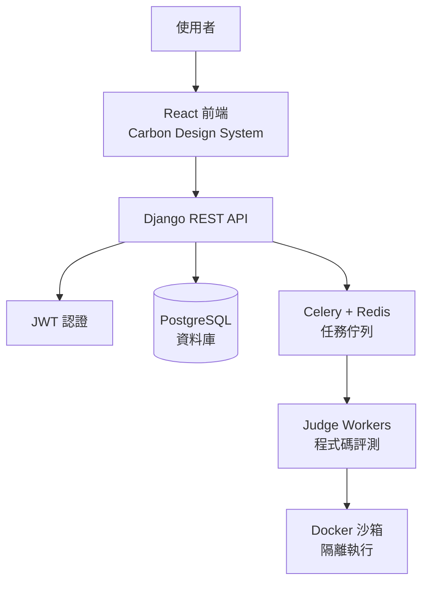

# QJudge - NYCU 線上評測平台

QJudge 是一個專為 NYCU（國立陽明交通大學）設計的現代化線上評測系統（Online Judge），提供完整的程式競賽與教學功能。

**域名**: `nycu-coding-lab.quan.wtf`

**技術棧**: React + Django + PostgreSQL + Celery + Docker

---

## 🎯 QJudge 簡介

QJudge 是一個功能完整的線上程式評測平台，專為程式設計課程與競賽設計。系統支援多種程式語言，提供即時評測、競賽管理、題目管理等完整功能。

### 核心特色

- 🎓 **教學導向**: 專為教師和學生設計的直觀介面
- 🏆 **競賽系統**: 完整的線上競賽功能，支援即時排名
- 📝 **題目管理**: 支援 YAML 格式批量導入題目
- 🔒 **安全評測**: 使用 Docker 沙箱隔離執行學生程式碼
- 🌐 **多語言支援**: 支援 C++、Python、Java 等多種程式語言
- ⚡ **即時回饋**: WebSocket 即時推送評測結果
- 📊 **數據分析**: 詳細的提交統計與分析功能

### 主要功能

#### 👨‍🎓 學生功能
- 瀏覽和解決程式題目
- 提交程式碼並即時查看評測結果
- 參加線上競賽並查看排名
- 查看歷史提交記錄和統計數據

#### 👨‍🏫 教師功能
- 創建和管理程式題目
- 使用 YAML 格式批量導入題目
- 舉辦和管理線上競賽
- 查看學生提交記錄和統計數據
- 自訂測試資料和評分標準

#### 🔧 系統功能
- JWT Token 身份驗證
- RESTful API 設計
- Docker 容器化部署
- Celery 非同步評測任務處理
- PostgreSQL 資料庫存儲
- Redis 快取和任務佇列

---

## 📚 文件導覽

本專案提供完整的中英文文件，涵蓋開發、部署、使用等各個方面。

### 🚀 快速開始
- **[執行與部署指南](./docs/RUN_AND_DEPLOY.md)** - 本地開發環境設置與生產環境部署
- **[DEPLOYMENT.md](./DEPLOYMENT.md)** - Docker Compose 與 Cloudflare Tunnel 詳細部署指南

### 👥 使用者指南
- **[學生使用指南](./docs/STUDENT_GUIDE.md)** - 如何參加競賽、提交程式碼
- **[教師競賽指南](./docs/TEACHER_CONTEST_GUIDE.md)** - 如何舉辦和管理競賽
- **[教師題目管理指南](./docs/TEACHER_PROBLEM_GUIDE.md)** - 如何創建和管理題目

### 💻 開發者文件
- **[後端 API 文件](./BACKEND_API.md)** - RESTful API 端點說明
- **[題目導入格式](./docs/problem-import-format.md)** - YAML 題目格式規範
- **[資料庫設計](./DATABASE_DESIGN.md)** - 資料庫結構與關聯
- **[前端使用案例](./FRONTEND_USECASE.md)** - 前端功能與使用流程
- **[UI 設計指南](./UI_DESIGN.md)** - 介面設計規範

### 🔧 技術文件
- **[開發需求](./REQUIREMENTS.md)** - 系統需求與功能規劃
- **[AI Agent 指南](./AGENT_GUIDE.md)** - AI 協作開發指引

---

## 🚀 快速開始

### 新手入門

1. **選擇你的身份**：
   - 👨‍🎓 學生使用者：閱讀 [學生使用指南](./docs/STUDENT_GUIDE.md)
   - 👨‍🏫 教師使用者：閱讀 [教師競賽指南](./docs/TEACHER_CONTEST_GUIDE.md) 和 [題目管理指南](./docs/TEACHER_PROBLEM_GUIDE.md)
   - 💻 開發者：閱讀 [執行與部署指南](./docs/RUN_AND_DEPLOY.md)

2. **本地開發環境設置**：
```bash
# 參考完整設置步驟請見 docs/RUN_AND_DEPLOY.md

# 啟動後端
cd backend
python -m venv venv
source venv/bin/activate  # Windows: venv\Scripts\activate
pip install -r requirements/dev.txt
python manage.py migrate
python manage.py runserver

# 啟動前端（新終端）
cd frontend
npm install
npm run dev
```

3. **使用 Docker 快速啟動**：
```bash
# 開發環境
docker-compose -f docker-compose.dev.yml up

# 存取：
# - 前端：http://localhost:3000
# - 後端：http://localhost:8000
# - Admin：http://localhost:8000/admin
```

---

## 💻 技術架構

### 系統架構圖



### 技術棧詳細說明

#### 前端技術
- **React 19**: 現代化的使用者介面框架
- **Carbon Design System**: IBM 開源設計系統
- **React Router**: 單頁應用路由管理
- **Monaco Editor**: 線上程式碼編輯器（VS Code 核心）
- **Vite**: 快速的前端建置工具

#### 後端技術  
- **Django 4**: Python Web 框架
- **Django REST Framework**: RESTful API 建構
- **PostgreSQL 15**: 關聯式資料庫
- **Celery**: 分散式任務佇列
- **Redis**: 快取與任務佇列
- **JWT**: 無狀態身份驗證

#### 評測系統
- **Docker**: 安全的程式碼執行沙箱
- **支援語言**: C++17、Python 3、Java 17、JavaScript (Node.js)
- **資源限制**: CPU 時間、記憶體、輸出大小限制
- **安全機制**: 網路隔離、檔案系統限制、系統呼叫過濾

#### 部署技術
- **Docker Compose**: 容器編排
- **Cloudflare Tunnel**: 安全的網路連接
- **GitHub Actions**: CI/CD 自動化
- **Nginx**: 反向代理與靜態檔案服務

---

## 📊 系統功能模組

### 1. 認證與授權模組
- JWT Token 身份驗證
- 使用者註冊與登入
- 權限管理（學生、教師、管理員）

### 2. 題目管理模組
- 題目的 CRUD 操作
- 多語言題目描述支援
- YAML 格式批量導入
- 測試資料管理
- 範例測試與隱藏測試

### 3. 提交評測模組
- 多語言編譯與執行
- 即時評測狀態更新（WebSocket）
- 評測結果詳細回饋
- 提交歷史記錄
- 程式碼相似度檢測（計劃中）

### 4. 競賽系統模組
- 競賽創建與管理
- 競賽密碼保護
- 即時排名系統
- 罰時計算
- 題目凍結機制
- 競賽公告系統

### 5. 通知系統模組
- 系統通知
- 競賽公告
- 評測結果通知
- WebSocket 即時推送

---

## 🎯 主要使用場景

### 學生使用流程
1. 註冊並登入系統
2. 瀏覽題目列表，選擇題目
3. 閱讀題目描述與範例
4. 使用線上編輯器撰寫程式碼
5. 提交程式碼並查看評測結果
6. 參加競賽並查看即時排名

### 教師使用流程
1. 登入教師帳號
2. 創建新題目或批量導入題目
3. 設置題目的測試資料與評分
4. 創建競賽並新增題目
5. 設定競賽時間與參數
6. 監控競賽進行與學生提交
7. 查看統計數據與分析

---

## 🔒 安全性設計

### 程式碼執行安全
- **Docker 容器隔離**: 每個提交在獨立容器中執行
- **資源限制**: CPU、記憶體、磁碟空間限制
- **網路隔離**: 禁止網路存取
- **系統呼叫限制**: 使用 seccomp 限制危險的系統呼叫
- **執行時間限制**: 防止無窮迴圈

### 應用程式安全
- **JWT Token 認證**: 無狀態、安全的身份驗證
- **CORS 配置**: 跨域請求保護
- **SQL 注入防護**: ORM 查詢防護
- **XSS 防護**: 輸入驗證與輸出轉義
- **CSRF 防護**: Django 內建防護機制
- **密碼加密**: bcrypt 雜湊演算法

---

## 🌟 專案特色

### 1. 教育友善設計
- 清晰的題目描述與範例
- 詳細的錯誤訊息回饋
- 支援多種程式語言
- 提供程式碼模板

### 2. 效能優化
- Redis 快取減少資料庫查詢
- Celery 非同步任務處理
- 資料庫索引優化
- 靜態檔案 CDN 加速

### 3. 可擴展性
- 微服務架構設計
- Docker 容器化部署
- 水平擴展評測 Worker
- 模組化程式碼設計

### 4. 開發友善
- RESTful API 設計
- 完整的 API 文件
- 測試驅動開發
- 程式碼風格統一

---

## 📦 專案結構

```
QJudge/
├── backend/                 # Django 後端
│   ├── apps/               # Django 應用模組
│   │   ├── users/         # 使用者管理
│   │   ├── problems/      # 題目管理
│   │   ├── submissions/   # 提交評測
│   │   ├── contests/      # 競賽系統
│   │   ├── notifications/ # 通知系統
│   │   ├── judge/         # 評測核心
│   │   └── core/          # 核心功能
│   ├── config/            # Django 設定
│   ├── requirements/      # Python 依賴
│   └── tests/             # 測試檔案
│
├── frontend/               # React 前端
│   ├── src/
│   │   ├── components/    # React 元件
│   │   ├── pages/         # 頁面元件
│   │   ├── services/      # API 服務
│   │   ├── utils/         # 工具函數
│   │   └── types/         # TypeScript 型別
│   ├── public/            # 靜態資源
│   └── tests/             # 測試檔案
│
├── docs/                   # 文件目錄
│   ├── RUN_AND_DEPLOY.md          # 執行與部署
│   ├── STUDENT_GUIDE.md           # 學生指南
│   ├── TEACHER_CONTEST_GUIDE.md   # 教師競賽指南
│   ├── TEACHER_PROBLEM_GUIDE.md   # 教師題目管理
│   └── problem-import-format.md   # 題目格式
│
├── docker-compose.yml      # Docker Compose 設定
├── docker-compose.dev.yml  # 開發環境設定
├── .env.example            # 環境變數範例
└── README.md               # 專案說明
```

---

## 🤝 貢獻指南

歡迎提交 Issue 和 Pull Request！

### 開發流程
1. Fork 本專案
2. 創建功能分支 (`git checkout -b feature/AmazingFeature`)
3. 提交變更 (`git commit -m 'Add some AmazingFeature'`)
4. 推送到分支 (`git push origin feature/AmazingFeature`)
5. 開啟 Pull Request

### 程式碼規範
- 後端：遵循 PEP 8 Python 編碼規範
- 前端：遵循 ESLint 和 Prettier 設定
- 提交訊息：使用清晰的提交訊息描述變更

### 測試要求
- 後端測試覆蓋率需達到 80% 以上
- 前端關鍵功能需有單元測試
- 提交 PR 前需確保所有測試通過

---

## 📞 聯絡資訊與資源

### 聯絡方式
- **專案維護者**: NYCU 開發團隊
- **專案網站**: [nycu-coding-lab.quan.wtf](https://nycu-coding-lab.quan.wtf)
- **問題回報**: [GitHub Issues](https://github.com/quan0715/QJudge/issues)

### 相關資源
- **Django REST Framework**: https://www.django-rest-framework.org/
- **Carbon Design System**: https://carbondesignsystem.com/
- **PostgreSQL 文件**: https://www.postgresql.org/docs/
- **Docker 文件**: https://docs.docker.com/

---

## 📄 授權

本專案採用 MIT 授權 - 詳見 [LICENSE](LICENSE) 檔案

---

## 🙏 致謝

- [Django](https://www.djangoproject.com/) - 強大的 Python Web 框架
- [React](https://react.dev/) - 現代化的前端框架
- [Carbon Design System](https://carbondesignsystem.com/) - IBM 開源設計系統
- [PostgreSQL](https://www.postgresql.org/) - 強大的開源資料庫
- [Docker](https://www.docker.com/) - 容器化技術

---

## 📝 更新紀錄

- **v1.1.0** (2025-12-03) - 更新中文文件
  - 新增完整的中文 README
  - 新增使用者指南文件
  - 優化文件結構

- **v1.0.0** (2025-01-26) - 初始版本
  - 完成基本功能開發
  - 完成 MVP 需求
  - 部署上線

---

**QJudge** - 讓程式教學與競賽更簡單！ 🚀
