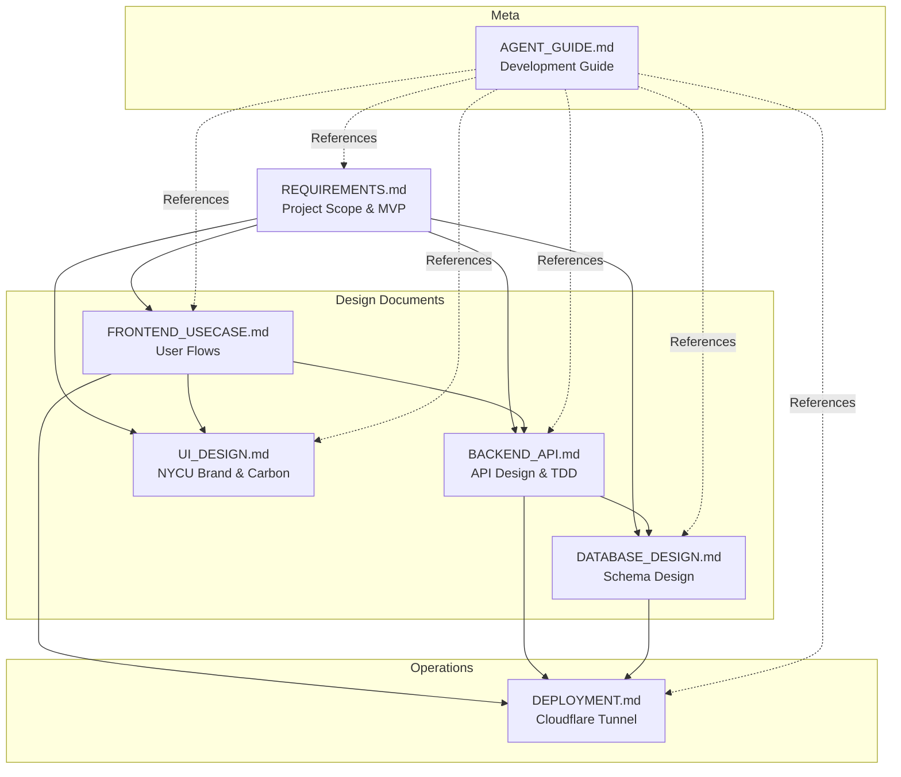

# NYCU Online Judge Platform - Documentation

Complete technical documentation for the NYCU Online Judge (OJ) Platform.

**Domain**: `nycu-coding-lab.quan.wtf`

**Tech Stack**: React + Django + PostgreSQL + Cloudflare Tunnel

---

## 📚 Documentation Structure

| Document | Description | Status |
|----------|-------------|--------|
| **[AGENT_GUIDE.md](./AGENT_GUIDE.md)** | AI Agent development guide, document relationships, and sync strategies | ✅ Ready |
| **[REQUIREMENTS.md](./REQUIREMENTS.md)** | MVP requirements, feature scope, tech stack, timeline | ✅ Ready |
| **[FRONTEND_USECASE.md](./FRONTEND_USECASE.md)** | User flows, UI components, page routing, state management | ✅ Ready |
| **[BACKEND_API.md](./BACKEND_API.md)** | API endpoints, TDD workflow, authentication strategy | ✅ Ready |
| **[DATABASE_DESIGN.md](./DATABASE_DESIGN.md)** | Schema, relationships, indexes, query optimization | ✅ Ready |
| **[UI_DESIGN.md](./UI_DESIGN.md)** | NYCU brand guidelines, Carbon Design System, color system | ✅ Ready |
| **[DEPLOYMENT.md](./DEPLOYMENT.md)** | Docker Compose, Cloudflare Tunnel, CI/CD, monitoring | ✅ Ready |

---

## 🎯 Quick Start for Developers

### 1. Read Documents in Order

**New Team Members**:
1. [REQUIREMENTS.md](./REQUIREMENTS.md) - Understand project goals
2. [DATABASE_DESIGN.md](./DATABASE_DESIGN.md) - Learn data structure
3. [BACKEND_API.md](./BACKEND_API.md) - API specs and TDD
4. [FRONTEND_USECASE.md](./FRONTEND_USECASE.md) - User flows
5. [UI_DESIGN.md](./UI_DESIGN.md) - Design guidelines
6. [DEPLOYMENT.md](./DEPLOYMENT.md) - Setup dev environment

**AI Agents**:
- Start with [AGENT_GUIDE.md](./AGENT_GUIDE.md) for complete workflow

### 2. Setup Development Environment

```bash
# Follow the instructions in DEPLOYMENT.md Section 2
cd online_judge
docker-compose up -d
```

### 3. Start Development

```bash
# Backend (TDD approach)
cd backend
python -m pytest  # Run tests first

# Frontend
cd frontend
npm run dev
```

---

## 📋 Document Relationships



---

## 🔑 Key Features (MVP)

### Authentication
- ✅ NYCU OAuth single sign-on
- ✅ Email/Password registration & login
- ✅ JWT token-based sessions

### Problem Management
- ✅ Multi-language problem descriptions (zh-TW, en)
- ✅ Test case generation for instructors
- ✅ Custom test cases for students
- ✅ C++ compilation and judging

### Contest System
- ✅ Timed exams with submission limits
- ✅ Screen monitoring (anti-cheating)
- ✅ Real-time rankings
- ✅ Q&A system

### Technical Stack
- **Frontend**: React + IBM Carbon Design System + Vite
- **Backend**: Django + DRF + Celery
- **Database**: PostgreSQL 15
- **Cache**: Redis 7
- **Deployment**: Docker Compose + Cloudflare Tunnel
- **CI/CD**: GitHub Actions

---

## 🛠️ Development Workflow

### TDD Approach (Backend)

```bash
# 1. Write tests first
cd backend
pytest tests/test_auth.py  # Should fail (RED)

# 2. Write minimal code to pass
# Implement feature...

pytest tests/test_auth.py  # Should pass (GREEN)

# 3. Refactor
# Improve code quality

pytest --cov=.  # Check coverage > 80%
```

### Feature Development Checklist

When adding a new feature:

```markdown
- [ ] Update REQUIREMENTS.md (if scope changes)
- [ ] Design API endpoints in BACKEND_API.md
- [ ] Design database schema in DATABASE_DESIGN.md
- [ ] Define user flows in FRONTEND_USECASE.md
- [ ] Check UI components in UI_DESIGN.md
- [ ] Write tests (TDD)
- [ ] Implement feature
- [ ] Update DEPLOYMENT.md (if env changes)
- [ ] Update AGENT_GUIDE.md change log
```

---

## 📖 Document Conventions

### File Naming
- **UPPERCASE.md** - Main documentation files
- **lowercase/** - Code directories
- Use hyphens for multi-word files: `database-design.md`

### Document Structure
All documents follow this structure:
```markdown
# Title

## Document Description
[Purpose and audience]

## Table of Contents
[Auto-generated or manual]

## Main Content
[Sections with clear headings]

## Change Log
[Version history]
```

### Cross-References
Use relative links:
```markdown
See [BACKEND_API.md](./BACKEND_API.md) for API specs.
Refer to section 3.2 in [DATABASE_DESIGN.md](./DATABASE_DESIGN.md#32-table-structure)
```

---

## 🔄 Keeping Documents in Sync

### Change Impact Matrix

| Change Type | REQ | FE | BE | DB | UI | DEPLOY |
|-------------|-----|----|----|----|----|--------|
| New Feature | ✅ | ✅ | ✅ | ✅ | ⚠️ | ⚠️ |
| Modify Feature | ✅ | ✅ | ✅ | ⚠️ | ❌ | ❌ |
| UI Change | ⚠️ | ✅ | ❌ | ❌ | ✅ | ❌ |
| API Change | ⚠️ | ✅ | ✅ | ⚠️ | ❌ | ❌ |
| DB Change | ⚠️ | ❌ | ✅ | ✅ | ❌ | ⚠️ |
| Tech Change | ✅ | ⚠️ | ⚠️ | ⚠️ | ❌ | ✅ |

- ✅ Must update
- ⚠️ May need update
- ❌ Usually no change

---

## 🤖 AI Agent Instructions

**For AI Agents developing this project**:

1. **Always read [AGENT_GUIDE.md](./AGENT_GUIDE.md) first**
2. Follow TDD workflow from [BACKEND_API.md](./BACKEND_API.md)
3. Use design patterns from documentation
4. Update all affected documents when making changes
5. Run tests before committing
6. Ensure code coverage > 80%

**Sample Prompt**:
```
Task: Implement user profile editing feature

Steps:
1. Read REQUIREMENTS.md to confirm it's in MVP scope
2. Check BACKEND_API.md for existing user endpoints
3. Add new API endpoint if needed
4. Update DATABASE_DESIGN.md if schema changes
5. Update FRONTEND_USECASE.md with user flow
6. Use TDD: Write tests → Implement → Refactor
7. Update documentation

Requirements:
- Follow Django + DRF conventions
- Use Carbon Design System components
- Maintain 80%+ test coverage
- Update all affected docs
```

---

## 📞 Contact & Resources

- **NYCU OAuth**: https://id.nycu.edu.tw/docs/
- **IBM Carbon**: https://carbondesignsystem.com/
- **Django DRF**: https://www.django-rest-framework.org/
- **PostgreSQL**: https://www.postgresql.org/docs/
- **Cloudflare**: https://dash.cloudflare.com/

---

## 📝 Version Control

All documents use Git version control. Major changes:

- **v1.0.0** (2025-01-26) - Initial documentation complete
  - MVP requirements defined
  - Full API design with TDD
  - Database schema v1
  - Cloudflare Tunnel deployment

---

## ✅ Document Status

Last updated: 2025-01-26

All documents are **READY FOR DEVELOPMENT** ✨

Start coding with confidence! 🚀
