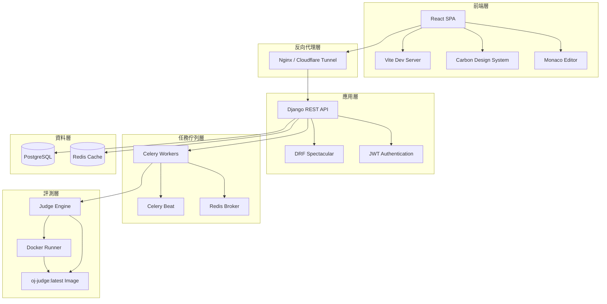

| col1 | col2 | col3 |
| ---- | ---- | ---- |
|      |      |      |
|      |      |      |

# QJudge 系統架構文件

> **文件版本**: 1.0
> **最後更新**: 2025-12-10
> **維護者**: NYCU 開發團隊

## 目錄

- [1. 系統概述](#1-系統概述)
- [2. 技術架構](#2-技術架構)
- [3. 後端架構](#3-後端架構)
- [4. 前端架構](#4-前端架構)
- [5. 資料庫設計](#5-資料庫設計)
- [6. 評測系統](#6-評測系統)
- [7. 部署架構](#7-部署架構)
- [8. 安全設計](#8-安全設計)

---

## 1. 系統概述

### 1.1 專案簡介

QJudge 是一個專為 NYCU（國立陽明交通大學）設計的現代化線上評測系統（Online Judge），提供完整的程式競賽與教學功能。

**核心域名**: `nycu-coding-lab.quan.wtf`

### 1.2 系統特色

- 🎓 **教學導向**: 專為教師和學生設計的直觀介面
- 🏆 **競賽系統**: 完整的線上競賽功能，支援即時排名
- 📝 **題目管理**: 支援 YAML 格式批量導入題目
- 🔒 **安全評測**: 使用 Docker 沙箱隔離執行學生程式碼
- 🌐 **多語言支援**: 支援 C++、Python、Java 等多種程式語言（前端目前主要支援 C++）
- ⚡ **即時回饋**: WebSocket 即時推送評測結果
- 📊 **數據分析**: 詳細的提交統計與分析功能

### 1.3 使用者角色

```
┌─────────────┐
│   Admin     │ ← 系統管理員（完整權限）
└─────────────┘
      ↓
┌─────────────┐
│   Teacher   │ ← 教師（可建立題目、競賽）
└─────────────┘
      ↓
┌─────────────┐
│   Student   │ ← 學生（解題、參加競賽）
└─────────────┘
```

---

## 2. 技術架構

### 2.1 系統架構圖



### 2.2 技術棧

#### 前端技術

| 技術                           | 版本    | 用途                             |
| ------------------------------ | ------- | -------------------------------- |
| **React**                | 19.2.0  | 使用者介面框架                   |
| **TypeScript**           | 5.9.3   | 型別安全                         |
| **Vite**                 | 7.2.4   | 建置工具                         |
| **Carbon Design System** | 1.96.0  | IBM 開源設計系統                 |
| **Monaco Editor**        | 4.7.0   | 線上程式碼編輯器（VS Code 核心） |
| **React Router**         | 7.9.6   | 路由管理                         |
| **TanStack Query**       | 5.90.12 | 資料獲取與快取                   |
| **React Markdown**       | 10.1.0  | Markdown 渲染                    |
| **Playwright**           | 1.57.0  | E2E 測試                         |

#### 後端技術

| 技術                            | 版本   | 用途                   |
| ------------------------------- | ------ | ---------------------- |
| **Django**                | 4.2.x  | Web 框架               |
| **Django REST Framework** | 3.14.x | RESTful API            |
| **PostgreSQL**            | 15     | 關聯式資料庫           |
| **Redis**                 | 7      | 快取與任務佇列         |
| **Celery**                | 5.3.x  | 分散式任務佇列         |
| **Docker**                | Latest | 容器化部署與程式碼沙箱 |
| **Gunicorn**              | 21.2.x | WSGI Server            |
| **JWT**                   | -      | 無狀態身份驗證         |
| **pytest**                | 7.4.x  | 單元測試               |

#### 評測系統

| 技術                    | 版本   | 用途            |
| ----------------------- | ------ | --------------- |
| **Docker Engine** | Latest | 隔離執行環境    |
| **GCC**           | 11.x   | C++ 編譯器      |
| **Python**        | 3.11   | Python 直譯器   |
| **OpenJDK**       | 17     | Java 編譯與執行 |
| **Seccomp**       | -      | 系統呼叫過濾    |

#### 部署技術

| 技術                        | 用途                   |
| --------------------------- | ---------------------- |
| **Docker Compose**    | 容器編排               |
| **Cloudflare Tunnel** | 安全的網路連接         |
| **GitHub Actions**    | CI/CD 自動化           |
| **Nginx**             | 反向代理與靜態檔案服務 |

---

## 3. 後端架構

### 3.1 Django 專案結構

```
backend/
├── apps/                       # Django 應用模組
│   ├── core/                  # 核心功能（資料庫路由、中介層）
│   ├── users/                 # 使用者認證與管理
│   ├── problems/              # 題目管理
│   ├── submissions/           # 提交評測
│   ├── contests/              # 競賽系統
│   ├── notifications/         # 通知系統
│   ├── announcements/         # 公告管理
│   └── judge/                 # 評測引擎
│
├── config/                    # Django 設定
│   ├── settings/
│   │   ├── base.py           # 基礎設定
│   │   ├── dev.py            # 開發環境
│   │   ├── prod.py           # 生產環境
│   │   └── test.py           # 測試環境
│   ├── urls.py               # URL 路由
│   ├── wsgi.py               # WSGI 介面
│   └── celery.py             # Celery 設定
│
├── requirements/              # Python 依賴
│   ├── base.txt              # 基礎套件
│   ├── dev.txt               # 開發套件
│   └── prod.txt              # 生產套件
│
├── tests/                     # 整合測試
├── fixtures/                  # 測試資料
├── scripts/                   # 管理腳本
└── manage.py                  # Django 管理指令
```

### 3.2 應用模組詳解

#### 3.2.1 Core (核心)

**職責**: 提供跨應用的核心功能

- **資料庫路由**: 動態切換 Local/Cloud 資料庫
- **中介層**: 資料庫切換中介層
- **例外處理**: 自訂例外處理器
- **管理指令**: 資料同步、遷移等

**主要檔案**:

- `db_router.py`: 資料庫路由器
- `db_middleware.py`: 資料庫切換中介層
- `db_views.py`: 資料庫管理 API
- `exceptions.py`: 自訂例外處理

#### 3.2.2 Users (使用者)

**職責**: 使用者認證與權限管理

**功能**:

- 📧 Email/密碼註冊登入
- 🎓 NYCU OAuth 整合
- 🔑 JWT Token 管理
- 👤 使用者個人檔案
- 📊 使用者統計資料
- 👥 角色管理（Admin/Teacher/Student）

**API 端點**:

```
POST   /api/v1/auth/email/register      # 註冊
POST   /api/v1/auth/email/login         # 登入
GET    /api/v1/auth/nycu/login          # NYCU OAuth 登入
POST   /api/v1/auth/nycu/callback       # OAuth 回調
POST   /api/v1/auth/refresh             # Token 刷新
GET    /api/v1/auth/me                  # 取得當前使用者
PATCH  /api/v1/auth/me                  # 更新個人資料
GET    /api/v1/auth/me/stats            # 使用者統計
GET    /api/v1/auth/search              # 搜尋使用者（Admin）
PATCH  /api/v1/auth/{id}/role           # 更新角色（Admin）
```

**資料模型**:

- `User`: 使用者基礎資料（擴展 AbstractUser）
- `UserProfile`: 使用者擴展資料（統計、偏好）

#### 3.2.3 Problems (題目)

**職責**: 題目管理與 CRUD 操作

**功能**:

- 📝 題目 CRUD 操作
- 🌐 多語言題目描述
- 📤 YAML 格式批量導入
- 🧪 測試案例管理
- 🏷️ 標籤分類
- 🔒 關鍵字限制（禁用/必須關鍵字）

**API 端點**:

```
GET    /api/v1/problems/                # 題目列表
POST   /api/v1/problems/                # 建立題目（Teacher+）
GET    /api/v1/problems/{id}/           # 題目詳情
PUT    /api/v1/problems/{id}/           # 更新題目（Teacher+）
DELETE /api/v1/problems/{id}/           # 刪除題目（Admin）
POST   /api/v1/problems/import/         # 批量導入（Teacher+）
POST   /api/v1/problems/{id}/test/      # 測試執行
```

**資料模型**:

- `Problem`: 題目核心資料
- `ProblemTranslation`: 多語言翻譯
- `LanguageConfig`: 語言特定設定
- `TestCase`: 測試案例
- `Tag`: 標籤

#### 3.2.4 Submissions (提交)

**職責**: 程式碼提交與評測

**功能**:

- 📤 程式碼提交
- ⚖️ 評測狀態管理
- 📊 提交歷史
- 🔍 提交詳情查詢
- 🧪 自訂測資測試

**API 端點**:

```
GET    /api/v1/submissions/             # 提交列表
POST   /api/v1/submissions/             # 提交程式碼
GET    /api/v1/submissions/{id}/        # 提交詳情
GET    /api/v1/submissions/{id}/results/ # 評測結果詳情
```

**資料模型**:

- `Submission`: 提交記錄
- `SubmissionResult`: 測試案例結果
- `ScreenEvent`: 螢幕監控事件（考試模式）

**評測狀態**:

```
pending   → judging → AC/WA/TLE/MLE/RE/CE/KR/SE
```

- **AC** (Accepted): 通過
- **WA** (Wrong Answer): 答案錯誤
- **TLE** (Time Limit Exceeded): 超時
- **MLE** (Memory Limit Exceeded): 記憶體超限
- **RE** (Runtime Error): 執行時錯誤
- **CE** (Compilation Error): 編譯錯誤
- **KR** (Keyword Restriction): 關鍵字限制
- **SE** (System Error): 系統錯誤

#### 3.2.5 Contests (競賽)

**職責**: 競賽管理與考試模式

**功能**:

- 🏆 競賽建立與管理
- 👥 參賽者管理
- 📊 即時排行榜
- 🔒 密碼保護
- 📢 競賽公告
- ❓ Clarification 系統
- 🎯 考試模式（防作弊）
- 🎭 匿名模式
- 👨‍🏫 多管理員支援

**API 端點**:

```
GET    /api/v1/contests/                # 競賽列表
POST   /api/v1/contests/                # 建立競賽（Teacher+）
GET    /api/v1/contests/{id}/           # 競賽詳情
PUT    /api/v1/contests/{id}/           # 更新競賽
POST   /api/v1/contests/{id}/register/  # 註冊參賽
POST   /api/v1/contests/{id}/start/     # 開始考試
POST   /api/v1/contests/{id}/end/       # 結束考試
GET    /api/v1/contests/{id}/scoreboard/ # 排行榜
POST   /api/v1/contests/{id}/announcements/ # 發布公告
GET    /api/v1/contests/{id}/clarifications/ # Clarification 列表
```

**資料模型**:

- `Contest`: 競賽基礎資料
- `ContestProblem`: 競賽題目（多對多關聯）
- `ContestParticipant`: 參賽者（註冊記錄）
- `ContestAnnouncement`: 競賽公告
- `Clarification`: Q&A 系統
- `ExamEvent`: 考試事件（防作弊監控）
- `ContestActivity`: 活動日誌

**競賽狀態**:

```
inactive → active → archived
```

**參賽者考試狀態**:

```
not_started → in_progress → paused/locked/submitted
```

#### 3.2.6 Judge (評測引擎)

**職責**: 程式碼編譯與執行

**架構**:

```
JudgeFactory
    ↓
BaseJudge (抽象基類)
    ↓
├─ CppJudge (C++ 評測)
├─ PythonJudge (Python 評測)
├─ JavaJudge (Java 評測)
└─ ... (可擴展)
```

**主要檔案**:

- `judge_factory.py`: Judge 工廠模式
- `base_judge.py`: 抽象基類
- `docker_runner.py`: Docker 執行器（C++ 實作）
- `python_judge.py`: Python 實作

**評測流程**:

1. 接收 Celery 任務
2. 根據語言選擇 Judge
3. 在 Docker 容器中執行
4. 收集結果（狀態、時間、記憶體）
5. 比對輸出
6. 更新資料庫

---

## 4. 前端架構

### 4.1 專案結構

```
frontend/
├── src/
│   ├── app/                   # 應用主結構
│   │   ├── pages/            # 頁面元件
│   │   └── providers.tsx     # 全域 Provider
│   │
│   ├── domains/               # 業務領域
│   │   ├── auth/             # 認證領域
│   │   ├── problem/          # 題目領域
│   │   ├── submission/       # 提交領域
│   │   ├── contest/          # 競賽領域
│   │   └── admin/            # 管理領域
│   │
│   ├── core/                  # 核心邏輯
│   │   ├── entities/         # 實體定義
│   │   ├── config/           # 設定檔
│   │   └── mappers/          # 資料映射器
│   │
│   ├── services/              # 服務層
│   │   ├── api/              # API 呼叫
│   │   └── databaseService.ts # 資料庫服務
│   │
│   ├── ui/                    # UI 元件庫
│   │   ├── components/       # 通用元件
│   │   ├── layout/           # 版面元件
│   │   └── theme/            # 主題系統
│   │
│   ├── layouts/               # 版面配置
│   ├── hooks/                 # 自訂 Hooks
│   ├── utils/                 # 工具函數
│   ├── App.tsx               # 應用入口
│   └── main.tsx              # 渲染入口
│
├── tests/                     # 測試
│   ├── e2e/                  # E2E 測試
│   └── helpers/              # 測試輔助
│
├── public/                    # 靜態資源
├── nginx/                     # Nginx 設定
└── playwright.config.e2e.ts  # Playwright 設定
```

### 4.2 領域驅動設計 (Domain-Driven Design)

#### 4.2.1 Auth 領域

**職責**: 使用者認證與授權

**元件**:

- `AuthContext.tsx`: 認證狀態管理
- `LoginPage.tsx`: 登入頁面
- `RegisterPage.tsx`: 註冊頁面
- `OAuthCallbackPage.tsx`: OAuth 回調
- `RouteGuards.tsx`: 路由守衛

**路由守衛**:

- `RequireAuth`: 需要登入
- `RequireGuest`: 需要未登入
- `RequireAdmin`: 需要 Admin 角色
- `RequireTeacherOrAdmin`: 需要 Teacher+ 角色

#### 4.2.2 Problem 領域

**職責**: 題目瀏覽與解題

**元件**:

- `ProblemList.tsx`: 題目列表
- `ProblemDetail.tsx`: 題目詳情
- `ProblemSolver.tsx`: 解題介面
- `ProblemForm.tsx`: 題目表單（Teacher+）
- `ProblemImportModal.tsx`: 批量導入（Teacher+）

#### 4.2.3 Contest 領域

**職責**: 競賽參與與管理

**元件**:

- `ContestListPage.tsx`: 競賽列表
- `ContestDashboard.tsx`: 競賽儀表板（統一入口）
- `ContestProblemPage.tsx`: 競賽解題
- `ContestScoreboard.tsx`: 排行榜
- `ContestSettingsPage.tsx`: 競賽設定（Teacher+）
- `ExamModeWrapper.tsx`: 考試模式監控

**考試模式特色**:

- 全螢幕鎖定
- 視窗失焦檢測
- 複製貼上監控
- 自動鎖定機制
- 違規計數

#### 4.2.4 Submission 領域

**職責**: 提交記錄查詢

**元件**:

- `SubmissionsPage.tsx`: 提交列表
- `SubmissionTable.tsx`: 提交表格
- `SubmissionDetailModal.tsx`: 提交詳情

### 4.3 狀態管理

#### 4.3.1 全域狀態 (Context)

```typescript
// 認證狀態
AuthContext: {
  user: User | null;
  token: string | null;
  login: (credentials) => Promise<void>;
  logout: () => void;
  isAuthenticated: boolean;
}

// 主題狀態
ThemeContext: {
  theme: 'white' | 'g10' | 'g90' | 'g100';
  setTheme: (theme) => void;
}

// 競賽狀態
ContestContext: {
  contest: Contest | null;
  isParticipant: boolean;
  role: 'owner' | 'admin' | 'participant' | null;
  // ... more
}
```

#### 4.3.2 伺服器狀態 (TanStack Query)

```typescript
// 範例：使用 useQuery
const { data: problems, isLoading } = useQuery({
  queryKey: ['problems', filters],
  queryFn: () => fetchProblems(filters),
  staleTime: 60000, // 1 分鐘
});

// 範例：使用 useMutation
const { mutate: submitCode } = useMutation({
  mutationFn: (code: string) => submitProblem(code),
  onSuccess: () => {
    queryClient.invalidateQueries(['submissions']);
  },
});
```

### 4.4 路由結構

```
/                              → Dashboard (登入後)
/login                         → 登入頁面
/register                      → 註冊頁面
/auth/nycu/callback            → NYCU OAuth 回調

/dashboard                     → 儀表板
/problems                      → 題目列表
/problems/:id                  → 題目詳情
/submissions                   → 提交列表

/contests                      → 競賽列表
/contests/new                  → 建立競賽 (Teacher+)
/contests/:id                  → 競賽儀表板
  ?tab=problems                   → 題目列表
  ?tab=submissions                → 提交記錄
  ?tab=standings                  → 排行榜
  ?tab=clarifications             → Q&A
  ?tab=settings                   → 設定 (Owner/Admin)
  ?tab=manage-problems            → 題目管理 (Owner/Admin)
  ?tab=participants               → 參賽者管理 (Owner/Admin)
  ?tab=admins                     → 管理員管理 (Owner)
  ?tab=logs                       → 活動日誌 (Owner/Admin)
/contests/:id/solve/:problemId → 競賽解題

/management/problems           → 題目管理 (Teacher+)
/management/problems/new       → 建立題目 (Teacher+)
/management/problems/:id/edit  → 編輯題目 (Teacher+)

/admin/users                   → 使用者管理 (Admin)
/admin/environment             → 環境管理 (Admin)
/management/announcements      → 公告管理 (Admin)
```

---

## 5. 資料庫設計

### 5.1 資料庫選擇

**Primary**: PostgreSQL 15

- ✅ 關聯式資料完整性
- ✅ 豐富的索引支援
- ✅ JSONB 欄位支援
- ✅ 成熟的生態系統

**Cache**: Redis 7

- ✅ Celery Broker
- ✅ 快取層
- ✅ 任務結果儲存

### 5.2 資料庫架構

專案支援雙資料庫架構：

```
┌──────────────┐       ┌──────────────┐
│ Local DB     │ ←───→ │ Cloud DB     │
│ (PostgreSQL) │ Sync  │ (Supabase)   │
└──────────────┘       └──────────────┘
       ↑                      ↑
       │                      │
       └──────── Django ──────┘
              (Dynamic Router)
```

**Local DB**: Docker 內的 PostgreSQL（開發/測試）
**Cloud DB**: Supabase PostgreSQL（生產環境備份）

### 5.3 核心資料表

#### Users (使用者)

```sql
users
├── id (PK)
├── username (Unique)
├── email (Unique)
├── password (Hashed)
├── auth_provider (email/nycu-oauth/...)
├── oauth_id
├── role (student/teacher/admin)
├── email_verified
├── created_at
└── updated_at

user_profiles (1-1 with users)
├── id (PK)
├── user_id (FK)
├── solved_count
├── submission_count
├── accept_rate
├── preferred_language
└── updated_at
```

#### Problems (題目)

```sql
problems
├── id (PK)
├── title
├── slug (Unique)
├── difficulty (easy/medium/hard)
├── time_limit (ms)
├── memory_limit (MB)
├── display_id (Unique, e.g., P001)
├── is_visible
├── is_practice_visible
├── created_by (FK → users)
├── created_in_contest (FK → contests, nullable)
├── submission_count
├── accepted_count
├── forbidden_keywords (JSONB)
├── required_keywords (JSONB)
├── created_at
└── updated_at

problem_translations (多語言)
├── id (PK)
├── problem_id (FK)
├── language (zh-TW/en)
├── title
├── description
├── input_description
├── output_description
└── hint

problem_language_configs
├── id (PK)
├── problem_id (FK)
├── language (cpp/python/java/...)
├── template_code
├── is_enabled
└── order

test_cases
├── id (PK)
├── problem_id (FK)
├── input_data
├── output_data
├── is_sample
├── is_hidden
├── score
└── order

tags
├── id (PK)
├── name (Unique)
├── slug (Unique)
├── description
├── color
└── created_at

problems ←→ tags (Many-to-Many)
```

#### Submissions (提交)

```sql
submissions
├── id (PK)
├── user_id (FK)
├── problem_id (FK)
├── contest_id (FK, nullable)
├── source_type (practice/contest)
├── language (cpp/python/java)
├── code (Text)
├── is_test (Boolean)
├── custom_test_cases (JSONB)
├── status (pending/judging/AC/WA/TLE/...)
├── score
├── exec_time (ms)
├── memory_usage (KB)
├── error_message
├── created_at
└── updated_at

submission_results (測試案例結果)
├── id (PK)
├── submission_id (FK)
├── test_case_id (FK, nullable for custom)
├── status (AC/WA/TLE/...)
├── exec_time (ms)
├── memory_usage (KB)
├── output
├── error_message
├── input_data (Snapshot)
└── expected_output (Snapshot)

screen_events (考試模式監控)
├── id (PK)
├── submission_id (FK)
├── event_type (blur/focus/copy/paste/...)
├── timestamp
└── details (JSONB)
```

#### Contests (競賽)

```sql
contests
├── id (PK)
├── name
├── description
├── rules
├── start_time (nullable)
├── end_time (nullable)
├── owner_id (FK → users)
├── visibility (public/private)
├── password (nullable)
├── status (active/inactive/archived)
├── exam_mode_enabled
├── scoreboard_visible_during_contest
├── anonymous_mode_enabled
├── allow_view_results
├── allow_multiple_joins
├── allow_auto_unlock
├── auto_unlock_minutes
├── max_cheat_warnings
├── created_at
└── updated_at

contests ←→ users (Many-to-Many via admins)

contest_problems (競賽題目)
├── id (PK)
├── contest_id (FK)
├── problem_id (FK)
└── order

contest_participants (參賽者)
├── id (PK)
├── contest_id (FK)
├── user_id (FK)
├── score
├── rank
├── nickname (匿名模式)
├── exam_status (not_started/in_progress/paused/locked/submitted)
├── joined_at
├── started_at
├── left_at
├── locked_at
├── lock_reason
└── violation_count

contest_announcements
├── id (PK)
├── contest_id (FK)
├── title
├── content
├── created_by (FK → users)
├── created_at
└── updated_at

contest_clarifications (Q&A)
├── id (PK)
├── contest_id (FK)
├── problem_id (FK, nullable)
├── author_id (FK → users)
├── question
├── answer
├── is_public
├── status (pending/answered)
├── created_at
└── answered_at

exam_events (考試事件)
├── id (PK)
├── contest_id (FK)
├── user_id (FK)
├── event_type (tab_hidden/window_blur/...)
├── metadata (JSONB)
└── created_at

contest_activities (活動日誌)
├── id (PK)
├── contest_id (FK)
├── user_id (FK)
├── action_type (register/start_exam/submit/...)
├── details
└── created_at
```

#### Notifications & Announcements

```sql
notifications
├── id (PK)
├── user_id (FK)
├── title
├── message
├── type
├── is_read
└── created_at

announcements (系統公告)
├── id (PK)
├── title
├── content
├── priority
├── is_active
├── created_by (FK → users)
├── created_at
└── updated_at
```

### 5.4 索引策略

**重點索引**:

```sql
-- Users
CREATE INDEX idx_users_email ON users(email);
CREATE INDEX idx_users_username ON users(username);
CREATE INDEX idx_users_role ON users(role);

-- Problems
CREATE INDEX idx_problems_difficulty ON problems(difficulty);
CREATE INDEX idx_problems_is_visible ON problems(is_visible);
CREATE INDEX idx_problems_is_practice_visible ON problems(is_practice_visible);

-- Submissions (效能關鍵！)
CREATE INDEX idx_submissions_user_created ON submissions(user_id, created_at DESC);
CREATE INDEX idx_submissions_problem_created ON submissions(problem_id, created_at DESC);
CREATE INDEX idx_submissions_contest_created ON submissions(contest_id, source_type, created_at DESC);
CREATE INDEX idx_submissions_status_created ON submissions(status, created_at DESC);
CREATE INDEX idx_submissions_source_test_created ON submissions(source_type, is_test, created_at DESC);

-- Contests
CREATE INDEX idx_contests_status ON contests(status);
CREATE INDEX idx_contests_start_time ON contests(start_time);

-- Exam Events
CREATE INDEX idx_exam_events_contest_user ON exam_events(contest_id, user_id);
CREATE INDEX idx_exam_events_created ON exam_events(created_at);
```

---

## 6. 評測系統

### 6.1 Judge 架構

```
┌─────────────────────────────────────────────┐
│            Django Application               │
│                                             │
│  Submission API → Celery Task (async)      │
└─────────────────┬───────────────────────────┘
                  │
                  ↓
┌─────────────────────────────────────────────┐
│           Celery Worker Pool                │
│                                             │
│  Task: judge_submission(submission_id)     │
│    1. Fetch submission & test cases        │
│    2. Choose Judge (via JudgeFactory)      │
│    3. Execute code in Docker               │
│    4. Collect results                      │
│    5. Update database                      │
└─────────────────┬───────────────────────────┘
                  │
                  ↓
┌─────────────────────────────────────────────┐
│          Judge Factory Pattern              │
│                                             │
│  get_judge(language) → BaseJudge           │
│    ├─ CppJudge                             │
│    ├─ PythonJudge                          │
│    └─ JavaJudge (future)                   │
└─────────────────┬───────────────────────────┘
                  │
                  ↓
┌─────────────────────────────────────────────┐
│        Docker Runner (Isolated)             │
│                                             │
│  Container per execution:                   │
│    - Image: oj-judge:latest                │
│    - Network: disabled                      │
│    - CPU limit: 1 core                      │
│    - Memory limit: problem.memory_limit     │
│    - PID limit: 64                          │
│    - Seccomp: cpp.json (syscall filter)    │
│    - Tmpfs: /tmp (100MB, executable)       │
│    - Capabilities: dropped (security)       │
└─────────────────────────────────────────────┘
```

### 6.2 評測流程

```
1. User Submit Code
   ↓
2. Create Submission (status: pending)
   ↓
3. Dispatch Celery Task: judge_submission.delay(submission_id)
   ↓
4. Celery Worker picks task
   ↓
5. Update status → judging
   ↓
6. Get Judge (CppJudge/PythonJudge)
   ↓
7. For each test_case:
   │
   ├─ Execute in Docker Container
   │  ├─ Compile code (if needed)
   │  ├─ Run with input_data
   │  ├─ Collect output, time, memory
   │  └─ Compare with expected_output
   │
   ├─ Save SubmissionResult
   │
   └─ Check status (CE/SE → stop early)
   ↓
8. Calculate final score & status
   ↓
9. Update Submission (status: AC/WA/TLE/...)
   ↓
10. Update Problem stats (submission_count, accepted_count)
    ↓
11. Update UserProfile stats
```

### 6.3 Docker 沙箱安全

#### 6.3.1 資源限制

```python
container = docker_client.containers.run(
    image='oj-judge:latest',
  
    # Memory
    mem_limit=f"{memory_limit_mb}m",
    memswap_limit=f"{memory_limit_mb}m",  # No swap
  
    # CPU
    cpu_period=100000,
    cpu_quota=100000,  # 1 core
  
    # Process
    pids_limit=64,  # Anti-fork bomb
  
    # Network
    network_disabled=True,
  
    # Tmpfs (executable)
    tmpfs={'/tmp': 'size=100M,mode=1777,exec'},
)
```

#### 6.3.2 Security Options

```python
security_opts = [
    'no-new-privileges',  # Prevent privilege escalation
    f'seccomp={seccomp_profile_path}',  # Syscall filtering
]

# Drop dangerous capabilities
cap_drop = [
    'NET_ADMIN', 'SYS_ADMIN', 'SYS_BOOT', 
    'SYS_MODULE', 'SYS_RAWIO', 'SYS_PTRACE',
    'SYS_TIME', 'MAC_ADMIN', 'MAC_OVERRIDE',
    'NET_RAW', 'AUDIT_WRITE', 'AUDIT_CONTROL'
]
```

#### 6.3.3 Seccomp Profile

Seccomp（Secure Computing Mode）過濾危險的系統呼叫：

```json
{
  "defaultAction": "SCMP_ACT_ALLOW",
  "syscalls": [
    {
      "names": ["reboot", "kexec_load", "mount", "umount", "pivot_root"],
      "action": "SCMP_ACT_ERRNO"
    }
  ]
}
```

**檔案位置**: `backend/judge/seccomp_profiles/cpp.json`

### 6.4 Judge Docker Image

**Dockerfile**: `backend/judge/Dockerfile.judge`

```dockerfile
FROM ubuntu:22.04

# Install compilers & runtimes
RUN apt-get update && apt-get install -y \
    g++ \
    python3 \
    openjdk-17-jdk \
    && rm -rf /var/lib/apt/lists/*

# Security hardening
RUN useradd -m -s /bin/bash judge
USER judge
WORKDIR /tmp
```

**Build**:

```bash
docker build -t oj-judge:latest -f backend/judge/Dockerfile.judge backend/judge
```

### 6.5 支援語言

| 語言             | 版本  | 編譯器/直譯器 | 前端支援                  |
| ---------------- | ----- | ------------- | ------------------------- |
| **C++**    | C++20 | g++ 11.x      | ✅ 完整支援               |
| **Python** | 3.11  | CPython       | ✅ 後端支援，前端待整合   |
| **Java**   | 17    | OpenJDK       | ⚠️ 後端支援，前端待整合 |
| **C**      | C11   | gcc           | ⚠️ 後端支援，前端待整合 |

**註**: 前端主要針對 C++ 優化，其他語言後端已實作但前端 UI 需進一步整合。

---

## 7. 部署架構

### 7.1 Docker Compose 架構

```yaml
services:
  # Database
  postgres:
    image: postgres:15-alpine
    volumes:
      - postgres_data:/var/lib/postgresql/data
    healthcheck: pg_isready

  # Cache & Broker
  redis:
    image: redis:7-alpine
    healthcheck: redis-cli ping

  # Backend
  backend:
    build: ./backend
    command: gunicorn --workers 4 config.wsgi:application
    depends_on:
      - postgres
      - redis

  # Celery Workers
  celery:
    build: ./backend
    command: celery -A config worker -l info
    volumes:
      - /var/run/docker.sock:/var/run/docker.sock  # DinD
      - judge_tmp:/judge_tmp
    depends_on:
      - backend
      - redis

  # Celery Beat (Scheduler)
  celery-beat:
    build: ./backend
    command: celery -A config beat -l info
    depends_on:
      - redis

  # Frontend
  frontend:
    build: ./frontend
    ports:
      - "80:80"
    depends_on:
      - backend

  # Cloudflare Tunnel
  cloudflared:
    image: cloudflare/cloudflared:latest
    command: tunnel --no-autoupdate run --token ${TUNNEL_TOKEN}

  # Judge Image Builder
  judge-image:
    build:
      context: ./backend/judge
      dockerfile: Dockerfile.judge
    image: oj-judge:latest
```

### 7.2 環境配置

#### 7.2.1 開發環境 (docker-compose.dev.yml)

```bash
docker-compose -f docker-compose.dev.yml up

# 前端: http://localhost:5173
# 後端: http://localhost:8000
# Admin: http://localhost:8000/django-admin
```

**特色**:

- 🔥 Hot reload (前後端)
- 🐛 Debug mode
- 📊 Browsable API
- 🔓 CORS allow all

#### 7.2.2 測試環境 (docker-compose.test.yml)

```bash
docker-compose -f docker-compose.test.yml up

# E2E Tests
cd frontend
npm run test:e2e
```

**特色**:

- 🧪 獨立測試資料庫
- 🎭 Playwright E2E
- 🔄 Test fixtures

#### 7.2.3 生產環境 (docker-compose.yml)

```bash
docker-compose up -d
```

**特色**:

- 🔒 SSL/TLS (Cloudflare)
- 🚀 Gunicorn (4 workers)
- 📈 Health checks
- 🔐 Security headers
- 📦 Static files (Nginx)

### 7.3 CI/CD Pipeline

#### 7.3.1 Backend Tests (.github/workflows/backend-tests.yml)

```yaml
Trigger: Push/PR to backend/**
Jobs:
  - Setup PostgreSQL & Redis
  - Install Python dependencies
  - Build oj-judge Docker image
  - Run migrations
  - Run pytest (coverage 80%)
```

#### 7.3.2 Judge Tests (.github/workflows/judge-tests.yml)

```yaml
Trigger: Push/PR to backend/**
Jobs:
  - Build judge image
  - Run judge unit tests
  - Run multi-language tests
  - Generate coverage report
```

#### 7.3.3 Frontend E2E Tests (Planned)

```yaml
Trigger: Push/PR to frontend/**
Jobs:
  - Setup test environment
  - Run Playwright E2E tests
  - Upload test artifacts
```

---

## 8. 安全設計

### 8.1 認證與授權

#### 8.1.1 JWT Token

```
Access Token: 1 hour
Refresh Token: 7 days
Algorithm: HS256
```

**流程**:

```
Login → Access Token + Refresh Token
      ↓
每次請求帶 Authorization: Bearer <access_token>
      ↓
Token 過期 → 使用 Refresh Token 換新的 Access Token
```

#### 8.1.2 RBAC (Role-Based Access Control)

```
Admin    > Teacher   > Student
  ↓          ↓           ↓
全部權限   管理題目    解題參賽
           管理競賽
```

**權限矩陣**:

| 功能         | Admin | Teacher | Student |
| ------------ | ----- | ------- | ------- |
| 建立題目     | ✅    | ✅      | ❌      |
| 編輯他人題目 | ✅    | ❌      | ❌      |
| 建立競賽     | ✅    | ✅      | ❌      |
| 管理使用者   | ✅    | ❌      | ❌      |
| 參加競賽     | ✅    | ✅      | ✅      |
| 提交程式碼   | ✅    | ✅      | ✅      |

### 8.2 程式碼執行安全

#### 8.2.1 Docker 隔離

- 🔒 **Network disabled**: 禁止網路存取
- 🔒 **Capabilities dropped**: 移除危險權限
- 🔒 **Read-only root**: 根檔案系統唯讀
- 🔒 **Tmpfs**: 臨時檔案系統（可執行）
- 🔒 **Resource limits**: CPU、記憶體、Process 限制

#### 8.2.2 Seccomp

過濾危險的系統呼叫：

- `reboot`
- `mount` / `umount`
- `kexec_load`
- `pivot_root`
- ...

#### 8.2.3 Time & Memory Limits

```
Time Limit: 1-10 seconds (per problem)
Memory Limit: 128-512 MB (per problem)
Timeout: 60 seconds (Docker container)
PID Limit: 64 (anti-fork bomb)
```

### 8.3 Web 安全

#### 8.3.1 HTTPS (Production)

```python
SECURE_SSL_REDIRECT = True
SESSION_COOKIE_SECURE = True
CSRF_COOKIE_SECURE = True
```

#### 8.3.2 安全 Headers

```python
SECURE_BROWSER_XSS_FILTER = True
SECURE_CONTENT_TYPE_NOSNIFF = True
X_FRAME_OPTIONS = 'DENY'
SECURE_HSTS_SECONDS = 31536000
```

#### 8.3.3 CORS

```python
CORS_ALLOW_CREDENTIALS = True
CORS_ALLOWED_ORIGINS = [
    'http://localhost:5173',  # Dev
    'https://nycu-coding-lab.quan.wtf',  # Prod
]
```

#### 8.3.4 CSRF Protection

Django 內建 CSRF middleware

- POST/PUT/PATCH/DELETE 需要 CSRF Token
- API 使用 JWT，前端不需要額外處理

#### 8.3.5 密碼安全

```python
AUTH_PASSWORD_VALIDATORS = [
    'UserAttributeSimilarityValidator',
    'MinimumLengthValidator',  # 8 字元
    'CommonPasswordValidator',
    'NumericPasswordValidator',
]

# Hashing: bcrypt (Django default)
```

### 8.4 考試模式防作弊

#### 8.4.1 前端監控

- 🔍 視窗失焦檢測 (`window.blur`)
- 🔍 全螢幕退出檢測 (`fullscreenchange`)
- 🔍 Tab 切換檢測 (`visibilitychange`)
- 🔍 複製貼上檢測 (`copy`, `paste`)

#### 8.4.2 後端記錄

所有事件記錄到 `ExamEvent` 表：

```sql
exam_events
├── contest_id
├── user_id
├── event_type (tab_hidden/window_blur/...)
├── metadata (JSONB)
└── created_at
```

#### 8.4.3 自動鎖定

```python
if participant.violation_count >= contest.max_cheat_warnings:
    participant.exam_status = ExamStatus.LOCKED
    participant.locked_at = now()
    participant.lock_reason = "Exceeded max violations"
```

#### 8.4.4 教師介入

教師可手動：

- 鎖定學生
- 解鎖學生
- 查看違規記錄
- 設定自動解鎖（N 分鐘後）

---

## 9. 效能優化

### 9.1 資料庫優化

- 📊 **索引**: 針對常見查詢建立索引
- 🔄 **連接池**: CONN_MAX_AGE 設定
- 🚀 **Select Related**: 減少 N+1 queries
- 📦 **Prefetch Related**: 預載多對多關聯

### 9.2 快取策略

- 🗄️ **Redis**: Celery broker + 結果儲存
- ⏱️ **TanStack Query**: 前端資料快取 (1 min stale time)
- 📝 **Memoization**: 重複計算結果快取

### 9.3 非同步處理

- ⚙️ **Celery**: 評測任務非同步處理
- 🔔 **Celery Beat**: 定時任務（競賽結束、自動解鎖）

### 9.4 前端優化

- 🎨 **Code Splitting**: 按路由分割
- 🖼️ **Lazy Loading**: 圖片延遲載入
- 📦 **Tree Shaking**: Vite 自動移除未使用程式碼
- 🚀 **Production Build**: Minify + Gzip

---

## 10. 監控與維護

### 10.1 日誌

**開發環境**: Console logging
**生產環境**: File logging (rotating, 15MB per file)

### 10.2 Health Checks

```yaml
# PostgreSQL
pg_isready -U postgres

# Redis
redis-cli ping

# Backend
curl http://localhost:8000/api/v1/

# Frontend
curl http://localhost:80
```

### 10.3 備份策略

#### 自動備份 (Celery Beat)

```python
# 每 6 小時執行一次
'backup-cloud-to-local': {
    'task': 'apps.core.tasks.backup_cloud_to_local',
    'schedule': 60 * 60 * 6,
}
```

#### 手動備份

```bash
# 匯出資料庫
docker exec oj_postgres pg_dump -U postgres online_judge > backup.sql

# 匯入資料庫
docker exec -i oj_postgres psql -U postgres online_judge < backup.sql
```

---

## 11. 未來規劃

### 11.1 短期 (1-3 個月)

- [ ] 完善 Python/Java 前端支援
- [ ] 程式碼相似度檢測（抄襲偵測）
- [ ] 更多統計圖表
- [ ] 批次匯出成績（Excel/CSV）
- [ ] 題目難度評分系統

### 11.2 中期 (3-6 個月)

- [ ] 即時排行榜（WebSocket）
- [ ] 題目推薦系統
- [ ] 學習路徑規劃
- [ ] ACM-ICPC 模式競賽
- [ ] IOI 模式競賽

### 11.3 長期 (6+ 個月)

- [ ] 多租戶支援（其他學校）
- [ ] 分散式評測（多機部署）
- [ ] GPU 支援（CUDA/OpenCL）
- [ ] 互動式題目
- [ ] 程式碼視覺化

---

## 12. 參考資源

### 12.1 官方文件

- [Django Documentation](https://docs.djangoproject.com/)
- [Django REST Framework](https://www.django-rest-framework.org/)
- [React Documentation](https://react.dev/)
- [Carbon Design System](https://carbondesignsystem.com/)
- [PostgreSQL Documentation](https://www.postgresql.org/docs/)
- [Docker Documentation](https://docs.docker.com/)

### 12.2 專案文件

- [README.md](../README.md) - 專案概述
- [API.md](./API.md) - API 文件
- [DATABASE.md](./DATABASE.md) - 資料模型詳解
- [DEPLOYMENT.md](./DEPLOYMENT.md) - 部署指南
- [TESTING.md](./TESTING.md) - 測試指南

---

**QJudge** - 打造卓越的程式教學平台 🚀
