# Submission API 性能問題流程圖

本文件使用流程圖視覺化說明性能問題和優化方案。

## 當前問題流程

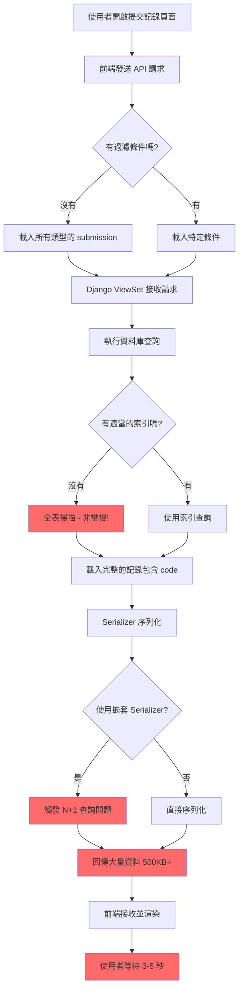

## 優化後流程

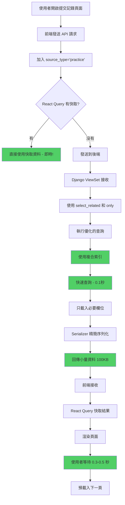

## 優化點對比

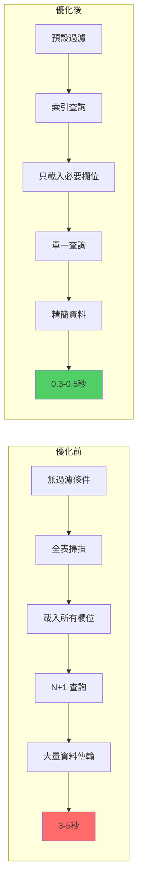

## 資料庫查詢優化

```mermaid
graph TD
    subgraph "優化前: 慢查詢"
    A[SELECT *] --> B[FROM submissions]
    B --> C[WHERE source_type='practice']
    C --> D[ORDER BY created_at DESC]
    D --> E[Sequential Scan]
    E --> F[掃描 100,000 筆記錄]
    F --> G[排序所有記錄]
    G --> H[返回前 20 筆]
    H --> I[花費 2-5 秒]
    end
    
    subgraph "優化後: 快查詢"
    J[SELECT id, user_id, ...] --> K[FROM submissions]
    K --> L[WHERE source_type='practice' AND is_test=false]
    L --> M[ORDER BY created_at DESC]
    M --> N[Index Scan using sub_src_test_created_idx]
    N --> O[只掃描必要記錄]
    O --> P[索引已排序]
    P --> Q[直接返回前 20 筆]
    Q --> R[花費 0.1-0.2 秒]
    end
    
    style I fill:#ff6b6b
    style R fill:#51cf66
```

## N+1 查詢問題

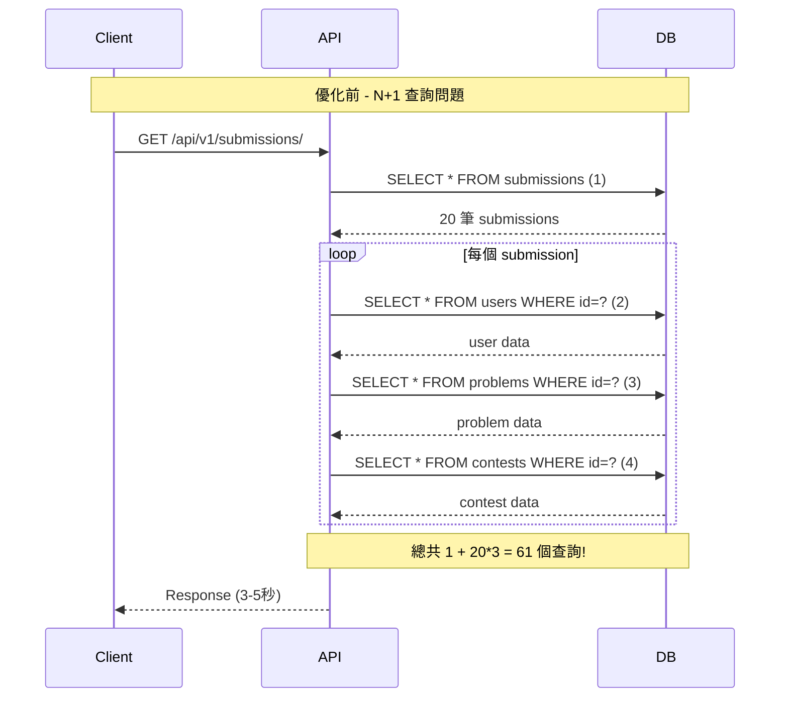

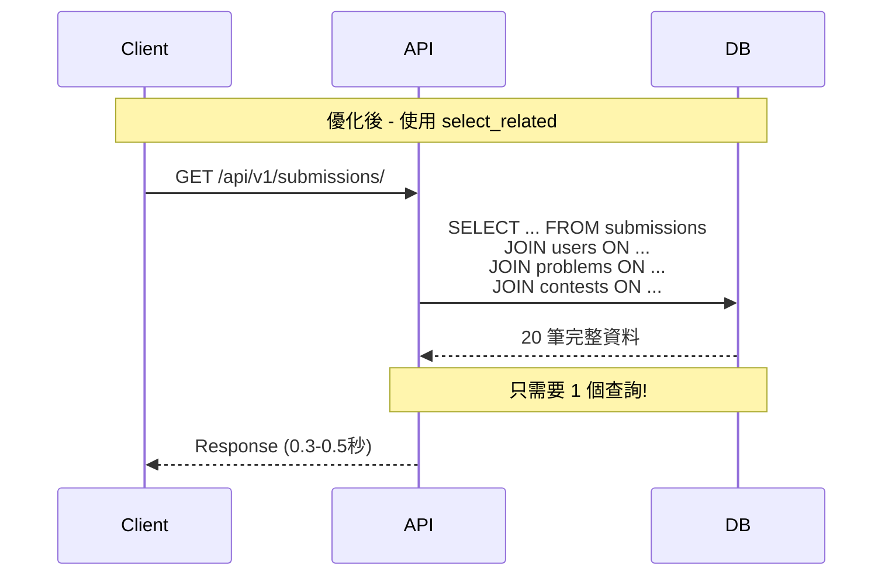

## React Query 快取策略

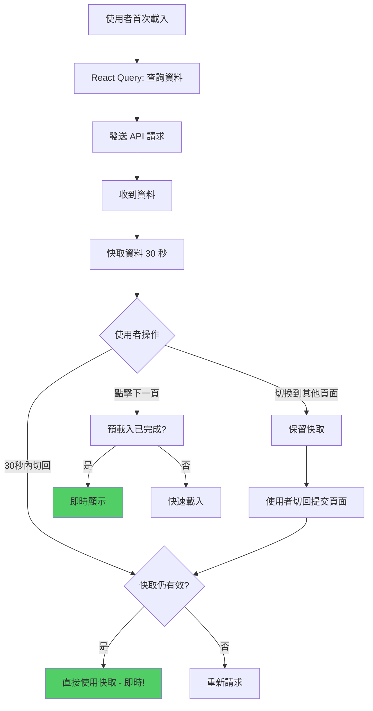

## 優化實作流程

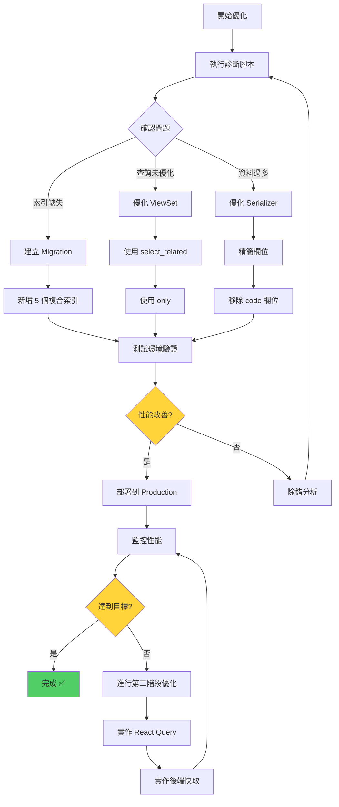

## 索引使用對比

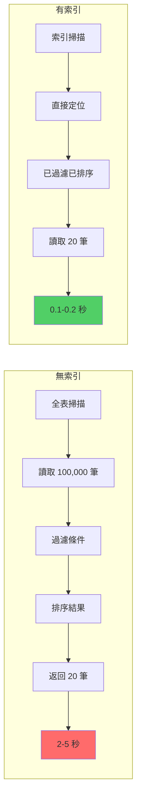

## 資料傳輸大小對比

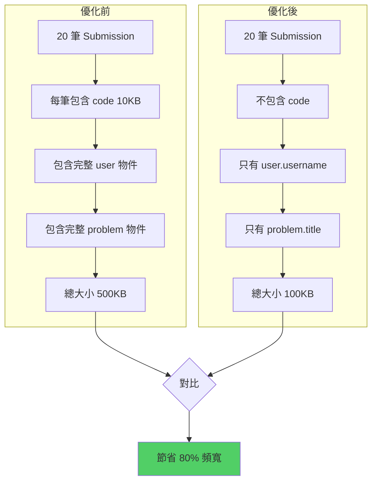

## 完整優化路徑圖

```mermaid
mindmap
  root((Submission API<br/>性能優化))
    資料庫層
      新增索引
        source_type + created_at
        contest + source_type
        problem + created_at
        status + created_at
      查詢優化
        select_related
        only()
        prefetch_related
    後端 API 層
      Serializer
        精簡欄位
        移除 code
        扁平化結構
      ViewSet
        智能查詢
        條件過濾
        分頁優化
      快取
        Redis
        查詢結果快取
        TTL 策略
    前端層
      React Query
        自動快取
        背景更新
        重試機制
      預設過濾
        source_type
        分頁大小
      預載入
        下一頁
        Prefetch
      使用者體驗
        Loading 狀態
        Skeleton 載入
        錯誤處理
```

## 效能改善時間軸

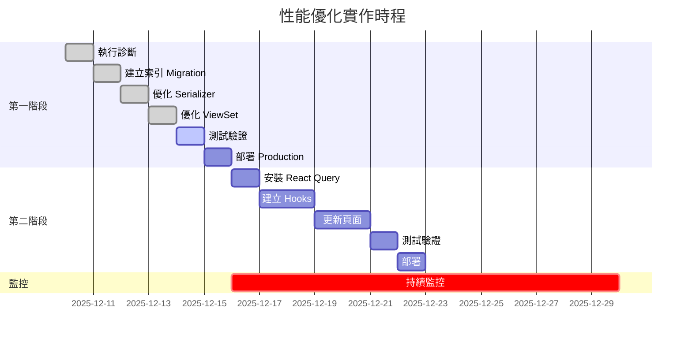

---

## 使用說明

以上流程圖可以在支援 Mermaid 的環境中顯示，例如：
- GitHub
- GitLab
- VS Code (with Mermaid extension)
- Markdown 編輯器

如果你的環境不支援 Mermaid，建議使用線上工具：
- https://mermaid.live/
- https://mermaid.ink/

---

**相關文件**:
- [執行摘要](./SUBMISSION_API_EXECUTIVE_SUMMARY.md)
- [詳細分析](./SUBMISSION_API_PERFORMANCE_ANALYSIS.md)
- [實作指南](./SUBMISSION_API_OPTIMIZATION_GUIDE.md)
