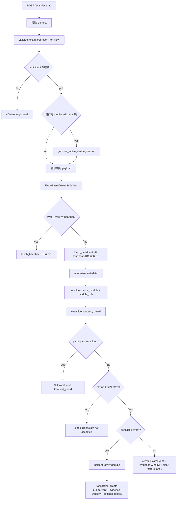

# Anti-cheat 核心事件紀錄系統接手導讀

**Status:** handover draft
**Last reviewed:** 2026-07-06
**Audience:** 第一次接手 QJudge 防作弊事件紀錄系統的工程師
**Related docs:** `docs/anticheat-architecture.md`、`docs/anticheat-model-design.md`

這份文件說明 QJudge 考試防作弊事件紀錄系統的運作原理。它不是操作手冊，也不是單純列檔案清單；目標是讓接手者知道：一筆事件為什麼會被建立、在哪裡被驗證、哪些資料會永久保存、哪些只存在 Redis、哪些事件會改變考生狀態，以及監考端最後看到的資料是怎麼組出來的。

---

## 0. 先建立心智模型

這套系統不是「自動判定學生作弊」的單一模組。比較準確的理解是：

> 系統把考試過程中的監控訊號、裝置狀態、考生行為、監考端操作與證據影格保存成可稽核紀錄，並在少數高風險事件發生時，更新考生的考試狀態。

也就是說，它同時在做四件事：

1. **記錄發生了什麼**：用 `ExamEvent` 保存原始考試事件。
2. **記錄誰做了什麼管理動作**：用 `ContestActivity` 保存高階活動紀錄。
3. **記錄事件對應的證據在哪裡**：用 `ExamEvidenceFrame` 保存影格 manifest，實際圖片放 object storage。
4. **維持考試 session 的完整性**：用 Redis 保存 active session、heartbeat、JTI pin、idempotency 與短時間 dedupe。

最重要的一句話：

> `ExamEvent` 是防作弊事件的主日誌，`ContestParticipant` 是考生狀態的主資料，`ExamEvidenceFrame` 是證據索引，Redis 是即時控制面，不是永久證據來源。

---

## 1. 接手時先看哪些檔案

### 1.1 Backend 主路徑

| 檔案 | 用途 | 接手時要看什麼 |
| --- | --- | --- |
| `backend/apps/contests/models/monitoring.py` | `ExamEvent`、`ExamEvidenceFrame`、`ContestActivity` 的 model 定義 | 欄位語意、choices、index |
| `backend/apps/contests/models/participants.py` | `ContestParticipant` 與 `ExamStatus` | 狀態機的持久欄位 |
| `backend/apps/contests/constants.py` | 事件分類、priority、扣點集合、recheck 集合 | event taxonomy 是否完整 |
| `backend/apps/contests/urls.py` | nested route 註冊 | `/api/v1/contests/{contest_id}/exam/...` 來源 |
| `backend/apps/contests/views/exam_lifecycle.py` | start/end exam | 建立 active session、寫 lifecycle event、清 session |
| `backend/apps/contests/views/exam_events.py` | 核心事件寫入 API | heartbeat、dedupe、落 DB、扣點、evidence window |
| `backend/apps/contests/views/exam_evidence.py` | 證據上傳與截圖查詢 API | upload intent、confirm、screenshots |
| `backend/apps/contests/services/anti_cheat_session.py` | Redis session/control plane | active session、heartbeat、idempotency、JTI pin |
| `backend/apps/contests/services/evidence_windows.py` | 事件證據時間窗 | `evidence_cluster_id` 與 window metadata |
| `backend/apps/contests/services/participant_dashboard.py` | 監考端 dashboard payload | timeline/event_feed 如何組合 |
| `backend/apps/contests/tasks.py` | 背景任務 | heartbeat timeout、force submit、contest end |
| `backend/apps/contests/serializers.py` | payload 驗證 | `ExamEventCreateSerializer` 與 evidence serializers |

### 1.2 Frontend 主路徑

| 檔案 | 用途 | 接手時要看什麼 |
| --- | --- | --- |
| `frontend/src/infrastructure/api/repositories/exam.repository.ts` | exam API client | `recordExamEvent()`、evidence upload API |
| `frontend/src/features/contest/anticheat/orchestrator.ts` | 前端事件 arbitration/dedupe | 前端如何決定送不送事件 |
| `frontend/src/features/contest/anticheat/forcedCapture.ts` | 事件觸發後強制截圖 | event response 如何帶出 evidence context |
| `frontend/src/features/contest/hooks/useExamHeartbeat.ts` | heartbeat timer | 15 秒一次心跳 |
| `frontend/src/features/contest/hooks/useViolationPipeline.ts` | detector lifecycle | triggered、escalated、restored event |
| `frontend/src/features/contest/hooks/useScreenShareMonitoring.ts` | screen share 事件來源 | `screen_share_stopped` |
| `frontend/src/features/contest/hooks/useExamMonitoring.ts` | clipboard/focus 類事件 | `clipboard_action` 等 |
| `frontend/src/features/contest/constants/eventTaxonomy.ts` | 前端事件分類顯示 | priority label/icon/category |
| `frontend/src/features/contest/components/admin/IncidentDetail.tsx` | 監考端事件詳情 | metadata 與 evidence frame 呈現 |

### 1.3 先不要從哪裡開始

不要先從 migration history 開始理解這套系統。migration 會讓你看到很多已移除或歷史狀態，例如 legacy takeover event、舊 video evidence model、舊 heartbeat event cleanup。接手時先看目前 models、views、services，再回頭看 migrations。

---

## 2. API 與路由入口

`backend/apps/contests/urls.py` 用 nested router 掛出 exam 子資源：

```text
/api/v1/contests/{contest_id}/exam/start/
/api/v1/contests/{contest_id}/exam/end/
/api/v1/contests/{contest_id}/exam/events/
/api/v1/contests/{contest_id}/exam/evidence/upload-intents/
/api/v1/contests/{contest_id}/exam/evidence/upload-confirm/
/api/v1/contests/{contest_id}/exam/screenshots/
```

`ExamViewSet` 不是單檔大 class，而是 mixin composition：

```text
ExamViewSet
  ├─ ExamLifecycleMixin   start/end exam
  ├─ ExamEventsMixin      event logging and penalty
  ├─ ExamAnticheatMixin   legacy/aux anti-cheat APIs
  ├─ ExamEvidenceMixin    evidence upload and screenshots
  └─ ExamSfuMixin         live monitoring SFU APIs
```

理解事件系統時，核心是前三個：

- `ExamLifecycleMixin`：考試 session 何時開始與結束。
- `ExamEventsMixin`：事件如何寫入。
- `ExamEvidenceMixin`：事件對應證據如何建立與確認。

---

## 3. 四張核心資料表

### 3.1 `ContestParticipant`：考生在一場考試中的狀態列

位置：`backend/apps/contests/models/participants.py`

重要欄位：

| 欄位 | 語意 |
| --- | --- |
| `contest` | 哪一場考試 |
| `user` | 哪一位考生 |
| `exam_status` | 考試狀態：`not_started`、`in_progress`、`paused`、`locked`、`submitted` |
| `violation_count` | 累計違規次數 |
| `started_at` | 開始考試時間 |
| `left_at` | 離開或提交時間 |
| `locked_at` | 被鎖定時間 |
| `lock_reason` | 暫停或鎖定原因 |
| `submit_reason` | 交卷原因 |

這張表是狀態機的 source of truth。事件本身不代表狀態已改變；只有當後端在處理事件時更新 `ContestParticipant`，考生狀態才算改變。

### 3.2 `ExamEvent`：核心事件日誌

位置：`backend/apps/contests/models/monitoring.py`

重要欄位：

| 欄位 | 語意 |
| --- | --- |
| `contest` | 事件所屬考試 |
| `user` | 事件所屬考生 |
| `event_type` | 事件種類，例如 `screen_share_stopped`、`heartbeat_timeout` |
| `metadata` | 事件附加資料，JSON |
| `created_at` | 後端建立事件的時間 |

`ExamEvent` 是防作弊事件的主日誌。只要監考端要回頭看「某個時間發生什麼」，通常先查這張表。

`metadata` 裡會放很多跨流程資訊，例如：

| 類型 | 常見 key |
| --- | --- |
| 前端決策 | `phase`、`priority`、`decision`、`reason_code`、`event_idempotency_key` |
| 裝置資訊 | `device_id`、`user_agent`、`incoming_device_id`、`existing_device_id` |
| 證據窗 | `evidence_cluster_id`、`evidence_mode`、`evidence_anchor_at_ms`、`evidence_window_start`、`evidence_window_end` |
| capture 結果 | `forced_capture_requested`、`forced_capture_reason`、`forced_capture_modules` |
| 人工監考 | `manual_proctor_note`、`recorded_by_user_id`、`manual_recording_started_at` |

### 3.3 `ExamEvidenceFrame`：事件證據影格 manifest

位置：`backend/apps/contests/models/monitoring.py`

重要欄位：

| 欄位 | 語意 |
| --- | --- |
| `contest`、`user` | 所屬考試與考生 |
| `exam_event` | 這張影格屬於哪一個事件 |
| `evidence_cluster_id` | 同一組事件證據的群組 id |
| `source_module` | 來源：`screen_share`、`webcam`、`attendance` |
| `evidence_mode` | `anchor_window`、`pre_loss`、`audit` |
| `upload_session_id` | 前端 capture session |
| `seq` | 同一批影格的序號 |
| `object_key` | object storage 路徑 |
| `client_captured_at_ms` | 瀏覽器擷取影格時間 |
| `status` | `issued`、`uploaded`、`failed`、`unavailable` |
| `byte_size`、`content_type`、`sha256` | storage 驗證資訊 |

這張表不存圖片 bytes。它存的是「圖片在哪裡、屬於哪個事件、狀態是否已確認」。實際 WebP 圖片在 object storage。

### 3.4 `ContestActivity`：高階活動紀錄

位置：`backend/apps/contests/models/monitoring.py`

重要欄位：

| 欄位 | 語意 |
| --- | --- |
| `contest` | 所屬考試 |
| `user` | 操作者或事件主體 |
| `action_type` | 高階動作，例如 `start_exam`、`end_exam`、`unlock_user` |
| `details` | 人可讀的描述 |
| `created_at` | 建立時間 |

`ContestActivity` 和 `ExamEvent` 的差異：

- `ExamEvent` 比較像原始監控事件與系統事件。
- `ContestActivity` 比較像管理活動或摘要型 audit log。

同一件事有時會同時寫兩種紀錄。例如偵測到跨裝置登入時，可能建立 `ExamEvent(concurrent_login_detected)`，也建立 `ContestActivity(concurrent_login_detected)`，方便監考端 timeline 顯示。

---

## 4. Redis 保存哪些即時狀態

位置：`backend/apps/contests/services/anti_cheat_session.py`

Redis/cache 裡保存的是控制面資料，不是最終審查資料。

| 類型 | Key prefix | 用途 | 是否永久 |
| --- | --- | --- | --- |
| active session | `exam:active` | 記住同一考生目前有效裝置 | 否 |
| conflict token | `exam:conflict` | 跨裝置衝突流程用 token | 否 |
| event idempotency | `exam:event:idempotency` | 避免同一事件重送造成重複處理 | 否 |
| incident family dedupe | `exam:incident_family` | 避免短時間同類事件重複扣點 | 否 |
| heartbeat | `exam:heartbeat` | 紀錄最後一次 heartbeat 時間 | 否 |
| exam JTI pin | `auth:exam_jti` | 考試期間限制 access token | 否 |

注意兩個原則：

1. Redis 裡的東西消失後，不一定能完整還原。
2. 只要會影響考生狀態或監考審查，就應該有 DB trace。

例如 heartbeat 每 15 秒送一次，但不會每次都落 `ExamEvent`。真正落 DB 的是 `heartbeat_timeout`，因為 timeout 會影響考生狀態。

---

## 5. 一筆事件從前端到 DB 的完整旅程

以下用 `screen_share_stopped` 當例子。

### 5.1 前端 detector 發現異常

例如 screen share 中斷，前端 hook 會呼叫：

```text
recordExamEventWithForcedCapture(contestId, "screen_share_stopped", ...)
```

這個 helper 在 `frontend/src/features/contest/anticheat/forcedCapture.ts`。

它做三件事：

1. 補 metadata：`forced_capture_requested`、`evidence_anchor_at_ms`、`evidence_mode`、`upload_session_id`。
2. 呼叫 `recordExamEvent()` 送事件到後端。
3. 如果後端回傳 `event_id`，再觸發 `forceCaptureForContest()` 上傳事件附近的證據影格。

### 5.2 前端 repository 組 payload

位置：`frontend/src/infrastructure/api/repositories/exam.repository.ts`

`recordExamEvent()` 會送：

```json
{
  "event_type": "screen_share_stopped",
  "metadata": {
    "source": "...",
    "reason": "...",
    "phase": "ACTIVE",
    "event_idempotency_key": "...",
    "forced_capture_requested": true,
    "evidence_anchor_at_ms": 1710000000000,
    "evidence_mode": "pre_loss",
    "upload_session_id": "..."
  }
}
```

它會 POST 到：

```text
/api/v1/contests/{contest_id}/exam/events/
```

目前只對 502/503/504 做最多三次 retry。非 retryable error 會回傳 `null`，前端不會一直重送。

### 5.3 後端 serializer 驗證 payload

位置：`backend/apps/contests/serializers.py`

`ExamEventCreateSerializer` 驗證：

- `event_type` 必須符合 `ExamEvent` model choices。
- `metadata` 大小預設最多 8192 bytes。
- `clipboard_action` 的 metadata 可以到 65536 bytes。
- 可額外接收 `client_observed_at_ms`、`server_time_offset_ms`、`evidence_anchor_at_ms`、`evidence_mode`、`event_idempotency_key`。

這裡只做基本格式檢查，不做完整事件語意判斷。事件是否扣點、是否需要 evidence window，是後面的 view/service 決定。

### 5.4 `ExamEventsMixin._log_event()` 接手

位置：`backend/apps/contests/views/exam_events.py`

核心流程如下：



### 5.5 heartbeat 是特殊事件

`event_type == "heartbeat"` 時：

- 後端只呼叫 `touch_heartbeat(contest.id, user.id)`。
- 不建立 `ExamEvent`。
- 回傳 `decision=heartbeat`。

原因是 heartbeat 很高頻。如果每 15 秒都寫 DB，長考試會產生大量低價值資料。真正需要審查的是「心跳逾時」，所以只有 Celery 偵測到 timeout 時才建立 `heartbeat_timeout` 事件。

### 5.6 非 heartbeat 事件會刷新 heartbeat

所有非 heartbeat 事件也會呼叫 `touch_heartbeat()`。這代表只要考生仍有其他事件送到後端，系統也視為 client 還活著。

### 5.7 `exam_entered` 會補裝置資訊

如果事件是 `exam_entered`，後端會補：

- `device_id`
- `user_agent`
- `device_kind`

這些資料來自 request headers、body、query params 或 user agent 推論。

### 5.8 evidence metadata 會被正規化

`_normalize_evidence_metadata()` 會整理：

- `client_observed_at_ms`
- `evidence_anchor_at_ms`
- `evidence_anchor_at`
- `evidence_mode`
- `loss_detected_at_ms`

如果事件需要證據，但前端沒有帶 anchor time，後端會用目前時間補上。

事件是否需要證據的判斷包含：

- 事件屬於 `PENALIZED_EVENT_TYPES`
- 事件屬於 anchor-window evidence event
- metadata 有 `forced_capture_requested`
- metadata 有 `evidence_anchor_at_ms`

### 5.9 後端會推論 source module 與 module role

`_resolve_module_context()` 會判斷事件屬於哪個來源：

- `screen_share_*` 通常是 `screen_share`
- `webcam_*` 通常是 `webcam`
- tablet 或只有 webcam active 時，webcam/viewport 可能是 primary
- desktop 且 screen share active 時，screen share 通常是 primary

這個判斷會影響某些事件是否需要 recheck pause。例如 `webcam_stopped` 如果只是 desktop 的 secondary source，不一定等同主監控來源中斷；如果是 tablet 的 primary source，語意就比較嚴重。

---

## 6. Dedupe 與 idempotency 的差異

這裡很容易混淆。

### 6.1 Event idempotency：防止同一請求重送

用途：避免前端 retry、網路抖動、同一事件被送兩次時重複建立或重複扣點。

位置：`anti_cheat_session.py`

核心概念：

```text
exam:event:idempotency:{contest_id}:{user_id}:{event_type}:{token}
```

如果同一個 token 在短時間內出現第二次，後端會視為 duplicate，回傳 `decision=dedupe_hit`。如果可以找到既有事件，回傳中會帶既有的 `event_id` 與 evidence metadata。

### 6.2 Incident-family dedupe：防止同一事故多次扣點

用途：避免同一個使用者行為觸發多個 detector，導致多次扣點。

例子：

- 同一瞬間離開 fullscreen，可能同時觸發 `exit_fullscreen` 與 `mouse_leave`。
- screen share 中斷可能伴隨 viewport 狀態變化。

`constants.py` 裡的 `INCIDENT_FAMILY` 會把事件歸到語意群組，例如：

```text
screen_share_stopped -> capture_loss
webcam_stopped       -> capture_loss
exit_fullscreen      -> display_escape
multiple_displays    -> display_escape
mouse_leave          -> pointer_escape
viewport_stopped     -> viewport_loss
```

如果同一 family 在短時間內已經處理過，新的事件仍可落 `ExamEvent`，但 metadata 會標記 `incident_family_dup=true`，且不再重複更新 `violation_count`。

### 6.3 前端也有一層 dedupe，但後端才是裁決者

前端 `orchestrator.ts` 會做：

- phase 判斷
- priority arbitration
- dedupe window
- terminal guard
- idempotency key 產生

這是為了減少不必要的事件與改善 UX，但不能把它視為安全邊界。真正決定是否落事件、是否扣點、是否改狀態的是後端。

---

## 7. 哪些事件會改變考生狀態

事件是否會改變狀態，主要看三組常數：

| 常數 | 用途 |
| --- | --- |
| `PENALIZED_EVENT_TYPES` | 會增加 `violation_count` 的事件 |
| `ENVIRONMENT_RECHECK_EVENT_TYPES` | 會要求重新預檢，通常轉 `paused` |
| `IMMEDIATE_LOCK_EVENT_TYPES` | 直接鎖定的事件，目前是空集合 |

### 7.1 典型處理方式

如果事件在 `PENALIZED_EVENT_TYPES`，且不是 family duplicate：

1. 後端建立 `ExamEvent`。
2. 後端建立或更新事件 evidence window metadata。
3. 後端用 `select_for_update()` 鎖定 `ContestParticipant`。
4. `violation_count += 1`。
5. 若事件需要 recheck，`exam_status` 從 `in_progress` 變成 `paused`。
6. 寫入 `ContestActivity(update_participant)` 或 `ContestActivity(lock_user)`。

### 7.2 `paused` 的語意

`paused` 不是單純暫停作答。對防作弊事件而言，它通常代表：

> 系統偵測到監控完整性中斷，學生必須重新通過環境檢查，才能回到 `in_progress`。

### 7.3 `locked` 的語意

目前 `IMMEDIATE_LOCK_EVENT_TYPES` 是空集合，所以一般 anti-cheat event 不會直接 hard lock。`locked` 多半來自人工管理、舊流程或未來明確定義的 hard security event。

### 7.4 `submitted` 的 terminal guard

如果 participant 已經 `submitted`，事件仍可能落 `ExamEvent`，但不應再改變狀態或扣點。這是 terminal guard 的目的：考生交卷後，前端可能還有 pending event 或 capture 回來，不能因此再次處分。

---

## 8. 證據鏈如何建立

事件與證據不是同一筆資料。

`ExamEvent` 說「發生了什麼」。

`ExamEvidenceFrame` 說「這個事件附近有哪些 frame 可查」。

Object storage 保存實際圖片 bytes。

### 8.1 事件先拿到 evidence window

位置：`backend/apps/contests/services/evidence_windows.py`

`attach_evidence_window_metadata(event)` 會在 event metadata 中補：

- `evidence_cluster_id`
- `evidence_mode`
- `evidence_anchor_at_ms`
- `evidence_anchor_at`
- `evidence_window_start`
- `evidence_window_end`
- `evidence_window_before_seconds`
- `evidence_window_after_seconds`
- `evidence_source_module`
- `pre_buffer_complete`

模式有三種：

| `evidence_mode` | 語意 |
| --- | --- |
| `anchor_window` | 事件發生時間前後各取一段 |
| `pre_loss` | 來源中斷前的 frame，不能包含中斷後 frame |
| `audit` | 稽核用，不一定有時間窗 |

### 8.2 前端請求 upload intents

前端拿到 event response 後，呼叫：

```text
POST /api/v1/contests/{contest_id}/exam/evidence/upload-intents/
```

payload 大致包含：

```json
{
  "event_id": 123,
  "evidence_cluster_id": "...",
  "source_module": "screen_share",
  "evidence_mode": "pre_loss",
  "upload_session_id": "...",
  "frames": [
    { "seq": 1, "client_captured_at_ms": 1710000000000 }
  ]
}
```

後端會：

1. 找到 `ExamEvent`。
2. 確認 event 屬於目前使用者，除非是 teacher-assisted attendance。
3. 驗證 participant 狀態允許上傳 evidence。
4. 驗證 `evidence_cluster_id` 是否與事件 metadata 一致。
5. 驗證 `pre_loss` frame 不可晚於 loss time。
6. 建立 `ExamEvidenceFrame(status=issued)`。
7. 回傳 presigned PUT URL。

### 8.3 前端上傳圖片 bytes

前端直接對 object storage PUT WebP 圖片。後端不代理圖片 bytes，原因是減少 API server 壓力。

object key 由後端產生，格式類似：

```text
contest_{contest_id}/user_{user_id}/session_{upload_session_id}/{module}/ts_{ts_ms}_seq_{seq}.webp
```

### 8.4 前端 confirm upload

圖片上傳後，前端呼叫：

```text
POST /api/v1/contests/{contest_id}/exam/evidence/upload-confirm/
```

後端會：

1. 找到 `ExamEvidenceFrame(status=issued)`。
2. 確認 frame 屬於同一 contest/user/event/upload session。
3. 用 object storage HEAD 驗證檔案存在。
4. 驗證 content type 必須是 `image/webp`。
5. 驗證 byte size 大於 0 且不超過上限。
6. 把 frame 更新成 `status=uploaded`。
7. 寫入 storage facts 到 frame metadata。

### 8.5 監考端查 screenshots

監考端呼叫：

```text
GET /api/v1/contests/{contest_id}/exam/screenshots/?user_id=...&event_id=...
```

後端會：

1. 檢查 request user 是否能管理 contest。
2. 用 `event_id` 或 `evidence_cluster_id` 找 anchor event。
3. 用 event metadata 推出查詢時間窗。
4. 查 `ExamEvidenceFrame(status=uploaded)`。
5. 對每個 object key 產生 presigned GET URL。
6. 回傳 frame list。

---

## 9. Heartbeat 的完整機制

### 9.1 前端每 15 秒送 heartbeat

位置：`frontend/src/features/contest/hooks/useExamHeartbeat.ts`

`useExamHeartbeat()` 在考試監控啟用時：

- 立即送一次 heartbeat。
- 之後每 15 秒送一次。
- 使用 `recordExamEvent(contestId, "heartbeat", ...)`。

註解裡有一句很重要：

> Heartbeat 完全獨立於 detector / event-listener system。

也就是說，就算 DOM listener 被移除，heartbeat 仍應該靠獨立 interval 持續送出。這是用來偵測「防作弊監聽器被關掉」、「網路斷線」、「瀏覽器 crash」的底線。

### 9.2 後端 heartbeat 不落 DB

`ExamEventsMixin._log_event()` 遇到 `heartbeat`：

1. 檢查 participant 是否在 monitored status。
2. 呼叫 `touch_heartbeat(contest.id, user.id)`。
3. 回傳 `decision=heartbeat`。
4. 不建立 `ExamEvent`。

### 9.3 Celery 偵測 timeout

位置：`backend/apps/contests/tasks.py`

`check_heartbeat_timeout()` 週期性查：

- contest 已發布
- cheat detection enabled
- contest 尚未結束
- participant 是 `in_progress`
- participant 已開始考試

然後讀 Redis 的最後 heartbeat。

如果超過 `HEARTBEAT_TIMEOUT_SECONDS = 60`：

1. 用 `hb_lock:{participant.pk}` 避免多 worker 重複處理。
2. 建立 `ExamEvent(event_type="heartbeat_timeout")`。
3. 呼叫 `attach_evidence_window_metadata(event)`。
4. 呼叫 `_apply_penalty_from_event(participant, "heartbeat_timeout")`。
5. participant 通常會變成 `paused`，要求重新預檢。

### 9.4 接手時要注意的問題

目前 heartbeat timeout 的 penalty path 在 `tasks.py` 裡有一份 `_apply_penalty_from_event()`，同步 API path 在 `exam_events.py` 裡有 `_process_penalized_event()`。兩者都會更新 participant。這是維護風險：未來新增事件或改狀態規則時，要小心不要只改其中一邊。

---

## 10. 裝置 session 與跨裝置登入

裝置完整性不只靠 `ExamEvent`，還靠 Redis active session。

### 10.1 start exam 建立 active session

`POST /exam/start/` 在 `ExamLifecycleMixin.start_exam()` 裡處理。

主要步驟：

1. 找 contest。
2. 檢查 participant 與權限。
3. 檢查是否 locked 或 submitted。
4. 呼叫 `_ensure_active_device_session()` 檢查裝置衝突。
5. 檢查 attendance 是否允許開始。
6. 把 participant 設成 `in_progress`。
7. 寫 `ContestActivity(start_exam)` 或 `ContestActivity(resume_exam)`。
8. 呼叫 `set_active_session()`。
9. 若 cheat detection enabled，blacklist 其他 refresh token 並 pin 目前 access token JTI。
10. 呼叫 `touch_heartbeat()`。

### 10.2 active session payload

`set_active_session()` 寫入 Redis 的 payload 包含：

- `contest_id`
- `participant_id`
- `user_id`
- `device_id`
- `ip`
- `ua`
- `jti`
- `updated_at`

這是後端判斷「目前這個 request 是否來自同一台裝置」的依據。

### 10.3 裝置衝突如何記錄

如果 active session 已有不同 `device_id`，`build_device_conflict_payload()` 會建立：

```text
ExamEvent(event_type="concurrent_login_detected")
```

metadata 會包含：

- `existing_device_id`
- `incoming_device_id`
- `source`

登入流程也會用 `find_exam_conflict()` 擋下 active exam 期間的其他裝置登入，並建立 `ExamEvent(concurrent_login_detected)` 與 `ContestActivity(concurrent_login_detected)`。

### 10.4 end exam 清理 session

`POST /exam/end/` 會：

1. 允許 `in_progress`、`paused`、`locked` 交卷。
2. 若 request 裝置和 active session 不一致，只記錄 `end_exam_device_mismatch`，不阻擋交卷。
3. 呼叫 `finalize_submission()`。
4. 清 heartbeat。
5. 清 JTI pin。

`finalize_submission()` 會把 participant 轉成 `submitted`，設定 `left_at`、`submitted_at`、`submit_reason`，並清 active session 與 allowed JTI。

---

## 11. Manual proctor note 如何進入事件系統

監考端可以人工建立監考註記。

位置：`backend/apps/contests/views/contest.py`

事件型別：

```text
manual_proctor_note
```

metadata 會包含：

- `manual_proctor_note=true`
- `reason`
- `description`
- `recorded_by_user_id`
- `recorded_by_username`
- `manual_recording_started_at`
- `manual_recording_ended_at`
- `evidence_window_start`
- `evidence_window_end`
- forced capture upload 結果

這類事件的語意和學生端 detector 不同：

- 它是 TA/teacher 人工建立。
- 不應該被一般 60 秒同類事件聚合吃掉。
- 通常是 review plane 的補充證據，不應自動扣點。

目前 `participant_dashboard.py` 特別讓 `manual_proctor_note` 不參與一般 grouping。

---

## 12. Dashboard 如何把事件變成人看的資料

位置：`backend/apps/contests/services/participant_dashboard.py`

監考端不是直接看 DB row，而是看後端整理過的 payload。

### 12.1 Timeline

`_serialize_timeline()` 會把：

- `ExamEvent`
- `ContestActivity`

合併成同一條 timeline。

`heartbeat` 會被排除，因為 heartbeat 不應出現在人工審查列表。

### 12.2 Event feed

`_serialize_event_feed()` 會：

1. 查出 participant 的所有 `ExamEvent`，排除 `heartbeat`。
2. 查出已上傳 evidence frame 數量。
3. 查出 `ContestActivity`。
4. 把同一 `event_type` 在 60 秒內的事件聚合成 incident。
5. 對每個 incident 補：
   - `priority`
   - `category`
   - `penalized`
   - `first_at`
   - `last_at`
   - `count`
   - `evidence_count`
   - `summary`
   - `metadata`
   - `source`

priority 來自 `EVENT_PRIORITY`，category 來自 `EVENT_CATEGORY`。

### 12.3 為什麼 taxonomy 漂移會傷到 dashboard

Dashboard 的分類、標籤、排序、顏色、是否顯示為違規，都依賴 `event_type`。如果新增事件只在某個 view 寫入，卻沒有補 `EVENT_PRIORITY` 或 frontend label，dashboard 仍可能顯示資料，但語意會變得模糊。例如它可能被 fallback 成 system event，或沒有正確 icon/label。

---

## 13. Event taxonomy：事件值不是普通字串

這套系統大量使用字串 event type。這些字串不是隨便取名；每個值都牽涉到：

- model choices 是否允許
- serializer 是否通過
- priority 類別
- 是否扣點
- 是否要求 recheck
- 是否歸入 incident family
- frontend 是否知道如何顯示
- dashboard 是否聚合
- i18n 是否有 label
- evidence window 是否會建立

目前 taxonomy 分散在多個位置：

| 位置 | 管什麼 |
| --- | --- |
| `ExamEvent.EVENT_TYPE_CHOICES` | DB/model 層合法值 |
| `ContestActivity.ACTION_TYPE_CHOICES` | 活動紀錄合法值 |
| `backend/apps/contests/constants.py` | priority、penalty、recheck、incident family |
| `frontend/src/core/entities/contest.entity.ts` | 前端 union type |
| `frontend/src/features/contest/constants/eventTaxonomy.ts` | 前端 priority/icon/category |
| `frontend/src/features/contest/anticheat/orchestrator.ts` | 前端 arbitration/dedupe mirror |
| i18n JSON | 顯示文字 |
| `participant_dashboard.py` | grouping 與 feed projection |

接手時要把 event type 當成 contract，不要把它當成任意字串。

---

## 14. 常見事件類型與語意

### 14.1 Lifecycle/system events

| 事件 | 來源 | 語意 |
| --- | --- | --- |
| `exam_entered` | 前端考試頁 | 考生進入考試 runtime |
| `exam_submit_initiated` | 前端交卷流程 | 使用者開始交卷 |
| `force_submit_locked` | Celery | locked 太久被強制交卷 |
| `concurrent_login_detected` | auth/device guard | 偵測到其他裝置 |
| `other_devices_logged_out` | start exam | 開始考試時踢掉其他 token |
| `end_exam_device_mismatch` | end exam | 交卷 request 裝置與 active session 不一致 |
| `manual_proctor_note` | 監考端 | 人工註記與人工證據窗 |

### 14.2 Monitoring loss / violation events

| 事件 | 語意 |
| --- | --- |
| `screen_share_stopped` | 螢幕分享停止，通常是 P0 |
| `screen_share_interrupted` | 螢幕分享短暫中斷，通常是 info |
| `screen_share_restored` | 螢幕分享恢復 |
| `webcam_stopped` | webcam 停止 |
| `webcam_interrupted` | webcam 短暫中斷 |
| `webcam_restored` | webcam 恢復 |
| `viewport_stopped` | viewport integrity 中斷 |
| `viewport_restored` | viewport integrity 恢復 |
| `split_view_detected` | 偵測到 split view |
| `multiple_displays` | 偵測到多螢幕 |
| `exit_fullscreen` | 全螢幕離開並 escalated |
| `mouse_leave` | 游標離開有效區域並 escalated |
| `forbidden_focus_event` | 禁止的 focus 類事件 |
| `listener_tampered` | 監控 listener 完整性異常 |
| `heartbeat_timeout` | heartbeat 超時 |

### 14.3 Info / legacy events

| 事件 | 語意 |
| --- | --- |
| `tab_hidden`、`window_blur` | legacy focus event |
| `*_triggered` | detector 初始觸發，通常不直接扣點 |
| `*_restored` | detector 恢復 |
| `capture_upload_degraded` | capture/upload 品質下降 |
| `clipboard_action` | 剪貼簿相關行為 |
| `warning_timeout` | legacy 警告倒數流程 |

---

## 15. ContestActivity 何時使用

不要把所有事件都寫成 `ContestActivity`。它適合用在：

- 考生生命週期：`start_exam`、`end_exam`、`auto_submit`
- 管理操作：`lock_user`、`unlock_user`、`update_participant`
- 題目/競賽管理：`update_contest`、`update_problem`
- 高階 audit：`concurrent_login_detected`

如果是 detector 或監控事件，應該寫 `ExamEvent`。

如果同一件事需要「原始事件」與「高階活動」，可以兩邊都寫，但要清楚分工：

- `ExamEvent.metadata` 保存 machine-readable facts。
- `ContestActivity.details` 保存人可讀摘要。

---

## 16. 新增事件時的標準流程

假設你要新增 `network_degraded`。

### 16.1 先定義語意，不要先寫 code

先回答：

1. 這是學生違規、監控失效、資訊事件，還是系統事件？
2. 會不會增加 `violation_count`？
3. 會不會要求重新預檢？
4. 會不會直接 lock？
5. 是否需要 evidence window？
6. source module 是 `screen_share`、`webcam`、`attendance`，還是和 source 無關？
7. metadata 必須有哪些 key？
8. dashboard 要不要聚合？
9. 前端是否要有 i18n label？

### 16.2 Backend 必改

至少檢查：

1. `ExamEvent.EVENT_TYPE_CHOICES`
2. `constants.py` 的 `EVENT_PRIORITY`
3. 若會扣點：`PENALIZED_EVENT_TYPES`
4. 若會 recheck：`ENVIRONMENT_RECHECK_EVENT_TYPES`
5. 若需要 dedupe：`INCIDENT_FAMILY`
6. 若是 restore event：`RESTORE_EVENT_TO_INCIDENT_FAMILY`
7. serializer 或 view 是否需要特殊 metadata 驗證
8. tests

### 16.3 Frontend 必改

至少檢查：

1. `core/entities/contest.entity.ts`
2. `features/contest/constants/eventTaxonomy.ts`
3. `features/contest/anticheat/orchestrator.ts`
4. detector/hook 或 violation route
5. i18n label
6. admin incident UI 是否需要特殊呈現

### 16.4 Review plane 必改

檢查：

- `participant_dashboard.py` 是否能正確 priority/category
- 是否要排除 grouping
- 是否要合併 metadata
- evidence count 是否能關聯到事件

---

## 17. 排查問題時的路線

### 17.1 前端說事件送了，但 DB 沒看到

依序查：

1. 前端是否真的呼叫 `recordExamEvent()`。
2. request 是否打到 `/exam/events/`。
3. response status 是否是 400/403/409。
4. `ExamEventCreateSerializer` 是否因 event choices 或 metadata size 擋下。
5. participant 是否在允許狀態。
6. 是否是 `heartbeat`，因為 heartbeat 本來就不落 DB。
7. 是否被 active device session 擋下。
8. 後端是否回 `dedupe_hit`，但既有事件已存在。

### 17.2 DB 有事件，但沒有扣點

依序查：

1. event type 是否在 `PENALIZED_EVENT_TYPES`。
2. metadata 是否標 `incident_family_dup=true`。
3. participant 是否已 `submitted`。
4. event phase 是否是 `TERMINATING` 或 `TERMINAL`。
5. 是否走到 terminal guard。
6. Celery path 或 API path 是否用不同 penalty function。

### 17.3 DB 有事件，但沒有 evidence

依序查：

1. event metadata 是否有 `evidence_cluster_id`。
2. event 是否被 `attach_evidence_window_metadata()` 視為 relevant。
3. 前端是否拿到 response 的 `event_id`。
4. `recordExamEventWithForcedCapture()` 是否被使用，還是只用 `recordExamEvent()`。
5. `upload-intents` 是否建立 `ExamEvidenceFrame(status=issued)`。
6. object storage PUT 是否成功。
7. `upload-confirm` 是否因 content type、size、object key mismatch 被拒絕。
8. `screenshots` 查詢是否用錯 `event_id`、`user_id`、`source_module` 或時間窗。

### 17.4 Dashboard 顯示奇怪分類

依序查：

1. `EVENT_PRIORITY` 是否有該 event type。
2. frontend `eventTaxonomy.ts` 是否有該 event type。
3. i18n label 是否存在。
4. `participant_dashboard.py` grouping 是否把它合併到舊 incident。
5. `manual_proctor_note` 類事件是否被不該聚合的邏輯聚合。

### 17.5 Heartbeat timeout 沒發生

依序查：

1. 前端 `useExamHeartbeat()` 是否啟用。
2. participant 是否是 `in_progress`。
3. contest 是否 `published`。
4. contest 是否 `cheat_detection_enabled=True`。
5. contest end_time 是否仍在未來。
6. Redis heartbeat key 是否一直被刷新。
7. Celery beat 是否有跑 `check_heartbeat_timeout()`。

### 17.6 Heartbeat timeout 太容易發生

依序查：

1. 前端 15 秒 heartbeat 是否被網路或 auth 擋下。
2. access token 是否因 JTI pin 被拒絕。
3. Redis TTL 是否正常。
4. server clock 與 client/network 是否有極端延遲。
5. Celery timeout 門檻是否仍是 60 秒。

---

## 18. 目前已知的結構性弱點

### 18.1 Event taxonomy 分散

實際寫入事件值、model choices、backend constants、frontend taxonomy、i18n、dashboard projection 分散在多處。這造成新增事件時很容易漏改。

目前已觀察到的對齊問題包括：

- `manual_proctor_note` 實際使用，但需確認 model choices 完整對齊。
- `other_devices_logged_out`、`end_exam_device_mismatch` 由 lifecycle 寫入，需納入 choices/priority。
- `resume_exam`、`reopen_exam` 由 activity log 寫入，需納入 activity choices。

接手者應優先把 event/action choices 對齊，並加測試避免再次漂移。

### 18.2 Penalty state machine 重複

API path 與 Celery path 都會更新 `ContestParticipant`：

- `ExamEventsMixin._process_penalized_event()`
- `tasks._apply_penalty_from_event()`

兩者目前大方向一致，但不是同一個函式。未來新增事件時，若只改其中一邊，就會發生「同一事件從不同入口進來，處置不同」。

### 18.3 Metadata 沒有 typed schema

`ExamEvent.metadata` 承載非常多語意，但沒有依 event type 做 schema 驗證。這會讓某些 key 只有某個 consumer 看得懂。新增 metadata 時，最好同時列出：

- 哪個 producer 會寫
- 哪個 service 會讀
- 哪個 dashboard component 會顯示
- 缺 key 時 fallback 是什麼

### 18.4 `(contest, user)` 代替 participant FK

`ExamEvent`、`ExamEvidenceFrame`、`ContestActivity` 都用 `(contest, user)` 表示參與者。這對歷史資料與查詢方便，但 schema 無法保證事件一定屬於有效 participant。長期可考慮新增 nullable `participant` FK 並 backfill。

---

## 19. 建議的長期整理方向

### 19.1 建立 canonical event registry

把 event type 的全部語意集中成一個 registry，例如：

```python
ExamEventSpec(
    value="screen_share_stopped",
    priority=0,
    category="critical",
    penalized=True,
    requires_recheck=True,
    incident_family="capture_loss",
    evidence_mode_default="pre_loss",
)
```

然後由 registry 匯出：

- model choices
- constants
- serializer validation
- dashboard priority
- frontend fixture 或 taxonomy endpoint

### 19.2 建立 `ExamEventService`

所有事件建立都走同一個 service：

```text
ExamEventService.record_event(...)
```

它負責：

- validate event taxonomy
- normalize metadata
- idempotency
- incident-family dedupe
- create ExamEvent
- attach evidence window
- call PenaltyEngine
- return EventDecision

這能讓 view、Celery、auth/device guard、manual proctor 不再各自手寫 `ExamEvent.objects.create(...)`。

### 19.3 建立 `PenaltyEngine`

所有會改 `ContestParticipant` 的 anti-cheat 處置都走：

```text
PenaltyEngine.apply(event, participant)
```

它是唯一能更新：

- `violation_count`
- `exam_status`
- `locked_at`
- `lock_reason`

的 anti-cheat 裁決者。

### 19.4 Metadata schema 分層

不一定要把 `metadata` 拆成多張表。比較務實的做法是：

- 保留 JSONField。
- 對高風險事件加 typed serializer/dataclass。
- 在 event service 寫入前驗證。
- 在 dashboard 讀取時用同一組 parser。

---

## 20. 新手接手 Checklist

如果你第一次要改這套系統，照這個順序：

1. 先確認你要改的是 `ExamEvent`、`ContestActivity`、`ExamEvidenceFrame`，還是 `ContestParticipant` 狀態。
2. 找出事件來源：frontend detector、exam lifecycle、Celery、auth login guard、manual proctor。
3. 確認 event/action type 是否已在 choices。
4. 確認 `constants.py` priority、penalty、recheck、incident family。
5. 確認 frontend taxonomy 與 i18n。
6. 確認是否需要 evidence window。
7. 確認是否會改 `violation_count` 或 `exam_status`。
8. 確認 dashboard 是否要特殊 grouping 或 metadata display。
9. 補測試，至少涵蓋 payload accepted、event created、state transition、dashboard projection。
10. 如果事件會扣點，特別測 idempotency 與 incident-family dedupe。

---

## 21. 一句話總結

QJudge 的核心事件紀錄系統可以分成「事件日誌、狀態機、證據 manifest、即時控制面、審查投影」五層。接手時不要只看某一個 API，也不要只看前端 detector；真正的資料語意是跨 `ExamEvent`、`ContestParticipant`、`ExamEvidenceFrame`、`ContestActivity`、Redis 與 dashboard projection 一起形成的。

目前最值得先整理的是 event contract：把實際寫入值、choices、priority、penalty、metadata schema、frontend taxonomy 和 dashboard 呈現收斂，才能讓事件紀錄從「能寫入」進一步變成「可解釋、可維護、可稽核」。
