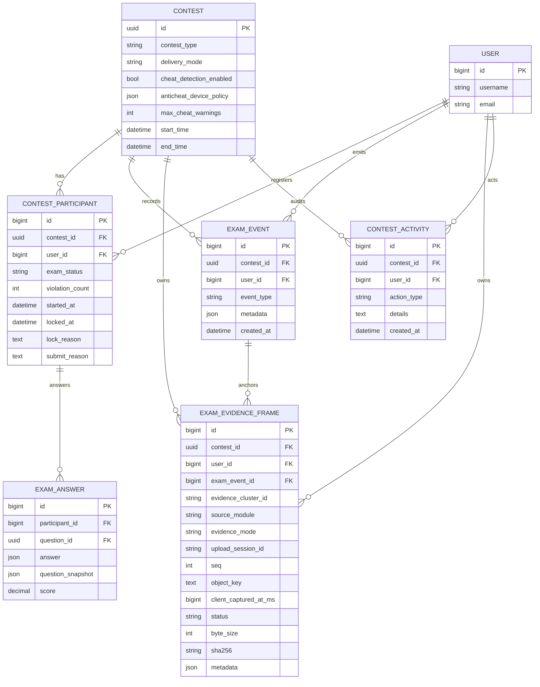
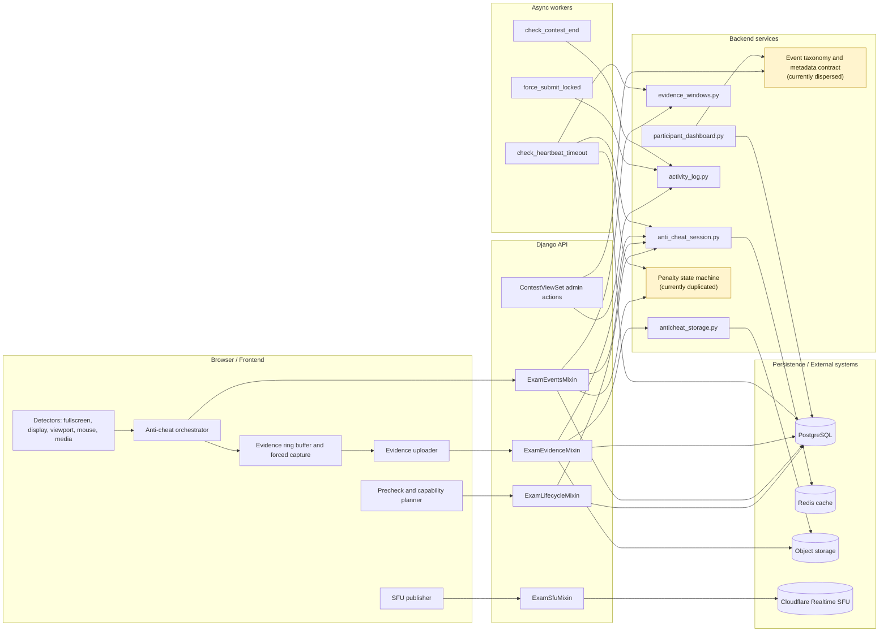
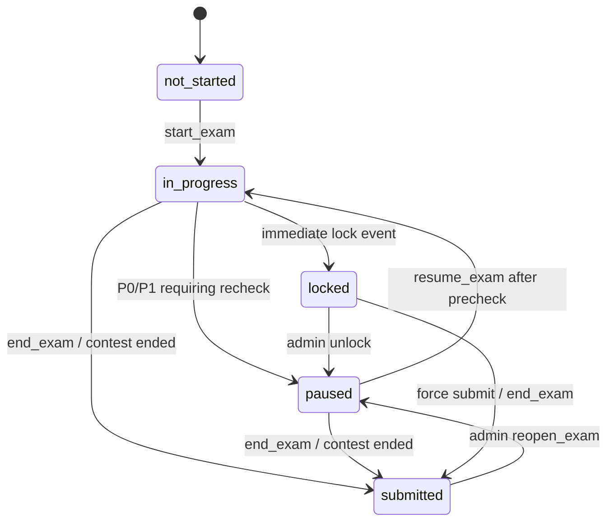

# Anti-cheat Model 模組設計與一致性分析

**Status:** review draft
**Last reviewed:** 2026-07-06
**Scope:** `backend/apps/contests` 的考試事件、證據鏈、裝置 session、heartbeat、背景任務，以及 `frontend/src/features/contest` 的考試端監控 runtime。

本文件聚焦在「防作弊事件模型」本身：資料如何形成、如何被裁決、如何被保全為證據、如何在監考端被閱讀。既有 `docs/anticheat-architecture.md` 偏向 inventory；本文件則用模型設計的角度描述事件生命週期、資料不變量與目前最薄弱的 contract 邊界。

---

## 摘要

目前 QJudge 的 anti-cheat model 並不是單一元件，而是由四個平面共同構成：

1. **Control plane**：Redis 內的 active session、heartbeat、JTI pin、event idempotency、incident-family dedupe。
2. **Event plane**：`ExamEvent` 保存學生端、系統端、監考端產生的考試事件。
3. **Evidence plane**：`ExamEvidenceFrame` 保存 WebP frame manifest，object storage 保存實際 bytes。
4. **Review plane**：`ContestActivity`、participant dashboard、incident feed、screenshots API 將原始事件投影成可審查材料。

這個設計的優點是低延遲、可追溯、可容納多種前端 detector；缺點是 event taxonomy、metadata schema、penalty state machine 分散在 model choices、constants、view、Celery task、frontend mirror、dashboard projection 之間。從一致性角度看，**最薄弱的一環是 Event Contract Layer**：同一個事件的合法值、分類、metadata 欄位、扣點語意與呈現語意沒有一個可被測試保證的單一來源。

---

## 設計目標

防作弊模組不應被理解成「自動判定作弊」的黑盒。比較準確的模型是：系統以可稽核的方式紀錄監控訊號，將高風險訊號轉成有限狀態機上的處置，並保留可供人工審查的證據。

本模組應滿足下列目標：

- **完整性**：同一位考生同一場考試只能有一個有效答題 session；跨裝置登入必須被偵測並留下紀錄。
- **可追溯性**：每一個影響考生狀態的事件都必須落 durable storage；高頻 heartbeat 可以留在 Redis，但 timeout 必須落 DB。
- **可審查性**：事件要能關聯到前後影格、來源模組、時間窗、參與者狀態與監考端操作。
- **低誤傷**：事件要經過 dedupe、priority arbitration、terminal guard，避免同一個 UI 或瀏覽器狀態引發多次處分。
- **可演進性**：新增 detector、evidence source、事件種類時，應有明確 taxonomy 與 metadata contract，不需要在多個檔案用字串同步。

---

## Sequence Diagram：事件與證據生命週期

```mermaid
sequenceDiagram
    autonumber
    actor Student as 考生瀏覽器
    participant Runtime as Frontend anti-cheat runtime
    participant API as ExamViewSet
    participant Redis as Redis control plane
    participant DB as PostgreSQL
    participant Storage as Object storage
    actor TA as 監考端

    Student->>Runtime: 進入考試與完成 precheck
    Runtime->>API: POST /exam/start
    API->>DB: 讀取 ContestParticipant
    API->>Redis: set_active_session + touch_heartbeat + JTI pin
    API->>DB: ContestActivity(start_exam)
    API-->>Runtime: exam_status=in_progress

    Runtime->>API: POST /events (exam_entered, metadata)
    API->>Redis: touch_heartbeat
    API->>DB: ExamEvent(exam_entered)
    API-->>Runtime: event_id + exam_status

    Runtime->>Runtime: detector 產生違規或監控中斷訊號
    Runtime->>Runtime: priority arbitration + dedupe + forced capture
    Runtime->>API: POST /events (例如 screen_share_stopped)
    API->>Redis: event idempotency guard
    API->>Redis: incident-family dedupe guard
    API->>DB: ExamEvent(event_type, metadata)
    API->>DB: attach_evidence_window_metadata(event)
    alt penalized 且非 incident-family duplicate
        API->>DB: SELECT ContestParticipant FOR UPDATE
        API->>DB: violation_count += 1; exam_status -> paused/locked
        API->>DB: ContestActivity(update_participant 或 lock_user)
    end
    API-->>Runtime: decision + evidence_cluster_id + status

    Runtime->>API: POST /evidence/upload-intents
    API->>DB: 建立 ExamEvidenceFrame(status=issued)
    API-->>Runtime: presigned PUT URLs
    Runtime->>Storage: PUT image/webp frame bytes
    Runtime->>API: POST /evidence/upload-confirm
    API->>Storage: HEAD object 驗證 content-type/size
    API->>DB: ExamEvidenceFrame(status=uploaded)

    TA->>API: GET /screenshots?event_id=...
    API->>DB: 查 ExamEvidenceFrame(uploaded)
    API->>Storage: 產生 presigned GET URLs
    API-->>TA: incident frames
```

### 解讀

同步事件路徑由 `backend/apps/contests/views/exam_events.py` 負責。`heartbeat` 是例外：它只更新 Redis，不建立 `ExamEvent`。除 heartbeat 外的事件會先進入 idempotency 與 incident-family dedupe，再落 `ExamEvent`。若事件屬於 `PENALIZED_EVENT_TYPES`，且不是同 family 的短時間重複事件，才更新 `ContestParticipant.violation_count` 與 `exam_status`。

證據鏈採 manifest-backed 設計：API 先建立 `ExamEvidenceFrame(status=issued)`，瀏覽器只拿 presigned URL 上傳 bytes，confirm 時後端再用 object HEAD 驗證 storage fact，最後把 manifest 標記為 `uploaded`。因此 DB row 是證據索引的 source of truth，object storage 是 frame bytes 的保存位置。

---

## Sequence Diagram：Heartbeat Timeout 與背景處置

```mermaid
sequenceDiagram
    autonumber
    actor Student as 考生瀏覽器
    participant Runtime as Frontend runtime
    participant API as ExamEventsMixin
    participant Redis as Redis heartbeat
    participant Celery as Celery beat task
    participant DB as PostgreSQL
    participant Review as Admin dashboard

    loop 考試進行中
        Runtime->>API: POST /events (heartbeat)
        API->>Redis: touch_heartbeat(contest_id, user_id)
        API-->>Runtime: decision=heartbeat
    end

    Celery->>DB: 查詢 in_progress participants
    Celery->>Redis: get_last_heartbeat(contest_id, user_id)
    alt heartbeat 超過 60 秒或不存在且 started_at 超時
        Celery->>Redis: hb_lock SETNX 防重入
        Celery->>DB: ExamEvent(heartbeat_timeout)
        Celery->>DB: attach_evidence_window_metadata(event)
        Celery->>DB: SELECT ContestParticipant FOR UPDATE
        Celery->>DB: violation_count += 1; exam_status -> paused
        Celery->>DB: ContestActivity(update_participant)
    else heartbeat 尚有效
        Celery-->>Celery: no-op
    end

    Review->>DB: 讀取 ExamEvent + ContestActivity
    DB-->>Review: timeline / event_feed
```

### 解讀

Heartbeat 是低成本 liveness signal，因此不進 `ExamEvent`。系統只在 timeout 時建立 durable event。這個取捨合理，但背景任務目前有自己的 `_apply_penalty_from_event()`；它與 `ExamEventsMixin._process_penalized_event()` 都在修改同一個 participant 狀態機。只要兩邊規則稍微不一致，就會出現 API 路徑與 Celery 路徑對同事件有不同處置的風險。

---

## ER Diagram：持久資料模型



### 資料語意

`ContestParticipant` 是考生在單場考試中的主狀態列，也是防作弊處置的狀態機承載者。`ExamEvent` 是 event plane 的 durable log，承接 frontend detector、auth/device guard、Celery timeout、manual proctor note 等來源。`ExamEvidenceFrame` 是 evidence plane 的 manifest row，以 `exam_event_id` 錨定事件，並反向保存 `contest_id`、`user_id` 方便查詢。`ContestActivity` 是 review plane 的高階活動紀錄，混合了監考操作、考生生命週期與系統處置。

目前 `ExamEvent`、`ExamEvidenceFrame`、`ContestActivity` 都用 `(contest, user)` 表示考試參與者，而不是直接 FK 到 `ContestParticipant`。這讓現有查詢簡單，也能容忍歷史資料；但資料庫無法保證「事件一定屬於已註冊的 participant」，也無法在 schema 層保證 event/frame/activity 彼此的 participant identity 一致。

---

## Component Diagram：模組分層與責任



### 分層原則

前端 runtime 可以做 capability detection、event arbitration、forced capture 與 UX guard，但不能成為防作弊裁決的最終來源。後端 API 必須保存 canonical event、控制 participant 狀態轉換，並把證據與事件錨定。Redis 只保存 volatile control state；所有會影響人工審查或考生狀態的事實，都應在 DB 中有 durable trace。

---

## 事件模型設計

### 事件分類

目前後端以 `backend/apps/contests/constants.py` 定義事件優先級與扣點集合：

| Priority | 語意 | 例子 | 預期處置 |
| --- | --- | --- | --- |
| P0 critical | 重大監控失效，需要重新預檢 | `screen_share_stopped`、`heartbeat_timeout`、`listener_tampered` | 建立事件、附 evidence window、扣點、通常轉 `paused` |
| P1 violation | 一般違規 | `exit_fullscreen`、`multiple_displays`、`mouse_leave`、`webcam_stopped` | 建立事件、扣點；視 event family 與狀態機處置 |
| P2 info | 資訊或恢復事件 | `*_interrupted`、`*_restored`、`capture_upload_degraded`、legacy focus events | 落 event feed，不扣點 |
| P3 system | 生命週期、管理或裝置完整性 | `exam_entered`、`exam_submit_initiated`、`concurrent_login_detected`、`manual_proctor_note` | 供稽核與 dashboard 呈現，不作為違規扣點 |

比較健康的模型應該把「事件值是否合法」、「事件屬於哪個 priority」、「是否扣點」、「是否要求 recheck」、「是否可合併成同一 incident family」、「metadata schema」放在同一個 taxonomy registry 裡。現況是 model choices、constants、frontend taxonomy、frontend orchestrator、dashboard grouping、i18n 都各自持有一部分語意。

### Metadata contract

`ExamEvent.metadata` 目前承載多種語意：

- 前端 runtime：`phase`、`priority`、`reason_code`、`event_idempotency_key`、`incident_family`。
- 裝置 session：`device_id`、`user_agent`、`incoming_device_id`、`existing_device_id`。
- 證據窗：`evidence_cluster_id`、`evidence_mode`、`evidence_anchor_at_ms`、`evidence_window_start`、`evidence_window_end`。
- forced capture：`forced_capture_requested`、`forced_capture_reason`、`forced_capture_modules`、upload 結果。
- manual proctor：`manual_proctor_note`、`recorded_by_user_id`、`manual_recording_started_at`、`manual_recording_ended_at`。
- attendance：`attendance_mode` 與簽到簽退佐證資訊。

JSONField 的彈性是合理的，但應以 event family 對應 typed schema。沒有 typed schema 時，任何新的 metadata key 都可能只被某一個 consumer 認得，導致 dashboard、evidence lookup 或 penalty logic 出現沉默式退化。

---

## 狀態機設計

`ContestParticipant.exam_status` 是 anti-cheat action 的承載狀態：



現況 `IMMEDIATE_LOCK_EVENT_TYPES` 是空集合，因此多數自動 anti-cheat 處置是「扣點並轉 `paused`，要求重新預檢」，不是直接 hard lock。這個策略比較能降低誤傷，但也意味著 `paused` 的語意必須清楚：它不是一般暫停，而是「監控完整性尚未恢復，必須重新通過環境檢查」。

狀態機應有單一 backend service，例如 `PenaltyEngine.apply(event, participant)`。目前同步 API 路徑在 `ExamEventsMixin._process_penalized_event()`，非同步 heartbeat timeout 路徑在 `tasks._apply_penalty_from_event()`。兩者重複實作，且 lock reason、module role、recheck 判斷不完全同一套。這是狀態一致性的第二個薄弱點。

---

## 不變量

以下不變量應被測試保證：

1. 每一個會寫入 `ExamEvent.event_type` 的值，都必須存在於 canonical event taxonomy 與 `ExamEvent.EVENT_TYPE_CHOICES`。
2. 每一個會寫入 `ContestActivity.action_type` 的值，都必須存在於 `ContestActivity.ACTION_TYPE_CHOICES` 或被明確標示為 legacy/deprecated。
3. `EVENT_PRIORITY`、`PENALIZED_EVENT_TYPES`、`ENVIRONMENT_RECHECK_EVENT_TYPES`、frontend `eventTaxonomy.ts` 必須對同一事件給出一致語意。
4. 所有會影響 `ContestParticipant.exam_status`、`violation_count`、`locked_at`、`lock_reason` 的行為，都必須通過同一個狀態機 service。
5. `ExamEvidenceFrame.exam_event`、`contest`、`user` 必須指向同一個 logical participant；若保留反正規化欄位，至少要在 service 層驗證一致。
6. `heartbeat` 不落 DB 是允許的，但 `heartbeat_timeout` 必須落 `ExamEvent`，且應可被 dashboard 與 evidence window 正確呈現。
7. `manual_proctor_note` 這類人工事件不能被事件聚合吃掉；它應保持獨立 incident，並保留 recording window 與操作者資訊。
8. 裝置衝突事件 `concurrent_login_detected` 是完整性事件，不應被誤歸類為違規扣點。

---

## 目前薄弱的一環

### 1. Event Contract Layer 分散且會漂移

目前實際寫入值與 choices/taxonomy 已出現不一致跡象：

- `manual_proctor_note` 在 admin action、frontend entity、priority taxonomy 中存在，但不在 `ExamEvent.EVENT_TYPE_CHOICES`。
- `other_devices_logged_out`、`end_exam_device_mismatch` 由 exam lifecycle 寫入，但不在 `ExamEvent.EVENT_TYPE_CHOICES` 與 `EVENT_PRIORITY`。
- `resume_exam`、`reopen_exam` 由 lifecycle / participant state 寫入 `ContestActivity`，但不在 `ContestActivity.ACTION_TYPE_CHOICES`。
- 前端 `ExamViolationType`、`eventTaxonomy.ts`、後端 `constants.py`、model choices 不是由同一份 registry 產生，長期會持續漂移。

這個問題的危害不只是 schema 語意不準。更嚴重的是 dashboard、i18n、扣點、evidence window、incident grouping 都依賴同一個 `event_type` 字串；一旦新增事件只更新其中一部分，系統可能仍能運作，但審查語意已經不完整。

### 2. Penalty state machine 有兩份實作

`ExamEventsMixin._process_penalized_event()` 與 `tasks._apply_penalty_from_event()` 都會更新 `ContestParticipant`。目前兩者大方向一致，但 module role、lock reason、recheck 條件與 future event 行為可能分岔。防作弊系統最怕的是「同一事件因進入路徑不同而處置不同」，因此這段應收斂成單一 service。

### 3. Metadata schema 未型別化

`ExamEvent.metadata` 是跨流程的主要載體，但沒有以 event type 或 family 驗證。`evidence_windows.py`、`exam_evidence.py`、`participant_dashboard.py` 都以特定 key 讀取 metadata。若新增 detector 或 forced capture 欄位，只要漏掉其中一個 consumer，就會產生難以被 DB constraint 發現的資料不一致。

### 4. Participant identity 沒有直接 FK

`ExamEvent`、`ExamEvidenceFrame`、`ContestActivity` 使用 `(contest, user)`。這在歷史資料與查詢上方便，但缺少 schema 層的 participant identity 保證。長期建議加 nullable `participant` FK，先 backfill，再讓新寫入都走 participant FK，最後評估是否保留 `(contest, user)` 作查詢快照。

### 5. Redis control plane 缺少持久 audit 邊界

active session、heartbeat、idempotency、incident-family dedupe 都在 Redis。這是效能上合理的取捨，但 Redis 狀態消失時，除了 timeout event 之外，無法完整重建控制面歷史。對高爭議考試，至少應考慮把 session takeover、active-device replacement、JTI pin release 這類管理事件落 durable log。

---

## 建議收斂路線

### Phase 1：低風險 taxonomy/choices 對齊

先補齊實際寫入值：

- `ExamEvent.EVENT_TYPE_CHOICES`：加入 `manual_proctor_note`、`other_devices_logged_out`、`end_exam_device_mismatch`。
- `EVENT_PRIORITY`：加入 `other_devices_logged_out`、`end_exam_device_mismatch`，建議皆為 P3 system。
- `ContestActivity.ACTION_TYPE_CHOICES`：加入 `resume_exam`、`reopen_exam`。
- 前端 taxonomy 與 i18n：確認同一組值都有 label 與 priority fallback。
- 加 architecture test：掃描 `ExamEvent.objects.create(event_type="...")` 與 `log_contest_activity(... action_type="...")` 的 literal，至少避免已知 literal 漏 choices。

### Phase 2：建立 canonical event registry

建立後端單一 registry，例如 `backend/apps/contests/events/taxonomy.py`：

- `ExamEventType`
- `ContestActivityType`
- `priority`
- `category`
- `penalized`
- `requires_recheck`
- `incident_family`
- `metadata_schema`
- `frontend_exposure`

model choices、constants、serializer validation、dashboard priority 都由 registry 匯出。前端可先手動鏡像，但測試要比對後端產出的 taxonomy endpoint 或 fixture。

### Phase 3：集中事件寫入與扣點

新增 `ExamEventService.record_event(...)` 與 `PenaltyEngine.apply(...)`：

- view、Celery、auth/device guard、manual proctor 都呼叫同一個 event service。
- `PenaltyEngine` 是唯一能改 `violation_count` 與 `exam_status` 的 anti-cheat 裁決者。
- service 回傳 `EventDecision`，包含 `accepted`、`dedupe_hit`、`participant_transition`、`evidence_window`。

### Phase 4：typed metadata 與 participant FK

逐步為高價值事件補 metadata schema：

- capture loss：`source_module`、`module_role`、`loss_detected_at_ms`、`evidence_mode`。
- device conflict：`existing_device_id`、`incoming_device_id`、`source`。
- manual proctor：`recorded_by_user_id`、`manual_recording_started_at`、`manual_recording_ended_at`。
- heartbeat timeout：`source`、`last_heartbeat_at`、`timeout_seconds`。

接著新增 nullable `participant` FK 到 `ExamEvent`、`ExamEvidenceFrame`、`ContestActivity`，新寫入先填，歷史資料 backfill，再逐步把查詢改成 participant-first。

### Phase 5：查詢與索引收斂

dashboard 與 screenshots 查詢經常使用 `contest + user + event_type + created_at` 或 `contest + user + status + client_captured_at_ms`。建議補 composite indexes：

- `ExamEvent(contest, user, event_type, created_at)`
- `ExamEvidenceFrame(contest, user, status, client_captured_at_ms)`
- `ContestActivity(contest, user, created_at)`

這不改語意，但能讓 review plane 的查詢成本更可預測。

---

## 結論

目前 anti-cheat model 的基礎方向正確：用 Redis 處理高頻控制狀態，用 DB 保存事件與證據 manifest，用 object storage 保存 frame bytes，再由 dashboard 做人工審查投影。真正需要優先處理的不是大改資料表，而是把 event contract 收斂成可測試、可生成 choices、可跨前後端對齊的 canonical taxonomy。

若只做一件事，應先做 Phase 1：把實際寫入值補進 choices/taxonomy，並加測試防止再次漂移。這一步風險低，卻能立刻修正目前事件紀錄「看起來混亂」的主要根因。下一步才適合把 penalty state machine 與 event writing service 合併，降低長期維護成本。
