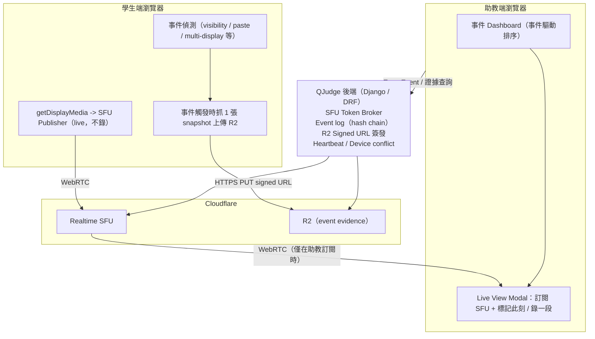

# 線上考試監考系統遷移提案：即時監看 + Event-Keyed 證據

狀態：待 review
作者：Quan
日期：2026-04-27
影響範圍：考試監考流程、學生端錄影鏈路、助教審查 UI、Cloudflare / R2 基礎設施

> 本文件是架構提案，實際 Cloudflare Realtime SFU 方案、免費額度、計費與 API 細節在實作前仍需以 Cloudflare 官方文件與帳號 Dashboard 的當下狀態再確認一次。

## 1. 執行摘要

本提案規劃將 QJudge 線上考試的監考機制從「全程低 fps 螢幕快照 + 事後縮時影片」改為「即時 SFU 監看 + 事件觸發的證據快照」。

核心變更：

- 平時：學生螢幕分享走 Cloudflare Realtime SFU，助教可即時監看，完全不錄影
- 事件觸發：偵測到可疑事件時抓單張 snapshot 存 R2，與 ExamEvent 綁定
- 助教主動：在 Live View 中可主動「標記此刻」或「錄一段」，產生重點證據
- 完全捨棄：定期定時的影像紀錄、事後 ffmpeg 縮時影片合成

預期效益：

| 指標 | 現況 | 變更後 | 變化 |
| --- | --- | --- | --- |
| 後端考試流量 | ~195 Mbps | <1 Mbps | -99% |
| 單場儲存 | 65-140 GB | ~80 MB | -99.94% |
| 學生端 CPU | 25-40% | 10-18% | -50% |
| 抓現行作弊延遲 | 事後 | <1 秒 | 質的改變 |
| 證據信噪比 | ~0.5%（事件相關幀） | ~95% | 質的改變 |
| 月成本 | ~$10 | $0-5 | -50% 以上 |

工作量：3-4 週單人 / 2 週前後端並行 + 1 週實考驗證。

## 2. 背景與動機

### 2.1 現況觀察

QJudge 目前已有完整的監考實作：每 3 秒擷取 WebP 螢幕快照，經 IndexedDB queue 直傳 R2，事後由 Celery + ffmpeg 合成 1 fps MP4 縮時影片供助教回放。整套基礎設施（事件鏈、heartbeat、JTI 鎖、device conflict 處理）已運行穩定。

### 2.2 觀察到的問題

1. 影片回放幾乎沒有人看。實證上助教不會花時間 scrub 2 小時 MP4，多數爭議實際是用結構化的 ExamEvent log 判定。
2. 儲存的證據絕大多數是噪音。學生 99% 的時間在正常作答，這些畫面被無差別錄下儲存，但永遠不會被使用。
3. 無法即時介入。現況是事後才能調閱影片，作弊行為發生當下助教看不到，無法即時警告或制止。
4. 法務 / 隱私負擔。每場考試保存 65-140 GB 含學生螢幕內容的影像資料，需要明確的同意書、保存期限、存取稽核機制。

### 2.3 設計原則

> 存的東西要有 100% 被使用的可能；沒人會看的東西不存。

## 3. 架構決策

### 3.1 實質證據的定義

證據的價值 = 被使用的機率 x 使用時的決定性。盤點各類資料：

| 證據類型 | 使用機率 | 決定性 | 實質價值 |
| --- | --- | --- | --- |
| 沒事件期間的影像 | 接近 0 | 低 | 0 |
| 事件當下的單張 snapshot | 高 | 高 | 高 |
| 事件當下的短片（30s） | 高 | 高 | 高 |
| 結構化 event log | 高 | 中 | 高 |
| 助教主動標記的 snapshot | 高 | 高 | 極高 |
| 助教主動錄製的片段 | 高 | 高 | 極高 |

決策：只保存上方價值「高」以上的內容；放棄定期取樣。

### 3.2 整體架構



### 3.3 Evidence Window 決策

事件證據不以「每個事件產一段影片」為單位，而以可合併的 evidence window 為單位。

核心規則：

- 單一事件：保留 `event_time - 20s` 到 `event_time + 20s`，總長 40 秒。
- 短時間連續事件：若新事件落在既有 window 結束後 20 秒內，合併到同一個 evidence window。
- 單段最大長度：120 秒。超過後切成下一段 evidence window，避免連續事件把整場考試錄下來。
- 同一個 evidence window 可關聯多個 `ExamEvent`，審查 UI 以 event cluster 呈現。
- 若事件發生時前置 buffer 不足，仍保存可取得的前段並標記 `pre_buffer_complete=false`。

範例：

```text
事件 A：10:00:00
window：09:59:40 - 10:00:20

事件 B：10:00:15
落在既有 window 內
window 延長為：09:59:40 - 10:00:35

事件 C：10:00:50
距離前一段結束 15 秒
window 延長為：09:59:40 - 10:01:10

若總長超過 120 秒
切為：
clip 1：09:59:40 - 10:01:40
clip 2：10:01:40 - ...
```

實作含義：

- 學生端需要維持約 30 秒 ring buffer，才能取得事件前 20 秒。
- `ExamEvent` 建立後，後端負責將事件掛入對應 evidence window。
- 第一版先以 `ExamEvent.metadata` 記錄 window / cluster 資訊，不新增獨立 evidence model。
- R2 object key 應以 window / clip 為主，不再以單一事件為唯一主體。
- 事件仍是審查主軸；clip 只是事件 cluster 的媒體附件。
- 暫不新增 `ExamEvidenceWindow` model；功能完成後再依查詢、狀態流與審查需求評估是否正規化。

### 3.4 Live View 決策

TA 偵測到事件後可以從 dashboard 直接開 Live View 監看該學生畫面。這個行為不應打斷學生作答。

產品規則：

- 學生端在考試期間持續 publish screen track 到 Cloudflare Realtime SFU。
- TA 開啟 Live View 只是新增 subscriber，從 Cloudflare 拉流。
- 學生不需要重新授權、不彈出 browser prompt、不重新分享螢幕。
- TA 每次開啟 Live View 都必須寫 audit log：TA、contest、student、開始時間、結束時間、觸發來源。
- 考試開始前明確告知「考試期間助教可即時查看螢幕分享」。
- 考試中不彈 popup 干擾學生；狀態列可固定顯示「螢幕分享監考中」。

權限規則：

- 後端必須驗證 `can_manage_contest(ta, contest)`。
- 後端必須限制 TA 只能 subscribe 該 contest 內的學生 track。
- Subscriber token TTL 建議 5 分鐘，到期後由 TA modal 靜默續簽。
- 學生端不接收 TA 監看狀態作為即時事件，避免造成考試行為干擾。

## 4. 技術方案

### 4.1 學生端

保留（重用既有約 600 LOC）：

- `forcedCapture.ts`：事件觸發抓圖機制
- `useAnticheatUploader.ts`：Signed URL 上傳器
- `useCanvasProcessor.ts`：WebP 編碼
- `screenShareHandoffStore.ts`：跨頁面 stream 保留
- 所有監測 hooks，例如 `useFullscreenMonitoring`
- `orchestrator.ts`：事件仲裁

新增：

- `useSfuScreenSharePublisher.ts`（約 200 LOC）：WebRTC publisher，連 Cloudflare SFU
- `sfuPublisher.ts`（約 150 LOC）：連線、ICE restart、重連邏輯
- `useEvidenceRingBuffer.ts`（約 180 LOC）：維持 30 秒本地短暫 buffer，供事件 clip 取得前 20 秒
- `evidenceWindowClient.ts`（約 120 LOC）：事件後建立 / 延長 evidence window，並負責 clip 上傳協調

刪除：

- 既有 `useAnticheatScreenCapture.ts` 中的 `setInterval` 定期 capture 區塊
- 移除「定期 enqueue + flush」流程

### 4.2 助教端

新增：

- `ExamLiveViewModal.tsx`（約 280 LOC）：取代既有 `ExamVideoReviewModal`
  - 訂閱單一學生 SFU video
  - 「標記此刻」按鈕：截 `<video>` element，上傳 R2，建立 `ta_marked_snapshot` ExamEvent
  - 「錄一段」按鈕：MediaRecorder 錄當前訂閱流，30/60 秒上傳 R2
  - 顯示該生最近 30 秒事件 timeline
- `EvidenceTimeline.tsx`（約 300 LOC）：事後審查介面
  - 以 ExamEvent 為主軸，每個事件可附 0-1 張縮圖 / 短片
  - 取代「2 小時 MP4 scrub」的審查模式

修改：

- `IncidentCard.tsx`：「看影片」按鈕改為「看 Live」
- `OverviewActionWidgets.tsx`：增加「在線 / 離線」狀態（沿用 heartbeat）

### 4.3 後端

新增：

- `services/sfu_broker.py`（約 120 LOC）：Cloudflare SFU token 簽發
- `services/evidence_windows.py`（約 180 LOC）：建立、合併、封頂與切分 evidence window；第一版只寫入 `ExamEvent.metadata`
- `views/exam_sfu.py`（約 80 LOC）：publisher / subscriber token endpoints
- `views/exam_evidence.py` 重寫（約 200 LOC，取代既有 603 行）：改為 ExamEvent-keyed 證據查詢

保留：

- `services/anti_cheat_session.py`：heartbeat / device conflict / JTI
- `services/anticheat_storage.py`：R2 helper
- `services/anticheat_config.py`：policy
- `views/exam_events.py`：event log
- `services/exam_submission.py` 大部分邏輯

刪除：

- 舊 ffmpeg 影片合成 task
- 舊 raw screenshot retention task
- 舊 evidence video / job metadata model
- `services/exam_submission.py:enqueue_compile_video`

Model 變更：

- `Contest.monitoring_mode`：新增 enum（`snapshot` / `live_sfu`），預設 `snapshot`，作為 per-contest feature flag
- 第一版不新增必需 model，優先沿用現有資料結構：
  - `ExamEvent.metadata`：記錄 `evidence_cluster_id`、`evidence_window_start`、`evidence_window_end`、`evidence_clip_key`、`pre_buffer_complete`
- `ExamEvent.evidence_keys`：可選後續 migration；若 metadata 查詢與序列化足夠，第一版不加
- `ExamEvidenceWindow`：可選 Phase 2 正規化模型；當 clip lifecycle、cluster 查詢、狀態追蹤變複雜時再新增

若後續需要正規化，建議 `ExamEvidenceWindow` 欄位：

| 欄位 | 說明 |
| --- | --- |
| `contest` | 所屬 contest |
| `user` | 學生 |
| `source_module` | `screen_share` / `webcam` |
| `started_at` | window 開始時間 |
| `ended_at` | window 結束時間 |
| `status` | `open` / `recording` / `uploaded` / `failed` |
| `r2_key` | 已上傳 clip 的 R2 key |
| `event_ids` | 關聯的 ExamEvent ids，或改以 join table 實作 |
| `pre_buffer_complete` | 是否完整取得事件前 20 秒 |
| `metadata` | bitrate、duration、browser codec、錯誤碼等 |

## 5. Cloudflare 服務建置

這套方案需要 Cloudflare Realtime SFU + R2。R2 已在使用，只需新開 Realtime。

### 5.1 帳號與服務開通

前置條件：

- 已有 Cloudflare 帳號（QJudge 已使用 R2，沿用同一個）
- 確認帳號方案：Realtime SFU 在所有方案（含 Free）皆可使用，預設含 1,000 GB / 月免費額度

開通步驟：

1. 登入 Cloudflare Dashboard
2. 左側選單進入 Realtime -> SFU
3. 點擊 Create Application
4. Application name：`qjudge-prod-monitoring`（或環境對應名稱）
5. 取得 App ID（公開）與 App Secret（密鑰，僅顯示一次，需立即存入 secrets manager）

為環境分離建立多個 App：

```text
qjudge-dev-monitoring
qjudge-staging-monitoring
qjudge-prod-monitoring
```

每個 App 有獨立的 ID / Secret 與計費，避免互相影響。

### 5.2 Realtime SFU 設定

Room 命名規則（後端在 `sfu_broker.py` 強制執行）：

```python
room_id = f"{LIVE_MONITORING_ROOM_PREFIX}-{contest_id}-{user_id}"
```

範例：`qjudge-prod-exam-42-1337`

一學生一 room、考試生命週期內 permanent，方便助教多次進出觀看。

Track 設定：

- 學生 publisher 推單一 video track（無 simulcast，因為助教一次只看一人）
- 解析度：1280 x 720
- Frame rate：5 fps
- Bitrate：600 kbps
- Codec：H.264（首選，硬體加速廣泛）/ VP8（fallback）
- 不開音訊軌（不需要，且減少隱私風險）

Token TTL：

- Publisher token：考試剩餘時間 + 30 分鐘 buffer
- Subscriber token：5 分鐘（每次助教開 modal 重新簽）

### 5.3 TURN 設定（可選但建議）

部分學生可能在校園 / 公司 NAT / 防火牆環境，純 STUN 無法穿透時需要 TURN relay。

建立 TURN Key：

1. Dashboard -> Realtime -> TURN
2. Create Key
3. Key name：`qjudge-prod-turn`
4. Lifetime：90 days（到期自動 rotate）
5. 取得 Key ID 與 API Token

計費：TURN 流量 $0.05/GB，與 SFU egress 共用 1,000 GB 免費額度。

Failover 策略：學生端優先嘗試 P2P / STUN，失敗時自動 fallback 到 TURN。Cloudflare Realtime SDK 預設行為。

### 5.4 R2 設定

R2 已在使用，只需新增 bucket 與 lifecycle policy。

新增 bucket：

```text
qjudge-prod-exam-evidence
```

Lifecycle Policy（在 R2 -> bucket -> Settings -> Lifecycle）：

| 規則名稱 | 條件 | 動作 |
| --- | --- | --- |
| `standard-retention` | 所有物件，tag = `retention=standard` | 建立後 30 天刪除 |
| `flagged-retention` | tag = `retention=flagged` | 不自動刪除，手動歸檔流程處理 |
| `appeal-retention` | tag = `retention=appeal` | 建立後 180 天刪除 |

Object key 命名：

```text
contest_{contest_id}/user_{user_id}/event_{event_id}/{type}_{timestamp}.{ext}
```

範例：

```text
contest_42/user_1337/event_8821/auto_snapshot_1714200000000.webp
contest_42/user_1337/event_8822/ta_marked_1714200030000.webp
contest_42/user_1337/event_8823/ta_clip_1714200060000.webm
```

Presigned URL TTL：上傳 5 分鐘、下載 2 分鐘（使用 `OBJECT_STORAGE_PRESIGNED_URL_TTL_SECONDS`）。

### 5.5 環境變數

新增至 `backend/config/settings/base.py`：

```python
# Cloudflare Realtime SFU
CLOUDFLARE_REALTIME_APP_ID = os.getenv("CLOUDFLARE_REALTIME_APP_ID")
CLOUDFLARE_REALTIME_APP_SECRET = os.getenv("CLOUDFLARE_REALTIME_APP_SECRET")
CLOUDFLARE_REALTIME_TURN_KEY_ID = os.getenv("CLOUDFLARE_REALTIME_TURN_KEY_ID")
CLOUDFLARE_REALTIME_TURN_KEY_API_TOKEN = os.getenv("CLOUDFLARE_REALTIME_TURN_KEY_API_TOKEN")

# Feature flag
LIVE_MONITORING_ENABLED = os.getenv("LIVE_MONITORING_ENABLED", "false") == "true"
LIVE_MONITORING_ROOM_PREFIX = os.getenv("LIVE_MONITORING_ROOM_PREFIX", "qjudge-prod-exam-")

# R2 evidence bucket
EVIDENCE_BUCKET = os.getenv("EVIDENCE_BUCKET", "qjudge-prod-exam-evidence")

# ANTICHEAT_RAW_BUCKET 作為事件證據截圖 bucket
```

### 5.6 安全與權限

Secrets 管理：

- `CLOUDFLARE_REALTIME_APP_SECRET` 與 `CLOUDFLARE_REALTIME_TURN_KEY_API_TOKEN` 走既有 secrets manager（不可進 git）
- Spike 階段使用獨立 dev App，spike 結束後 rotate

SFU Token ACL：

- Publisher token 限定該學生的 `user_id`，無法 publish 到其他 room
- Subscriber token 限定 `can_manage_contest(ta, contest)` 通過的助教，且僅能 subscribe 指定 `target_user_id`
- 後端發 token 前必過 `_ensure_active_device_session`（device conflict 檢查，沿用既有）

Audit log：

- 助教取得 subscriber token：寫 `ContestActivity(action_type="ta_live_view_started")`
- 助教標記可疑：寫 `ExamEvent(event_type="ta_marked_suspicious")`
- 學生 SFU 異常斷線：寫 `ExamEvent(event_type="sfu_publisher_disconnected")`

### 5.7 監控與計費

Cloudflare Dashboard 監控：

- Realtime -> Application -> Analytics：concurrent publishers / subscribers、egress GB
- 建議設置 budget alert：每月 $10 觸發告警

自家後端 metrics（Prometheus / log）：

- `qjudge_sfu_publisher_token_minted_total{contest_id}`
- `qjudge_sfu_subscriber_token_minted_total{contest_id, ta_user_id}`
- `qjudge_evidence_uploaded_bytes_total{type=auto|ta_marked|ta_clip}`
- `qjudge_ta_live_view_session_duration_seconds`

計費風險控制：

- 後端 rate limit token broker（既有 `ExamAnticheatUrlsThrottle` 機制可沿用）
- Subscriber token TTL 短（5 分鐘），降低權限洩漏放大風險
- 每月初檢查 Cloudflare 用量與預估值偏差

## 6. 程式碼影響範圍

### 6.1 LOC 統計

| 類別 | LOC 變化 |
| --- | --- |
| 刪除 | 約 1,800（影片相關 pipeline） |
| 新增 | 約 1,200（SFU + Live View + Evidence Timeline） |
| 修改 | 約 400 |
| 淨變化 | 約 -600 LOC |

### 6.2 風險最小的部分

事件鏈完全不動，所以風險集中在「擷取與儲存」層：

- ExamEvent model 與 hash chain 不變
- Heartbeat / device conflict / JTI 不變
- Orchestrator 仲裁邏輯不變
- 所有監測 hooks 不變
- 學生端 publisher 全新（風險中）
- 助教 Live View UI 全新（風險中）
- Evidence 上傳鏈路 80% 沿用既有 forcedCapture 路徑

## 7. 階段執行計畫

### Phase 0：Spike（已規劃，3 天）

Day 1：Hello world

- 建立 `qjudge-dev-monitoring` Cloudflare App
- 兩瀏覽器分頁 publisher / subscriber 跑通
- 量測玻璃對玻璃延遲，目標 <1 秒

Day 2：訂閱啟動延遲與重連

- 測「點按鈕到看到畫面」<2 秒
- 用 Network Link Conditioner 模擬 5% loss、Wi-Fi 切換
- 量測重連時間 <10 秒

Day 3：Idle publisher 規模測試

- Playwright 起 50 個 headless publisher
- 確認 Cloudflare per-app concurrent 上限不會卡 130 人
- 計費實測：50 publisher idle 是否真的 0 費用

Go / No-Go 條件：3 個目標全達標。

### Phase 1：基礎建設（5-7 天，前後端可並行）

後端（5 天）：

- `services/sfu_broker.py` + `views/exam_sfu.py`
- 新環境變數 + secrets 配置
- Migration：`Contest.monitoring_mode`、`ExamEvent.evidence_keys`
- 單元測試 + 整合測試

前端（5-7 天）：

- `useSfuScreenSharePublisher.ts` + `sfuPublisher.ts`
- 整合既有 `ExamCaptureContext`（介面對齊，上層零改動）
- 重連 / fallback 邏輯
- Vitest + Playwright E2E

整合驗收：學生 publisher 推流，spike 階段的 `subscriber.html` 看得到。

### Phase 2：助教端整合（4-6 天）

- `ExamLiveViewModal.tsx`（含「標記此刻」「錄一段」）
- `EvidenceTimeline.tsx` 取代既有 `ExamVideoReviewModal`
- `IncidentCard` 改「看 Live」按鈕
- 後端 `ta_evidence` action 處理 TA-marked 上傳

### Phase 3：Feature Flag 與雙跑（3-4 天）

- `Contest.monitoring_mode` 開關接入前後端
- 前端依 mode 載入對應 hook
- Settings UI 新增模式選項
- Staging 雙模式並存驗證

### Phase 4：內部 Dry Run（1 週 elapsed）

- 30 人小規模試考（內部團隊扮學生）
- 量測 concurrent publisher、token broker latency、學生端 CPU、TA modal 使用率
- 修 bug，預期 3-5 個小問題

### Phase 5：正式 130 人考試（1 天）

T-7 天：

- 學生 device check 強制通過機制（包含 STUN / TURN 連通性測試）

T-1 天：

- Cloudflare quota 確認
- 前後端 build pin SHA
- Stagger join load test

T-15 分鐘：

- 助教 dashboard 待命
- 工程師 standby
- Token broker 監控就緒

考試中監控：

- Token broker error rate <1%
- SFU concurrent publisher 趨近 130
- Subscribe latency p95 <2 秒

回滾上限：學生已連 SFU 時無法切回舊路徑。事件鏈獨立故學生不會考不下去，最壞情況是 live view 暫停、TA 改用 dashboard event log 監考。

### Phase 6：清理與 Webcam 遷移（5-7 天，正式上線後執行）

- Webcam pipeline 同樣遷移到 SFU（一個 room 兩條 track）
- 刪除舊影片轉檔 task、raw screenshot retention task、舊 evidence video / job metadata model
- 移除 ffmpeg dependency（後端 image 縮小）
- 廢除舊影片專用 Celery worker
- 30 天後 drop 過渡期 model

## 8. 成本分析

### 8.1 單場 130 人 2 小時考試

| 項目 | 計算 | 金額 |
| --- | --- | --- |
| Cloudflare SFU ingress | 130 x 600 kbps x 7200s 約 70 GB | 免費（ingress） |
| Cloudflare SFU egress | 助教觀看約 2 GB | 免費（< 1000 GB 額度） |
| TURN relay（估 10% 走 TURN） | 約 7 GB | 免費（< 1000 GB 額度） |
| R2 存證（事件 snapshot） | 約 80 MB / 場 | $0.001 |
| R2 操作 PUT | 約 1500 次 / 場 | 免費 |
| 單場合計 | | <$0.01 |

### 8.2 月度 / 年度

假設每月 4 場 130 人考試 + 證據保留 30 天：

| 項目 | 月成本 | 年成本 |
| --- | --- | --- |
| SFU 流量（含 dry run） | $0-3 | $0-36 |
| R2 儲存（峰值 320 MB） | $0.005 | $0.06 |
| TURN | $0-1 | $0-12 |
| 合計 | <$5 | <$50 |

對照現況（每月約 $10 R2 儲存 + ffmpeg 算力成本），長期省超過 50%。

## 9. 風險與緩解

| 風險 | 嚴重度 | 緩解 |
| --- | --- | --- |
| Cloudflare Realtime SDK 不穩 / 文件不全 | 高 | Phase 0 Spike 強制驗證；備案：自架 LiveKit / mediasoup（多 1-2 週） |
| 130 人並發 publisher join 打爆 token broker | 中 | 客戶端 retry-with-jitter、後端 rate limit、stagger 5/s |
| 學生家用 Wi-Fi 不穩重連體驗差 | 中 | 強制 device check 驗 STUN / TURN 連通性、考前說明文件 |
| 學生瀏覽器 SFU 連線失敗 | 中 | 事件鏈獨立，event log 仍正常上報，最壞退化為「事件監考」 |
| 弱機（舊筆電）CPU 撐不住 | 低 | Phase 0 Spike 驗證；前端偵測 CPU 高時提示換機 |
| Cloudflare 服務全網 outage | 低 | 事件鏈獨立，學生可正常考試，僅 live view 暫停 |
| 助教未即時看 dashboard 漏抓作弊 | 低 | Event log 完整保留，可事後審查；助教培訓 |
| 申訴時無畫面證據 | 低 | Event-keyed snapshot + TA 主動標記覆蓋常見情境；極端情況以 hash-chained event log 為證 |

## 10. 上線與回滾策略

### 10.1 漸進啟用

1. Phase 3 完成，staging 驗證
2. Phase 4 dry run，30 人內部試考
3. Phase 5 正式啟用，第一場 130 人考試
4. 後續所有新建 contest 預設 `monitoring_mode=live_sfu`
5. Phase 6 清理舊 pipeline

### 10.2 回滾矩陣

| 階段 | 回滾方式 | 影響 |
| --- | --- | --- |
| Phase 1-4 | 設 `LIVE_MONITORING_ENABLED=false` | 無影響，舊路繼續 |
| Phase 5 進行中（學生已連 SFU） | 不回滾，stop live view，dashboard 監考 | 失去即時監看，事件鏈正常 |
| Phase 6 之後 | 不可回滾 | 確保 Phase 5 通過再執行 |

### 10.3 既有資料處理

- 過去考試的舊影片證據紀錄若仍需申訴查詢，應先由資料備份或 object storage lifecycle 留存
- 30 天後跑 cleanup job 刪舊 R2 物件
- 確認不再查詢後 drop 舊 model

## 11. 法務與隱私

### 11.1 同意書修訂（Phase 3 開放前完成）

- 移除「螢幕錄影 X 天保存」字樣
- 新增：「考試期間助教可即時觀看您的螢幕分享，畫面不被儲存」
- 新增：「偵測到可疑行為時，系統會擷取單張當下截圖作為證據，保留 30 天」
- 新增：「助教標記可疑時刻會記錄結構化事件，必要時連同截圖作為證據」

### 11.2 存取稽核

- 所有 TA live view session、TA marked snapshot、證據下載都寫入 `ContestActivity`
- 學生申請查閱「自己的證據」流程：透過後端 API 出 signed URL，記入 audit log

### 11.3 保留期限

| 證據類型 | 預設保留 | 申訴中 |
| --- | --- | --- |
| 自動事件 snapshot | 30 天 | 自動延長至結案 + 90 天 |
| TA marked snapshot | 30 天 | 同上，可手動標記為「歸檔」永久保留 |
| TA 錄製短片 | 30 天 | 同上 |
| Event log | 1 年 | 不刪 |

## 12. 開放問題（請 reviewer 給意見）

1. Webcam 是否同步遷移？
   建議 Phase 6 一起處理保持架構對稱。但若 Phase 5 先驗證螢幕單路，可拆分降低風險。
2. TA 主動錄製片段的時長上限？
   建議 60 秒上限，避免單一片段過大。reviewer 是否有更好的建議？
3. 是否要支援多助教同時看同一學生？
   技術上 SFU 支援多 subscriber，但 UX 上是否要顯示「另一位助教也在看」？
4. 離開考試後學生是否能查閱自己的證據？
   GDPR / 個資法觀點上應該支援，但實務上很少被使用，是否值得做 UI？
5. Cloudflare vendor lock-in 風險。
   若未來想換到 LiveKit / 自架，token broker 抽象設計是否充分？
6. Phase 5 上線時程。
   下次 130 人考試是哪一場？是否來得及完成 Phase 0-4？

## 13. 附錄

### A. 既有程式碼盤點（重點）

| 路徑 | LOC | Phase 6 後 |
| --- | ---: | --- |
| `frontend/src/features/contest/anticheat/orchestrator.ts` | 294 | 保留 |
| `frontend/src/features/contest/anticheat/forcedCapture.ts` | 231 | 保留 |
| `frontend/src/features/contest/screens/paperExam/hooks/useAnticheatScreenCapture.ts` | 519 | 大改（移除 setInterval） |
| `frontend/src/features/contest/screens/paperExam/hooks/anticheat/useAnticheatUploader.ts` | 89 | 保留 |
| `frontend/src/features/contest/components/admin/ExamVideoReviewModal.tsx` | 632 | 刪除，取代為 `ExamLiveViewModal` + `EvidenceTimeline` |
| `backend/apps/contests/services/anti_cheat_session.py` | 448 | 保留 |
| `backend/apps/contests/services/anticheat_storage.py` | 189 | 保留 |
| `backend/apps/contests/services/anticheat_config.py` | 280 | 保留 |
| `backend/apps/contests/views/exam_anticheat.py` | 206 | 部分修改（移除 `anticheat_urls` 中的定期 case） |
| `backend/apps/contests/views/exam_evidence.py` | 603 | 重寫（約 200 LOC） |
| `backend/apps/contests/views/exam_events.py` | 457 | 保留 |
| 舊影片轉檔 task | 約 180 | 刪除 |

### B. 實作參考連結

- Cloudflare Realtime: <https://developers.cloudflare.com/realtime/>
- Cloudflare Realtime SFU API: <https://developers.cloudflare.com/realtime/sfu/>
- Cloudflare R2 Lifecycle: <https://developers.cloudflare.com/r2/buckets/object-lifecycles/>
