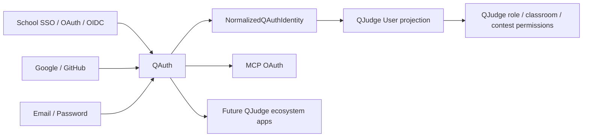
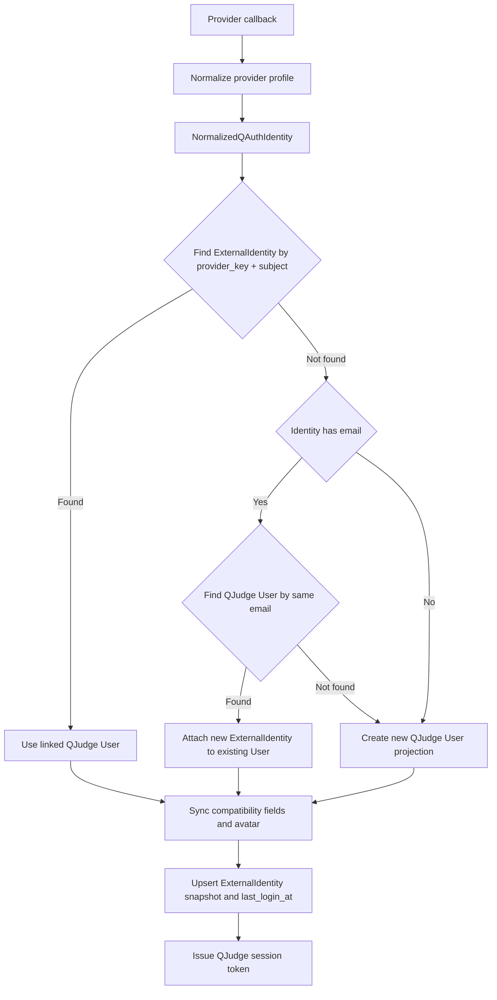

# QAuth 服務架構

QAuth 是 QJudge 生態中的身份與 OAuth 邊界。它負責登入來源、外部身份連結、session、OAuth client、MCP OAuth、token 簽發與公開金鑰；QJudge 保留角色、課程、比賽、教師邀請、班級邀請與應用授權。

本文件說明 QAuth 如何和 QJudge 的 `User` 系統連結。重點不是把 QJudge `User` 直接搬進 QAuth，而是定義一個清楚的 user projection contract：QAuth 判斷「這是哪一個人」，QJudge 決定「這個人在 QJudge 可以做什麼」。

## 責任邊界

| 模組 | 責任 |
| --- | --- |
| QAuth | provider 設定、Email/Password provider、OAuth/OIDC/SSO provider、外部身份連結、QAuth session、OAuth client、MCP OAuth、token 簽發 |
| QJudge | `User` projection、role、permission、teacher activation invite、classroom invite、classroom membership、contest permission、problem/submission ownership |
| 第三方 IdP | 學校 SSO、Google、GitHub 或其他 OAuth/OIDC provider 的使用者認證與 profile claim |

QAuth 不直接授予 QJudge teacher/admin 權限，也不直接建立 classroom membership 或 contest permission。這些仍由 QJudge domain flow 決定。



## 核心模型

| 模型 | 說明 |
| --- | --- |
| `QAuthUser` | QAuth 內部的全域身份主體。抽成獨立服務後才會成為真正的 owner model。 |
| `QAuthAccount` | 一個 provider account 與 QAuth user 的連結。現在由 QJudge 的 `ExternalIdentity` 承擔。 |
| `NormalizedQAuthIdentity` | provider callback 後產生的標準身份資料，是 account linking 的輸入。 |
| `ProviderTokenSet` | callback 當下拿到的 provider token。第一版只用來取 profile，不持久保存。 |
| `QAuthProviderOption` | 前端可讀取的 provider 顯示資料，例如 key、type、category、display name、logo URL。 |
| `QAuthProviderConnection` | 後端 server-only provider 連線設定，例如 endpoint、scope、client id/secret env key。 |
| `QAuthSession` | 使用者登入 QAuth 後的 session。過渡期仍由 QJudge JWT cookie 承擔。 |
| `QAuthClientApplication` | QJudge、MCP server 或未來 app 在 QAuth 裡的 OAuth client。 |

第一版公開 contract 不包含 `institution_key`、`supports_registration`、`email_verified`。目前 QJudge 沒有 email 驗證流程，所以 QAuth v1 信任 provider 回傳的 email。

## 與 QJudge User 的關係

QJudge 的 `User` 是應用系統 projection，不是 QAuth 的 provider account。QJudge module 可以用 `User.id`、`role`、permission、membership 來做授權，但不應用 `User.auth_provider` 或 `User.oauth_id` 推論使用者完整身份。

目前 monolith 內的對應關係如下：

| QAuth 概念 | QJudge 過渡期資料 |
| --- | --- |
| QAuth user | `apps.users.models.User` |
| QAuth account/provider identity | `apps.users.models.ExternalIdentity` |
| Provider subject | `ExternalIdentity.subject` |
| Provider key | `ExternalIdentity.provider_key` |
| Provider profile snapshot | `ExternalIdentity.profile_snapshot` |
| Session token | QJudge JWT cookie |
| Legacy latest provider display | `User.auth_provider`、`User.oauth_id` |

`ExternalIdentity` 是外部身份連結的主資料來源。`User.auth_provider`、`User.oauth_id`、`User.email_verified` 是相容欄位，只用來保留既有 API、admin 或舊資料行為。

## Account Linking Contract

收斂後，provider callback 不應直接寫 `User`。provider service 只負責 OAuth transport 與 profile normalization，然後把標準身份交給 account linking service：

```python
link_qauth_identity(
    identity: NormalizedQAuthIdentity,
    token_set: ProviderTokenSet | None = None,
) -> User
```

Provider service 不建立或查詢 `User`。OAuth callback view 會呼叫 `service.normalize_identity(oauth_data)` 與 `service.provider_token_set(oauth_data)` 取得 QAuth contract，然後直接呼叫 `link_qauth_identity()`。

目前 monolith 內的責任拆分：

| 模組 | 責任 |
| --- | --- |
| `account_linking.py` | 依序執行 provider subject 查找、同 email 合併、新 user 建立、projection sync、external account upsert |
| `external_accounts.py` | 查詢與寫入 `ExternalIdentity`，只保存 provider account 與 app user ref 的連結 |
| `user_projection.py` | 查詢、建立與更新 QJudge `User` / `UserProfile` projection |

這個拆分是 package 化前的最後一層 monolith 邊界。未來若接不同 app 的 User DB，替換的是 external account store 與 user projection 實作，不需要改 provider service。

### `NormalizedQAuthIdentity`

```python
@dataclass(frozen=True)
class NormalizedQAuthIdentity:
    provider_key: str
    provider_subject: str
    email: str | None
    username: str
    display_name: str = ""
    avatar_url: str = ""
    raw_profile: dict = field(default_factory=dict)
```

必要欄位：

| 欄位 | 必要性 | 說明 |
| --- | --- | --- |
| `provider_key` | 必要 | provider storage key。上線後不要任意改名，改名需要資料遷移。 |
| `provider_subject` | 必要 | provider 回傳的穩定 subject，例如 OIDC `sub`。不能用 display name。 |
| `email` | 強烈建議 | 第一版用同 email 合併到同一個 QJudge `User`。 |
| `username` | 必要 | 建立新 QJudge `User` projection 時使用。 |
| `display_name` | 選用 | 顯示用途，不應作為 identity key。 |
| `avatar_url` | 選用 | 可同步到 QJudge `UserProfile`，但不可覆蓋手動設定的 avatar。 |
| `raw_profile` | 選用 | 保存 provider normalize 後的 snapshot，方便除錯與後續欄位擴充。 |

### `ProviderTokenSet`

`ProviderTokenSet` 只代表 callback 當下從 provider 換到的 token。

第一版 QAuth 不保存第三方 provider access token 或 refresh token。登入流程使用 token 取得 profile 後即丟棄。若未來要代表使用者呼叫 provider API，應新增獨立且加密的 token store，不能把 provider token 塞進 `ExternalIdentity.profile_snapshot` 或 QJudge JWT。

## User Linking 流程



連結順序：

1. 用 `(provider_key, provider_subject)` 查 `ExternalIdentity`。
2. 若找到，使用該 `ExternalIdentity.user`。
3. 若找不到，且 identity 有 email，用同 email 查既有 QJudge `User`。
4. 若同 email user 存在，將新的 provider identity 掛到該 user。
5. 若同 email user 不存在，建立新的 QJudge `User` projection。
6. 寫入相容欄位 `User.auth_provider`、`User.oauth_id`、`User.email_verified`，但新功能不應依賴這些欄位判斷身份。
7. 若 provider 有 avatar，且使用者沒有手動設定 avatar，更新 `UserProfile.avatar_url`。
8. 建立或更新 `ExternalIdentity`，保存 provider key、subject、email、profile snapshot、last login time。
9. 由 QJudge session/JWT service 簽發登入 token。

同一個 email 在第一版視為同一個使用者。接入新 provider 前，維護者必須確認該 provider 的 email 語意可信。若 provider 不能保證 email 屬於登入者，應先改成 pending link 或人工確認流程。

## Callback 時序

```mermaid
sequenceDiagram
    autonumber
    actor U as "使用者"
    participant FE as "Frontend auth page"
    participant API as "QJudge auth API"
    participant Provider as "OAuth provider service"
    participant IdP as "External IdP"
    participant Link as "account_linking.py"
    participant DB as "User + ExternalIdentity"
    participant JWT as "QJudge JWT service"

    U->>FE: "點選登入方式"
    FE->>API: "GET /api/v1/auth/{provider}/login"
    API->>Provider: "get_authorization_url(redirect_uri, state)"
    Provider-->>API: "authorization_url"
    API-->>FE: "authorization_url"
    FE->>IdP: "redirect"
    IdP-->>FE: "callback code"
    FE->>API: "POST /api/v1/auth/{provider}/callback"
    API->>Provider: "exchange_code(code, redirect_uri)"
    Provider->>IdP: "token endpoint + userinfo endpoint"
    IdP-->>Provider: "token set + profile"
    Provider-->>API: "normalized provider data"
    API->>Link: "link_qauth_identity(identity, token_set)"
    Link->>DB: "find ExternalIdentity(provider_key, subject)"
    Link->>DB: "fallback find/create User by email"
    Link->>DB: "upsert ExternalIdentity"
    Link-->>API: "QJudge User"
    API->>JWT: "generate_tokens(user)"
    API-->>FE: "JWT cookie + user data"
```

`account_linking.py` 只負責流程協調；`external_accounts.py` 負責 `ExternalIdentity`；`user_projection.py` 負責 QJudge `User` / `UserProfile`。OAuth provider service 只處理 provider transport 與 profile normalization。

## Provider 設定與憑證

QAuth 把 provider 的公開顯示資訊和 server-only 連線設定分開。

`QAuthProviderOption` 回給前端，只能包含可公開資料：

```json
{
  "key": "nycu",
  "type": "oidc",
  "category": "campus",
  "display_name": "NYCU 國立陽明交通大學",
  "display_name_i18n_key": "auth.providers.nycu",
  "logo_url": "/school-logos/nycu.png"
}
```

`QAuthProviderConnection` 留在後端設定，負責 OAuth endpoint、scope 與 credential env key：

```json
{
  "key": "nycu",
  "type": "oidc",
  "authorization_url": "https://id.example.edu/oauth/authorize",
  "token_url": "https://id.example.edu/oauth/token",
  "userinfo_url": "https://id.example.edu/oauth/userinfo",
  "scope": "openid email profile",
  "client_id_env": "NYCU_OAUTH_CLIENT_ID",
  "client_secret_env": "NYCU_OAUTH_CLIENT_SECRET"
}
```

前端不能讀 client id、client secret、token endpoint 或 userinfo endpoint。部署者透過 env/seed 管理這些資料，provider secret 輪替只需要更新環境變數並重啟後端。

## QJudge Domain 邊界

User linking 完成後，只代表「這個 QAuth identity 對應到哪一個 QJudge User」。後續 domain 權限仍由 QJudge 控制：

- Teacher 身份仍走 teacher activation invite。
- Classroom invite 仍是 QJudge feature，不移入 QAuth 第一版。
- Admin 身份由管理者授權或 seed 建立。
- Classroom membership、contest permission、problem/submission ownership 不由 provider claim 自動產生。
- MCP OAuth 可以由 QAuth 管理 client、scope 與 token，但 MCP tool/resource policy 仍要由 QJudge 或 MCP domain 判斷。

## 擴充 Provider 的最小流程

1. 在後端設定 `QAuthProviderConnection`，填入 endpoint、scope、client id env、client secret env。
2. 在公開 provider option 加入 `key`、`type`、`category`、`display_name`、`display_name_i18n_key`、`logo_url`。
3. 新增 provider service，沿用 `BaseOAuthService` 的 OAuth transport，只實作 provider-specific profile normalize。
4. 將 provider route key 加入 registry。
5. 確認 `_parse_user_info()` 或 equivalent normalize output 能產生 `provider_subject`、email、username。
6. 補 account linking 測試：同 `(provider_key, subject)` 回到同 user；同 email 連到同 user；不同 email 建立新 user。
7. 補 frontend provider option 測試：login/register/campus 頁都只依 `AuthOptions` contract 顯示 provider。

## 維護原則

- Provider 差異留在 provider service 或 profile normalize，不複製登入 view、JWT 簽發或 account linking。
- User linking 集中在 `link_qauth_identity()` contract，不讓每個 provider 自己決定如何建立 `User`。
- `account_linking.py` 不直接 import QJudge models；資料存取集中在 `external_accounts.py` 與 `user_projection.py`。
- `ExternalIdentity` 是外部身份連結主資料來源。
- `User.auth_provider`、`User.oauth_id`、`User.email_verified` 是相容欄位。
- `ProviderTokenSet` 不持久化；不要把第三方 access token 或 refresh token 寫進 database snapshot。
- Public provider option 不包含 secret、endpoint、`institution_key`、`supports_registration`、`email_verified`。
- Provider storage key 進 production 後不要任意改名；需要改名時以 migration 更新 `ExternalIdentity.provider_key`。
- QAuth 可以服務多個 app；每個 app 應維護自己的 user projection 與授權資料。
