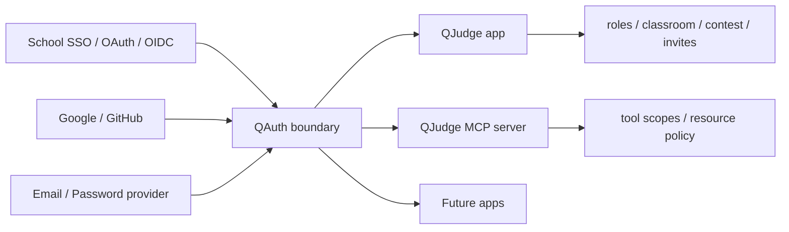

# QAuth Authentication Decoupling Implementation Plan

> **For agentic workers:** REQUIRED SUB-SKILL: Use superpowers:subagent-driven-development (recommended) or superpowers:executing-plans to implement this plan task-by-task. Steps use checkbox (`- [ ]`) syntax for tracking.

**Goal:** Build a clean QAuth boundary so QJudge authentication can later become a reusable identity, OAuth, SSO, and MCP authorization service for QJudge and future apps.

**Architecture:** Start by creating a QAuth-compatible contract inside the existing monolith, then move provider federation, account linking, sessions, OAuth client registry, and MCP OAuth into a service boundary. QJudge keeps application-specific user projection, roles, classroom/contest permissions, teacher invites, and classroom invites.

**Tech Stack:** Django / Django REST Framework / django-oauth-toolkit backend, React + TypeScript frontend, existing QJudge JWT cookie flow during transition, future OIDC-style issuer with JWKS.

## Global Constraints

- Do not move teacher activation invites into QAuth.
- Do not move classroom invites into QAuth; classroom invite remains a QJudge feature.
- Do not make QAuth decide QJudge roles, classroom membership, contest permissions, or teacher status.
- Keep Email/Password as a provider that deployments can disable.
- Preserve current QJudge login behavior while adding the decoupling seam.
- Treat MCP OAuth as part of QAuth service ownership.
- Use Auth.js/NextAuth contract ideas as references, not as a runtime dependency.
- QAuth v1 trusts provider email because QJudge does not yet operate an email verification flow.
- Do not expose `email_verified`, `institution_key`, or `supports_registration` in the first QAuth provider/session contract.
- Keep public provider metadata separate from server-only provider connection settings.
- Store provider client credentials as environment secret references; do not return secrets from auth option APIs.
- Do not persist third-party provider access/refresh tokens for identity-only login in v1; use them to fetch profile data and discard them.
- Commit at phase boundaries, not after every small step, unless the execution branch policy requires smaller commits.

---

## Reference Contracts

Auth.js references worth borrowing:

- Adapter/data contract: `User`, `Account`, `Session`, verification token concepts, and adapter operations for user/account/session storage. Source: https://authjs.dev/reference/core/adapters
- Provider profile normalization: provider `profile()` and `account()` callbacks normalize provider profile and token data before persistence. Source: https://authjs.dev/reference/core/providers
- Callback/event extension points: `jwt`, `session`, and sign-in callbacks provide controlled extension points. Source: https://authjs.dev/reference/core
- OAuth/OIDC provider model: OAuth 2.0 and OpenID Connect are first-class provider types. Source: https://authjs.dev/concepts/oauth

QAuth should borrow the separation, not the schema verbatim. QAuth needs school SSO, MCP OAuth, and app projection boundaries that Auth.js does not model for QJudge.

## Target Boundary



QAuth owns identity, providers, sessions, OAuth clients, and tokens.
QJudge owns app-specific authorization and domain features.

## File Structure

Planned backend ownership:

- Create: `backend/apps/users/auth/contracts.py`  
  Shared QAuth-compatible dataclasses and typed dictionaries used before service extraction.
- Create: `backend/apps/users/auth/account_linking.py`  
  Provider-account-to-QJudge-user linking rules; keeps email linking in one place.
- Create: `backend/apps/users/auth/external_accounts.py`  
  External provider account persistence backed by `ExternalIdentity`.
- Create: `backend/apps/users/auth/user_projection.py`  
  QJudge `User` / `UserProfile` projection persistence for QAuth identities.
- Modify: `backend/apps/users/auth/providers/base.py`  
  Reduce `BaseOAuthService` to provider transport and profile normalization orchestration.
- Modify: `backend/apps/users/auth/providers/*.py`  
  Return normalized QAuth identities instead of ad hoc dict shapes.
- Modify: `backend/apps/users/auth/options.py`  
  Emit QAuth provider option contract with i18n key, logo URL, and category.
- Create: `backend/apps/users/auth/provider_connections.py`  
  Load server-only provider endpoints and credential environment references.
- Modify: `backend/apps/users/views/auth.py`  
  Keep views thin; delegate login completion to account-linking and session issuing services.
- Modify: `backend/apps/users/models.py`  
  Keep `User` and `ExternalIdentity` as QJudge projection state during transition.
- Create: `backend/apps/oauth/services/metadata.py`  
  Build OAuth authorization server metadata and MCP server card data.
- Create: `backend/apps/oauth/services/client_registry.py`  
  Dynamic client registration and seeded MCP client ownership.
- Create: `backend/apps/oauth/services/authorization_code.py`  
  Authorization approval, redirect URI validation, PKCE validation, and Grant creation.
- Modify: `backend/apps/oauth/views.py`  
  Convert view functions into thin HTTP adapters around service functions.
- Modify: `backend/apps/oauth/tests/*.py`  
  Lock MCP OAuth behavior before extraction.

Planned frontend ownership:

- Create: `frontend/src/core/entities/qauth.entity.ts`  
  Framework-neutral QAuth user, provider, session, scope, and OAuth client types.
- Create: `frontend/src/core/ports/qauth.repository.ts`  
  Port for QAuth API calls.
- Create: `frontend/src/infrastructure/api/repositories/qauth.repository.ts`  
  Adapter over current QJudge auth endpoints first, later over standalone QAuth.
- Create: `frontend/src/features/auth/hooks/useQAuthProviders.ts`  
  Provider option hook replacing direct `useAuthOptions` usage.
- Create: `frontend/src/features/auth/hooks/useQAuthSession.ts`  
  Session hook with `loading | authenticated | unauthenticated | error`.
- Create: `frontend/src/features/auth/hooks/useQAuthActions.ts`  
  `signIn`, `signOut`, `refresh`, and OAuth redirect helpers.
- Modify: `frontend/src/features/auth/hooks/useAuthOptions.ts`  
  Replace screen usage with QAuth hooks, then remove the old hook.
- Modify: `frontend/src/features/auth/screens/LoginScreen.tsx`  
  Consume QAuth hooks without knowing provider callback details.
- Modify: `frontend/src/features/auth/screens/RegisterScreen.tsx`  
  Use the same QAuth provider list as login for v1.
- Modify: `frontend/src/features/auth/screens/OAuthCallbackScreen.tsx`  
  Use QAuth action contract for callback completion.

Planned documentation:

- Create: `docs/qauth-service-architecture.md`  
  System document for QAuth responsibility, contracts, and extraction phases.
- Modify: `frontend/public/docs/zh-TW/identity-auth-extension.md`  
  Add a QAuth migration section that distinguishes current in-app auth from future QAuth.

---

### Task 1: Write The QAuth Architecture Document

**Files:**
- Create: `docs/qauth-service-architecture.md`
- Modify: `frontend/public/docs/zh-TW/identity-auth-extension.md`

**Interfaces:**
- Consumes: Current auth module paths listed in this plan.
- Produces: Architecture vocabulary used by backend and frontend tasks: `QAuthUser`, `QAuthAccount`, `QAuthProviderOption`, `QAuthSession`, `QAuthClientApplication`.

- [ ] **Step 1: Create the system document**

Add `docs/qauth-service-architecture.md` with these sections:

```markdown
# QAuth 服務架構

QAuth 是 QJudge 生態的身份與 OAuth 服務邊界。它負責登入來源、外部身份連結、登入 session、OAuth client、MCP OAuth、token 簽發與公開金鑰。QJudge 保留角色、課程、比賽、教師邀請、班級邀請與應用授權。

## 不屬於 QAuth 的責任

- 教師啟用邀請
- 班級邀請
- QJudge role
- classroom membership
- contest permission
- problem/submission ownership

## QAuth 基本模型

| 模型 | 責任 |
| --- | --- |
| `QAuthUser` | 全域身份主體 |
| `QAuthAccount` | 一個 provider account 與 user 的連結 |
| `QAuthProviderOption` | 前端可顯示的 provider metadata |
| `QAuthSession` | 使用者在 QAuth 的登入 session |
| `QAuthClientApplication` | QJudge、MCP、未來 app 的 OAuth client |

## 與 QJudge 的關係

QJudge 接收 QAuth identity 後建立或更新本地 `User` projection。QJudge 不把 provider token 當成授權來源，也不讓 QAuth 直接決定 QJudge 權限。
```

- [ ] **Step 2: Add migration note to the existing identity document**

Append this section to `frontend/public/docs/zh-TW/identity-auth-extension.md`:

```markdown
## QAuth 解耦方向

目前 QJudge 的身份認證仍在 `backend/apps/users` 與 `backend/apps/oauth` 內。未來抽成 QAuth 時，登入來源、外部身份連結、session、OAuth client、MCP OAuth 與 token 簽發會移到 QAuth；QJudge 仍保留 `User` projection、role、teacher invite、classroom invite、classroom membership 與 contest permission。
```

- [ ] **Step 3: Verify documentation builds**

Run:

```bash
rg -n "QAuth|teacher invite|classroom invite" docs frontend/public/docs/zh-TW/identity-auth-extension.md
```

Expected:

```text
docs/qauth-service-architecture.md contains QAuth responsibilities
frontend/public/docs/zh-TW/identity-auth-extension.md contains QAuth migration section
```

---

### Task 2: Add QAuth-Compatible Backend Contracts

**Files:**
- Create: `backend/apps/users/auth/contracts.py`
- Test: `backend/apps/users/tests/test_account_linking.py`

**Interfaces:**
- Produces:
  - `NormalizedQAuthIdentity`
  - `QAuthProviderOption`
  - `QAuthProviderConnection`
  - `ProviderTokenSet`
  - `QAuthAccountLinkInput`

- [ ] **Step 1: Write contract tests**

Add tests to `backend/apps/users/tests/test_oauth_profile_helpers.py`:

```python
from apps.users.auth.contracts import NormalizedQAuthIdentity, QAuthProviderConnection, QAuthProviderOption


def test_normalized_qauth_identity_requires_subject_and_provider():
    identity = NormalizedQAuthIdentity(
        provider_key="nycu",
        provider_subject="school-subject-1",
        email="student@nycu.edu.tw",
        username="student",
        display_name="Student",
        avatar_url="https://example.edu/avatar.png",
        raw_profile={"sub": "school-subject-1"},
    )

    assert identity.provider_key == "nycu"
    assert identity.provider_subject == "school-subject-1"


def test_qauth_provider_option_public_shape():
    option = QAuthProviderOption(
        key="nycu",
        type="oidc",
        category="campus",
        display_name="NYCU 國立陽明交通大學",
        display_name_i18n_key="auth.providers.nycu",
        logo_url="/auth/providers/nycu.svg",
    )

    assert option.key == "nycu"
    assert option.category == "campus"
    assert option.display_name_i18n_key == "auth.providers.nycu"


def test_qauth_provider_connection_uses_secret_env_references():
    connection = QAuthProviderConnection(
        key="nycu",
        type="oidc",
        issuer_url="https://id.nycu.edu.tw",
        scope="openid email profile",
        client_id_env="NYCU_OAUTH_CLIENT_ID",
        client_secret_env="NYCU_OAUTH_CLIENT_SECRET",
        claim_mapping={"subject": "sub", "email": "email", "name": "name"},
    )

    assert connection.key == "nycu"
    assert connection.client_secret_env == "NYCU_OAUTH_CLIENT_SECRET"
    assert connection.claim_mapping["email"] == "email"
```

- [ ] **Step 2: Create the contracts file**

Create `backend/apps/users/auth/contracts.py`:

```python
"""QAuth-compatible identity contracts used by the in-app auth boundary."""

from __future__ import annotations

from dataclasses import dataclass, field
from typing import Literal


ProviderType = Literal["password", "oauth2", "oidc"]
ProviderCategory = Literal["campus", "social", "password"]


@dataclass(frozen=True)
class ProviderTokenSet:
    access_token: str = ""
    refresh_token: str = ""
    id_token: str = ""
    expires_at: int | None = None
    scope: str = ""
    token_type: str = "bearer"


@dataclass(frozen=True)
class NormalizedQAuthIdentity:
    provider_key: str
    provider_subject: str
    email: str | None
    username: str
    display_name: str = ""
    avatar_url: str = ""
    raw_profile: dict = field(default_factory=dict)


@dataclass(frozen=True)
class QAuthProviderOption:
    key: str
    type: ProviderType
    category: ProviderCategory
    display_name: str
    display_name_i18n_key: str = ""
    logo_url: str = ""


@dataclass(frozen=True)
class QAuthProviderConnection:
    key: str
    type: ProviderType
    issuer_url: str = ""
    authorization_url: str = ""
    token_url: str = ""
    userinfo_url: str = ""
    jwks_url: str = ""
    scope: str = "openid email profile"
    client_id_env: str = ""
    client_secret_env: str = ""
    claim_mapping: dict[str, str] = field(default_factory=dict)


@dataclass(frozen=True)
class QAuthAccountLinkInput:
    identity: NormalizedQAuthIdentity
    token_set: ProviderTokenSet
```

`ProviderTokenSet` is a transient callback object. QAuth v1 uses it only while completing login and fetching profile data; account linking must not persist third-party provider access tokens or refresh tokens.

- [ ] **Step 3: Run tests**

Run:

```bash
.codex/skills/qjudge-env-compose-owner/scripts/qjudge-dc.sh test exec -T backend-test pytest -q apps/users/tests/test_oauth_profile_helpers.py
```

Expected: all tests in the file pass.

---

### Task 3: Extract Account Linking Out Of Provider Services

**Files:**
- Create: `backend/apps/users/auth/account_linking.py`
- Create: `backend/apps/users/auth/external_accounts.py`
- Create: `backend/apps/users/auth/user_projection.py`
- Modify: `backend/apps/users/auth/providers/base.py`
- Test: `backend/apps/users/tests/test_account_linking.py`
- Test: `backend/apps/users/tests/test_auth_module_boundaries.py`

**Interfaces:**
- Consumes: `NormalizedQAuthIdentity`, `ProviderTokenSet`
- Produces: `link_qauth_identity(identity: NormalizedQAuthIdentity, token_set: ProviderTokenSet | None = None) -> User`

- [x] **Step 1: Add tests for provider-email linking**

Add tests:

```python
import pytest

from apps.users.auth.account_linking import link_qauth_identity
from apps.users.auth.contracts import NormalizedQAuthIdentity
from apps.users.models import ExternalIdentity, User


@pytest.mark.django_db
def test_link_qauth_identity_reuses_same_email_user():
    user = User.objects.create_user(
        username="existing",
        email="student@example.edu",
        password="testpass123",
    )
    identity = NormalizedQAuthIdentity(
        provider_key="nycu",
        provider_subject="nycu-sub-1",
        email="student@example.edu",
        username="student",
        raw_profile={"sub": "nycu-sub-1"},
    )

    linked_user = link_qauth_identity(identity)

    assert linked_user.id == user.id
    assert ExternalIdentity.objects.filter(
        user=user,
        provider_key="nycu",
        subject="nycu-sub-1",
    ).exists()


@pytest.mark.django_db
def test_link_qauth_identity_creates_user_when_email_is_new():
    identity = NormalizedQAuthIdentity(
        provider_key="github",
        provider_subject="github-sub-1",
        email="student-new@example.edu",
        username="student2",
        raw_profile={"id": "github-sub-1"},
    )

    linked_user = link_qauth_identity(identity)

    assert linked_user.email == "student-new@example.edu"
    assert ExternalIdentity.objects.filter(
        user=linked_user,
        provider_key="github",
        subject="github-sub-1",
    ).exists()
```

- [x] **Step 2: Create account linking service**

Create `backend/apps/users/auth/account_linking.py`:

```python
"""QAuth identity to QJudge user projection linking."""

from __future__ import annotations

from django.core.cache import cache
from django.utils import timezone

from .contracts import NormalizedQAuthIdentity, ProviderTokenSet
from ..models import ExternalIdentity, User, UserProfile


def link_qauth_identity(
    identity: NormalizedQAuthIdentity,
    token_set: ProviderTokenSet | None = None,
) -> User:
    # token_set is intentionally transient in v1. Do not persist provider tokens here.
    linked_user = _find_user_by_external_identity(identity)
    if linked_user is not None:
        user = linked_user
    elif identity.email:
        user = _find_or_create_user_by_email(identity)
    else:
        user = _create_user_for_identity(identity)

    _sync_user_compat_fields(user, identity)
    _sync_avatar(user, identity.avatar_url)
    _upsert_external_identity(user, identity)
    return user


def _find_user_by_external_identity(identity: NormalizedQAuthIdentity) -> User | None:
    row = (
        ExternalIdentity.objects.select_related("user")
        .filter(provider_key=identity.provider_key, subject=identity.provider_subject)
        .first()
    )
    return row.user if row else None


def _find_or_create_user_by_email(identity: NormalizedQAuthIdentity) -> User:
    user = User.objects.filter(email=identity.email).first()
    if user is not None:
        return user
    return _create_user_for_identity(identity)


def _create_user_for_identity(identity: NormalizedQAuthIdentity) -> User:
    username = identity.username or (identity.email or "").split("@")[0] or "user"
    original_username = username
    suffix = 1
    while User.objects.filter(username=username).exists():
        username = f"{original_username}{suffix}"
        suffix += 1
    return User.objects.create(
        username=username,
        email=identity.email or "",
        auth_provider=identity.provider_key,
        # QAuth v1 trusts provider email; this only fills the existing QJudge compatibility field.
        email_verified=True,
        is_active=True,
    )


def _sync_user_compat_fields(user: User, identity: NormalizedQAuthIdentity) -> None:
    user.auth_provider = identity.provider_key
    user.oauth_id = identity.provider_subject
    # QAuth v1 does not expose email verification. Keep the legacy QJudge flag truthy.
    user.email_verified = True
    user.save(update_fields=["auth_provider", "oauth_id", "email_verified"])


def _sync_avatar(user: User, avatar_url: str) -> None:
    if not avatar_url:
        return
    profile, _ = UserProfile.objects.get_or_create(user=user)
    if profile.avatar_source == "manual" and profile.avatar_url:
        return
    profile.avatar_url = avatar_url
    profile.avatar_source = "oauth"
    profile.save(update_fields=["avatar_url", "avatar_source", "updated_at"])
    cache.delete(f"user_preferences:v1:{user.id}")


def _upsert_external_identity(user: User, identity: NormalizedQAuthIdentity) -> ExternalIdentity:
    row, _ = ExternalIdentity.objects.update_or_create(
        provider_key=identity.provider_key,
        subject=identity.provider_subject,
        defaults={
            "user": user,
            "email": identity.email or "",
            # Compatibility with the existing ExternalIdentity model.
            "email_verified": True,
            "profile_snapshot": identity.raw_profile,
            "last_login_at": timezone.now(),
        },
    )
    return row
```

- [x] **Step 3: Cut OAuth callback over to account linking**

Modify `backend/apps/users/auth/providers/base.py` so provider services expose identity and token normalization only. `OAuthCallbackView` calls `link_qauth_identity()` directly.

```python
from ..contracts import NormalizedQAuthIdentity, ProviderTokenSet


@classmethod
def normalize_identity(cls, oauth_data: dict) -> NormalizedQAuthIdentity:
    user_info = oauth_data["user_info"]
    return NormalizedQAuthIdentity(
        provider_key=cls.provider_name,
        provider_subject=str(user_info.get("oauth_id") or "").strip(),
        email=user_info.get("email"),
        username=user_info.get("username") or "",
        display_name=user_info.get("name") or user_info.get("username") or "",
        avatar_url=user_info.get("avatar_url") or cls._default_avatar_url(user_info),
        raw_profile=user_info,
    )


@classmethod
def provider_token_set(cls, oauth_data: dict) -> ProviderTokenSet:
    return ProviderTokenSet(access_token=oauth_data.get("access_token", ""))
```

Also remove OAuth provider exports from `backend/apps/users/services.py` and delete `backend/apps/users/auth/legacy.py`.

- [x] **Step 4: Run targeted backend tests**

Run:

```bash
.codex/skills/qjudge-env-compose-owner/scripts/qjudge-dc.sh test exec -T backend-test pytest -q apps/users/tests
```

Expected: users auth and profile tests pass.

---

### Task 4: Promote Provider Metadata To QAuth Provider Options

**Files:**
- Modify: `backend/apps/users/auth/options.py`
- Create: `backend/apps/users/auth/provider_connections.py`
- Modify: `backend/config/settings/base.py`
- Modify: `frontend/src/core/entities/auth.entity.ts`
- Modify: `frontend/src/features/auth/screens/RegisterScreen.tsx`
- Test: `backend/apps/users/tests/test_auth_enhanced.py`
- Test: `frontend/src/features/auth/screens/AuthProviderOptionsScreen.test.tsx`

**Interfaces:**
- Produces backend response shape:

```json
{
  "email_password_enabled": true,
  "providers": [
    {
      "key": "nycu",
      "type": "oidc",
      "category": "campus",
      "display_name": "NYCU 國立陽明交通大學",
      "display_name_i18n_key": "auth.providers.nycu",
      "logo_url": "/auth/providers/nycu.svg"
    }
  ]
}
```

- Consumes server-only provider connection settings:

```json
[
  {
    "key": "nycu",
    "type": "oidc",
    "authorization_url": "https://id.nycu.edu.tw/o/authorize/",
    "token_url": "https://id.nycu.edu.tw/o/token/",
    "userinfo_url": "https://id.nycu.edu.tw/api/profile/",
    "scope": "openid email profile",
    "client_id_env": "NYCU_OAUTH_CLIENT_ID",
    "client_secret_env": "NYCU_OAUTH_CLIENT_SECRET",
    "claim_mapping": {
      "subject": "sub",
      "email": "email",
      "name": "name",
      "avatar_url": "picture"
    }
  },
  {
    "key": "github",
    "type": "oauth2",
    "authorization_url": "https://github.com/login/oauth/authorize",
    "token_url": "https://github.com/login/oauth/access_token",
    "userinfo_url": "https://api.github.com/user",
    "scope": "read:user user:email",
    "client_id_env": "GITHUB_OAUTH_CLIENT_ID",
    "client_secret_env": "GITHUB_OAUTH_CLIENT_SECRET",
    "claim_mapping": {
      "subject": "id",
      "email": "email",
      "name": "name",
      "avatar_url": "avatar_url"
    }
  }
]
```

Provider connection settings are never returned from `/api/v1/auth/options`.

- [ ] **Step 1: Add backend API test**

Add an assertion to the auth options test:

```python
def test_auth_options_returns_qauth_provider_metadata(api_client, settings):
    settings.AUTH_PROVIDER_OPTIONS = [
        {
            "key": "nycu",
            "type": "oidc",
            "category": "campus",
            "display_name": "NYCU 國立陽明交通大學",
            "display_name_i18n_key": "auth.providers.nycu",
            "logo_url": "/auth/providers/nycu.svg",
        }
    ]

    response = api_client.get("/api/v1/auth/options")

    assert response.status_code == 200
    provider = response.data["data"]["providers"][0]
    assert provider["key"] == "nycu"
    assert provider["type"] == "oidc"
    assert provider["display_name_i18n_key"] == "auth.providers.nycu"
    assert "client_secret" not in provider
    assert "client_secret_env" not in provider
    assert "token_url" not in provider
```

- [ ] **Step 2: Update public provider fields**

Update `PUBLIC_AUTH_PROVIDER_FIELDS` in `backend/apps/users/auth/options.py`:

```python
PUBLIC_AUTH_PROVIDER_FIELDS = (
    "key",
    "type",
    "category",
    "display_name",
    "display_name_i18n_key",
    "logo_url",
)
```

- [ ] **Step 3: Add server-only provider connection loader**

Create `backend/apps/users/auth/provider_connections.py`:

```python
"""Server-only provider connection configuration for QAuth federation."""

from __future__ import annotations

import json
import os

from django.conf import settings

from apps.users.auth.contracts import QAuthProviderConnection


def load_provider_connections(raw: str | None = None) -> dict[str, QAuthProviderConnection]:
    source = raw if raw is not None else getattr(settings, "QAUTH_PROVIDER_CONNECTIONS_JSON", "[]")
    items = json.loads(source or "[]")
    return {
        item["key"]: QAuthProviderConnection(
            key=item["key"],
            type=item.get("type", "oauth2"),
            issuer_url=item.get("issuer_url", ""),
            authorization_url=item.get("authorization_url", ""),
            token_url=item.get("token_url", ""),
            userinfo_url=item.get("userinfo_url", ""),
            jwks_url=item.get("jwks_url", ""),
            scope=item.get("scope", "openid email profile"),
            client_id_env=item.get("client_id_env", ""),
            client_secret_env=item.get("client_secret_env", ""),
            claim_mapping=item.get("claim_mapping", {}),
        )
        for item in items
    }


def resolve_provider_credentials(connection: QAuthProviderConnection) -> tuple[str, str]:
    client_id = os.getenv(connection.client_id_env, "") if connection.client_id_env else ""
    client_secret = os.getenv(connection.client_secret_env, "") if connection.client_secret_env else ""
    return client_id, client_secret
```

Rules:

- QAuth v1 uses explicit `authorization_url`, `token_url`, and `userinfo_url`; OIDC discovery from `issuer_url` is a later enhancement.
- If a provider connection omits a URL, `BaseOAuthService` falls back to the existing provider-specific Django setting.
- Callback URL is generated by QAuth as `${QAUTH_PUBLIC_URL}/auth/providers/{key}/callback`; deployments register that URL in the third-party IdP console.
- `client_id_env` and `client_secret_env` point to environment variables; the JSON does not contain raw secret values.

Update `backend/config/settings/base.py`:

```python
QAUTH_PROVIDER_CONNECTIONS_JSON = env("QAUTH_PROVIDER_CONNECTIONS_JSON", default="[]")
```

Deployment configuration example:

```bash
QAUTH_PUBLIC_URL=https://auth.example.edu
AUTH_PROVIDER_OPTIONS_JSON='[
  {
    "key": "nycu",
    "type": "oidc",
    "category": "campus",
    "display_name": "NYCU 國立陽明交通大學",
    "display_name_i18n_key": "auth.providers.nycu",
    "logo_url": "/auth/providers/nycu.svg"
  }
]'
QAUTH_PROVIDER_CONNECTIONS_JSON='[
  {
    "key": "nycu",
    "type": "oidc",
    "authorization_url": "https://id.nycu.edu.tw/o/authorize/",
    "token_url": "https://id.nycu.edu.tw/o/token/",
    "userinfo_url": "https://id.nycu.edu.tw/api/profile/",
    "scope": "openid email profile",
    "client_id_env": "NYCU_OAUTH_CLIENT_ID",
    "client_secret_env": "NYCU_OAUTH_CLIENT_SECRET",
    "claim_mapping": {
      "subject": "sub",
      "email": "email",
      "name": "name",
      "avatar_url": "picture"
    }
  }
]'
NYCU_OAUTH_CLIENT_ID=replace-with-idp-client-id
NYCU_OAUTH_CLIENT_SECRET=replace-with-idp-client-secret
```

- [ ] **Step 4: Update frontend entity type**

Modify `AuthProviderOption` in `frontend/src/core/entities/auth.entity.ts`:

```ts
export interface AuthProviderOption {
  key: string;
  type?: "password" | "oauth2" | "oidc";
  category: "campus" | "social" | "password";
  display_name: string;
  display_name_i18n_key?: string;
  logo_url?: string;
}
```

- [ ] **Step 5: Stop filtering registration providers**

Modify `frontend/src/features/auth/screens/RegisterScreen.tsx`:

```ts
const registrationProviders = options.providers;
```

Update `frontend/src/features/auth/screens/AuthProviderOptionsScreen.test.tsx` provider fixtures by removing `supports_registration` from every provider object:

```ts
{
  key: "school-x",
  category: "campus",
  display_name: "Test University",
  logo_url: "/auth-providers/test.svg",
}
```

- [ ] **Step 6: Run backend and frontend tests**

Run:

```bash
.codex/skills/qjudge-env-compose-owner/scripts/qjudge-dc.sh test exec -T backend-test pytest -q apps/users/tests/test_auth_enhanced.py
.codex/skills/qjudge-env-compose-owner/scripts/qjudge-dc.sh dev exec -T frontend npm run test -- AuthProviderOptionsScreen.test.tsx
```

Expected: auth option tests pass.

---

### Task 5: Move MCP OAuth Logic Behind QAuth-Owned Services

**Files:**
- Create: `backend/apps/oauth/services/metadata.py`
- Create: `backend/apps/oauth/services/client_registry.py`
- Create: `backend/apps/oauth/services/authorization_code.py`
- Modify: `backend/apps/oauth/views.py`
- Test: `backend/apps/oauth/tests/test_metadata.py`
- Test: `backend/apps/oauth/tests/test_dcr.py`
- Test: `backend/apps/oauth/tests/test_authorize.py`

**Interfaces:**
- Produces:
  - `build_authorization_server_metadata() -> dict`
  - `register_public_client(payload: dict) -> tuple[dict, int]`
  - `approve_authorization(user: User, payload: dict) -> tuple[dict, int]`

- [ ] **Step 1: Add service-level tests for metadata**

Add to `backend/apps/oauth/tests/test_metadata.py`:

```python
from django.test import override_settings

from apps.oauth.services.metadata import build_authorization_server_metadata


@override_settings(OAUTH_ISSUER_URL="https://qauth.example.edu")
def test_build_authorization_server_metadata_uses_qauth_issuer():
    metadata = build_authorization_server_metadata()

    assert metadata["issuer"] == "https://qauth.example.edu"
    assert metadata["authorization_endpoint"] == "https://qauth.example.edu/o/authorize/"
    assert metadata["token_endpoint"] == "https://qauth.example.edu/o/token/"
    assert metadata["code_challenge_methods_supported"] == ["S256"]
```

- [ ] **Step 2: Create metadata service**

Create `backend/apps/oauth/services/metadata.py`:

```python
from django.conf import settings


def supported_oauth_scopes() -> list[str]:
    scopes = getattr(settings, "OAUTH2_PROVIDER", {}).get("SCOPES", {})
    if isinstance(scopes, dict):
        return list(scopes.keys())
    return ["mcp"]


def build_authorization_server_metadata() -> dict:
    issuer = settings.OAUTH_ISSUER_URL
    return {
        "issuer": issuer,
        "authorization_endpoint": f"{issuer}/o/authorize/",
        "token_endpoint": f"{issuer}/o/token/",
        "registration_endpoint": f"{issuer}/o/register/",
        "revocation_endpoint": f"{issuer}/o/revoke/",
        "response_types_supported": ["code"],
        "grant_types_supported": ["authorization_code"],
        "code_challenge_methods_supported": ["S256"],
        "scopes_supported": supported_oauth_scopes(),
        "token_endpoint_auth_methods_supported": ["none"],
    }


def build_mcp_server_card() -> dict:
    mcp_url = settings.MCP_PUBLIC_URL.rstrip("/")
    return {
        "serverInfo": {"name": "QJudge MCP Server", "version": "0.1.0"},
        "transport": {"type": "streamable-http", "endpoint": f"{mcp_url}/mcp"},
        "capabilities": {"tools": {"listChanged": False}, "resources": {}, "prompts": {}},
    }
```

- [ ] **Step 3: Extract client registration**

Create `backend/apps/oauth/services/client_registry.py` with:

```python
import secrets
import string
from urllib.parse import urlparse

from oauth2_provider.models import Application


def generate_client_id(length: int = 32) -> str:
    alphabet = string.ascii_letters + string.digits
    return "".join(secrets.choice(alphabet) for _ in range(length))


def validate_public_redirect_uris(redirect_uris: list[str]) -> str:
    allowed_schemes = {"http", "https", "cursor", "vscode"}
    loopback_hosts = {"localhost", "127.0.0.1", "[::1]"}
    for uri in redirect_uris:
        parsed = urlparse(uri)
        if parsed.scheme not in allowed_schemes:
            return f"Invalid redirect_uri: {uri}"
        if parsed.scheme == "http" and parsed.hostname not in loopback_hosts:
            return f"http redirect_uris must use a loopback address: {uri}"
    return ""


def register_public_client(payload: dict) -> tuple[dict, int]:
    redirect_uris = payload.get("redirect_uris", [])
    grant_types = payload.get("grant_types", ["authorization_code"])
    auth_method = payload.get("token_endpoint_auth_method", "none")
    client_name = payload.get("client_name", "QJudge OAuth Client")

    if "authorization_code" not in grant_types:
        return {"error": "invalid_client_metadata", "error_description": "authorization_code grant type is required"}, 400
    if auth_method != "none":
        return {"error": "invalid_client_metadata", "error_description": "Only public clients are supported"}, 400
    if not redirect_uris or not isinstance(redirect_uris, list):
        return {"error": "invalid_client_metadata", "error_description": "redirect_uris is required"}, 400

    redirect_error = validate_public_redirect_uris(redirect_uris)
    if redirect_error:
        return {"error": "invalid_client_metadata", "error_description": redirect_error}, 400

    client_id = generate_client_id()
    Application.objects.create(
        name=client_name,
        client_id=client_id,
        client_secret="",
        client_type=Application.CLIENT_PUBLIC,
        authorization_grant_type=Application.GRANT_AUTHORIZATION_CODE,
        redirect_uris=" ".join(redirect_uris),
        skip_authorization=False,
    )
    return {
        "client_id": client_id,
        "client_name": client_name,
        "grant_types": ["authorization_code"],
        "token_endpoint_auth_method": "none",
        "redirect_uris": redirect_uris,
    }, 201
```

- [ ] **Step 4: Extract authorization approval**

Create `backend/apps/oauth/services/authorization_code.py` with:

```python
import secrets
from datetime import timedelta
from urllib.parse import urlencode

from django.utils import timezone
from oauth2_provider.models import Application, Grant

from .metadata import supported_oauth_scopes


def approve_authorization(user, payload: dict) -> tuple[dict, int]:
    client_id = payload.get("client_id")
    redirect_uri = payload.get("redirect_uri")
    state = payload.get("state", "")
    code_challenge = payload.get("code_challenge", "")
    code_challenge_method = payload.get("code_challenge_method", "")
    response_type = payload.get("response_type")
    scope = payload.get("scope", "mcp")
    deny = bool(payload.get("deny", False))

    if not client_id or not redirect_uri:
        return {"error": "invalid_request", "error_description": "client_id and redirect_uri are required"}, 400
    if response_type != "code":
        return {"error": "unsupported_response_type", "error_description": "Only response_type=code is supported"}, 400
    if scope not in set(supported_oauth_scopes()):
        return {"error": "invalid_scope", "error_description": "Unsupported scope"}, 400
    if not code_challenge:
        return {"error": "invalid_request", "error_description": "code_challenge is required (PKCE)"}, 400
    if code_challenge_method != "S256":
        return {"error": "invalid_request", "error_description": "code_challenge_method must be S256"}, 400

    application = Application.objects.filter(client_id=client_id).first()
    if application is None:
        return {"error": "invalid_client", "error_description": "Unknown client_id"}, 400
    if redirect_uri not in application.redirect_uris.split():
        return {"error": "invalid_request", "error_description": "redirect_uri not registered"}, 400

    if deny:
        params = {"error": "access_denied", "error_description": "User denied the request"}
        if state:
            params["state"] = state
        return {"redirect_uri": f"{redirect_uri}?{urlencode(params)}"}, 200

    code = secrets.token_urlsafe(32)
    Grant.objects.create(
        user=user,
        application=application,
        code=code,
        expires=timezone.now() + timedelta(seconds=60),
        redirect_uri=redirect_uri,
        scope=scope,
        code_challenge=code_challenge,
        code_challenge_method=code_challenge_method,
    )
    params = {"code": code}
    if state:
        params["state"] = state
    return {"redirect_uri": f"{redirect_uri}?{urlencode(params)}"}, 200
```

- [ ] **Step 5: Thin the views**

Replace logic in `backend/apps/oauth/views.py` with calls to the service functions. Keep the route names and response shapes unchanged.

- [ ] **Step 6: Run MCP OAuth tests**

Run:

```bash
.codex/skills/qjudge-env-compose-owner/scripts/qjudge-dc.sh test exec -T backend-test pytest -q apps/oauth/tests
```

Expected: all OAuth/MCP tests pass.

---

### Task 6: Add Frontend QAuth Client Hooks

**Files:**
- Create: `frontend/src/core/entities/qauth.entity.ts`
- Create: `frontend/src/core/ports/qauth.repository.ts`
- Create: `frontend/src/infrastructure/api/repositories/qauth.repository.ts`
- Create: `frontend/src/features/auth/hooks/useQAuthProviders.ts`
- Create: `frontend/src/features/auth/hooks/useQAuthSession.ts`
- Create: `frontend/src/features/auth/hooks/useQAuthActions.ts`
- Modify: `frontend/src/features/auth/hooks/index.ts`
- Modify: `frontend/src/features/auth/hooks/useAuthOptions.ts`
- Test: `frontend/src/features/auth/screens/AuthProviderOptionsScreen.test.tsx`

**Interfaces:**
- Produces:
  - `useQAuthProviders()`
  - `useQAuthSession()`
  - `useQAuthActions()`

- [ ] **Step 1: Create QAuth frontend entities**

Create `frontend/src/core/entities/qauth.entity.ts`:

```ts
export type QAuthProviderType = "password" | "oauth2" | "oidc";
export type QAuthProviderCategory = "password" | "campus" | "social";
export type QAuthSessionStatus = "loading" | "authenticated" | "unauthenticated" | "error";

export interface QAuthUser {
  id: string;
  email?: string;
  name?: string;
  avatarUrl?: string;
}

export interface QAuthProviderOption {
  key: string;
  type: QAuthProviderType;
  category: QAuthProviderCategory;
  label: string;
  labelI18nKey?: string;
  logoUrl?: string;
}

export interface QAuthSession {
  user: QAuthUser;
  expiresAt?: string;
  scopes: string[];
}

export interface QAuthProviderList {
  emailPasswordEnabled: boolean;
  providers: QAuthProviderOption[];
}
```

- [ ] **Step 2: Create repository port**

Create `frontend/src/core/ports/qauth.repository.ts`:

```ts
import type { QAuthProviderList, QAuthSession } from "@/core/entities/qauth.entity";
import type { AuthResponse } from "@/core/entities/auth.entity";

export interface QAuthRepository {
  getProviders(): Promise<QAuthProviderList>;
  getSession(): Promise<QAuthSession | null>;
  signInWithPassword(email: string, password: string): Promise<AuthResponse>;
  getAuthorizationUrl(providerKey: string, redirect?: string): Promise<string>;
  completeOAuthCallback(providerKey: string, code: string): Promise<AuthResponse>;
  signOut(): Promise<void>;
}
```

- [ ] **Step 3: Create infrastructure adapter over existing endpoints**

Create `frontend/src/infrastructure/api/repositories/qauth.repository.ts`:

```ts
import type { QAuthProviderList, QAuthProviderOption, QAuthSession } from "@/core/entities/qauth.entity";
import type { QAuthRepository } from "@/core/ports/qauth.repository";
import {
  getAuthOptions,
  getCurrentUser,
  getOAuthUrl,
  login,
  logout,
  oauthCallback,
} from "@/infrastructure/api/repositories/auth.repository";

const mapProvider = (provider: any): QAuthProviderOption => ({
  key: provider.key,
  type: provider.type ?? (provider.category === "campus" ? "oidc" : "oauth2"),
  category: provider.category,
  label: provider.display_name || provider.key,
  labelI18nKey: provider.display_name_i18n_key,
  logoUrl: provider.logo_url,
});

export const qauthRepository: QAuthRepository = {
  async getProviders(): Promise<QAuthProviderList> {
    const response = await getAuthOptions();
    return {
      emailPasswordEnabled: response.data.email_password_enabled,
      providers: response.data.providers.map(mapProvider),
    };
  },
  async getSession(): Promise<QAuthSession | null> {
    const response = await getCurrentUser();
    if (!response.success || !response.data) return null;
    return {
      user: {
        id: String(response.data.id),
        email: response.data.email,
        name: response.data.profile?.display_name || response.data.username,
        avatarUrl: response.data.profile?.avatar_url || undefined,
      },
      scopes: [],
    };
  },
  signInWithPassword: async (email: string, password: string) => login({ email, password }),
  getAuthorizationUrl: getOAuthUrl,
  completeOAuthCallback: oauthCallback,
  signOut: logout,
};
```

- [ ] **Step 4: Create hooks**

Create `frontend/src/features/auth/hooks/useQAuthProviders.ts`:

```ts
import { useEffect, useState } from "react";
import type { QAuthProviderList } from "@/core/entities/qauth.entity";
import { qauthRepository } from "@/infrastructure/api/repositories/qauth.repository";

const DEFAULT_PROVIDERS: QAuthProviderList = {
  emailPasswordEnabled: true,
  providers: [],
};

export const useQAuthProviders = () => {
  const [data, setData] = useState<QAuthProviderList>(DEFAULT_PROVIDERS);
  const [loading, setLoading] = useState(true);

  useEffect(() => {
    let active = true;
    qauthRepository.getProviders()
      .then((providers) => {
        if (active) setData(providers);
      })
      .catch(() => {
        if (active) setData(DEFAULT_PROVIDERS);
      })
      .finally(() => {
        if (active) setLoading(false);
      });
    return () => {
      active = false;
    };
  }, []);

  return { data, loading };
};
```

Create `frontend/src/features/auth/hooks/useQAuthSession.ts`:

```ts
import { useEffect, useState } from "react";
import type { QAuthSession, QAuthSessionStatus } from "@/core/entities/qauth.entity";
import { qauthRepository } from "@/infrastructure/api/repositories/qauth.repository";

export const useQAuthSession = () => {
  const [session, setSession] = useState<QAuthSession | null>(null);
  const [status, setStatus] = useState<QAuthSessionStatus>("loading");

  const refresh = async () => {
    setStatus("loading");
    try {
      const nextSession = await qauthRepository.getSession();
      setSession(nextSession);
      setStatus(nextSession ? "authenticated" : "unauthenticated");
    } catch {
      setSession(null);
      setStatus("error");
    }
  };

  useEffect(() => {
    refresh();
  }, []);

  return { session, status, refresh };
};
```

Create `frontend/src/features/auth/hooks/useQAuthActions.ts`:

```ts
import { useState } from "react";
import { qauthRepository } from "@/infrastructure/api/repositories/qauth.repository";

export const useQAuthActions = () => {
  const [loadingProvider, setLoadingProvider] = useState<string | null>(null);

  const signIn = async (providerKey: string, redirect?: string) => {
    setLoadingProvider(providerKey);
    const url = await qauthRepository.getAuthorizationUrl(providerKey, redirect);
    window.location.href = url;
  };

  const signOut = async () => {
    await qauthRepository.signOut();
  };

  return { signIn, signOut, loadingProvider };
};
```

- [ ] **Step 5: Replace `useAuthOptions` usage**

Update auth screens to use `useQAuthProviders` directly, then remove `useAuthOptions.ts` after no imports remain:

- `LoginScreen.tsx` consumes `useQAuthProviders`.
- `RegisterScreen.tsx` consumes `useQAuthProviders`.
- `CampusSsoScreen.tsx` consumes `useQAuthProviders`.
- Delete `frontend/src/features/auth/hooks/useAuthOptions.ts`.

- [ ] **Step 6: Run frontend tests**

Run:

```bash
.codex/skills/qjudge-env-compose-owner/scripts/qjudge-dc.sh dev exec -T frontend npm run test -- AuthProviderOptionsScreen.test.tsx
```

Expected: provider option tests pass without changing screen behavior.

---

### Task 7: Define QJudge User Projection Explicitly

**Files:**
- Create: `backend/apps/users/auth/projection.py`
- Modify: `backend/apps/users/views/auth.py`
- Test: `backend/apps/users/tests/test_auth_enhanced.py`

**Interfaces:**
- Produces: `complete_qjudge_login(user: User, request, login_method: str) -> Response`

- [ ] **Step 1: Create projection helper**

Create `backend/apps/users/auth/projection.py`:

```python
from rest_framework_simplejwt.tokens import AccessToken

from ..services import JWTService
from ..views.common import build_conflict_response, record_login, token_cookie_response


def complete_qjudge_login(user, request, login_method: str):
    conflict_response = build_conflict_response(user, request, provider=login_method)
    if conflict_response is not None:
        return conflict_response

    tokens = JWTService.generate_tokens(user)
    access_jti = str(AccessToken(tokens["access"]).get("jti", ""))
    record_login(user, request, login_method=login_method, jti=access_jti)
    return token_cookie_response(user, tokens)
```

- [ ] **Step 2: Use helper from email and OAuth views**

In `backend/apps/users/views/auth.py`, replace repeated token/login-record code:

```python
from ..auth.projection import complete_qjudge_login
```

Then:

```python
return complete_qjudge_login(user, request, login_method="email")
```

and:

```python
return complete_qjudge_login(user, request, login_method=provider)
```

- [ ] **Step 3: Run auth tests**

Run:

```bash
.codex/skills/qjudge-env-compose-owner/scripts/qjudge-dc.sh test exec -T backend-test pytest -q apps/users/tests/test_auth.py apps/users/tests/test_auth_enhanced.py
```

Expected: auth tests pass.

---

### Task 8: Add Service-Extraction Configuration Without Switching Runtime

**Files:**
- Modify: `backend/config/settings/base.py`
- Modify: `.env.example`
- Modify: `example.env`
- Test: `backend/tests/test_test_settings.py`

**Interfaces:**
- Produces settings:
  - `QAUTH_MODE`
  - `QAUTH_ISSUER_URL`
  - `QAUTH_CLIENT_ID`
  - `QAUTH_AUDIENCE`
  - `QAUTH_JWKS_URL`

- [ ] **Step 1: Add settings with in-app defaults**

Add to `backend/config/settings/base.py`:

```python
QAUTH_MODE = env("QAUTH_MODE", default="in_app")
QAUTH_ISSUER_URL = env("QAUTH_ISSUER_URL", default=OAUTH_ISSUER_URL)
QAUTH_CLIENT_ID = env("QAUTH_CLIENT_ID", default="qjudge-web")
QAUTH_AUDIENCE = env("QAUTH_AUDIENCE", default="qjudge-api")
QAUTH_JWKS_URL = env("QAUTH_JWKS_URL", default=f"{QAUTH_ISSUER_URL}/oauth/jwks")
```

- [ ] **Step 2: Document env values**

Add to `.env.example` and `example.env`:

```dotenv
# QAuth service extraction mode. Keep "in_app" until a standalone QAuth service exists.
QAUTH_MODE=in_app
QAUTH_ISSUER_URL=http://localhost:8000
QAUTH_CLIENT_ID=qjudge-web
QAUTH_AUDIENCE=qjudge-api
QAUTH_JWKS_URL=http://localhost:8000/oauth/jwks
```

- [ ] **Step 3: Add settings test**

Add to `backend/tests/test_test_settings.py`:

```python
from django.conf import settings


def test_qauth_defaults_to_in_app_mode():
    assert settings.QAUTH_MODE in {"in_app", "external"}
    assert settings.QAUTH_CLIENT_ID
    assert settings.QAUTH_AUDIENCE
```

- [ ] **Step 4: Run settings tests**

Run:

```bash
.codex/skills/qjudge-env-compose-owner/scripts/qjudge-dc.sh test exec -T backend-test pytest -q tests/test_test_settings.py
```

Expected: settings tests pass.

---

### Task 9: Full Verification Gate

**Files:**
- No new files.

**Interfaces:**
- Consumes all previous tasks.
- Produces a branch ready for review.

- [ ] **Step 1: Run backend auth and OAuth scope**

Run:

```bash
.codex/skills/qjudge-env-compose-owner/scripts/qjudge-dc.sh test exec -T backend-test pytest -q apps/users/tests apps/oauth/tests
```

Expected: all tests pass.

- [ ] **Step 2: Run CI-equivalent backend unit scope**

Run:

```bash
.codex/skills/qjudge-env-compose-owner/scripts/qjudge-dc.sh test exec -T backend-test pytest --ignore=apps/judge/ --ignore=apps/submissions/tests/test_performance.py -q
```

Expected: backend unit scope passes.

- [ ] **Step 3: Run frontend auth tests**

Run:

```bash
.codex/skills/qjudge-env-compose-owner/scripts/qjudge-dc.sh dev exec -T frontend npm run test -- AuthProviderOptionsScreen.test.tsx OnboardingScreen.test.tsx
```

Expected: frontend auth tests pass.

- [ ] **Step 4: Run frontend architecture checks**

Run:

```bash
node .codex/skills/qjudge-quality-gates-owner/scripts/lint-naming.js --root frontend/src
node .codex/skills/qjudge-quality-gates-owner/scripts/lint-architecture.js --root frontend/src
```

Expected: no new naming or architecture violations.

## Self-Review

Spec coverage:

- QAuth as reusable service boundary: covered by Tasks 1, 2, 8.
- Teacher invite excluded from QAuth: covered by Task 1 and global constraints.
- Classroom invite excluded from QAuth: covered by Task 1 and global constraints.
- MCP OAuth included in service ownership: covered by Task 5.
- Auth.js-inspired contracts: covered by reference contracts, Tasks 2, 3, and 6.
- Frontend client hooks: covered by Task 6.
- QJudge keeps application authorization: covered by Task 7.

Placeholder scan:

- No `TBD`, `TODO`, or open-ended "add appropriate handling" instructions remain.
- Every code-producing task includes concrete file paths and code snippets.

Type consistency:

- Backend identity type is `NormalizedQAuthIdentity`.
- Frontend provider type is `QAuthProviderOption`.
- QJudge projection remains separate from QAuth identity.
