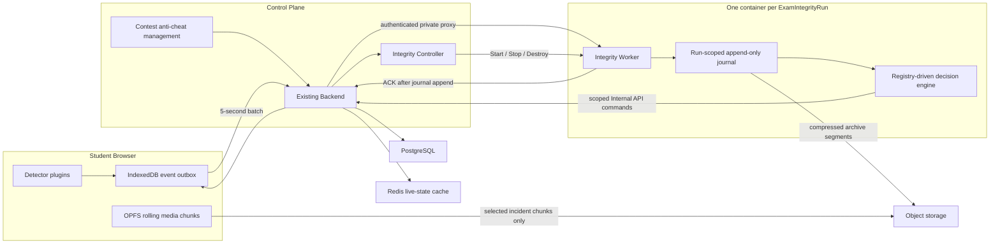

# Exam Integrity Worker 與事件證據架構設計

日期：2026-07-21

狀態：已核准，待實作計畫

範圍：QJudge paper exam anti-cheat frontend、Django Backend、Integrity Controller、每場考試獨立 Integrity Worker、Redis 與 object storage

## 1. 背景

目前防作弊流程由 frontend detector、直接事件 API、Redis heartbeat、Django service、Celery worker 與 Celery Beat 共同完成。Frontend 同時存在 on-trigger、grace timer、定時 heartbeat、screen/webcam health polling 與 evidence ring buffer；Backend 另外以 30 或 60 秒週期掃描 heartbeat timeout、locked participant 與 contest end。

這些責任能運作，但有幾個結構性問題：

1. 每場考試的判定工作分散在 browser、Backend request path 與全域 Celery 排程，無法形成單一可重播的事件判定上下文。
2. 全域週期性工作即使沒有進行中的考試仍常駐，且會反覆掃描資料庫。
3. 現行事件 taxonomy 分散在 frontend union、Backend constants、model choices、route 與 orchestrator。新增事件通常需要修改多個核心模組。
4. Redis heartbeat 是即時狀態，不是 durable raw event journal；目前 main Compose 未配置 Redis volume/AOF，dev 更明確關閉 persistence。
5. 現有 evidence 以本機影格與事件觸發上傳為主，無法完整呈現事件前後的連續畫面；若改為整場媒體上傳，則頻寬、object PUT 數量、隱私與保存成本過高。

本設計將每場考試的事件排序、判定、連線風險、incident grouping、evidence retention 與自動交卷計時集中到一個短生命週期 Integrity Worker。Worker 不是執行學生程式碼的 OJ judge，也不取代現有 code-judging Celery workers。

## 2. 目標

- 每場考試建立一個獨立 Integrity Worker container，最多以約 200 名考生為第一版容量基準。
- Worker 於考試前約一分鐘由管理員啟動，考試後由管理員決定 Stop、Destroy 與資料 Purge 時機。
- Frontend 將所有有意義的 detector signals 先 durable 寫入 IndexedDB，再每五秒以 batch 傳給現有 Backend。
- Backend 維持唯一 public authenticated gateway，但 raw batch 不落 PostgreSQL；Backend 將 batch 同步轉送至該場 Worker。
- Worker 將 batch append 到 run-scoped durable journal 後才 ACK，並持續壓縮封存至 object storage。
- Worker 不直接連 PostgreSQL；normalized event、participant state transition 與 auto-submit 全部透過 scoped Backend Internal API。
- 事件採 canonical registry/plugin model。新增使用既有 sensor、evidence 與 action 的事件時，不修改 transport、journal、controller、lifecycle 或 archive 核心。
- 只保存 incident 對應的 screen/webcam 片段，不保存或上傳整場原始影像。
- 保留 raw event journal、policy/registry snapshot 與版本資訊，支援未來 deterministic replay 與 AI assessment。
- 移除被新 Worker 取代的全域 anti-cheat Celery scans，但不影響程式碼判題、AI run 或錯誤監控 worker。

## 3. 非目標

- 不建立 OJ code-execution judge，也不更動 submission sandbox 架構。
- 第一版不設計 auto-submit fallback；Worker 未運作時由 health/UI 顯示，管理員人工恢復。
- 不保存整場 screen/webcam 原始影像。
- 不讓 AI assessment 覆寫 raw journal、normalized event 或人工決定。
- 不導入 Kafka、NATS、Redis Streams、Kubernetes、Nomad 或其他新的 durable scheduler/stream infrastructure。
- 不建立 contest-level rollout feature flag 或新舊 anti-cheat 雙軌模式；目前沒有 active exam，採直接切換。
- 不替每個事件種類建立資料表，也不把 registry 存成資料庫 row-per-definition。
- 第一版不建立 AI assessment table；只保留日後增加該層所需的 raw、normalized、evidence 與版本資料。

## 4. 已採用的整體拓撲



### 4.1 Student Browser

Browser 只負責可在 client 正確完成的工作：

- detector plugins 與 source-level sampling/edge detection；
- IndexedDB durable outbox；
- sequence、batch、retry 與 ACK；
- 每五秒的 state snapshot；
- OPFS screen/webcam rolling evidence buffer；
- 權限、恢復與警告 UI。

Browser 不負責：

- 跨事件語意去重；
- incident grouping；
- grace/recovery arbitration；
- risk priority；
- participant state transition；
- 自動交卷決策。

「raw signal」指 detector 已整理出的有意義狀態，不代表每一個 DOM callback 都要記錄。例如 resize observer 或 mouse event 仍需在 detector source 層採樣，避免產生無界事件量。

### 4.2 Existing Backend

Backend 是穩定的 public ingest gateway 與唯一 durable business-state writer：

- 驗證學生、contest、participant、exam session 與 request size；
- 解析 `run_id` 並將 batch 轉送到 private Worker endpoint；
- 只有收到 Worker durable ACK 後才回覆 browser ACK；
- 提供 Worker scoped Internal API；
- 執行既有 `ExamEvent`、participant transition、activity log 與 `finalize_submission` service；
- 發出 evidence presigned upload/download URL；
- 保存 Integrity Run、normalized event 與 retained evidence metadata；
- 將 Controller/Worker 狀態投影到既有 contest anti-cheat 管理頁。

Backend 不保存 raw batch payload，也不在 request path 重新實作 Worker 的判定邏輯。

### 4.3 Integrity Controller

Controller 是 Compose 中常駐的輕量 service，也是唯一可操作 per-exam Integrity Worker containers 的元件。Backend 不直接持有 Docker socket。

Controller 負責：

- `Start / Stop / Destroy` 冪等操作；
- Worker image allowlist 與 digest 記錄；
- run-scoped volume、private network、resource limits 與 container labels；
- run token secret mount；
- desired/observed container state reconciliation；
- RUNNING 期間程序退出時，以同一 run volume 自動重啟；
- 回報 endpoint、container ID、image digest、started/stopped time 與 health。

第一版不使用 Backend 直接操作 Docker，避免 Backend compromise 等同取得 host container control。也不導入 Kubernetes/Nomad，因為目前部署以 static Docker Compose 為主，且第一版規模不需要額外 orchestrator。

### 4.4 Integrity Worker

每個 Worker 只服務一個 `ExamIntegrityRun`，不開 public port，只能透過 private network 被 Backend 呼叫。它負責：

- batch schema/version 驗證；
- append-only journal 與 session sequence index；
- technical idempotency、out-of-order buffer 與 contiguous ACK；
- heartbeat/connectivity analysis；
- registry-driven incident grouping、grace/recovery、priority 與 action selection；
- evidence retain window 決定；
- scheduled auto-submit command；
- archive segment、hash chain 與 manifest；
- deterministic replay；
- processed/archive cursors 與 health/warnings。

Worker 不持有 Django ORM 或 global database credentials。它只透過 scoped Backend Internal API 改變正式業務資料。

## 5. Run、Health 與資料生命週期

### 5.1 Run lifecycle

對管理員只暴露以下狀態：

```text
STOPPED -> STARTING -> RUNNING -> STOPPING -> STOPPED -> DESTROYED
```

- `Start` 合併原先可能拆成 prepare/activate 的操作。管理員可在預定開始前一分鐘執行；Worker 啟動時已取得 scheduled start/end、policy 與 registry snapshot。
- `Stop` 合併 drain/archive。停止新 ingest 後，完成 in-flight processing、journal archive、manifest checksum 與 Backend cursor/status 回報，才能進入 STOPPED。
- `Destroy` 只移除 container；不刪 run volume、object archive 或 PostgreSQL metadata。只有 archive 完成且 manifest 驗證成功時才允許正常 Destroy。
- `DESTROYED` 是 terminal compute state。若仍預期離線考生補送，管理員應停留在 STOPPED，不應 Destroy。

到達 scheduled end 時，Worker 執行 auto-submit，但不自動 Stop；它繼續 RUNNING 接收可能的離線補送，直到管理員認為補送窗口足夠並手動 Stop。STOPPED 後仍可重新 Start 同一 Run 接收晚到資料。

RUNNING 期間 process 意外退出，Controller 可用相同 run volume 重啟並由 journal 重建 index。這是 runtime recovery，不是自動開始或結束考試。

### 5.2 Health

Health 只保留：

- `healthy`
- `unhealthy`

不建立 `degraded` 狀態。非致命問題以 `warnings[]` 表達，例如：

- `archive_lag_high`
- `object_storage_unavailable`
- `journal_capacity_near_limit`
- `token_expiring`
- `evidence_upload_failure_rate_high`

只有 Worker 無法繼續接收或處理 batch 才是 `unhealthy`。單一學生拒絕 webcam、screen recording 中斷或 evidence unavailable 是 participant/incident 狀態，不影響整場 Worker health。

### 5.3 Data lifecycle

資料狀態保持簡單：

```text
OPEN -> ARCHIVED -> PURGED
```

- `OPEN`：Worker 正在接收，或仍可能被重新 Start 以接收離線補送。
- `ARCHIVED`：目前所有 server-known journal segments 已上傳、manifest 已驗證。
- `PURGED`：管理員明確執行資料刪除。

若 STOPPED/ARCHIVED 的 run 因晚到資料而再次 Start，data state 暫時回到 OPEN，產生新的 archive generation/delta segments；再次 Stop 後重建並驗證新 manifest，再回到 ARCHIVED。

Purge 與 Destroy 完全分離。Purge 必須有專屬權限、二次確認與 audit log，並刪除 run volume、raw archives、retained evidence 與未來 AI derivatives；保留不可還原的最小刪除稽核紀錄。

第一版 retention policy 為 `manual`，不設定自動保存期限。

## 6. Frontend event outbox 與 batch protocol

### 6.1 Write-before-send

每個 event 必須先成功寫入 IndexedDB，才能進入傳輸流程。`seq` 只在 IndexedDB transaction commit 時分配，因此 client 不會因預先分配後寫入失敗而製造刻意缺口。

每個 event 至少包含：

- `event_id`：全域唯一 idempotency identifier；
- `exam_session_id`；
- `device_session_id`；
- `seq`：同一 device session 單調遞增；
- `occurred_at_client_ms`：client wall-clock；
- `monotonic_ms`：同一 page/runtime 的 monotonic clock；
- `event_type`；
- `event_schema_version`；
- `registry_version`；
- `payload` / `metadata`。

每五秒產生的 `state_snapshot` 也是 sequenced outbox record。即使該窗口沒有其他 detector signal，它仍會取得序號並參與相同 ACK，讓 batch arrival、snapshot history 與 reconnect backlog 使用單一連續序列，不需要第二套 heartbeat sequence。

每五秒建立一個 batch。Batch 至少包含：

- `batch_id`；
- `run_id`；
- `exam_session_id`；
- `device_session_id`；
- `first_seq` / `last_seq`；
- `events[]`；
- `state_snapshot`；
- 自上次 ACK 後新增、尚未確認的 evidence chunk descriptors；
- client build/registry version。

Batch 首次送出時即固定 `batch_id` 與範圍；timeout/retry 必須重送同一 batch，不因重試建立新 identity。Reconnect backlog 以有上限的 chunks 分段送出，不送一個無界巨型 request。

### 6.2 ACK semantics

Backend 只有在 Worker 完成以下操作後才 ACK：

1. 驗證 run/token/schema 基本條件；
2. journal append 成功；
3. session sequence index 已能計算最高連續序號。

第一版 response 只需要：

```json
{
  "acked_through_seq": 123,
  "pending_commands": [],
  "release_evidence_before_ms": 0
}
```

不提供 `missing_ranges`。Frontend 只刪除 `seq <= acked_through_seq` 的 IndexedDB rows；較新的 rows 一律保留等待下次 retry。Delivery semantics 為 at-least-once，Worker 以 `device_session_id + seq + event_id` 做 technical idempotency。

Frontend 不提供 P0 immediate transport。`pagehide`、reconnect、exam-end 可為可靠性提早 flush，但不改變事件 priority 或繞過同一 outbox/ACK protocol。

### 6.3 Worker unavailable semantics

本設計明確接受以下 trade-off，以換取不在 PostgreSQL 建立高流量 batch inbox：

- Worker 未 Start、正在 STOPPING、已 Stop/Destroy、private route 不可達或 append 未完成時，Backend 不 ACK。
- Browser 保留 IndexedDB rows，等 Worker 恢復後重送。
- 若考試後才恢復網路，管理員必須在 Destroy 前保持或重新 Start Worker，才能接收晚到資料。
- Browser/device 永遠未再次連線時，離線期間資料無法被 server 取得；任何 server architecture 都無法在 client offline 時消除此限制。
- 若整台 Worker host 與 run volume 在 archive 前同時永久毀損，最近尚未上傳的 segments 可能遺失。第一版接受此 infrastructure risk，不另建 PostgreSQL/Kafka fallback。

## 7. 時間與晚到事件

Backend/Worker 額外記錄：

- `received_at_server`
- `processed_at_worker`

四種時間用途不得混用：

- heartbeat/connectivity 只依 Backend/Worker 實際收到 batch 的 server time，不相信 client wall-clock；
- evidence anchor 使用經校正的 client event time，並保留 receipt delay；
- ordering 優先使用 device session sequence 與 monotonic delta；
- client wall-clock 只作事件顯示、cross-source alignment 與異常偵測。

晚到事件規則：

- 永遠保留，標記 `delayed_delivery=true`；
- 可補入 audit、raw archive 與 evidence link；
- 不抹除已經觀察到的 connection gap；
- 不回溯修改 participant 的當時狀態；
- participant 已 submitted 後的晚到事件只作 audit，不重新打開或回滾 submission；
- 明顯 clock jump、逆序或 client/server offset 異常產生 `clock_integrity_degraded` signal。

## 8. Canonical Event Definition Registry

Registry 是第一級 domain contract，核心模組不得以 event type 建立逐項 `if/switch`。

每個 event definition 至少描述：

- canonical id 與 schema version；
- triggered/escalated/restored signals；
- emission policy：`every`、`edge`、`sample` 或 `state_snapshot`；
- timing/grace/recovery config；
- incident family、category 與 priority；
- evidence mode、source requirements 與 before/after window；
- continuation/grouping rules；
- normalized action/command mapping；
- payload JSON schema；
- i18n/icon metadata key。

每個 `ExamIntegrityRun` 保存完整 policy snapshot、registry snapshot/version 與 Worker image digest。Replay 必須使用原始 snapshot，不使用系統當下最新版。

新增使用既有 sensor/evidence/action 的監控事件時，完整生命週期只新增：

1. detector plugin；
2. event definition；
3. metadata JSON schema；
4. i18n/icon；
5. tests。

不得修改：

- IndexedDB outbox；
- batch/ACK protocol；
- Backend proxy；
- journal/archive；
- Controller/Worker lifecycle；
- Internal API adapter；
- evidence uploader core。

只有真正新增 sensor、evidence source 或 business action 時，才新增對應 adapter。

既有 `ExamEvent.event_type` 的 Django `choices` 不再作 canonical registry，避免每次新增 event 都產生 model/migration 修改。Backend Internal API 以該 Run snapshot 驗證 canonical event id；未知 event 仍先保存在 raw journal，並以 warning/unsupported result 處理，不丟失原始資料。

## 9. Worker journal 與 archive

### 9.1 Run volume

每個 run 取得獨立 named volume。Journal 採 append-only segments，至少包含：

- segment sequence；
- batch/event records；
- per-record checksum；
- previous segment hash；
- opened/closed time；
- registry/policy/worker version；
- processed cursor；
- archive status。

實作可選 JSONL/length-prefixed records，但必須能偵測 partial trailing write、重建 session cursor、驗證 hash chain 並 deterministic replay。ACK 必須發生在 record 已完成 durable append 之後，而不是只進入 process memory queue；可使用短時間 group commit，但同一 group 必須完成 flush/fsync 才能回覆其中任何 request。

### 9.2 Archive segments

Worker 不為每個五秒 batch 建立 object。它依時間或大小旋轉，例如每分鐘或 8–16 MB，產生壓縮 segment（如 `jsonl.gz`）與 checksum，再透過 Backend 簽發的 run-scoped presigned URL 上傳 object storage。

Manifest 至少記錄：

- run/contest id；
- archive generation；
- segment list、range、size 與 checksum；
- final session cursors；
- raw/normalized counts；
- policy/registry snapshot checksum；
- Worker image digest/version；
- created/verified time；
- previous manifest hash（若為 delta generation）。

Object upload、checksum 與 manifest 驗證完成前，不得刪除本機 segment。Destroy 不刪 run volume；Purge 才刪除。

### 9.3 Replay

Replay 輸入為 raw archive、policy snapshot、registry snapshot 與 Worker version。相同輸入必須產生相同 normalized result。AI assessment 是 replay 後的額外衍生層，不修改 raw archive、normalized event 或原始 manifest。

## 10. Incident-only evidence

### 10.1 Source policy

Screen/webcam 是否啟用完全沿用 contest anti-cheat policy，並在 Run Start 時凍結：

- 只啟用 screen：只建立 screen recorder/buffer；
- 只啟用 webcam：只建立 webcam recorder/buffer；
- 兩者啟用：分開錄製、共享 recording epoch，歸屬同一 incident；
- 未啟用：不要求權限、不錄製、不產生 descriptor；
- 已啟用但權限拒絕或中斷：產生 `evidence_source_degraded`，incident evidence 標記 partial/unavailable。

Run 啟動後 policy 不動態改變；管理員修改只影響下一個 Integrity Run。如此可確保同場學生規則一致，並能重播原始判定。

### 10.2 Local rolling chunks

Browser 使用獨立 MediaRecorder sessions，將 screen/webcam 片段寫入 OPFS；IndexedDB 只保存 descriptors 與 retention/upload state。第一版不在 client mux 兩個來源。

預設參數：

| Source | Target resolution | FPS | Target bitrate |
| --- | --- | --- | --- |
| Screen | 1280×720 | 5 | 約 800 Kbps |
| Webcam | 640×480 | 10 | 約 350 Kbps |

- 每五秒形成 logical chunk；
- codec 不寫死，依 browser MediaRecorder capability negotiation；
- descriptor 記錄實際 MIME、resolution、FPS、bitrate、recording session/epoch；
- 必須記錄初始化片段/codec metadata，使 retained contiguous sequence 可解碼；
- descriptor 包含 `chunk_id`、source、seq、start/end、byte size、SHA-256、previous hash 與 local availability；
- 本機至少維持最近 60 秒；
- safety cap 為每來源五分鐘或 100 MB；超過時產生 `evidence_buffer_degraded`。

上述 target 是 policy default，不保證所有 browser/device 都能完全達成；實際錄製能力必須回報。

### 10.3 Retain and upload

事件 batch 只攜帶 chunk descriptors/hashes，不攜帶 media bytes。Worker 建立 incident 後，預設要求保留事件前 10 秒至後 10 秒；重疊 windows 合併，長時間持續事件每 60 秒切段。

`retain_evidence` 不需要獨立 `ExamIntegrityCommand` table：

- Worker 經 Internal API 建立 normalized `ExamEvent`，其中保存 evidence window 與 source requirements；
- Backend/Worker batch response 將尚未完成 evidence 的 events 投影為 `pending_commands`；
- response 遺失時，下一次 batch/poll 會重新產生相同 retain command；
- 完成狀態由 `ExamEvidenceChunk` 判斷，不依賴一次性 queue message。

Browser 收到命令後向 Backend 申請嚴格綁定 chunk/source/hash/size/path 的 presigned URL，直接 PUT object storage，再回報 manifest。Media bytes 永遠不經 Backend 或 Worker proxy。

Frontend 只有在以下條件全部成立時才能刪除本機 chunk：

- chunk 早於 `release_evidence_before_ms`；
- 沒有 pending retain；
- 若被要求保留，upload 已完成且 hash 已驗證；
- 對應 event batch 已 ACK。

Incident evidence 狀態為：

- `pending`
- `complete`
- `partial`
- `unavailable`

Browser 關閉、使用者清除 storage 或裝置永不恢復網路時，evidence 可能 partial/unavailable；raw event 仍保留。未被選中的 media 不離開裝置，release watermark 通過後刪除。

此方案明確接受：未來 AI 只能分析 retained incident clips，不能從已刪除的整場影像發現全新視覺事件。

## 11. PostgreSQL 與 Redis

### 11.1 新增資料表

第一版只新增兩張表。

#### `ExamIntegrityRun`

至少保存：

- contest relation；
- run UUID；
- compute/data/health state；
- warnings/last error；
- desired/observed container identity；
- scheduled/start/stop/destroy times；
- policy snapshot；
- registry snapshot/version；
- Worker image/digest/version；
- run token hash/expiry/revoked time；
- journal/archive generation、manifest object key/hash；
- aggregate received/processed/archived cursors/counts；
- last Worker heartbeat；
- manual retention/Purge audit fields。

#### `ExamEvidenceChunk`

只在 chunk 被要求/上傳時建立，至少保存：

- run、contest、participant/user、normalized `ExamEvent` relation；
- incident id/evidence cluster id；
- source（screen/webcam）；
- recording session、chunk seq、start/end；
- object key、content type、codec、byte size；
- SHA-256、previous hash；
- status、requested/uploaded/verified time；
- actual capture metadata。

### 11.2 既有資料表調整

- `ExamEvent` 繼續保存 normalized event/incident，新增 nullable `integrity_run`、stable `incident_id`、canonical definition/schema version、client occurred time、server received time、Worker processed time與 delayed-delivery marker。
- `ExamEvent.event_type` 不再以 hard-coded Django choices 作 registry source。
- `ExamEvidenceFrame` 保留目前 WebP frame/attendance 用途，不硬塞五秒影音 chunk，避免破壞既有 evidence 與 attendance workflow。
- 不建立 `ExamIntegrityEventBatch`、`ExamIntegrityClientSession` 或 `ExamIntegrityCommand`。
- 不進行歷史 event/evidence backfill；既有 rows 繼續由現有 dashboard/query 顯示。

### 11.3 Redis responsibility

Redis 只保存遺失後可重建的 hot state：

- participant last batch/online status；
- session cursor cache；
- live risk/dashboard counters；
- Controller/Worker health cache；
- distributed locks；
- new-batch/command notification。

Redis 不作以下資料的唯一來源：

- ACKed raw batch；
- policy/registry snapshot；
- normalized event；
- evidence metadata；
- archive manifest；
- run credential/audit state。

## 12. Backend Internal API 與 thin adapter

Worker 是獨立 process，不能直接呼叫 Django Python service；thin adapter 的目的，是在不給 Worker database/admin credential 的前提下重用現有 business invariants、transaction、audit 與 idempotency。

第一版優先提供單一 batch command endpoint，例如：

```text
POST /internal/integrity/runs/{run_id}/commands/
```

Commands 可包含：

- `record_event`
- `auto_submit`
- `update_run_checkpoint`
- `publish_archive_manifest`

每個 command 必須有 idempotency key。Adapter 驗證 token scope、run/contest/participant ownership、registry version 與 command schema，再 dispatch 到既有 service。它不得複製 submission finalization 或 participant transaction 邏輯。

`record_event` 可呼叫既有 normalized event/participant state service；`auto_submit` 必須呼叫既有 `finalize_submission`。Worker 不以 user/admin 身份 impersonate，也不直接更新資料表。

## 13. Security boundary

### 13.1 Identity

- Browser 沿用現有 student authentication 與 contest/exam session authorization。
- Controller 使用獨立 service identity，只能操作 Integrity lifecycle API。
- 每個 Worker 使用隨機 per-run opaque token；Backend 只保存 hash。
- Token scope 僅允許自己的 run 讀寫 commands/checkpoints/archive metadata。
- Token 透過唯讀 secret mount 提供，不放進 image 或 command line。
- Token expiry 依 scheduled end 加緩衝；完成 Stop 後撤銷，重新 Start 時簽發新 token；Destroy 時終止並撤銷所有 run credentials。

### 13.2 Container/network

- Worker 非 root、read-only root filesystem、禁止 privileged；可寫路徑只限 run volume/tmpfs。
- Worker 無 public ingress，只允許 Backend private network 呼叫。
- Egress 僅允許 Backend Internal API 與由 Backend 授權的 object storage endpoints。
- Controller 獨占 Docker socket；Backend 移除 Docker socket mount。
- Controller 只允許 allowlisted image/digest、resource limits、labels、networks 與 mounts，不接受任意 Docker arguments。

### 13.3 Evidence and administration

- Presigned upload URL 綁定 participant、run、chunk id、source、content length、MIME、hash 與 immutable object path。
- Start、Stop、Destroy、evidence view/download、Purge 都留下 audit log。
- Internal/public ingest 設定 request size、rate limit、schema limit 與 correlation id。
- Logs 不記錄 token、media bytes 或完整敏感 payload。

## 14. Auto-submit 與既有 Celery 工作

Worker 依 scheduled end 與 Run policy 產生 idempotent `auto_submit` commands，Backend adapter 使用現有 `finalize_submission`。第一版不保留 Celery auto-submit fallback；Worker 不健康時由管理頁顯示並由管理員處理。

以下現有 contest Celery tasks 由 Worker 取代並下線：

- `check_contest_end`
- `auto_submit_participants`
- `check_force_submit_locked`
- `force_submit_locked_participant`
- `check_heartbeat_timeout`

同步移除三個 Beat entries：

- `check-contest-end-every-minute`
- `check-force-submit-locked-every-30-seconds`
- `check-heartbeat-timeout-every-30-seconds`

現有 transaction/service logic 若仍需要，應移出 `tasks.py` 並由 Backend Internal API adapter 重用，不把 ORM 邏輯搬進 Worker。

不得下線以下 containers：

- `celery-high`：contest code submissions；
- `celery`：practice submissions 與 AI durable runs；
- `celery-beat`：仍需執行 `sweep_stale_ai_runs`；
- `judge-image`：code-judging sandbox；
- `ai-service`；
- `glitchtip-worker`。

`celery-high` 應只監聽 `high_priority`，不再同時消費 `default`，維持 contest submission priority isolation。Celery code-judging workers 繼續持有自己的 Docker socket；Backend socket 移交 Controller。

## 15. 管理頁與 observability

第一版直接整合到現有 contest anti-cheat management page，不建立全域 Integrity dashboard。

管理員可見：

- Run lifecycle、health、data state；
- Worker image/digest、registry/policy version；
- started/stopped time、last Worker heartbeat；
- active/last-seen participant counts；
- incoming batch rate；
- journal unarchived bytes、oldest record age、archive lag；
- normalized incident counts；
- evidence pending/complete/partial/unavailable counts；
- warnings、last error 與 correlation id；
- Start/Stop/Destroy/Purge actions 與 guard reason。

Participant connectivity 使用 server receipt time。Threshold 屬於 registry/policy，例如預設 15 秒進入 suspect、60 秒視為 disconnected，而不是寫死在核心 transport。

## 16. Failure/error semantics

### 16.1 Browser/backend/worker path

- Backend timeout 或 Worker unavailable：不 ACK，Browser retry。
- duplicate batch/event：journal technical idempotency，normalized command亦使用 idempotency key。
- out-of-order：先保存但只推進 contiguous ACK；不需要回傳 missing ranges。
- malformed/oversized batch：拒絕且不 ACK，回傳可觀察的 schema/error code；Frontend 不得無限快速重試同一不可修復 payload。
- registry mismatch/unknown event：raw journal 保留，產生 warning；已知部分仍可處理。

### 16.2 Journal/archive

- partial trailing write：啟動時截斷至最後一個 checksum-valid record。
- object storage 暫時不可用：journal 繼續接收並產生 warning；接近容量上限時 warning，無法再寫入才 unhealthy/no ACK。
- Stop archive 失敗：保持 STOPPING，不允許正常 Destroy。
- manifest checksum 不一致：unhealthy，保留 local segments，禁止 Purge/Destroy guard 通過。

### 16.3 Evidence

- 權限拒絕、錄製中斷、storage quota、browser close 或 upload failure：incident evidence partial/unavailable，不丟棄 raw event。
- retain response 遺失：由 normalized event projection 重新產生命令。
- hash/size/MIME 不符：object 不標記 verified，不釋放本機 chunk。

## 17. Capacity 與成本基準

200 名考生、每五秒一個 batch：約為：

- 40 batch requests/sec；
- 2,400 batches/min；
- 144,000 batches/hour；
- 兩小時約 288,000 batches。

Raw batches 寫入 per-run journal 並合併成 archive segments，不形成 PostgreSQL rows 或每 batch object PUT。

Evidence 預設 bitrate 約為 screen 800 Kbps + webcam 350 Kbps。兩個來源本機錄製五分鐘通常約 40–50 MB，仍以每來源 100 MB safety cap 為準。只有 retained incident windows 上傳，因此 server-side media 成本隨事件數量成長，而不是隨整場考試時長乘學生人數成長。

## 18. 模組邊界

### 18.1 Frontend

遵守 `features -> shared/core/infrastructure`：

- contest/exam anti-cheat feature 組裝 detectors、policy、UI 與 workflow；
- generic IndexedDB outbox、batch transport、OPFS/media storage adapter 放在 infrastructure/shared 適當邊界；
- canonical event types/schema 與純 sequence/window logic 放在 core；
- core 不 import browser API、HTTP client、React 或 feature implementation；
- detector plugin 不能繞過 outbox 直接 POST event。

### 18.2 Backend

- contest/exam feature 擁有 `ExamIntegrityRun`、`ExamEvidenceChunk` 與 business adapter；
- Docker/container I/O 只存在 Controller infrastructure boundary；
- object storage、Redis、HTTP client 是 infrastructure adapters；
- participant/submission invariants 仍由既有 domain services 擁有；
- Internal API view 只驗證/dispatch，不重新實作 transaction logic。

### 18.3 Worker

- pure registry/incident/replay engine 不 import HTTP、Docker、filesystem 或 object-storage SDK；
- journal、Backend client、archive uploader、clock 是 ports/adapters；
- run composition root 注入 snapshot、ports 與 scoped credential；
- 新 event definition 不得 import Controller/Backend implementation。

## 19. 直接導入與 migration

目前沒有 active exam，因此不建立 feature flag、shadow mode 或雙軌 ownership。部署時直接切換：

1. 新增 Django schema 與 Internal API；
2. 部署 Controller、Worker image 與 object-storage archive support；
3. 部署 Backend public batch proxy 與管理操作；
4. 部署 frontend IndexedDB batch transport、registry plugins 與 OPFS evidence；
5. 移除舊 frontend direct anti-cheat event/heartbeat 主路徑；
6. 移除三個 anti-cheat Beat entries 與五個已取代 tasks；
7. 以測試考試完成 Start、batch、incident、evidence、auto-submit、Stop、Archive、Destroy 全流程驗證後開放正式考試。

歷史 `ExamEvent`/`ExamEvidenceFrame` 不 backfill、不刪除。Attendance、manual proctor note 與其他非 detector workflow 仍沿用既有 Backend services/endpoints。新舊 frontend 不需要同時參與同一場 active exam。

## 20. 測試與發布門檻

### 20.1 Frontend

- event 必須先 commit IndexedDB 才能分配 seq/送出；
- page refresh、browser restart、offline/reconnect 後 queue 完整；
- ACK 只刪除 `seq <= acked_through_seq`；
- timeout 重送同一 batch identity；
- reconnect backlog 使用 bounded chunks；
- screen/webcam policy disabled 時不要求權限、不啟動 recorder；
- enabled source 產生 5 秒 descriptors、hash chain 與 shared epoch；
- retain/release watermark 不會提前刪除待上傳 evidence；
- quota/permission/recorder failure 產生 degraded evidence signal。

### 20.2 Worker/core

- duplicate/out-of-order/sequence gap 的 contiguous ACK；
- journal partial write recovery 與 cursor rebuild；
- deterministic replay；
- event-time、late-delivery、submitted-after-late semantics；
- registry grace/recovery/grouping/priority；
- archive rotation、checksum、hash chain、manifest generations；
- Stop guard 與 Destroy guard；
- scoped token/run isolation；
- 加入一個測試 event plugin 時，transport/journal/controller/lifecycle/archive 核心零修改。

### 20.3 Backend/controller/integration

- Backend 未收到 Worker durable ACK 時不得 ACK browser；
- per-run routing 與 cross-run authorization rejection；
- Internal API command idempotency、scope 與既有 service transaction；
- auto-submit 只執行一次並使用 `finalize_submission`；
- Controller Start/Stop/Destroy 冪等、allowlist、limits、network/volume/secret mounts；
- Worker process restart 使用同一 volume 恢復；
- evidence presigned URL 約束、PUT confirm 與 hash verification；
- retain response 遺失後可重新投影命令；
- Purge 權限、二次確認與 audit。

### 20.4 Load/failure acceptance

- 200 名模擬考生每五秒送一次，持續至少一小時；
- 40 batches/sec 下 ACK p95 < 500 ms；
- 所有 ACKed batches 都存在 journal 或 verified archive；
- duplicate retry 不產生重複 normalized event；
- 200 人同時 reconnect 時 request size 有界且可逐步 catch up；
- Worker unavailable 時 Backend 不 ACK，恢復後可補送；
- Stop 完成 processing/archive/checksum，未完成時禁止 Destroy；
- 相同 raw archive + registry/policy snapshot replay 產生相同 normalized output；
- 只上傳被 incident 選中的 screen/webcam chunks，未選中媒體不離開裝置。

## 21. 不變條件

實作與 review 必須持續保證：

1. Browser 未收到 durable ACK 前不刪事件。
2. Backend 不把 raw batch 當永久 PostgreSQL domain row。
3. Worker 不直接連 PostgreSQL。
4. Redis 遺失不造成 ACKed raw journal、normalized event、archive manifest 或 evidence metadata 遺失。
5. Container Destroy 不等於資料刪除。
6. 未被 incident 選中的原始媒體不離開學生裝置。
7. 晚到事件不回溯 participant/submission state。
8. 同一 Run 永遠使用啟動時凍結的 policy/registry snapshot。
9. 新增一般事件 plugin 不改動核心 transport/lifecycle/archive。
10. Auto-submit 只有 Integrity Worker 一個 owner，第一版無 fallback。
