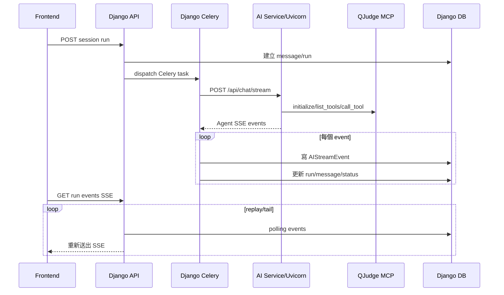
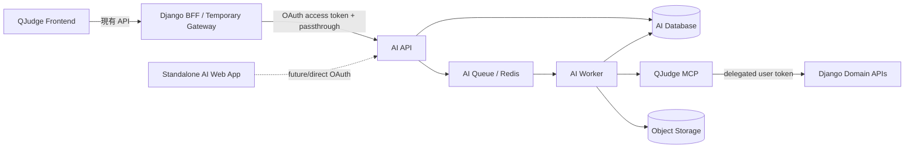
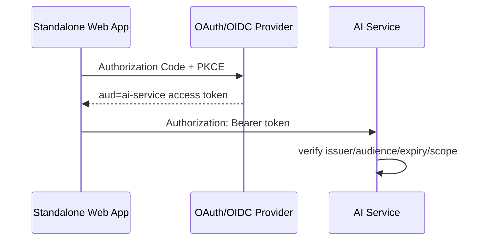
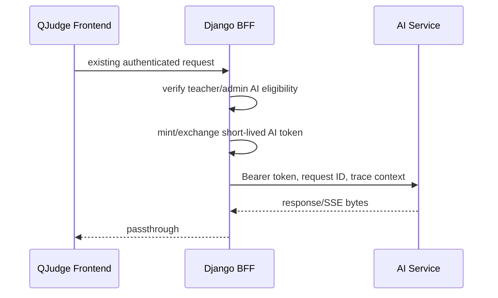

# AI Service 獨立化與資料 Ownership 設計

日期：2026-08-04
狀態：已確認設計；2026-08-04 修訂 usage 範圍
目標分支：`dev`

## 1. 摘要

QJudge 目前已將 Agent、LangGraph checkpoint 與 MCP client 放在 `ai-service`，但聊天資料與 durable run orchestration 仍由 Django 管理。一次 AI run 會同時經過 Django Celery runtime 與 AI Service runtime：AI Service 產生 SSE，Django Celery 再解析、重新編號、持久化，最後由 Django 透過另一條 SSE 傳給 frontend。兩套 runtime 必須持續同步 run status、message、event、HITL 與 checkpoint，導致取消、恢復與 terminal-state reconciliation 複雜化。

本設計採 boundaries-first：

- 暫不建立獨立 API Gateway。
- Django 暫時保留 BFF／Gateway 角色。
- AI Service 成為 AI domain 的唯一 owner。
- AI session、message、run、event、artifact metadata 與 checkpoint 移入獨立 AI database；Run 只記錄 input／output token usage，不建立 cost、credit 或 usage ledger。
- AI API 與 AI Worker 共用同一套 application services，不再由 Django Celery 轉送與解讀 Agent stream。
- 每次會啟動或恢復 Agent 的操作都必須先具備可用 MCP；MCP 失敗視為 AI run 能力失敗，不提供無工具降級模式。
- 系統仍在 beta，既有 AI 資料直接清除，不設計 dual-write、CDC 或正式資料遷移。

這個階段完成後，系統屬於以 bounded context 劃分的 service-based architecture；AI bounded context 已具備微服務所需的資料與部署自治。獨立 Gateway 留到 frontend 或第三方 client 真正需要同時存取多個 public resource server 時再導入。

## 2. 現況與問題

### 2.1 現有元件

| 元件 | 現有責任 |
| --- | --- |
| Django `backend/apps/ai` | session/message/run/event/artifact/credit models、API、Celery orchestration、SSE replay、取消與 stale-run recovery；既有 cost／credit 為待退場 legacy |
| Django Celery worker | 讀取 `AIChatRun`、呼叫 AI Service、解析上游 SSE、更新 Django models |
| AI Service Uvicorn process | DeepAgent／LangGraph 執行、checkpoint、MCP connection、tool execution、HITL、原始 SSE |
| QJudge MCP | OAuth token 驗證、QJudge tools、向 Django domain API 轉交使用者 token |
| Frontend Copilot transport | 呼叫 Django `/api/v1/ai/*`，訂閱 Django SSE |

主要程式位置：

- `backend/apps/ai/models.py`
- `backend/apps/ai/tasks.py`
- `backend/apps/ai/services/run_runtime.py`
- `backend/apps/ai/views.py`
- `ai-service/services/deepagent_runner.py`
- `ai-service/services/mcp_tool_provider.py`
- `mcp-server/server.py`

### 2.2 現有 run 資料流



LLM 只執行一次，但同一個 run 有兩個控制者：

1. Django runtime 管理 `AIChatRun.status`、message、event sequence、queue、cancel 與 usage。
2. AI Service runtime 管理 LangGraph thread、checkpoint、tool call、MCP、approval 與 ask-user interrupt。

兩邊不在同一個 transaction，只能依賴 SSE 對齊。現有程式因此需要處理：

- event 已寫入但 run status 尚未更新；
- terminal／paused event 與 Django status 不一致；
- Celery task 已取消但 checkpoint 仍留有未完成 tool call；
- stream 中斷後的 terminal-state reconciliation；
- stale Celery pickup 與 checkpoint repair。

### 2.3 架構分類

現況較接近 Django-centered 的 service-based architecture，亦可視為 distributed monolith 的早期變型：服務已有獨立 process，但資料 ownership、身份鏈與 durable workflow 仍由 Django 統籌。

目前已有的基礎：

- Docker service 邊界；
- backend OpenAPI、AI Pydantic schema 與 MCP tool schema；
- LangGraph checkpoint；
- persisted stream event replay；
- Integrity subsystem 的 retry／outbox 經驗；
- Django request ID、Sentry 與基礎設施 metrics。

仍待補齊的微服務準則：

- database per service；
- AI Service 的 OAuth resource-server 身份；
- workload identity；
- 獨立 AI API／worker deployment lifecycle；
- consumer contract governance；
- 跨服務 trace context 與 service-level SLI；
- 一致的 idempotency、timeout 與 retry policy。

## 3. 設計目標

### 3.1 必須達成

1. AI Service 是 session、message、run、event、token usage、artifact metadata 與 checkpoint 的唯一 owner。
2. Django 不直接讀寫 AI database。
3. AI Service 不直接讀取 Django database 或 Django user model。
4. AI API 與 AI Worker 可獨立於 Django 部署、擴縮與 migration。
5. frontend 經 Django BFF 時維持現有使用者行為與 Copilot transport contract。
6. standalone AI Web App 可使用 OAuth 2.1／OIDC access token 呼叫 AI Service。
7. QJudge domain operation 一律透過 QJudge MCP／Backend API，並以原使用者身份做最終權限檢查。
8. MCP 是 run operations 的必要依賴；MCP 不可用時不呼叫 LLM。
9. session/history 等 persistence API 不因 MCP 故障而失效。
10. 移除 Django Celery 對 Agent SSE 的解析、持久化與重新串流。

### 3.2 不在本階段

- 建立 Kong、Traefik 或其他獨立 Gateway；
- 將 frontend 改成直接呼叫 AI Service；
- 拆分 Django 內其他 bounded contexts；
- Kafka、通用 event bus、service mesh 或 Saga framework；
- 既有 beta AI 資料遷移；
- dual-write、CDC 或跨 DB foreign key；
- 無 MCP 的純 AI 降級模式；
- domain data 的自動清除、封存、retention TTL、資料壓縮與容量 quota；
- 建立正式 npm package。

## 4. 目標架構



### 4.1 Django BFF／Gateway

Django 暫時負責：

- 接受既有 frontend API；
- 驗證 QJudge 使用者與教師／管理員 AI 使用資格；
- 取得或交換 `aud=ai-service`、包含 `ai:chat` scope 的短效 token；
- 將 HTTP request、response、SSE bytes、request ID 與 trace context 原樣轉送；
- 保持既有 Copilot chat contract；legacy `/sessions/credit/` 不保留，管理介面改用 `/api/v1/ai/usage/`。

Django 不再負責：

- 建立或更新 AI domain models；
- dispatch AI Celery tasks；
- 解讀 Agent events；
- 重新編 event sequence；
- 聚合 assistant message；
- 管理 AI run state machine；
- 收集或彙總 AI token usage；
- 修復 LangGraph checkpoint。

Gateway 是 protocol adapter，不是第二個 AI runtime。SSE proxy 不得解析或改寫 `agent_message_delta`、`awaiting_user_answer`、`tool_call_started` 等 domain events。

### 4.2 AI API

AI API 負責：

- OAuth resource-server authentication；
- session/message/run/artifact REST API；
- session ownership 與 scope enforcement；
- idempotent run command acceptance；
- enqueue run command；
- persisted event replay／tail SSE；
- read-only health、model 與 diagnostics endpoints。

AI API 不在 request process 執行長時間 Agent workflow。

### 4.3 AI Worker

AI Worker 負責：

- 原子 claim queued run；
- 同 session run serialization；
- execute／resume／answer；
- MCP credential check／exchange；
- MCP initialize、tool discovery 與 tool execution；
- DeepAgent／LangGraph execution；
- checkpoint；
- event/message/run persistence；
- input／output token usage capture；
- cancel／repair；
- stale-run recovery 與下一個 queued run dispatch。

AI Worker 直接呼叫共用 application service 與 `DeepAgentRunner`，不得透過 HTTP 回呼同一個 AI API。

### 4.4 QJudge MCP

現有 Streamable HTTP MCP、tool definitions 與 Django token passthrough 可沿用。QJudge MCP 保持 QJudge-specific integration，不搬入 AI domain。

需補強：

- 驗證 issuer、audience、expiry 與 scope；
- 保留 Django domain API 的 resource-level permission checks；
- 明確區分 MCP OAuth access token 與 service internal credential；
- 提供穩定的 tool schema contract tests。

## 5. 資料 Ownership

### 5.1 AI Database

AI Service 只為需要被 API 單獨定位的 aggregate 建立全域 UUID。子資料使用父 aggregate ID 加序號，不再為每筆資料產生另一個 UUID。

| 資料 | Primary key／managed key | 必要性 |
| --- | --- | --- |
| Session | `session_id` UUID | URL、search param、ownership check 與 LangGraph thread |
| Run | `run_id` UUID | SSE、cancel、resume、Worker claim 與 task dispatch |
| Artifact Metadata | `artifact_id` UUID | UI 開啟、下載與存取權限檢查 |
| Message | `(session_id, ordinal)` | Message 只在 Session 內排序與定位，不需要全域 UUID |
| Stream Event | `(run_id, sequence)` | Event 只在 Run 內 replay，不需要 event ID |
| LangGraph Checkpoint | LangGraph managed schema | 使用 `session_id` 作為 thread ID；不建立第二份 domain mapping |

AI domain 對外只有三種全域 UUID：`session_id`、`run_id`、`artifact_id`。每個概念只有一個 authoritative ID：

- `session_id` 直接作為 LangGraph `thread_id`，資料表不保存另一個 `thread_id`。
- `run_id` 直接作為 Celery task ID，資料表不保存 `external_run_id` 或 `celery_task_id`。
- Message API ID 由 `session_id + ordinal` 表示；frontend transport 可將兩者組成穩定字串供 UI 更新，不新增資料欄位。
- Artifact storage key 由 `session_id + artifact_id` 推導，不保存任意 object key。
- `tool_call_id` 只存在 event payload；`request_id` 與 `trace_id` 只存在 observability context。
- `Idempotency-Key` 是 Run 上的普通欄位，以 `(session_id, idempotency_key)` 建立 unique constraint，不是另一個 entity 或 PK。

關聯欄位也只保留無法推導的資料：

- Session 是唯一保存 `owner_issuer`、`owner_subject` 的 aggregate；Run、Message、Event 與 Artifact 不重複保存 owner。
- Run 保存必要的 `session_id` foreign key，不保存 user／owner foreign key。
- Message 保存 `session_id` 與可為空的 `run_id`；Run 不反向保存 `user_message_id` 或 `assistant_message_id`。
- Artifact 保存 `session_id` 與可為空的 `produced_by_run_id`，以支援使用者先上傳、之後才啟動 run 的情境。
- Event 只保存 `run_id`；其 Session 與 owner 一律經 Run 推導。

本階段不建立下列表格：

- Execution Log：run diagnostics、tool usage 與錯誤送 structured logging／Sentry；必要摘要放在 Run。
- Usage Ledger：不建立。Run 只保存 `input_tokens` 與 `output_tokens` 的最終絕對值；request／run count 由 Run rows 聚合，不另存 counter。
- Cost／Credit：不保存 `cost_cents`、`cost_usd`、`credits`、`usage_accounted`，也不維護模型 pricing、credit scale 或 pricing alignment contract。
- MCP Credential Cache：改用 Redis short-lived credential lease，不進 AI DB。
- AI Principal／User：不複製 Django user，也不另外建立內部 user ID。

AI DB 不建立 Django `users` foreign key。Session 直接保存 `owner_issuer` 與 `owner_subject`，並以兩者加 `updated_at` 建立查詢 index。`issuer + subject` 是外部身份，不能取代 `session_id` 成為 Session PK。

目前沒有獨立 tenant domain，因此不加入 `tenant_id`。QJudge classroom、contest 或 task identifiers 只能以有 schema 與大小限制的 external reference 保存，不建立跨 DB foreign key，也不作為 AI table PK。

### 5.2 Django Database

Django 繼續擁有：

- user profile 與產品角色；
- classroom、contest、exam、problem；
- submission 與 grading results；
- subscription／產品方案；
- QJudge resource permissions；
- 其他非 AI domain data。

### 5.3 Database deployment

第一階段可共用同一個 PostgreSQL cluster，但使用不同 database 與帳號：

```text
PostgreSQL cluster
├── online_judge  # Django credential only
└── qjudge_ai     # AI Service credential only
```

規則：

- 各服務自行管理 migrations；
- Django credential 無權讀寫 `qjudge_ai`；
- AI credential 無權讀寫 `online_judge`；
- 不建立跨 database foreign key；
- backup／restore／migration 可分開執行；
- LangGraph checkpointer 連到 `qjudge_ai`，不再使用 `online_judge`。

AI Service persistence 採 SQLAlchemy 2 + Alembic；LangGraph 既有 Postgres checkpointer 繼續使用 psycopg。兩者共享 AI database，但各自使用明確 schema／table ownership。

AI Worker queue 第一階段可與 Django 共用 Redis cluster，但必須使用獨立 queue name、key prefix 與 worker deployment。Django 不得 publish、claim 或 inspect AI run tasks；AI Service 也不得消費 Django domain tasks。

MCP credential lease 也使用 Redis，但與 queue 使用不同 key prefix。Lease key 由 `issuer + subject + mcp_server_id` 經 HMAC 計算，對 queue 呈現為 opaque key；scope 是 lease value，不進 key，避免同一使用者因 scope 組合產生多筆 credential。Lease 只保存完成該次 operation 所需的加密 credential material，TTL 不得超過 token expiry。

### 5.4 Artifact

一般 AI session artifact 的 metadata 與存取 API 移入 AI Service，binary 繼續存放 object storage。Object key 固定由 `session_id + artifact_id` 推導；filename、content type、size 與 checksum 是 metadata，不參與 PK。既有由 AI Service 使用 internal token 呼叫 Django `_internal/artifacts` 的路徑應退場。

寫入考題、評分、發布等 QJudge domain operation 仍透過 QJudge MCP；它們不是 AI artifact persistence。

## 6. OAuth 與 Token 邊界

### 6.1 Standalone Web App



Browser 只持有使用者 access token，不持有 service internal secret 或 MCP refresh token。

### 6.2 QJudge embedded flow



QJudge 現有教師／管理員限制應映射成 `ai:chat` scope。AI Service 仍驗證 scope，不能只信任 Gateway 已做過檢查。

### 6.3 Token 類型

| Token | 流向 | 規則 |
| --- | --- | --- |
| AI access token | Web App／Django BFF → AI Service | 短效、`aud=ai-service`、包含 AI scopes |
| MCP delegated token | AI Worker → QJudge MCP | 短效、`aud=qjudge-mcp`、包含 `mcp` scope |
| Workload token | service → service 系統操作 | audience-scoped；不送到 browser |
| Credential lease | AI API → Redis → AI Worker | 短效、加密、以 derived opaque lease key 交給 queue |

現有 `AI_SERVICE_INTERNAL_TOKEN` 可在過渡期保留給尚未改造的 service-to-service endpoint，但不得成為 browser credential。完成 OAuth／workload identity 後應移除長效 shared secret。

## 7. MCP Credential Lifecycle 與失敗語意

### 7.1 每次 run operation

適用於 start、resume、approve、answer：

1. 驗證 AI access token。
2. 以 `issuer + subject + mcp_server_id` 查找 Redis credential lease；requested scopes 與 granted scopes 都是 value，不是 key。
3. 本地驗證 signature、issuer、audience、expiry 與 scope。
4. token 無效或低於安全剩餘時間時，使用這次 request 的 subject token 執行 token exchange。
5. 將 operation 所需的加密 credential material 寫入短效 lease；queue payload 只包含 derived opaque lease key，不另外生成 credential ID。
6. API 在接受會啟動 Agent 的 command 前完成 credential readiness preflight。
7. AI Worker 取得 lease，建立自己的 MCP connection，執行 initialize 與 `list_tools`。
8. cached token 遇到 MCP `401` 時清除原值，使用 lease 中的短效 exchange material 強制交換，且只重試一次。
9. 仍失敗時結束該 operation，不呼叫 LLM。

API preflight 與 Worker connection 分開，因為跨 process connection 不能共用。preflight 防止已知的 credential failure 產生無效 run；Worker 仍需處理 enqueue 後發生的網路或 protocol failure。

### 7.2 對外錯誤

| 狀況 | Error code | HTTP／run 結果 |
| --- | --- | --- |
| AI access token 無效 | `AI_AUTH_INVALID` | `401` |
| AI scope 不足 | `AI_SCOPE_DENIED` | `403` |
| MCP token 無法交換 | `MCP_AUTH_FAILED` | command 前 `503`；worker 階段則 failed run |
| MCP 連線／timeout | `MCP_UNAVAILABLE` | `503` 或 failed run |
| MCP initialize 失敗 | `MCP_PROTOCOL_ERROR` | failed run |
| Tool discovery schema 不合法 | `MCP_TOOL_DISCOVERY_FAILED` | failed run |

錯誤 envelope 至少包含：

```json
{
  "error": {
    "code": "MCP_UNAVAILABLE",
    "message": "AI tools are temporarily unavailable.",
    "retryable": true,
    "request_id": "request-id"
  }
}
```

### 7.3 可用性邊界

MCP 故障時，下列 persistence API 仍可使用：

- session/history；
- run history；
- artifact download；
- model list；
- health／diagnostics。

會啟動 Agent 的 operations 全部失敗。不提供無 MCP tools 的 Agent，也不允許 Agent 假裝已讀寫 QJudge 資料。

## 8. Run Lifecycle 與一致性

### 8.1 Run 狀態

沿用現有語意：

```text
queued
running
awaiting_approval
awaiting_user_answer
completed
failed
cancelled
```

同一 session 同時最多有一個 active run。後續 run 進入 `queued`，active run 結束或取消後由 AI Worker 啟動下一個。

### 8.2 原子持久化

每個 Agent event 在同一個 AI DB transaction 內完成：

```text
append stream event
+ update run.last_sequence
+ apply run status transition
+ update message projection
+ replace run.input_tokens / run.output_tokens for usage_report
```

不得重現現有「先寫 event，再獨立更新 status」的分裂寫入。

`usage_report` payload 只允許非負整數 `input_tokens` 與 `output_tokens`。它不包含 model pricing、cost、credit 或換算倍率；Run 的 `model_id` 已能指出執行模型，不在 usage payload 重複保存。

### 8.3 Queue delivery

Celery／Redis 採 at-least-once delivery。AI Worker 必須原子 claim run；同一 task 重送時不可重複呼叫 LLM。`usage_report` 攜帶該 Run 的最終 token 絕對值，projection 使用覆寫而非累加，因此 event replay 不會重複累計。

start run 接受 `Idempotency-Key`。相同 session 與 key 重送時回傳既有 run；session ownership 已由 `issuer + subject` 先行驗證，因此 unique constraint 不重複加入 identity 欄位。

### 8.4 SSE

AI API 從 persisted events 依 sequence replay／tail。第一階段可沿用 database polling + bounded backoff，不為此額外導入 event bus。

SSE 規則：

- 支援 `after`／last sequence reconnect；
- terminal 與 paused 狀態關閉 stream；
- 定期送出 heartbeat；
- Gateway 關閉 buffering，不解析 payload；
- Gateway 不重試 streaming POST；
- client retry 必須帶相同 idempotency key。

### 8.5 Cancel／HITL

- cancel 由 AI API 記錄 `cancel_requested`，Worker cooperative stop 並完成 checkpoint repair；
- approval／answer 先完成 OAuth 與 MCP readiness，再改變 paused run；
- MCP readiness 失敗時 paused run 保持原狀，可稍後重試；
- stale-run sweeper 由 AI Service scheduler 負責，Django Beat 不再掃描 AI runs。

## 9. API Contract

AI Service 的 canonical API：

```text
GET    /v1/sessions
POST   /v1/sessions
GET    /v1/sessions/{session_id}
PATCH  /v1/sessions/{session_id}
DELETE /v1/sessions/{session_id}

POST   /v1/sessions/{session_id}/runs
GET    /v1/runs/{run_id}
GET    /v1/runs/{run_id}/events
POST   /v1/runs/{run_id}/cancel
POST   /v1/runs/{run_id}/approve
POST   /v1/runs/{run_id}/answer

GET    /v1/artifacts
POST   /v1/artifacts
GET    /v1/artifacts/{artifact_id}
GET    /v1/models
GET    /v1/usage

GET    /health/live
GET    /health/ready
```

Django 過渡期保留 `/api/v1/ai/*`，映射到 canonical API。Compatibility adapter 可以轉換 path、header 與 envelope，但不得轉換 Agent domain events 或維護第二份狀態。管理介面的 usage endpoint 固定為 `GET /api/v1/ai/usage/`，回傳 `total_input_tokens`、`total_output_tokens`、`total_runs` 與 `updated_at`；`total_runs` 計算該 owner 的所有 Run rows（含 failed／cancelled），`updated_at` 取最新 Run update。舊 `/sessions/credit/` 與 cost／credit response fields 直接移除。Frontend `AIUsagePanel` 改顯示 input tokens、output tokens 與 runs，不顯示金額或 credits。

AI Service 應輸出 OpenAPI，CI 需加入：

- schema snapshot／breaking-change detection；
- frontend Copilot transport contract suite；
- Django proxy consumer contract suite；
- MCP tool schema contract suite。

## 10. AI Service 內部分層

```text
ai-service/
├── api/                 # FastAPI routers、auth、DTO
├── domain/              # Session/Message/Run/Event entities 與狀態規則
├── application/         # start/resume/cancel/subscribe use cases
├── infrastructure/
│   ├── database/        # SQLAlchemy repositories、Alembic
│   ├── queue/           # Celery dispatch／claim
│   ├── oauth/           # JWT verify、exchange、credential lease
│   ├── mcp/             # MCP transport/tool adapter
│   ├── artifacts/       # object storage
│   └── checkpoints/     # LangGraph Postgres
└── worker/              # execute run、stale sweep
```

依賴方向：

```text
api / worker → application → domain
infrastructure → application ports / domain
domain → no I/O framework
```

FastAPI router、Celery task、SQLAlchemy model、MCP SDK types 不得滲入 domain state machine。

## 11. Beta Cutover

既有 AI sessions、messages、runs、events、credits 與 artifacts 視為 beta 測試資料，直接清除，不建立正式 migration pipeline。Legacy pricing、cost 與 credit code 不搬入 AI Service。

切換步驟：

1. 建立 `qjudge_ai` database 與專用 credential。
2. AI Service 執行 Alembic 與 LangGraph checkpoint setup。
3. 部署 AI API、AI Worker、AI scheduler。
4. 驗證 OAuth、MCP、queue、database 與 object storage readiness。
5. 清除或封存舊 beta AI data；如需除錯，只保留 database dump／JSON，不提供匯入能力。
6. Django `/api/v1/ai/*` 切換為 AI Service compatibility proxy。
7. 執行 contract、integration 與 browser smoke tests。
8. 停止 Django AI Celery dispatch 與 stale sweeper。
9. 先以最後一個 Django schema migration 刪除舊 AI tables，再移除 `backend/apps/ai` 的 active runtime ownership、models、admin 與 internal artifact endpoints。歷史 migrations 在 Django migration baseline 尚未重整前保留，不得直接刪除。
10. 保留最小 BFF adapter 與 QJudge permission/token-exchange integration。

切換不要求零停機。驗證期間可以暫停 AI run operations。

## 12. 觀測性

跨服務必須傳遞：

```text
X-Request-ID
trace_id / traceparent
session_id
run_id
OAuth issuer + subject（log 中採安全格式）
MCP server_id
```

必要 metrics：

- queued／running／paused run count；
- worker pickup latency；
- run duration 與 terminal status；
- MCP credential exchange／connection／protocol failure；
- SSE subscriber count 與 reconnect count；
- stale run count；
- input／output token usage；
- Django Gateway upstream latency 與 5xx；
- database／queue pool saturation。

必要 logs：

- structured JSON；
- service、version、environment；
- request ID、run ID 與 error code；
- 不記錄 access token、refresh token、完整 prompt 或敏感 artifact content。

`/health/live` 只表示 process 存活；`/health/ready` 檢查 AI DB、queue 與必要設定。MCP 的瞬時網路狀態不應讓 session/history API 被負載平衡器移除，但 run readiness diagnostics 必須顯示 MCP 狀態。

## 13. 測試策略

### 13.1 Unit tests

- run state transition；
- session serialization；
- event reducer／message projection；
- idempotency；
- JWT claims 與 scope；
- MCP credential lease／exchange／single retry；
- PK／unique constraint 與 authoritative ID mapping；
- token usage 使用絕對值覆寫，不因 replay／duplicate delivery 累加；
- error mapping。

### 13.2 AI Service integration tests

測試堆疊：

```text
AI API
+ AI Worker
+ AI Database
+ Redis
+ Fake OAuth issuer
+ Fake MCP server
+ Fake model runner
```

涵蓋：

- start → stream → complete；
- duplicate task 不重複執行；
- MCP token 有效、過期與 exchange 失敗；
- MCP initialize／list_tools 失敗；
- reconnect from sequence；
- approval／answer；
- cancel／repair；
- worker crash／stale recovery；
- token usage 與該 Run 最終 usage report 一致；
- persistence API 在 MCP 故障時仍可讀取。

### 13.3 Contract tests

- AI OpenAPI breaking-change check；
- Django compatibility proxy contract；
- Copilot transport contract；
- MCP OAuth／tool schema contract；
- SSE event ordering 與 terminal semantics。

### 13.4 End-to-end

```text
Frontend
→ Django BFF
→ AI API
→ AI Worker
→ QJudge MCP
→ Django domain API
```

必要情境：

- 建立 session 並發送第一則訊息；
- 即時文字 streaming；
- 刷新後恢復既有 session／active run；
- ask-user／approval 長時間停留後 resume；
- MCP 故障時 run operation 顯示 retryable failure；
- session/history 在 MCP 故障時仍可讀取；
- 跨使用者 session 存取被拒絕；
- 教師／管理員可取得 `ai:chat`，未授權角色被拒絕。

## 14. 完成條件

1. AI Service 使用獨立 database credential，Django 無權直接存取。
2. Django `backend/apps/ai` 不再擁有 AI domain models 或 Celery tasks。
3. 一次 run 只有 AI Service 一套 authoritative runtime。
4. Agent event 只被持久化與編號一次。
5. Django SSE proxy 不解析或改寫 Agent events。
6. AI API 與 AI Worker 可獨立重啟與擴縮。
7. OAuth issuer／audience／scope 在 AI Service 驗證。
8. MCP credential 在每次 run operation 檢查，失敗時不呼叫 LLM。
9. MCP 故障不影響 session/history persistence APIs。
10. QJudge domain write 只透過 MCP／Backend permission checks。
11. frontend full-page／embed Copilot 使用者行為不變。
12. request ID／trace context 能跨 Django、AI API、AI Worker、MCP 與 Django domain API 對應。
13. domain API 只公開 `session_id`、`run_id`、`artifact_id` 三種全域 UUID。
14. Message／Event 使用 aggregate-scoped sequence；不存在 `external_run_id`、持久化 `thread_id` 或 `celery_task_id`。
15. usage 不建立獨立 ledger；Run 只保存 input／output tokens，系統不存在 cost、credit、pricing 或 `usage_accounted` 欄位／邏輯；credential 不建立 AI DB table。
16. unit、integration、contract 與 E2E gates 全部通過。

## 15. 獨立 Gateway 的導入條件

本階段不建立獨立 Gateway。出現下列需求時再評估：

- frontend 或第三方 client 需要直接存取兩個以上 public resource servers；
- AI Service 需要獨立 rate limit、quota、canary 或 autoscaling policy；
- 多個產品共用 AI Service；
- Django BFF 的 proxy latency、連線或 release coupling 成為可量測瓶頸；
- 需要統一管理跨服務 API lifecycle 與 edge security policy。

Gateway 導入後接手 TLS、routing、JWT baseline validation、CORS、rate limit、request ID、SSE policy 與 canary routing。Domain permission、AI lifecycle 與 MCP tool logic 仍留在各自服務。

## 16. 風險與控制

| 風險 | 控制方式 |
| --- | --- |
| AI Worker task 重送造成重複 LLM 或 token usage 累加 | 原子 claim + idempotency key + usage 絕對值覆寫 |
| OAuth token audience 混用 | AI token 與 MCP token 使用不同 audience；AI Service 執行 token exchange |
| Gateway 重新引入第二套 event logic | compatibility adapter 只做 protocol mapping；contract test 禁止 payload rewrite |
| MCP 短暫故障讓 run 不可用 | 一次強制 exchange/retry、清楚的 retryable error、persistence API 保持可用 |
| AI DB 與 object storage metadata 不一致 | checksum 與 deterministic object key；orphan cleanup 延後到實際出現容量需求時設計 |
| paused run 在 MCP 失敗時被錯誤推進 | readiness 成功後才改變 paused state |
| 共用 Postgres／Redis cluster 造成基礎設施層級故障 | database、credential、queue namespace 與 pool 分離；需要時再拆 physical cluster |
| AI domain data 持續增加 | beta 階段接受此風險並量測 table／object storage 用量；有實際容量壓力後另寫 retention 設計 |
| beta cutover 遺漏舊 runtime | boundary test／repository search gate 禁止 Django AI models/tasks/runtime symbols |

## 17. 決策紀錄

- 採 boundaries-first，不先建立獨立 Gateway。
- Django 暫時扮演 BFF／Gateway。
- AI DB 與 AI Service ownership 先完成。
- 現有 beta AI 資料可直接清除。
- AI domain 只公開 `session_id`、`run_id`、`artifact_id` 三種全域 UUID。
- Message 與 Event 使用父 aggregate ID 加序號；不建立 Execution Log、Usage Ledger、Credential Cache 或 AI User table。
- Run 只保存 input／output token usage；移除 cost、credit、pricing、credit scale 與 `usage_accounted`，request count 由 Run rows 聚合。
- 本階段不設計 domain data 的自動清除、封存、retention TTL、壓縮或容量 quota；credential lease 的 TTL 只用來限制 token 暴露時間。
- AI Service 內建立 AI API、AI Worker、AI scheduler。
- 第一階段沿用 Celery、Redis、PostgreSQL 與 MCP Streamable HTTP。
- MCP 是 run operations 的必要依賴。
- MCP 失敗不提供純 AI 降級；session/history 仍保持可用。
- Django Celery 不再轉送、解析、保存或重播 AI Service 內容。
- 獨立 Gateway 延後到出現可量測的多入口與 edge-governance 需求。
