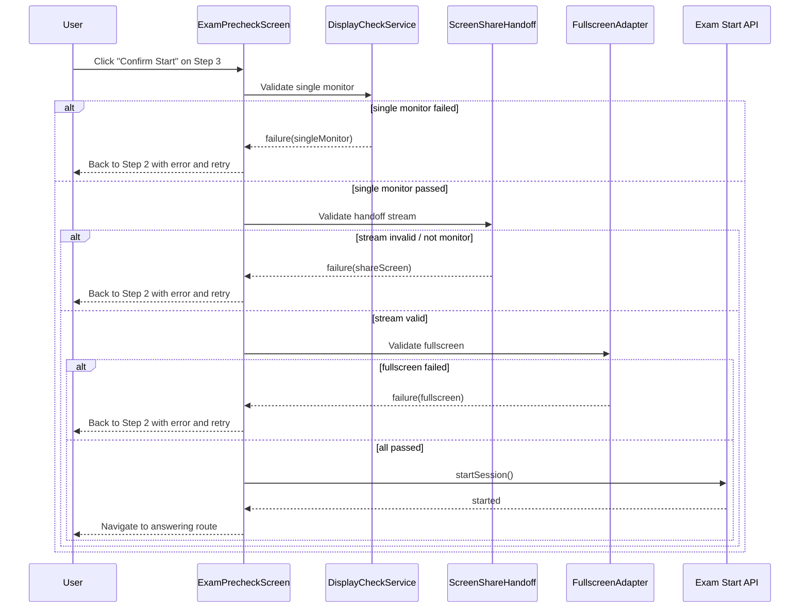

# Exam Pre-check and Anti-Cheat Sequence

> Status: 2026-03-08  
> Scope: `frontend/src/features/contest/screens/paperExam/ExamPrecheckScreen.tsx`

## Purpose

This document defines the pre-check flow before entering paper exams and clarifies fallback behavior when validation fails at start time.

## 3-step flow

1. Eligibility checks (Step 1)
2. Environment checks (Step 2)
3. Confirm start (Step 3)

## Step 2 checks (fixed order)

1. `singleMonitor`
2. `shareScreen` (`displaySurface` must be `monitor`)
3. `fullscreen`
4. `interaction`

## Fallback behavior (Step 3 -> Step 2)

If start-time preflight fails:

1. Return to Step 2.
2. Mark the matched check as `fail` with detail.
3. Mark downstream checks as `blocked`.
4. Show `Retry checks` action.

## Sequence diagram

