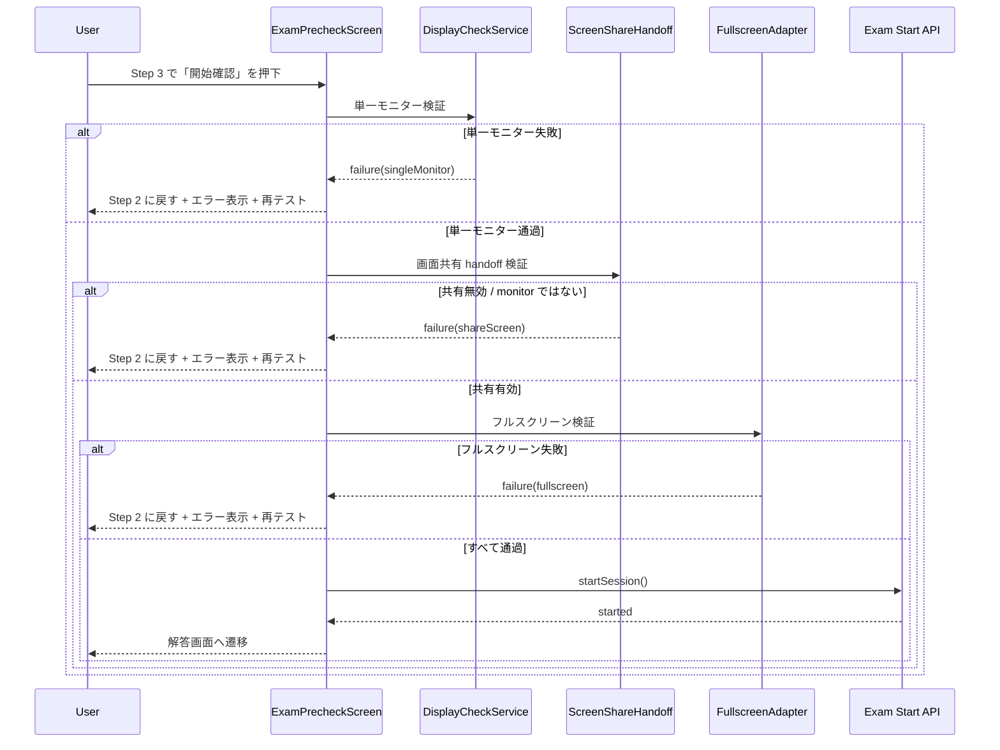

> 状態: 2026-03-08  
> 対象: `frontend/src/features/contest/screens/paperExam/ExamPrecheckScreen.tsx`

## 目的

この文書は、paper exam 開始前の pre-check フローと、開始直前検証の失敗時に Step 2 へ戻す挙動を定義します。

## 3 ステップの流れ

1. 資格確認 (Step 1)
2. 環境チェック (Step 2)
3. 開始確認 (Step 3)

## Step 2 のチェック項目（固定順）

1. `singleMonitor`
2. `shareScreen`（`displaySurface` は必ず `monitor`）
3. `fullscreen`
4. `interaction`

## 巻き戻し挙動（Step 3 -> Step 2）

開始前 preflight が失敗した場合:

1. Step 2 に戻します。
2. 該当チェックを `fail` で表示し、詳細理由を出します。
3. 後続チェックを `blocked` にします。
4. 下部アクションを `再テスト` に切り替えます。

## シーケンス図

