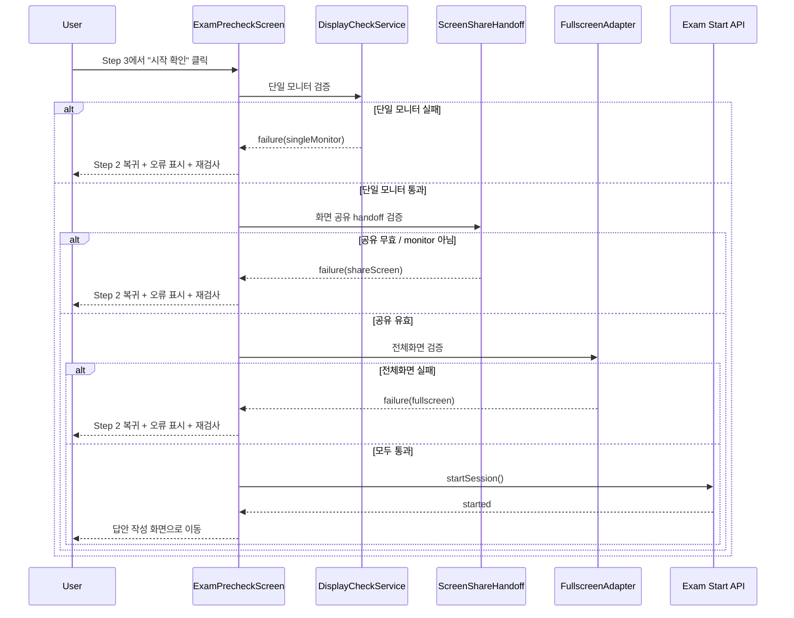

> 상태: 2026-03-08  
> 범위: `frontend/src/features/contest/screens/paperExam/ExamPrecheckScreen.tsx`

## 목적

이 문서는 paper exam 진입 전 pre-check 흐름과 시작 직전 검증 실패 시의 되돌림 동작을 정의합니다.

## 3단계 흐름

1. 자격 확인 (Step 1)
2. 환경 점검 (Step 2)
3. 시작 확인 (Step 3)

## Step 2 점검 항목 (고정 순서)

1. `singleMonitor`
2. `shareScreen` (`displaySurface`는 반드시 `monitor`)
3. `fullscreen`
4. `interaction`

## 되돌림 동작 (Step 3 -> Step 2)

시작 전 preflight 검증이 실패하면:

1. Step 2로 되돌아갑니다.
2. 해당 항목은 `fail`로 표시되고 상세 사유를 노출합니다.
3. 이후 항목은 `blocked`로 표시합니다.
4. 하단 액션은 `재검사`로 변경됩니다.

## 시퀀스 다이어그램

