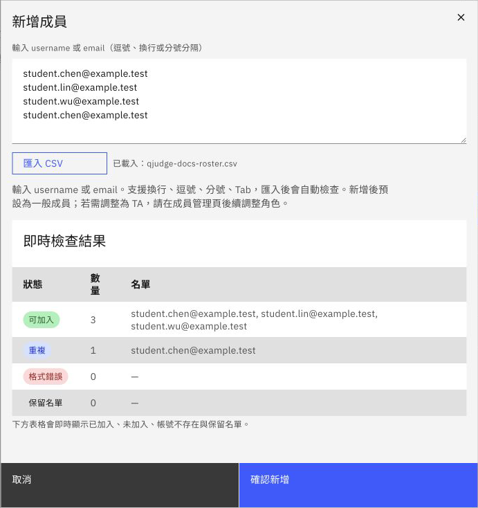
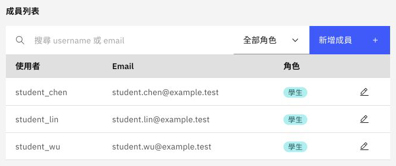

# 管理學生名冊

學生能登入 QJudge，不代表已經加入王老師的課程。教師需要把帳號加入教室，學生才會出現在這門課的名冊中。這個分層讓同一個學生帳號可以在不同學期加入不同課程，又不會看到與自己無關的考試。

在開始前，請先請學生使用授課單位提供的方式登入 QJudge 一次。名冊加入的是既有帳號；如果帳號尚未存在，系統會回報找不到，而不是自動替學生建立密碼。

## 開啟名冊管理

進入 `115 學年度作業系統` 後：

1. 選擇「教室設定」。
2. 在設定視窗左側選擇「助教管理」。目前這個區域同時管理學生與助教，不只限於助教。
3. 在「成員列表」按「新增成員」。

你可以直接貼上帳號或電子郵件，也可以匯入 CSV。校園名冊通常已經是試算表，因此本例使用 CSV；只要有一欄是 `email`、`username` 或 `帳號`，每列放一名學生即可。

```csv
email
student.chen@example.test
student.lin@example.test
student.wu@example.test
```

## 先看預覽，再加入

匯入後，QJudge 不會立刻修改名冊，而是先整理結果。本例故意重複放入一次陳同學的信箱，因此畫面顯示 3 筆可加入、1 筆重複。



圖：預覽會先處理格式與重複資料。這時尚未加入任何學生，可以回到原始名單修正後再匯入。

預覽中常見的狀態如下：

| 狀態 | 代表的意思 | 建議處理 |
| --- | --- | --- |
| 可加入 | 格式正確，送出後會查找對應帳號 | 確認人數與原始名單一致 |
| 重複 | 同一個帳號在本次匯入中出現超過一次 | 保留一筆即可 |
| 格式錯誤 | 內容不像可辨識的帳號或信箱 | 回到試算表修正欄位 |
| 保留名單 | 輸入了教室擁有者或已保留的管理帳號 | 不需要重複加入 |

確認後按「確認新增」。系統會再檢查帳號是否存在，並將成功加入的帳號列在成員列表。



圖：成員加入後預設為學生。只有確實協助管理課程的人員，才需要再調整為助教。

## 找不到帳號時

如果結果顯示「帳號不存在」，先比對學生實際用來登入的信箱或使用者名稱。校園單一登入有時會使用學號作為 username，而不是完整信箱；最可靠的方法是請學生從自己的設定頁確認帳號。

仍找不到時，請學生先完成一次登入，再重新加入該筆資料。不要在文件或群組中收集學生密碼，教師也不需要代替學生登入。

## 人數確認

關閉設定視窗後，可以在「教室成員」查看教師、助教與學生。正式準備考試前，至少比對一次系統人數與課程名單；退選或加選異動也應先更新教室名冊，再處理考試參與資格。

[上一步：建立教室](#/docs/classroom-setup) · [下一步：準備考試](#/docs/exam-preparation)
