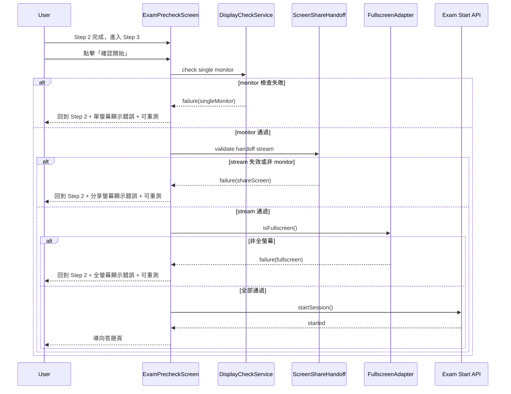

# Exam Pre-check 與防弊時序（前端）

> 文件狀態：2026-03-08  
> 適用範圍：`frontend/src/features/contest/screens/paperExam/ExamPrecheckScreen.tsx`

## 目標

本文件定義 paper exam 在「開始考試前」的 pre-check 行為與失敗回退規則，確保：

1. 檢查流程可重現、可除錯。
2. 第 3 步開始前驗證失敗時，回退到第 2 步並標示對應錯誤。
3. 使用者可在第 2 步直接執行「重新測試」。

## 三步驟流程

1. 資格確認（Step 1）
2. 環境檢查（Step 2）
3. 確認開始（Step 3）

### Step 2 檢查項目（固定順序）

1. `singleMonitor`：單螢幕檢查
2. `shareScreen`：分享螢幕（必須是 `displaySurface=monitor`）
3. `fullscreen`：全螢幕
4. `interaction`：互動輸入（最近滑鼠/鍵盤互動）

## 回退規則（Step 3 -> Step 2）

當使用者在第 3 步按下「確認開始」，系統會重新做 preflight 驗證。若失敗：

1. 回到第 2 步。
2. 對應檢查項標記為 `fail` 並顯示錯誤原因。
3. 後續檢查項標記為 `blocked`。
4. 底部操作改為「重新測試」。

### 失敗映射

- 多螢幕或無法判斷螢幕：`singleMonitor -> fail`
- 分享中斷 / track 非 live / 非 monitor：`shareScreen -> fail`
- 非全螢幕：`fullscreen -> fail`

## 時序圖（Start 前重驗證）

## UI 狀態語意

- `pending`：尚未開始
- `running`：測試中
- `pass`：成功
- `fail`：失敗（有具體原因）
- `blocked`：被上游失敗阻擋

## 維護注意事項

1. 任何新 preflight 條件，都必須映射到既有檢查項（或新增檢查項並更新順序）。
2. 禁止在 Step 3 失敗後只顯示全域錯誤而不回填檢查項。
3. 「重新測試」必須能重跑完整 Step 2，不可只重試單一副作用。

