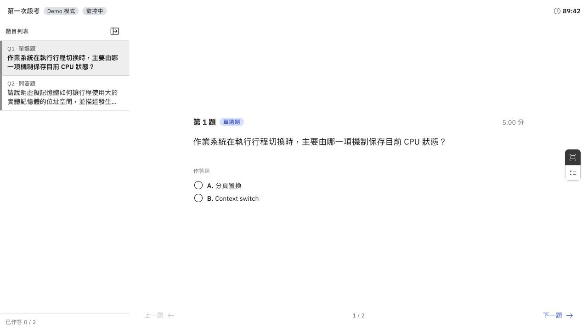

# 確認考試內容

正式考試發布後，題目修改會受到作答狀態與考試規則限制。因此在發布之前，最好由教師或助教用學生視角走過一次完整考卷。這一步不是要真的參加考試，而是確認畫面、內容與政策是否符合授課團隊原本的安排。

## 開啟作答預覽

在 `第一次段考` 的「Exam 管理」頁，按右上角的眼睛圖示「預覽作答畫面」。預覽會另外開啟 Demo 模式，不會產生學生作答紀錄，也不會把考試發布給名冊中的學生。

圖：左側列出兩道題目，中央呈現學生實際作答區。Demo 模式讓教師在發布前檢查題型、順序、選項與版面。

先逐題切換，再切換「逐題模式」與「全題模式」。如果題幹包含程式碼、表格、數學式或圖片，也要在預覽中確認排版，而不是只看編輯器內容。

## 題目與配分

逐題確認以下內容：

- 題目順序是否符合教學安排，題號是否連續。
- 題型、選項與正確答案是否一致。
- 每題分數與總分是否正確。本例為 5 分加 15 分，共 20 分。
- 問答題是否有足夠明確的評分參考答案與配分依據。
- 學生應看到的說明是否完整，教師專用的正確答案與詳解沒有出現在作答畫面。

如果需要修改，關閉 Demo 分頁，回到「Exam 管理」處理；看到「所有變更已儲存」後，再重新開啟預覽確認。

## 名冊與參與資格

回到管理總覽，參與者應該和這場考試預計使用的學生名單一致。本例只有陳同學、林同學與吳同學三個虛構帳號。

教室名冊是課程層級資料，考試參與者則是這一場活動的範圍。加退選、補考或跨班考試都可能讓兩者不同；正式發布前，應由授課團隊確認差異是刻意安排，而不是名單漏匯入。

## 時段與考試政策

從左側「設定」進入「基本資訊」，確認開始與結束時間。學生只能在開始時間後進入作答，超過結束時間會停止收卷；請同時確認主機時區與學校所在地一致。

接著回顧建立時選擇的政策：

- 是否真的需要考試模式與監考事件紀錄。
- 網路中斷後是否允許重新加入。
- 現場是否有 QR 簽到與投影設備。
- 考試規則是否已告知學生使用哪些裝置、瀏覽器與網路。

如果啟用 Exam Integrity，系統提供的是事件與證據，不會自動代替教師判定違規。監考人員仍需在考前理解處理原則，並在考後保留人工覆核。

## 發布前檢查表

授課團隊可以用以下清單完成最後一次內部確認：

- [ ] 教師帳號與共同管理的助教權限正確。
- [ ] 學生名冊與這場考試的參與者一致。
- [ ] 題目順序、題型、答案、配分與總分正確。
- [ ] 開放題已有可供教師與助教共同使用的評分規準。
- [ ] 圖片、程式碼、表格與數學式在 Demo 模式顯示正常。
- [ ] 開始時間、結束時間與主機時區正確。
- [ ] 考試模式、重新加入與 QR 簽到符合現場規則。
- [ ] 考試說明已清楚告知學生裝置、瀏覽器與網路要求。

完成這份清單，代表 QJudge 已經準備好第一場考試，但本指南仍停在正式發布之前。學生應試、監考例外處理、批改與成績發布會在後續操作指南接續說明。

[上一步：準備考試](#/docs/exam-preparation) · [回到快速入門](#/docs/quick-start)
