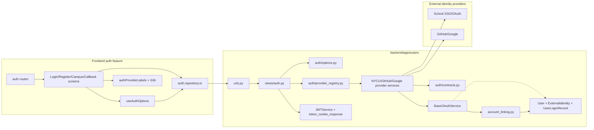
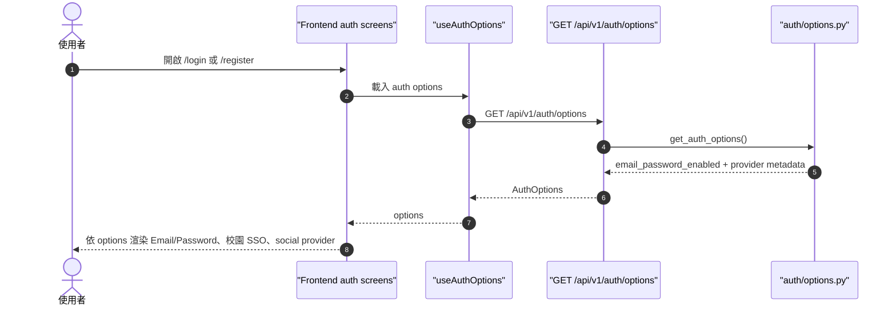
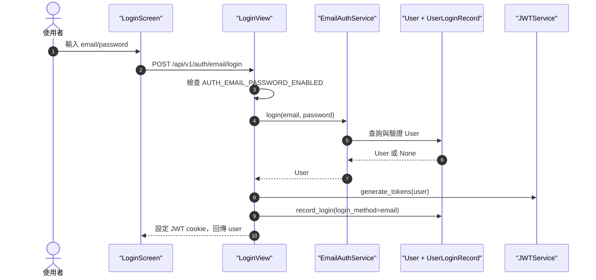
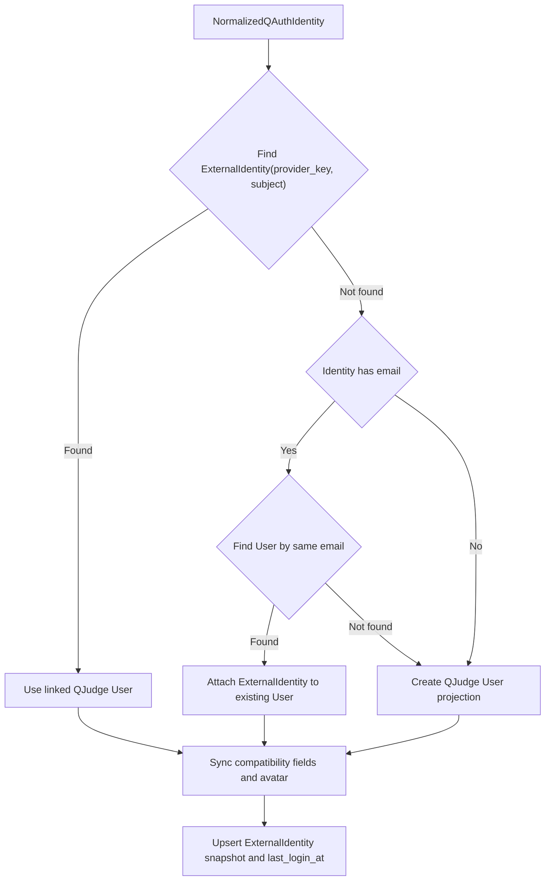
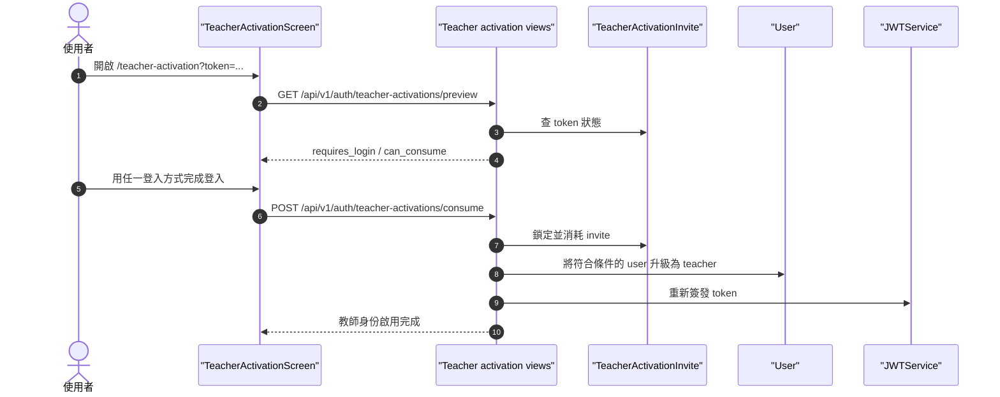

> 文件狀態：系統文件，2026-06-24
> 適用範圍：`backend/apps/users`、`backend/apps/oauth`、`frontend/src/features/auth`
> 目標讀者：QJudge 維護者、部署學校的系統管理者、準備串接 SSO/OAuth 的開發者

# 身份認證系統文件

## 文件目的

這份文件說明 QJudge 身份認證模組如何運作、各元件負責什麼、登入流程如何串接，以及如何維護或新增第三方 SSO/OAuth provider。

QJudge 的身份模組負責把外部身份轉成平台內部的 `User` 與登入 session。外部身份可以來自 Email/Password、學校 SSO、OAuth 2.0 或 OpenID Connect。登入完成後，其他功能模組只使用 QJudge 自己的 `User`、role、permission、classroom/contest membership，不直接讀第三方 provider 的 access token 或 claims。

## 快速導覽

| 讀者想做的事 | 建議閱讀 |
| --- | --- |
| 了解元件分工 | 「系統邊界」、「元件總覽」 |
| 了解登入時序 | 「執行流程」 |
| 了解 API 與前端 contract | 「公開 API 與前端顯示 contract」 |
| 關閉 Email/Password | 「維護操作」 |
| 新增學校 SSO/OAuth | 「新增學校 SSO/OAuth provider」 |
| 排查 provider 問題 | 「故障排查」與「已知限制」 |
| 判斷舊欄位或舊 import 能不能用 | 「後端相容面盤點」 |

## 名詞

| 名詞 | 說明 |
| --- | --- |
| Provider | 一個外部登入來源，例如 `nycu`、`github`、`google` 或某校 SSO |
| Provider route key | URL、registry、metadata 使用的公開 key，例如 `/api/v1/auth/google/login` 的 `google` |
| Provider storage key | `BaseOAuthService.provider_name`，目前寫入 `ExternalIdentity.provider_key` 與相容欄位 `User.auth_provider` |
| ExternalIdentity | QJudge user 與外部 provider 身份之間的連結，唯一鍵是 `(provider_key, subject)` |
| Subject | Provider 回傳的穩定使用者識別值，例如 OIDC `sub` 或 provider user id |
| Auth options | `GET /api/v1/auth/options` 回傳的登入方式設定，前端用它決定顯示哪些登入方式 |
| 相容欄位 | 仍讀寫以保留舊資料、舊 API 或 admin 顯示的欄位；不是新功能的主資料來源 |
| 舊 OAuth import path | 過去從 `apps.users.services` 或 `apps.users.auth.legacy` 匯入 OAuth provider；目前已移除，請改用 `backend/apps/users/auth/*` |

## 系統邊界

### QJudge 內部 session

無論使用 Email/Password 或第三方 SSO/OAuth，登入成功後都會簽發 QJudge 自己的 JWT，並透過 cookie 回到前端。第三方 provider token 只用來完成登入與取得 userinfo；除非另有明確需求，系統不應長期保存第三方 access token。

### 第三方登入與 `backend/apps/oauth`

`backend/apps/users` 裡的 OAuth service 是「QJudge 作為 client，向第三方 provider 登入」。

`backend/apps/oauth` 是「QJudge 作為 authorization server，提供給 MCP/CLI 等外部 client 使用」。兩者都使用 OAuth 名詞，但責任不同。維護第三方學校 SSO/OAuth 時，主要改 `backend/apps/users/auth/` 與 `frontend/src/features/auth/`，不要把 provider login 邏輯放進 `backend/apps/oauth`。

## 元件總覽

### 後端元件

| 元件 | 路徑 | 責任 |
| --- | --- | --- |
| Auth URL | `backend/apps/users/urls.py` | 定義 `/api/v1/auth/*` 路由 |
| Email views | `backend/apps/users/views/auth.py` | Email register/login，檢查 Email/Password 是否啟用 |
| OAuth views | `backend/apps/users/views/auth.py` | `/<provider>/login` 與 `/<provider>/callback` generic dispatch |
| Auth options | `backend/apps/users/auth/options.py` | 輸出前端可公開讀取的登入方式 metadata |
| Provider registry | `backend/apps/users/auth/provider_registry.py` | 將 provider route key 對到 service class |
| Base OAuth service | `backend/apps/users/auth/providers/base.py` | 共用 OAuth URL、token exchange、userinfo fetch，並把 callback data 轉成 `NormalizedQAuthIdentity` / `ProviderTokenSet` |
| Account linking service | `backend/apps/users/auth/account_linking.py` | 將 `NormalizedQAuthIdentity` 連到 QJudge `User` projection，只負責流程協調 |
| External account store | `backend/apps/users/auth/external_accounts.py` | 查詢與寫入 `ExternalIdentity` |
| User projection service | `backend/apps/users/auth/user_projection.py` | 查詢、建立、更新 QJudge `User` / `UserProfile` projection |
| Provider service | `backend/apps/users/auth/providers/*.py` | 各 provider 的設定與 profile normalize，例如 NYCU/GitHub/Google |
| Profile helper | `backend/apps/users/auth/providers/profile.py` | 抽取 avatar、合併 profile fallback、解析 id token payload hint |
| External identity model | `backend/apps/users/models.py` | 保存 provider identity 與 QJudge user 的連結 |
| User services | `backend/apps/users/services.py` | 保留 JWT、Email/Password、teacher activation 等 user service；不再匯出 OAuth provider |
| JWT response helper | `backend/apps/users/views/common.py` | 包裝登入成功 response 並設定 JWT cookie |
| Teacher activation | `backend/apps/users/views/teacher_activation.py` | 教師啟用邀請流程，獨立於登入方式 |

### 前端元件

| 元件 | 路徑 | 責任 |
| --- | --- | --- |
| Auth repository | `frontend/src/infrastructure/api/repositories/auth.repository.ts` | 呼叫登入、註冊、auth options、OAuth login/callback API |
| Auth entity types | `frontend/src/core/entities/auth.entity.ts` | 定義 `AuthOptions`、`AuthProviderOption`、`User` 等型別 |
| Auth options hook | `frontend/src/features/auth/hooks/useAuthOptions.ts` | 載入 `GET /api/v1/auth/options`，提供登入頁使用 |
| Login page | `frontend/src/features/auth/screens/LoginScreen.tsx` | 顯示 Email/Password、校園 SSO 入口與 social provider |
| Register page | `frontend/src/features/auth/screens/RegisterScreen.tsx` | 使用同一份 provider 清單顯示可用註冊方式 |
| Campus SSO page | `frontend/src/features/auth/screens/CampusSsoScreen.tsx` | 顯示 `category=campus` 的 provider 清單 |
| OAuth callback page | `frontend/src/features/auth/screens/OAuthCallbackScreen.tsx` | 接收 provider callback code，呼叫後端換 JWT |
| Provider labels | `frontend/src/features/auth/utils/authProviderLabels.ts` | i18n label fallback |
| Provider buttons/icons | `frontend/src/features/auth/components/AuthProviderButton.tsx`、`AuthProviderIcon.tsx` | provider button、logo、loading 狀態 |

### 元件關係圖



## 資料模型

### `User`

`User` 是 QJudge 的內部帳號。授權與業務功能應依賴 `User.id`、`role`、membership 與 permission。

目前 `User.auth_provider` 與 `User.oauth_id` 是相容欄位，用來保留既有資料、API 與 admin 顯示。它們只能表示最近一次外部登入來源，不代表使用者完整的 provider identity。新功能若要判斷外部身份連結，應改查 `ExternalIdentity`。

### `ExternalIdentity`

`ExternalIdentity` 保存外部 provider identity 與 QJudge user 的連結。

| 欄位 | 用途 |
| --- | --- |
| `user` | 連到 QJudge `User` |
| `provider_key` | provider storage key，目前來自 `BaseOAuthService.provider_name` |
| `subject` | Provider 回傳的穩定使用者 id |
| `email` | Provider 回傳的 email |
| `email_verified` | Provider 是否宣告 email 已驗證 |
| `profile_snapshot` | normalize 後的 provider profile 快照 |
| `last_login_at` | 該外部身份最後登入時間 |

資料庫保證 `(provider_key, subject)` 唯一。這表示同一個外部身份不能同時連到多個 QJudge user。

### QAuth identity 與 QJudge User projection

QAuth 的身份資料和 QJudge 的 `User` 不是同一個責任。QAuth 負責判斷「這是哪一個人」；QJudge 的 `User` 是應用系統 projection，負責 role、permission、classroom、contest 與其他 QJudge domain 行為。

目前 monolith 過渡期的對應關係：

| QAuth 概念 | QJudge 資料 |
| --- | --- |
| QAuth user | `User` |
| Provider account | `ExternalIdentity` |
| Provider storage key | `ExternalIdentity.provider_key` |
| Provider subject | `ExternalIdentity.subject` |
| Provider profile snapshot | `ExternalIdentity.profile_snapshot` |
| QJudge session | QJudge JWT cookie |

抽成獨立 QAuth 服務後，QJudge 仍應保留自己的 `User` projection。QAuth 不直接授予 teacher/admin，不建立 classroom membership，也不決定 contest permission。

### `UserLoginRecord`

`UserLoginRecord` 記錄每次登入的 device、IP、user agent、login method 與 JWT jti。考試中的多裝置登入偵測也會使用這些資訊。

### `TeacherActivationInvite`

教師啟用邀請和登入方式分離。使用者可以透過 Email/Password、學校 SSO 或 OAuth 登入，但教師身份仍由 QJudge 的邀請 token 授權，不直接由 provider claim 自動升級。

### Institution 現況

目前沒有 `Institution` model，也沒有在 `User`、`UserProfile` 或 `ExternalIdentity` 上保存 institution。單校部署可以不需要 institution。若同一套 QJudge 要服務多所學校，應先設計 `Institution` 與 provider 所屬關係，再處理同 email 合併、報表分群與資料治理。

## 後端相容面盤點

本段把 legacy 統一稱為相容面：系統仍讀寫這些欄位或 import path，以保留既有資料、API、serializer、admin 或測試行為；但新功能設計時，不應把它們當成主資料來源。

### Model 與欄位

| 相容面 | 目前用途 | 新功能主資料來源 | 注意事項 |
| --- | --- | --- | --- |
| `User.auth_provider` | 記錄最近一次登入方式，供既有 serializer、admin、Email/Password 檢查與舊資料相容 | `ExternalIdentity.provider_key` 與 `provider_registry.py` | 它不是多 provider 身份清單；同一個 user 可有多筆 `ExternalIdentity` |
| `User.oauth_id` | 保存最近一次外部登入的 subject，供舊資料與舊 API 相容 | `ExternalIdentity.subject` | 多個 provider 的 subject 不能塞在這個欄位 |
| `User.email_verified` | QJudge 帳號層級的 email 驗證旗標；OAuth 登入目前仍會更新它以維持既有行為 | `ExternalIdentity.email_verified` 表示 provider 宣告的 email 驗證狀態 | 不可信 provider 不應因為有 email 就自動合併既有 user |
| `ExternalIdentity` | 保存 provider identity 與 QJudge `User` 的連結 | 這是外部身份連結的主資料來源 | 唯一鍵是 `(provider_key, subject)`；授權仍依 `User`、role、permission、membership |

### Service 與 import path

| 相容面 | 目前用途 | 新功能主入口 | 注意事項 |
| --- | --- | --- | --- |
| `apps.users.services.*OAuthService` | 已移除 | `backend/apps/users/auth/provider_registry.py` 與 `backend/apps/users/auth/providers/*` | `services.py` 只保留 JWT、Email/Password、teacher activation 等 user service |
| `backend/apps/users/auth/legacy.py` | 已移除 | 無 | 不再維護 OAuth re-export 橋接層 |
| `backend/apps/users/auth/provider_registry.py` | 將 provider route key 對到 provider service class | `get_oauth_service(provider)` | `nycu` route key 對到 `NYCUOAuthService.provider_name="nycu-oauth"` 是舊資料相容例外 |
| `backend/apps/users/auth/providers/base.py` | OAuth/OIDC 類 provider 共用 URL、token、userinfo；提供 `normalize_identity()` 與 `provider_token_set()` | `BaseOAuthService` subclass 與 `link_qauth_identity()` | provider 差異放在 subclass 或 profile helper，不複製 view/JWT/account linking |
| `backend/apps/users/auth/account_linking.py` | QAuth identity linking 流程 | `link_qauth_identity(identity, token_set)` | 不直接 import QJudge models；資料存取交給 `external_accounts.py` 與 `user_projection.py` |

## 設定來源

### Email/Password 開關

`AUTH_EMAIL_PASSWORD_ENABLED` 控制 Email/Password 是否啟用，預設為 `True`。

停用後，以下 API 會回 `403 EMAIL_PASSWORD_DISABLED`：

- `POST /api/v1/auth/email/register`
- `POST /api/v1/auth/email/login`
- `POST /api/v1/auth/change-password`
- `POST /api/v1/auth/forgot-password`
- `POST /api/v1/auth/reset-password`

前端會透過 `GET /api/v1/auth/options` 取得 `email_password_enabled=false`，並隱藏 Email/Password 表單。

### Provider metadata

公開 provider metadata 目前由 `backend/config/settings/base.py` 的 `DEFAULT_AUTH_PROVIDER_OPTIONS` 或 `AUTH_PROVIDER_OPTIONS_JSON` 提供。

`AUTH_PROVIDER_OPTIONS_JSON` 必須是 JSON array。設定後會取代 `DEFAULT_AUTH_PROVIDER_OPTIONS`，不是與預設值合併。每個項目會由 `auth/options.py` 過濾，只保留 `OAUTH_PROVIDERS` registry 中存在的 key，並只輸出公開欄位。

| 欄位 | 必要性 | 前端用途 |
| --- | --- | --- |
| `key` | 必要 | provider route key，例如 `nycu`、`github`、`google` |
| `type` | 建議 | `oauth2` 或 `oidc`，供前端與文件辨識 provider 類型 |
| `category` | 必要 | `campus` 顯示在校園 SSO，`social` 顯示在一般登入頁 |
| `display_name` | 必要 | i18n 缺字時的 fallback |
| `display_name_i18n_key` | 選用 | 前端翻譯 key；缺少時使用 `display_name` |
| `logo_url` | 選用 | provider logo；缺少時前端用文字縮寫 fallback |

`AUTH_PROVIDER_OPTIONS_JSON` 只放公開顯示資料。不要把 authorize URL、token URL、client id、client secret 或 claim mapping 放在這裡。

目前預設 provider：

```json
[
  {
    "key": "nycu",
    "type": "oidc",
    "category": "campus",
    "display_name": "NYCU 國立陽明交通大學",
    "display_name_i18n_key": "auth.providers.nycu",
    "logo_url": "/illustrations/nycu-logo.png"
  },
  {
    "key": "github",
    "type": "oauth2",
    "category": "social",
    "display_name": "GitHub",
    "display_name_i18n_key": "auth.providers.github"
  },
  {
    "key": "google",
    "type": "oidc",
    "category": "social",
    "display_name": "Google",
    "display_name_i18n_key": "auth.providers.google",
    "logo_url": "/illustrations/google-icon.svg"
  }
]
```

### Provider connection settings

每個 provider 的 OAuth/OIDC endpoint、scope、claim mapping 與 credential env name 由後端專用的 `QAUTH_PROVIDER_CONNECTIONS_JSON` 管理。這份設定不會從 `GET /api/v1/auth/options` 回傳，也不應出現在前端 bundle。

```json
[
  {
    "key": "nycu",
    "type": "oidc",
    "authorization_url": "https://id.nycu.edu.tw/o/authorize/",
    "token_url": "https://id.nycu.edu.tw/o/token/",
    "userinfo_url": "https://id.nycu.edu.tw/api/profile/",
    "scope": "openid email profile",
    "client_id_env": "NYCU_OAUTH_CLIENT_ID",
    "client_secret_env": "NYCU_OAUTH_CLIENT_SECRET",
    "claim_mapping": {
      "subject": "sub",
      "email": "email",
      "name": "name",
      "avatar_url": "picture"
    }
  }
]
```

`client_id_env` 和 `client_secret_env` 是環境變數名稱，不是 credential 本身。實際值仍放在部署環境：

```env
NYCU_OAUTH_CLIENT_ID=replace-with-client-id
NYCU_OAUTH_CLIENT_SECRET=replace-with-client-secret
```

`BaseOAuthService` 會優先讀取 `QAUTH_PROVIDER_CONNECTIONS_JSON` 中相同 `key` 的 URL、scope 與 credential env；沒有設定時，才回退到既有 `*_OAUTH_AUTHORIZE_URL`、`*_OAUTH_TOKEN_URL`、`*_OAUTH_USERINFO_URL`、`*_OAUTH_CLIENT_ID`、`*_OAUTH_CLIENT_SECRET` settings。

## 公開 API 與前端顯示 contract

### `GET /api/v1/auth/options`

前端進入登入或註冊頁時先呼叫此 API。

回應：

```json
{
  "success": true,
  "data": {
    "email_password_enabled": true,
    "providers": [
      {
        "key": "google",
        "type": "oidc",
        "category": "social",
        "display_name": "Google",
        "display_name_i18n_key": "auth.providers.google",
        "logo_url": "/illustrations/google-icon.svg"
      }
    ]
  }
}
```

前端規則：

- `email_password_enabled=false` 時，不顯示 Email/Password login/register 表單。
- `category=campus` 不直接展開在 login 頁；login 頁顯示「校園身份驗證登入」入口，進入 campus SSO 頁後再列出學校 provider。
- `category=social` 顯示在 login 頁。
- register 頁使用同一份 provider 清單，不再需要 `supports_registration`。
- label 優先讀 `auth.providers.{key}.*` i18n key；沒有翻譯時回退到後端 `display_name` 與通用 action label。
- `logo_url` 由後端提供，前端只渲染，不在畫面中硬寫學校 logo。

### `POST /api/v1/auth/email/login`

Email/Password 登入。成功後回傳 user data，並設定 JWT cookie。

### `POST /api/v1/auth/email/register`

Email/Password 註冊。停用 Email/Password 時不接受註冊。

### `GET /api/v1/auth/<provider>/login`

後端用 provider service 建立第三方 authorization URL。

目前 view 的行為：

1. 用 URL 裡的 `<provider>` 查 `OAUTH_PROVIDERS`。
2. 若 provider 不存在，回 `400 UNKNOWN_PROVIDER`。
3. 用 `FRONTEND_URL` 組出 callback URL：`{FRONTEND_URL}/auth/{provider}/callback`。
4. 產生 `state`，呼叫 `service.get_authorization_url(redirect_uri, state)`。
5. 回傳 `authorization_url` 給前端。

### `POST /api/v1/auth/<provider>/callback`

前端 callback page 收到 provider redirect 的 `code` 後呼叫此 API。

Request body：

```json
{
  "code": "authorization-code",
  "redirect_uri": "https://qjudge.example.edu/auth/google/callback"
}
```

後端流程：

1. 用 `<provider>` 查 provider service。
2. 驗證 callback payload。
3. `service.exchange_code(code, redirect_uri)` 向 provider token endpoint 換 access token，再取得 userinfo。
4. `service.normalize_identity(oauth_data)` 與 `service.provider_token_set(oauth_data)` 產生 QAuth contract。
5. `link_qauth_identity(identity, token_set)` 連結或建立 QJudge user。
6. 若該 user 有考試中的多裝置登入衝突，回 `EXAM_TAKEOVER_REQUIRED`。
7. 簽發 QJudge JWT cookie，回傳 user data。

## 執行流程

### 登入頁初始化



若 auth options 載入失敗，前端使用預設值：`email_password_enabled=true`、`providers=[]`。這是前端 fallback，不代表後端會接受 Email/Password；真正的啟用狀態以後端 guard 為準。

### Email/Password 登入



登入成功後，前端把 user data 放到 `localStorage`，再依使用者狀態導向登入後頁面。

### OAuth/SSO 登入

```mermaid
sequenceDiagram
    autonumber
    actor U as 使用者
    participant FE as "Login/Campus screen"
    participant API as "OAuthLoginView / OAuthCallbackView"
    participant Registry as "OAUTH_PROVIDERS"
    participant Service as "BaseOAuthService subclass"
    participant IdP as "External provider"
    participant Link as "account_linking.py"
    participant DB as "User + ExternalIdentity"
    participant JWT as "JWTService"

    U->>FE: 點選 provider
    FE->>API: GET /api/v1/auth/{provider}/login
    API->>Registry: get_oauth_service(provider)
    Registry-->>API: service class
    API->>Service: get_authorization_url(redirect_uri, state)
    Service-->>API: authorization_url
    API-->>FE: authorization_url
    FE->>IdP: redirect
    IdP-->>FE: /auth/{provider}/callback?code=...
    FE->>API: POST /api/v1/auth/{provider}/callback
    API->>Service: exchange_code(code, redirect_uri)
    Service->>IdP: token endpoint
    Service->>IdP: userinfo endpoint
    IdP-->>Service: token + profile
    API->>Service: normalize_identity(oauth_data)
    Service-->>API: NormalizedQAuthIdentity
    API->>Service: provider_token_set(oauth_data)
    Service-->>API: ProviderTokenSet
    API->>Link: link_qauth_identity(identity, token_set)
    Link->>DB: 查 ExternalIdentity(provider_key, subject)
    Link->>DB: 未命中時依 email 找 User 或建立 User
    Link->>DB: upsert ExternalIdentity
    Link-->>API: User
    API->>JWT: generate_tokens(user)
    API-->>FE: 設定 JWT cookie，回傳 user
```

### Account linking 規則

Account linking 的目標是把外部 provider identity 連到 QJudge 的 `User` projection。QAuth 負責辨識「這是哪一個人」；QJudge 的 role、permission、teacher activation、classroom membership 和 contest permission 仍由 QJudge domain 決定。

收斂後的核心 contract：

```python
link_qauth_identity(
    identity: NormalizedQAuthIdentity,
    token_set: ProviderTokenSet | None = None,
) -> User
```

Provider service 只負責把 provider raw userinfo 轉成 `NormalizedQAuthIdentity` 與 `ProviderTokenSet`。`link_qauth_identity()` 負責 linking 流程；`external_accounts.py` 負責 `ExternalIdentity` 查詢/upsert；`user_projection.py` 負責建立或更新 QJudge `User` / `UserProfile`。provider service 不應各自建立 `User` 或寫入 `ExternalIdentity`。



連結順序：

1. Provider service 把 raw userinfo normalize 成 `NormalizedQAuthIdentity`。
2. 用 `(provider_key, provider_subject)` 查 `ExternalIdentity`。
3. 如果找到，使用該 `ExternalIdentity.user`。
4. 如果找不到，且 identity 有 email，先用 email 查既有 `User`。
5. 如果同 email user 存在，將新的 `ExternalIdentity` 掛到該 user。
6. 如果同 email user 不存在，建立新的 QJudge `User` projection。
7. 更新相容欄位 `User.auth_provider`、`User.oauth_id`、`User.email_verified`，但新功能不應依賴這些欄位判斷外部身份。
8. 若 provider 有 avatar，且使用者沒有手動鎖定 avatar，就同步到 `UserProfile`。
9. 建立或更新 `ExternalIdentity`。

`ProviderTokenSet` 只在 callback 當下使用。第一版不保存第三方 access token 或 refresh token；如果未來需要代替使用者呼叫 provider API，應新增獨立且加密的 token store。

產品決策上，同一個 email 視為同一個 QJudge user。第一版 QAuth contract 信任 provider email，因為系統目前沒有 email 驗證功能；維護者啟用新 provider 前，必須確認 provider 的 email 語意可信。若 provider 無法保證 email 屬於登入者，應改成 pending link 或人工確認流程。

### 教師啟用流程

教師啟用不是 provider claim mapping。使用者登入後，仍需透過 QJudge 的 teacher activation invite 消耗 token 才能取得 teacher role。



## 新增學校 SSO/OAuth provider

### 接入前檢查

向學校或第三方系統確認：

- 協定是 OAuth 2.0 還是 OpenID Connect。
- authorize endpoint、token endpoint、userinfo endpoint。
- redirect URI 要註冊哪個網域。
- client id 與 client secret 的取得與輪替方式。
- userinfo 是否提供穩定 subject，例如 `sub` 或不可重複的 user id。
- email 是否提供。第一版 QAuth contract 信任 provider email；系統目前不要求 provider option 暴露 `email_verified`。
- 是否提供 avatar 或 display name。
- 是否需要額外 scope。

目前系統已支援 OAuth 2.0 / OIDC 類登入流程。SAML、CAS、LDAP 尚未實作 adapter，不應硬塞進 `BaseOAuthService`。

### 命名規則

新 provider 請讓下列 key 一致：

- `AUTH_PROVIDER_OPTIONS[*].key`
- `OAUTH_PROVIDERS` 的 key
- URL path：`/api/v1/auth/<provider>/login`
- 新 service 的 `provider_key`
- 新 service 的 `provider_name`

既有 NYCU 因相容舊資料，public route key 與 `provider_key` 是 `nycu`，但 `NYCUOAuthService.provider_name` 是 `nycu-oauth`。新 provider 不應複製這個差異，除非同時提供明確的資料遷移理由。

### 新增 service class

建立 `backend/apps/users/auth/providers/example_university.py`：

```python
from .base import BaseOAuthService
from .profile import extract_avatar_url


class ExampleUniversityOAuthService(BaseOAuthService):
    provider_key = "example-university"
    provider_name = "example-university"
    authorize_url_setting = "EXAMPLE_UNIVERSITY_OAUTH_AUTHORIZE_URL"
    token_url_setting = "EXAMPLE_UNIVERSITY_OAUTH_TOKEN_URL"
    userinfo_url_setting = "EXAMPLE_UNIVERSITY_OAUTH_USERINFO_URL"
    client_id_setting = "EXAMPLE_UNIVERSITY_OAUTH_CLIENT_ID"
    client_secret_setting = "EXAMPLE_UNIVERSITY_OAUTH_CLIENT_SECRET"
    default_scope = "openid email profile"

    @classmethod
    def _parse_user_info(cls, raw: dict) -> dict:
        return {
            "username": raw.get("preferred_username") or raw.get("name"),
            "email": raw.get("email"),
            "oauth_id": raw.get("sub") or raw.get("id"),
            "avatar_url": extract_avatar_url(raw),
        }
```

`_parse_user_info()` 必須回傳：

| 欄位 | 必要性 | 說明 |
| --- | --- | --- |
| `oauth_id` | 必要 | 穩定 subject，會成為 `ExternalIdentity.subject` |
| `email` | 強烈建議 | 用於連結既有 QJudge user |
| `username` | 建議 | 建立新 user 時使用 |
| `avatar_url` | 選用 | 同步 profile avatar |

第一版 QAuth contract 不要求 provider service 回傳 `email_verified`，也不在 provider option 或 session contract 暴露這個欄位。現有資料表上的 `User.email_verified` 與 `ExternalIdentity.email_verified` 仍可能被舊流程寫入，屬於相容欄位。

### 加入 registry

在 `backend/apps/users/auth/providers/__init__.py` 匯出 service class，再加入 `backend/apps/users/auth/provider_registry.py`：

```python
OAUTH_PROVIDERS = {
    "nycu": NYCUOAuthService,
    "github": GitHubOAuthService,
    "google": GoogleOAuthService,
    "example-university": ExampleUniversityOAuthService,
}
```

### 新增 settings 與 env

在 settings 中保留 credential env setting，或依部署方式提供同名環境變數：

```python
EXAMPLE_UNIVERSITY_OAUTH_CLIENT_ID = os.getenv("EXAMPLE_UNIVERSITY_OAUTH_CLIENT_ID", "")
EXAMPLE_UNIVERSITY_OAUTH_CLIENT_SECRET = os.getenv("EXAMPLE_UNIVERSITY_OAUTH_CLIENT_SECRET", "")
```

部署環境提供 secret，不要把 secret 寫入 Git。

OAuth/OIDC URL 與 scope 優先放在 `QAUTH_PROVIDER_CONNECTIONS_JSON`：

```json
[
  {
    "key": "example-university",
    "type": "oidc",
    "authorization_url": "https://sso.example.edu/oauth/authorize",
    "token_url": "https://sso.example.edu/oauth/token",
    "userinfo_url": "https://sso.example.edu/oauth/userinfo",
    "scope": "openid email profile",
    "client_id_env": "EXAMPLE_UNIVERSITY_OAUTH_CLIENT_ID",
    "client_secret_env": "EXAMPLE_UNIVERSITY_OAUTH_CLIENT_SECRET",
    "claim_mapping": {
      "subject": "sub",
      "email": "email",
      "name": "name",
      "avatar_url": "picture"
    }
  }
]
```

這份 JSON 是 server-only 設定。`client_id_env`、`client_secret_env` 只放環境變數名稱，實際 client id 與 secret 放在部署平台、secret manager 或 `.env`。

### 新增 provider metadata

最小 metadata：

```json
[
  {
    "key": "example-university",
    "type": "oidc",
    "category": "campus",
    "display_name": "Example University",
    "display_name_i18n_key": "auth.providers.example-university",
    "logo_url": "/school-logos/example-university.png"
  }
]
```

可以透過 `AUTH_PROVIDER_OPTIONS_JSON` 設定，或加到 seed/settings。`logo_url` 是 public frontend asset URL；學校 logo 可放在部署的 static/public 資源中。

### 前端 label 與 logo

前端不需要為新 provider 改登入頁。若要正式顯示翻譯文案，在 `frontend/src/i18n/locales/*/common.json` 補：

```json
{
  "auth": {
    "providers": {
      "example-university": {
        "displayName": "Example University",
        "description": "使用 Example University SSO 登入",
        "loginLabel": "使用 Example University SSO 登入",
        "registerLabel": "使用 Example University SSO 建立帳號"
      }
    }
  }
}
```

沒有 i18n key 時，前端會使用後端 `display_name` 產生 fallback label。

### 必補測試

新增 provider 時至少補下列測試：

- provider registry 能用 key 找到 service。
- `get_authorization_url()` 包含 client id、redirect URI、scope、state。
- `_parse_user_info()` 能把 provider payload 轉成 `oauth_id`、email、username。
- `NormalizedQAuthIdentity` 會帶出 `provider_key`、穩定 subject、email、username。
- `link_qauth_identity()` 會把 identity 連到正確的 QJudge `User` projection。
- `account_linking.py` 不直接 import QJudge models；只透過 `external_accounts.py` 與 `user_projection.py`。
- callback 後會建立或更新 `ExternalIdentity`。
- 第二次使用同一個 `(provider_key, subject)` 登入會回到同一個 QJudge user。
- 已存在相同 email 的 user 會被連結到同一個 user。
- `GET /api/v1/auth/options` 會回傳 provider metadata。
- 前端會依 `category` 顯示 provider，register 頁使用同一份 provider 清單。

## 維護操作

### 完全關閉 Email/Password

設定：

```env
AUTH_EMAIL_PASSWORD_ENABLED=false
```

確認：

- `GET /api/v1/auth/options` 回 `email_password_enabled=false`。
- 登入與註冊頁不顯示 Email/Password 表單。
- Email login/register/password reset/change password API 回 `403 EMAIL_PASSWORD_DISABLED`。
- 系統仍有可用的管理者登入方式。若關閉 Email/Password，部署者必須用 seed 或既有 SSO identity 建立第一個 admin。

### 新增或更換 provider logo

1. 將 logo 放到 public/static 可存取位置。
2. 在 provider metadata 設定 `logo_url`。
3. 呼叫 `GET /api/v1/auth/options` 確認 URL 已回傳。
4. 開啟登入頁確認前端顯示圖片。

前端只讀 `logo_url`，不需要在 LoginScreen 或 RegisterScreen 寫 provider 特例。

### 輪替 provider secret

1. 在第三方 provider 管理介面建立新 secret。
2. 更新部署環境的 `*_OAUTH_CLIENT_SECRET`。
3. 重啟 backend。
4. 用 `GET /api/v1/auth/<provider>/login` 確認 authorization URL 可建立。
5. 用測試帳號完成一次登入。
6. 移除舊 secret。

不要把 secret 放進 `AUTH_PROVIDER_OPTIONS_JSON` 或 `QAUTH_PROVIDER_CONNECTIONS_JSON`，也不要記錄到 log。`QAUTH_PROVIDER_CONNECTIONS_JSON` 只放 `client_id_env`、`client_secret_env` 這類環境變數名稱。

### 停用 provider

目前 `GET /api/v1/auth/options` 只會顯示 `AUTH_PROVIDER_OPTIONS` 中列出的 provider，但 OAuth login endpoint 主要依 `OAUTH_PROVIDERS` registry 判斷 provider 是否存在。若要完整停用 provider：

1. 從 `AUTH_PROVIDER_OPTIONS` 移除，讓前端不再顯示。
2. 若需要阻止直接打 API，從 `OAUTH_PROVIDERS` 移除或補後端 enabled guard。
3. 確認 `/api/v1/auth/<provider>/login` 不再可用。

## 故障排查

| 現象 | 優先檢查 |
| --- | --- |
| 前端沒有顯示 provider | `GET /api/v1/auth/options` 是否包含該 provider；`key` 是否存在於 `OAUTH_PROVIDERS` |
| 點 provider 回 `UNKNOWN_PROVIDER` | URL key 與 `OAUTH_PROVIDERS` key 是否一致 |
| provider 登入後 callback 失敗 | `redirect_uri` 是否與第三方平台註冊一致；token endpoint 是否接受目前 client id/secret |
| 登入後建立了新帳號，沒有連到既有帳號 | Provider 是否回傳 email；email 是否與既有 `User.email` 完全一致 |
| 第二次登入仍建立新連結 | `_parse_user_info()` 的 `oauth_id` 是否穩定 |
| logo 沒出現 | `logo_url` 是否在 auth options 回傳；靜態檔 URL 是否能直接開啟 |
| 關閉 Email/Password 後仍可呼叫 API | 檢查 backend 是否重啟、環境變數是否真的為 `false`、是否打到正確環境 |
| 教師登入後沒有 teacher 權限 | 確認 teacher activation invite 是否已 consume；SSO claim 不會自動授予 teacher |

## 驗證命令

前端 auth 顯示與 repository 測試：

```bash
docker compose -f docker-compose.dev.yml exec -T frontend npm run test -- --run \
  src/features/auth/screens/AuthProviderOptionsScreen.test.tsx \
  src/infrastructure/api/repositories/auth.repository.test.ts
```

前端 build：

```bash
docker compose -f docker-compose.dev.yml exec -T frontend npm run build
```

後端 auth options 測試：

```bash
.codex/skills/qjudge-env-compose-owner/scripts/qjudge-dc.sh test exec -T backend pytest \
  apps/users/tests/test_services.py::AuthOptionsTests \
  apps/users/tests/test_auth_enhanced.py::EnhancedAuthTests::test_auth_options_returns_login_configuration \
  -q
```

Django check：

```bash
docker compose -f docker-compose.dev.yml exec -T backend python manage.py check
```

文件檢查：

```bash
docker compose -f docker-compose.dev.yml exec -T frontend npm run check:docs
```

## 已知限制

這些是目前系統行為，不應在文件中假設已完成。

| 限制 | 影響 | 維護注意事項 |
| --- | --- | --- |
| OAuth `state` 目前產生後未持久化與 callback 驗證 | 無法完整防止 callback 混淆與 CSRF 類風險 | 新增高信任 provider 前，應補 signed state、TTL、redirect_uri 驗證 |
| 目前未實作 PKCE | public client 安全性不足 | 若接入標準 OIDC，建議一併補 `code_verifier` / `code_challenge` |
| Google id token 目前只作 profile fallback，未完整驗章 | OIDC 驗證不足 | 正式 OIDC adapter 應驗 issuer、audience、exp、nonce、JWKS signature |
| Provider enabled 狀態未在 callback/login endpoint 統一檢查 | 從 auth options 移除不等於 API 完整停用 | 停用 provider 時需同步處理 registry 或補 enabled guard |
| Provider metadata 仍由 settings/env 管理 | 多校、多環境管理不方便 | 後續可新增 `IdentityProvider` model，但需保留同一份 `GET /api/v1/auth/options` contract |
| OAuth 登入後仍會更新 `User.email_verified` 相容欄位 | 若啟用不可信 provider，可能把未驗證 email 當成已驗證帳號 | 啟用 provider 前確認 email 語意；後續應由 `link_qauth_identity()` 集中管理信任策略 |
| `User.auth_provider` / `oauth_id` 仍保留為相容欄位 | 其他模組誤用時可能只看到最近一次登入方式 | 新功能應讀 `ExternalIdentity`，授權邏輯只依賴 QJudge `User` 與 role/permission |
| 尚未支援 SAML/CAS/LDAP adapter | 不能直接串只支援這些協定的學校 | 應新增 adapter，輸出同一種 normalized profile，不要塞進 OAuth service |

## 維護原則

- 第三方 provider 差異應留在 provider service 或 profile normalize，不要複製登入 view、JWT 簽發或 account linking 流程。
- User linking 應集中在 `link_qauth_identity()` contract；provider service 不應直接決定如何建立或合併 QJudge `User`。
- `ExternalIdentity` 存取集中在 `external_accounts.py`；QJudge `User` / `UserProfile` projection 集中在 `user_projection.py`。
- 新的 OAuth provider 或 provider registry 程式碼應放在 `backend/apps/users/auth/`，不要加回 `backend/apps/users/services.py`。
- 前端只依賴 `AuthOptions` contract，不 import 後端 provider 常數。
- Provider route key 或 storage key 進 production 後，不要任意改名；改名需 migration。
- Subject claim 必須穩定，不能使用 display name。
- Email 自動合併只適合可信 provider。若 provider 無法證明 email 已驗證，應先改成 pending link 或人工確認流程。
- Teacher/admin 授權不要由 SSO claim 直接自動授予。Teacher 維持邀請流程，admin 維持管理者授權或 seed。
- `backend/apps/oauth` 與第三方登入維持邊界；外部登入在 `backend/apps/users/auth` 維護。
