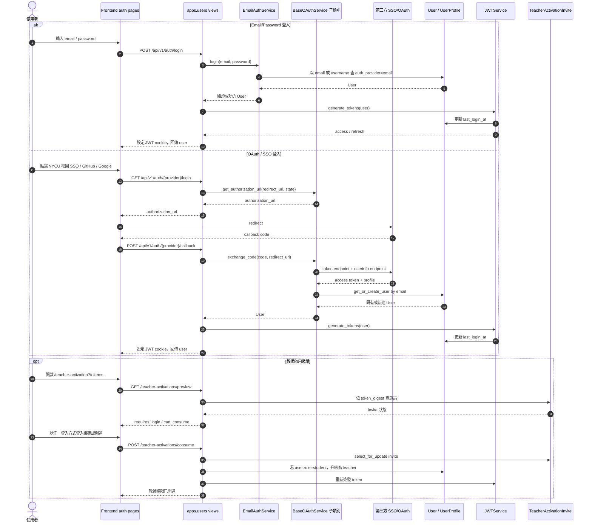

> 文件狀態：草稿，2026-06-24
> 適用範圍：`backend/apps/users`、`backend/apps/oauth`、`frontend/src/features/auth`
> 目標讀者：QJudge 維護者、部署學校的系統管理者、準備串接 SSO/OAuth 的貢獻者

# 身份模組維護與擴充草稿

## 目標

身份模組的責任是把外部身份轉換成 QJudge 內部使用者與登入工作階段。外部身份可以來自 Email/Password、學校 SSO、OAuth 2.0、OpenID Connect，後續也可能包含 SAML 2.0、CAS 或 LDAP。

QJudge 內部仍應維持單一授權模型：所有登入方式最後都簽發 QJudge 自己的 JWT，系統其他模組只依賴 `User`、role、permission 與 classroom/contest 權限，不直接依賴第三方 provider 的 token 或 claims。

## 目前現況

目前身份流程主要分成三塊：

- `backend/apps/users`
  - 管理 `User`、`UserProfile`、Email/Password、JWT cookie、登入紀錄、角色與教師啟用。
  - `services.py` 已有 `BaseOAuthService`、`NYCUOAuthService`、`GitHubOAuthService`、`GoogleOAuthService` 與 `OAUTH_PROVIDERS` registry。
  - `NYCUOAuthService` 可視為第一個「學校擴充 Provider」實作；GitHub/Google 則是社群 OAuth 範例。
  - `views/auth.py` 提供 generic provider dispatch：`/api/v1/auth/<provider>/login` 與 `/api/v1/auth/<provider>/callback`。
- `backend/apps/oauth`
  - 這是 QJudge 對外提供給 MCP/CLI 的 OAuth authorization server。
  - 它不是第三方登入入口，維護時必須和 `apps.users` 的外部登入 adapter 分清楚。
- `frontend/src/features/auth`
  - `auth.repository.ts` 可以用任意 `provider` 字串取得登入 URL 與送 callback。
  - `LoginScreen.tsx`、`CampusSsoScreen.tsx` 仍把可見 provider 寫死在畫面內，目前 NYCU 是唯一顯示的校園 provider。

目前設計已經有 provider registry 的雛形，但還不是完整可插拔架構。NYCU 應被整理成可重用的學校 provider 樣板；其他學校接入 SSO/OAuth 時，應優先新增設定與少量 claim mapping，而不是複製一套登入流程。

### 目前資料模型確認

`User` 目前有 `email`、`auth_provider`、`oauth_id`、`email_verified`、`role` 等欄位；`UserProfile` 目前保存顯示名稱、頭像、語言、主題與 editor 偏好。兩者目前都沒有 `institution` 欄位，也沒有獨立的 `Institution` model。

如果未來是一校一套部署，短期可以先不新增 `institution`。若同一套 QJudge 要服務多所學校，建議新增 `Institution`、`IdentityProvider.institution`，並在 `ExternalIdentity` 或 user profile 上保存來源學校，否則同 email 合併、provider 顯示、資料治理與報表分群會混在一起。

## 已確認決策

| 議題 | 決策 | 文件影響 |
| --- | --- | --- |
| Email/Password | 部署者必須能完全關閉 Email/Password，只保留學校 SSO | 新增 `AUTH_EMAIL_PASSWORD_ENABLED=false` 類型設定；關閉後 login/register/password reset/change password 都不顯示也不接受 API |
| 教師啟用 | 維持目前教師啟用邀請流程 | SSO 只負責登入與建立 user；teacher role 仍由 QJudge 內部邀請流程授權 |
| Institution | 目前 model 沒有 | 單校部署可先不做；多校共用時再新增 `Institution` 關聯 |
| 帳號合併 | 同 email 視為同一個 QJudge user | 保留 `User.email` unique；外部身份以 email 找既有 user 後再建立 provider link |
| Provider 管理 | 先以 env/seed 管理 | Phase 1 不做 admin UI；用 seed 載入 provider metadata 與 env secret |
| OAuth service 實作 | 不整個重寫，短期繼承既有 `BaseOAuthService` | NYCU 作為學校 provider 樣板；GitHub/Google 作為社群 OAuth 範例。中期抽成可設定的 OAuth/OIDC adapter，provider 特例只留小型 hook |

## 目前身份認證時序圖

下面是現行系統的實際時序，不是目標架構。重點是：Email/Password 與 OAuth 最後都會落到同一個 `User` 與 QJudge JWT cookie；教師啟用是登入後的獨立流程。



## 核心維護原則

1. 外部身份只在身份模組內處理。
   - contest、classroom、AI、submission 等模組不得直接讀 OAuth access token 或學校 claims。
   - 這些模組只能依賴 QJudge 內部的 `User`、role、membership、permission。

2. JWT 是 QJudge 內部 session，不是外部 provider token。
   - 外部 token 只用於完成登入、取得 userinfo 或必要的同步資料。
   - 除非有明確需求，不應把第三方 access token 長期保存。

3. Provider 設定與 provider 邏輯要分離。
   - 設定描述「這個學校的 issuer/client/scopes/claim mapping」。
   - adapter 描述「如何完成 OAuth/OIDC/SAML/CAS 流程」。
   - 新增學校時應優先新增設定。若 provider 需要特殊 profile parsing，可參照 `NYCUOAuthService` 這種小型子類別，不應複製整個登入流程。

4. 帳號連結必須可追蹤、可審計、可回復。
   - 同一個 QJudge user 可以綁定多個外部身份。
   - 同一個外部身份不能綁到多個 QJudge user。
   - 產品決策上同 email 視為同一個 QJudge user；安全實作上，provider 必須是可信 email 來源，或明確回傳 `email_verified=true`。

## 目前不足與建議解法

| 不足 | 風險 | 建議解法 |
| --- | --- | --- |
| `User` 只有單一 `auth_provider` + `oauth_id` | 無法同時綁定多個 provider；最近一次登入會覆蓋原登入來源 | 新增 `ExternalIdentity` model，以 `(provider_key, subject)` 作唯一鍵，`User.auth_provider` 改為 display/meta 欄位或逐步淡出 |
| provider 清單寫在 `services.py` 與前端畫面 | 開源後每所學校都要改程式碼 | 新增 `IdentityProvider` 設定來源與 `/api/v1/auth/providers` endpoint，由前端動態渲染 |
| OAuth state 產生後沒有完整的 callback 驗證流程 | 容易留下 CSRF、login injection 或 callback 混淆風險 | 使用 signed state + cache session，callback 必須驗證 `state`、`redirect_uri`、provider、TTL；OIDC 額外驗證 `nonce` |
| 尚未標準化 OIDC 驗證 | Google/OIDC 類 provider 目前偏向 userinfo fallback，id_token 驗證不足 | 對 OIDC provider 實作 discovery、JWKS 驗章、issuer/audience/exp/nonce 驗證 |
| Email/Password 不能由部署端完全關閉 | 學校只允許 SSO 時，仍會露出本機密碼入口 | 新增 `AUTH_EMAIL_PASSWORD_ENABLED`；關閉後後端拒絕 Email login/register/password reset，前端隱藏相關 UI |
| Email 自動合併規則過寬 | 未驗證 email 或 provider bug 可能誤綁既有帳號 | 只有 `email_verified=true` 才允許自動連結；否則建立 pending link 並要求既有帳號登入確認 |
| 校園 SSO UI 寫死 NYCU | 其他學校部署時要改 frontend code，也會讓 NYCU 看起來像核心特例 | provider metadata 回傳 `display_name`、`logo_url`、`category`、`enabled`、`sort_order`；NYCU 也改由同一份 metadata 顯示 |
| provider secret 全在 settings env | 多學校、多環境管理不易，旋轉 secret 缺乏流程 | 支援 env JSON 或 DB 設定；secret 以環境變數或加密欄位注入，不進 Git |
| role mapping 尚未模組化 | 學校 claim 無法自動映射 teacher/student/admin | 增加 claim mapping policy：domain allowlist、groups、affiliation、manual override 優先順序 |
| `apps.oauth` 與 OAuth login 命名容易混淆 | 維護者可能把 QJudge OAuth server 和外部登入串接混在一起 | 文件與程式命名上使用 `identity providers` / `external auth` 指稱第三方登入；`apps.oauth` 明確標示為 QJudge OAuth server |

## 建議目標架構

### 後端模組切分

建議在 `backend/apps/users` 內先收斂出 identity 子模組，後續若規模變大再獨立成 `backend/apps/identity`。

```text
backend/apps/users/
  identity/
    models.py              # IdentityProvider, ExternalIdentity
    registry.py            # adapter registry
    adapters/
      base.py              # AuthProviderAdapter contract
      oauth2.py            # generic OAuth 2.0
      oidc.py              # OpenID Connect
      saml.py              # future
      cas.py               # future
    services/
      login_session.py     # state/nonce/PKCE lifecycle
      account_linking.py   # external identity -> User resolution
      claim_mapping.py     # role/profile/classroom mapping
    views.py               # providers/login/callback endpoints
```

核心 contract：

```python
class AuthProviderAdapter:
    protocol: str

    def build_authorization_url(self, provider, redirect_uri, state, nonce, code_challenge) -> str:
        ...

    def exchange_callback(self, provider, code, redirect_uri, code_verifier) -> ExternalProfile:
        ...

    def normalize_profile(self, provider, raw_claims) -> ExternalProfile:
        ...
```

`ExternalProfile` 至少包含：

- `provider_key`
- `subject`
- `email`
- `email_verified`
- `username`
- `display_name`
- `avatar_url`
- `raw_claims`

### 資料模型

建議新增：

```python
class IdentityProvider(models.Model):
    key = models.SlugField(unique=True)
    name = models.CharField(max_length=100)
    protocol = models.CharField(max_length=20)  # oauth2, oidc, saml, cas
    enabled = models.BooleanField(default=False)
    category = models.CharField(max_length=20, default="social")  # campus, social, enterprise
    issuer = models.URLField(blank=True)
    authorize_url = models.URLField(blank=True)
    token_url = models.URLField(blank=True)
    userinfo_url = models.URLField(blank=True)
    jwks_url = models.URLField(blank=True)
    scopes = models.CharField(max_length=255, blank=True)
    client_id_env = models.CharField(max_length=100)
    client_secret_env = models.CharField(max_length=100, blank=True)
    claim_mapping = models.JSONField(default=dict)
    role_mapping = models.JSONField(default=dict)
    ui_metadata = models.JSONField(default=dict)


class ExternalIdentity(models.Model):
    user = models.ForeignKey(settings.AUTH_USER_MODEL, on_delete=models.CASCADE, related_name="external_identities")
    provider = models.ForeignKey(IdentityProvider, on_delete=models.PROTECT)
    subject = models.CharField(max_length=255)
    email = models.EmailField(blank=True)
    email_verified = models.BooleanField(default=False)
    last_login_at = models.DateTimeField(null=True, blank=True)
    raw_claims = models.JSONField(default=dict)

    class Meta:
        constraints = [
            models.UniqueConstraint(fields=["provider", "subject"], name="unique_external_identity"),
        ]
```

保留 `User.email` unique 可以維持現有登入體驗；若未來要支援沒有 email 的校園身份，應先定義 QJudge 的 primary account key，再調整 user model 約束。

### 登入流程

1. 前端呼叫 `GET /api/v1/auth/providers` 取得啟用中的 provider 清單。
2. 使用者選 provider，前端呼叫 `GET /api/v1/auth/<provider>/login`。
3. 後端建立 login session：
   - 產生 `state`、`nonce`、`code_verifier`。
   - 以 cache 保存 provider、redirect_uri、next path、TTL。
   - 回傳 authorization URL。
4. 使用者完成學校 SSO/OAuth。
5. 前端 callback 呼叫 `POST /api/v1/auth/<provider>/callback`，送出 `code`、`state`、`redirect_uri`。
6. 後端驗證 state/session，交換 token，驗證 OIDC id_token 或取得 userinfo。
7. `account_linking` 解析外部身份：
   - 先找 `(provider, subject)` 是否已有 `ExternalIdentity`。
   - 若無，且 email 已驗證，可依 email 找既有 user 並建立 link。
   - 若 email 未驗證或有衝突，建立 pending link，要求使用者用既有方式登入確認。
   - 都不存在時建立新 user。
8. `claim_mapping` 更新 profile、role 或學校資訊。
9. QJudge 簽發內部 JWT cookie，前端進入登入後頁面。

## 新增學校 SSO/OAuth 的建議流程

### 1. 判斷協定

- 優先使用 OpenID Connect。若學校提供 `.well-known/openid-configuration`、`issuer`、`jwks_uri`，就走 OIDC。
- 只有 OAuth 2.0 + userinfo 時，必須確認 userinfo 回傳穩定的 subject 與 email 驗證狀態。
- 若學校只提供 SAML 2.0 或 CAS，應新增對應 adapter，不要把 SAML/CAS 塞進 OAuth service。

### 2. 新增 provider 設定

Phase 1 先用 env JSON 或 admin seed 管理 provider，不做管理介面。範例：

```json
{
  "key": "example-university",
  "name": "Example University",
  "protocol": "oidc",
  "enabled": true,
  "category": "campus",
  "issuer": "https://sso.example.edu",
  "scopes": "openid email profile",
  "client_id_env": "EXAMPLE_UNIVERSITY_OIDC_CLIENT_ID",
  "client_secret_env": "EXAMPLE_UNIVERSITY_OIDC_CLIENT_SECRET",
  "claim_mapping": {
    "subject": "sub",
    "email": "email",
    "email_verified": "email_verified",
    "username": "preferred_username",
    "display_name": "name"
  },
  "role_mapping": {
    "teacher": {
      "claim": "groups",
      "contains": ["faculty", "teacher"]
    },
    "student": {
      "claim": "groups",
      "contains": ["student"]
    }
  },
  "ui_metadata": {
    "logo_url": "/school-logos/example-university.png",
    "button_label": "使用 Example University SSO 登入"
  }
}
```

### 3. NYCU 作為校園 Provider 樣板

現有 `NYCUOAuthService` 應定位為「學校 SSO/OAuth provider 的 reference implementation」，不是 QJudge 核心身份模型的特例。後續學校接入時，先判斷能否沿用 `BaseOAuthService` 的共通流程：

- authorization URL 組裝。
- code 交換 access token。
- access token 取得 userinfo。
- provider profile normalize 成 QJudge 的 `ExternalProfile`。
- 依 `(provider, subject)` 或 verified email 連結到 `User`。

若學校提供標準 OAuth 2.0 userinfo，通常只需要一份 provider 設定與 claim mapping。若 profile 欄位格式特殊，再新增小型子類別或 hook，覆寫 `_parse_user_info` 即可。這種做法讓 NYCU、其他學校 SSO、GitHub、Google 都共用同一條登入主流程；差異只留在 provider metadata 與少量 normalization。

### 4. 加入前端顯示

前端不應再維護 `CAMPUS_PROVIDERS` 常數。畫面應讀取後端 provider metadata：

- `category=campus` 顯示在校園身份驗證頁。
- `category=social` 顯示在一般登入頁。
- `enabled=false` 不顯示。
- logo 與 label 由 provider metadata 或 i18n key 決定；NYCU 也走同一份 metadata，不再由前端硬寫。

### 5. 補測試

最低測試範圍：

- provider registry 能依 `key` 找到設定與 adapter。
- login URL 包含正確 client、redirect、scope、state、PKCE challenge。
- callback 會拒絕缺少或錯誤的 state。
- OIDC id_token 驗證 issuer、audience、exp、nonce。
- `ExternalIdentity` 建立後，第二次登入會回到同一個 user。
- 已驗證 email 可以連結既有 user；未驗證 email 不會自動合併。
- provider disabled 時 login endpoint 回 404 或 400。
- 前端 provider list 可渲染 campus/social provider。

## 相容性與遷移計畫

### Phase 1：補文件與安全底線

- 保留現有 `BaseOAuthService`。
- 新增 `AUTH_EMAIL_PASSWORD_ENABLED`，讓部署者可以完全關閉 Email/Password。
- 補 state 驗證、callback TTL、provider enabled 檢查。
- 補 `/api/v1/auth/providers`，讓前端先從後端讀 provider 清單。
- 把 NYCU/GitHub/Google 的 UI 清單從畫面常數移到 provider metadata；NYCU 以 `category=campus` 呈現。
- Provider metadata 先由 env/seed 載入，不先做 admin UI。

### Phase 2：新增資料模型

- 新增 `IdentityProvider` 與 `ExternalIdentity`。
- 以 migration 將既有 `User.auth_provider` + `oauth_id` 回填成 `ExternalIdentity`。
- `User.auth_provider` 先保留為相容欄位，但新邏輯以 `ExternalIdentity` 為準。

### Phase 3：抽 adapter

- 不要把 `NYCUOAuthService`、`GitHubOAuthService`、`GoogleOAuthService` 整個重寫成彼此無關的流程；短期繼續繼承 `BaseOAuthService`。
- 將 `NYCUOAuthService` 作為學校 provider 樣板，逐步收斂到 `OAuth2Adapter` 或 `OIDCAdapter` 的設定案例。
- GitHub/Google 則保留為社群 OAuth/OIDC 範例；與學校 SSO 共用同一套 account linking 與 session 簽發流程。
- Provider 特例只能放在小型 hook，例如 GitHub primary email lookup，不應散落在主登入流程。

### Phase 4：支援更多校園協定

- 若有學校需要 SAML 2.0，新增 `SAMLAdapter`，登入結果仍輸出同一個 `ExternalProfile`。
- 若有學校需要 CAS，新增 `CASAdapter`。
- classroom 或 course roster 同步應另開「校務資料同步」模組，不應塞進登入 callback。

## 維護 Checklist

新增或調整 provider 前，確認：

- provider key 穩定、全小寫、不可重命名；若要改名需提供資料遷移。
- subject claim 穩定且不可重複，不能用 display name。
- email claim 是否保證已驗證。
- redirect URI 已在第三方平台註冊，且與 `FRONTEND_URL`/部署網域一致。
- callback 驗證 `state`、`nonce`、PKCE、issuer、audience。
- provider secret 不進 Git、不印在 log。
- 登入失敗 log 只記 provider、錯誤類型、request id，不記 access token 或完整 claims。
- role mapping 不得自動給 admin；admin 仍應由 QJudge 管理者手動授權或透過 seed 建立。
- 若部署關閉 Email/Password，必須提供 seed/bootstrap 流程建立第一個 admin 或允許指定 SSO 身份成為 admin。

## 已關閉問題

- 允許部署者完全關閉 Email/Password，只保留學校 SSO。
- teacher 身份維持目前教師啟用邀請流程，不由 SSO claims 自動升級。
- 目前 model 沒有 `institution`；多校共用時再新增。
- 同 email 視為同一個 QJudge user。
- provider 管理先用 env/seed，不先做 admin UI。
- OAuth provider service 短期繼承既有 `BaseOAuthService`；NYCU 作為學校擴充 provider 樣板，中期再抽可設定 adapter。

---

本草稿先定義身份模組的維護邊界與演進方向。下一步可以把 Phase 1 拆成實作 issue：補 state/PKCE、provider metadata endpoint、前端動態 provider list，這三項會立即降低開源部署時的修改成本。
