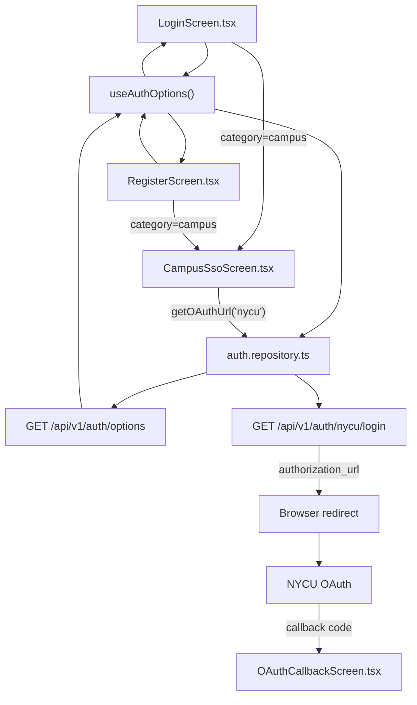
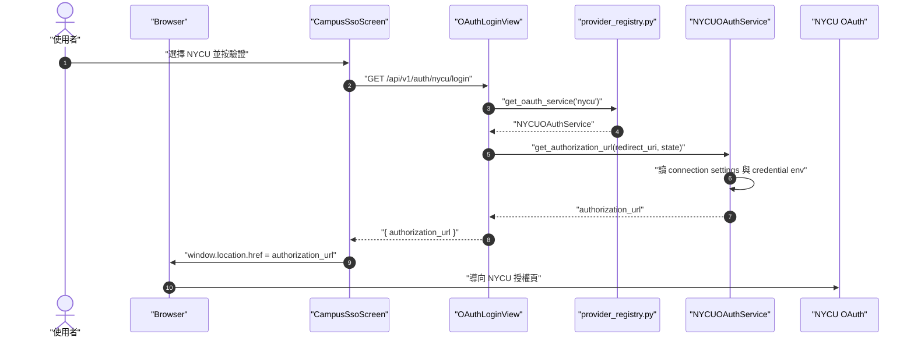
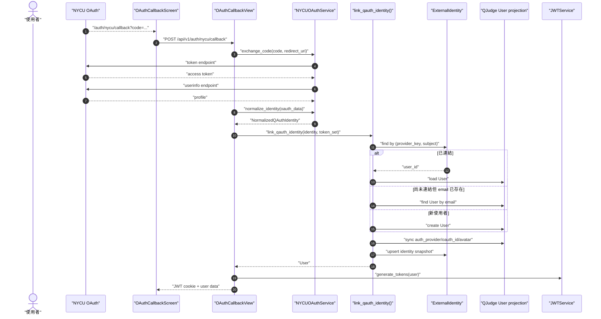

> 文件狀態：showcase，2026-06-26
> 適用範圍：`frontend/src/features/auth`、`backend/apps/users/auth`、`backend/apps/users/views/auth.py`
> 目標讀者：部署 NYCU Login 的維護者、準備把其他學校 SSO/OAuth 接進 QJudge 的開發者

# NYCU Login Showcase

這份文件用 `nycu` provider 示範一個學校 SSO/OAuth 如何從設定、前端顯示、後端 OAuth callback，最後落到 QJudge `User` 與登入 cookie。

本章重點是先看 NYCU Login 的責任分工，再照實作順序理解設定如何串起來。前半段說明 provider key、前端顯示資料、OAuth 連線資料與 account linking 的分工；後半段按登入流程走一遍，列出主要參數與 function 的用途。

## 核心觀念

QJudge 的外部登入可以先分成四個層級。每一層只處理一個問題，後面的實作步驟再對應到實際檔案、function 與 API。

| 層級 | 主要問題 | 責任 |
| --- | --- | --- |
| 前端顯示 | 使用者看得到哪些登入方式？ | 讀取 auth options，渲染校園 SSO、social login、provider 名稱與 logo |
| 後端登入入口 | 使用者點 provider 後要導向哪裡？ | 依 provider key dispatch，建立 authorization URL，接收 callback code |
| Provider service | 這個 IdP 的 OAuth/OIDC 細節是什麼？ | 讀取 endpoint、scope、credential，交換 token，取得 userinfo，normalize profile |
| 身份連結與 session | 外部身份要對到哪個 QJudge user？ | 查詢或建立 `ExternalIdentity` / `User`，同步 profile，簽發 QJudge JWT cookie |

這四層用同一個 provider key 串起來。NYCU 的 provider key 是 `nycu`，它會出現在前端 metadata、後端 registry、OAuth connection settings、login API 和 callback route。

| 資料流 | 說明 |
| --- | --- |
| `AuthProviderOption` | 提供前端顯示資料 |
| OAuth authorization URL | 將瀏覽器導向 NYCU |
| NYCU userinfo | 轉成 QJudge 可理解的 normalized identity |
| `ExternalIdentity` + `User` | 保存外部身份與 QJudge user 的對應 |
| JWT cookie | 建立 QJudge 自己的登入 session |

## 實作順序

### 步驟 1：選定 provider key 與 callback URL

先選定一個 provider key。NYCU 使用 `nycu`。這個 key 是整個登入流程的主線，從前端按鈕一路對到後端 provider service。

| 使用位置 | NYCU 範例 | 意義 |
| --- | --- | --- |
| Login API | `/api/v1/auth/nycu/login` | 前端取得 authorization URL |
| Callback API | `/api/v1/auth/nycu/callback` | 前端送回 provider callback code |
| Frontend callback route | `/auth/nycu/callback` | 瀏覽器從 NYCU 回到 QJudge 前端 |
| Provider registry | `"nycu": NYCUOAuthService` | 後端用 key 找 service class |
| Provider option | `"key": "nycu"` | 前端用 key 渲染與發起登入 |
| Provider connection | `"key": "nycu"` | `BaseOAuthService` 用 key 讀 OAuth 連線設定 |

Callback URL 由 `FRONTEND_URL` 和 provider key 組出：

```text
{FRONTEND_URL}/auth/nycu/callback
```

NYCU OAuth application 後台也要設定同一個 callback URL。若部署環境使用 Cloudflare Tunnel，`FRONTEND_URL` 應對齊使用者瀏覽器實際開啟的前端 origin。

| 參數 | 範例 | 用途 |
| --- | --- | --- |
| `FRONTEND_URL` | `https://qjudge.example.edu` | 後端組 OAuth callback URL |
| provider key | `nycu` | login、callback、metadata、registry、connection 共用的識別值 |
| callback path | `/auth/nycu/callback` | 前端接收 IdP redirect code 的 route |

### 步驟 2：接上後端 provider service

NYCU 的 service class 在 `backend/apps/users/auth/providers/nycu.py`：

```python
class NYCUOAuthService(BaseOAuthService):
    provider_key = "nycu"
    authorize_url_setting = "NYCU_OAUTH_AUTHORIZE_URL"
    token_url_setting = "NYCU_OAUTH_TOKEN_URL"
    userinfo_url_setting = "NYCU_OAUTH_USERINFO_URL"
    client_id_setting = "NYCU_OAUTH_CLIENT_ID"
    client_secret_setting = "NYCU_OAUTH_CLIENT_SECRET"
    default_scope = "profile"
```

Provider service 的欄位意義：

| 欄位 | 核心功能 |
| --- | --- |
| `provider_key` | 對應 provider key；`BaseOAuthService` 用它讀取 `QAUTH_PROVIDER_CONNECTIONS_JSON`，並寫入 `ExternalIdentity.provider_key` |
| `authorize_url_setting` | connection settings 沒提供 URL 時，回讀 Django settings 的欄位名 |
| `token_url_setting` | token endpoint 的 settings fallback 欄位名 |
| `userinfo_url_setting` | userinfo endpoint 的 settings fallback 欄位名 |
| `client_id_setting` | client id 的 settings fallback 欄位名 |
| `client_secret_setting` | client secret 的 settings fallback 欄位名 |
| `default_scope` | connection settings 沒提供 scope 時使用的 scope |

新增 provider 時，選定一個 `provider_key`，例如 `example-university`，並讓 metadata、registry、connection、API path 都使用同一個值。NYCU 舊資料中的 `nycu-oauth` 會由 migration 收斂成 `nycu`。

NYCU service 由 `provider_registry.py` 掛到 provider key：

```python
register_oauth_provider(
    key="nycu",
    service=NYCUOAuthService,
    type="oidc",
    category="campus",
    display_name="NYCU 國立陽明交通大學",
    display_name_i18n_key="auth.providers.nycu",
    logo_url="/illustrations/nycu-logo.png",
)
```

核心 function：

| Function | 位置 | 核心功能 |
| --- | --- | --- |
| `get_oauth_service(provider)` | `provider_registry.py` | 用 provider key 取得 provider service class |
| `get_authorization_url(redirect_uri, state)` | `BaseOAuthService` | 組出 IdP authorization URL |
| `exchange_code(code, redirect_uri)` | `BaseOAuthService` / subclass | 用 callback code 換 access token，取得 userinfo |
| `normalize_identity(oauth_data)` | `BaseOAuthService` | 把 provider callback data 轉成 `NormalizedQAuthIdentity` |
| `provider_token_set(oauth_data)` | `BaseOAuthService` | 把 provider token 包成 `ProviderTokenSet`，供後續 service 使用 |
| `_parse_user_info(raw)` | `NYCUOAuthService` | 把 NYCU userinfo 轉成統一 profile 欄位 |

NYCU 的 `_parse_user_info()` 目前輸出：

```python
{
    "username": raw.get("username"),
    "email": raw.get("email"),
    "oauth_id": raw.get("sub") or raw.get("id"),
    "avatar_url": extract_avatar_url(raw),
    "email_verified": raw.get("email_verified", True),
}
```

這一步的目標是把 provider profile 收斂成 `username`、`email`、`oauth_id`、`avatar_url` 這幾個欄位，讓後面的 account linking 不需要理解每個 provider 的 raw claim 格式。

### 步驟 3：註冊 provider 與前端顯示 metadata

NYCU 的 service 和前端顯示資料在 `backend/apps/users/auth/provider_registry.py` 一起註冊：

```python
register_oauth_provider(
    key="nycu",
    service=NYCUOAuthService,
    type="oidc",
    category="campus",
    display_name="NYCU 國立陽明交通大學",
    display_name_i18n_key="auth.providers.nycu",
    logo_url="/illustrations/nycu-logo.png",
)
```

同一筆註冊會被兩個地方使用：`/api/v1/auth/nycu/login` 透過 `key` 找到 `NYCUOAuthService`，`GET /api/v1/auth/options` 透過同一筆資料回傳前端要顯示的名稱、分類與 logo。

Provider option 參數：

| 參數 | 必要性 | 核心功能 |
| --- | --- | --- |
| `key` | 必要 | 對應 provider key；前端呼叫 `/api/v1/auth/{key}/login` |
| `type` | 建議 | 標示 provider 類型，例如 `oidc` 或 `oauth2` |
| `category` | 必要 | `campus` 顯示在校園 SSO 頁；`social` 顯示在一般 OAuth 按鈕列 |
| `display_name` | 必要 | 前端翻譯缺字時的 fallback 名稱 |
| `display_name_i18n_key` | 建議 | 文件化翻譯 key；前端目前會讀 `auth.providers.${key}.*` |
| `logo_url` | 選用 | provider logo 的 public asset URL |

前端實際使用的翻譯 key：

| i18n key | 用途 |
| --- | --- |
| `auth.providers.nycu.displayName` | NYCU provider 顯示名稱 |
| `auth.providers.nycu.description` | 校園 SSO 選擇頁的 provider 描述 |
| `auth.providerActions.loginWith` | 通用登入按鈕文案 |
| `auth.providerActions.registerWith` | 通用註冊按鈕文案 |

### 步驟 4：設定後端 OAuth 連線資料

OAuth endpoint、scope 和 credential env name 由 `QAUTH_PROVIDER_CONNECTIONS_JSON` 管理：

```env
FRONTEND_URL=https://qjudge.example.edu
NYCU_OAUTH_CLIENT_ID=replace-with-nycu-client-id
NYCU_OAUTH_CLIENT_SECRET=replace-with-nycu-client-secret
QAUTH_PROVIDER_CONNECTIONS_JSON='[
  {
    "key": "nycu",
    "type": "oidc",
    "authorization_url": "https://id.nycu.edu.tw/o/authorize/",
    "token_url": "https://id.nycu.edu.tw/o/token/",
    "userinfo_url": "https://id.nycu.edu.tw/api/profile/",
    "scope": "openid email profile",
    "client_id_env": "NYCU_OAUTH_CLIENT_ID",
    "client_secret_env": "NYCU_OAUTH_CLIENT_SECRET",
    "claim_mapping": {
      "subject": "sub",
      "email": "email",
      "name": "name",
      "avatar_url": "picture"
    }
  }
]'
```

Connection 參數：

| 參數 | 核心功能 |
| --- | --- |
| `key` | 對應 provider service 的 `provider_key` |
| `type` | 標示 provider protocol 類型 |
| `authorization_url` | IdP authorization endpoint |
| `token_url` | IdP token endpoint |
| `userinfo_url` | IdP userinfo endpoint |
| `scope` | authorization request 使用的 scope |
| `client_id_env` | 讀取 client id 的環境變數名稱 |
| `client_secret_env` | 讀取 client secret 的環境變數名稱 |
| `claim_mapping` | 描述 provider claim 與 QAuth identity 欄位的對應；目前 NYCU 實際 mapping 仍由 `_parse_user_info()` 執行 |

讀取流程由 `backend/apps/users/auth/provider_connections.py` 負責：

| Function | 核心功能 |
| --- | --- |
| `load_provider_connections(raw=None)` | 解析 `QAUTH_PROVIDER_CONNECTIONS_JSON`，回傳以 `key` 索引的 connection map |
| `resolve_provider_credentials(connection)` | 依 `client_id_env`、`client_secret_env` 從環境變數讀取 credential |
| `BaseOAuthService._provider_connection()` | 依 provider service 的 `provider_key` 找 connection |
| `BaseOAuthService._provider_url()` | 優先讀 connection URL，再回讀 Django settings |
| `BaseOAuthService._client_credentials()` | 優先讀 connection credential env，再回讀 Django settings |
| `BaseOAuthService._scope()` | 優先讀 connection scope，再使用 service `default_scope` |

### 步驟 5：前端載入 options 並渲染 NYCU 入口

前端進入登入或註冊頁時，會先呼叫：

```http
GET /api/v1/auth/options
```

NYCU provider 的回應形狀：

```json
{
  "success": true,
  "data": {
    "email_password_enabled": true,
    "providers": [
      {
        "key": "nycu",
        "type": "oidc",
        "category": "campus",
        "display_name": "NYCU 國立陽明交通大學",
        "display_name_i18n_key": "auth.providers.nycu",
        "logo_url": "/illustrations/nycu-logo.png"
      }
    ]
  }
}
```

前端元件分工：

| 元件或 function | 核心功能 |
| --- | --- |
| `useAuthOptions()` | 載入 `GET /api/v1/auth/options`，提供 `options` 與 `loading` |
| `getAuthOptions()` | repository 層呼叫 auth options API |
| `LoginScreen` | 依 `category="campus"` 顯示「學校認證」入口 |
| `RegisterScreen` | 使用同一份 provider options 顯示註冊入口 |
| `CampusSsoScreen` | 列出 `category="campus"` 的 provider，讓使用者選擇學校 |
| `getProviderDisplayName()` | 依 provider key 讀 i18n 顯示名稱，缺字時使用 `display_name` |
| `getProviderDescription()` | 依 provider key 讀 provider 描述 |
| `AuthProviderIcon` | 依 `logo_url` 顯示 logo，或用 provider 名稱產生 fallback icon |
| `getOAuthUrl(provider)` | 呼叫 `/api/v1/auth/{provider}/login`，取得 authorization URL |



### 步驟 6：啟動 OAuth login

使用者在 `CampusSsoScreen` 選擇 NYCU 並按「驗證」後，前端會呼叫：

```ts
const url = await getOAuthUrl("nycu");
window.location.href = url;
```

後端流程：



`OAuthLoginView` 的核心 function 與參數：

| 項目 | 核心功能 |
| --- | --- |
| `provider` | URL route param，NYCU 是 `nycu` |
| `get_oauth_service(provider)` | 取得 `NYCUOAuthService` |
| `redirect_uri` | `{FRONTEND_URL}/auth/{provider}/callback` |
| `state` | 每次 login request 產生的 OAuth state |
| `service.get_authorization_url()` | 組出 NYCU authorization URL |
| `authorization_url` | 前端要導向的 IdP URL |

### 步驟 7：處理 callback 與 account linking

NYCU 授權完成後，瀏覽器回到：

```text
/auth/nycu/callback?code=...
```

前端 `OAuthCallbackScreen` 會呼叫：

```ts
oauthCallback("nycu", code)
```

Callback 與 linking 流程：



Callback 階段的核心 function：

| Function | 核心功能 |
| --- | --- |
| `oauthCallback(provider, code)` | 前端 repository 呼叫後端 callback API |
| `OAuthCallbackView.post()` | 驗證 callback payload，串起 provider service、account linking、JWT response |
| `service.exchange_code()` | 用 code 向 NYCU token endpoint 換 token，再抓 userinfo |
| `service.normalize_identity()` | 產生 `NormalizedQAuthIdentity` |
| `service.provider_token_set()` | 產生 `ProviderTokenSet` |
| `link_qauth_identity()` | 找或建立 QJudge `User`，並 upsert `ExternalIdentity` |
| `build_conflict_response()` | 檢查考試中的多裝置接管狀態 |
| `JWTService.generate_tokens()` | 產生 QJudge access/refresh token |
| `record_login()` | 記錄本次登入來源與 jti |
| `token_cookie_response()` | 設定 JWT cookie 並回傳 user data |

`NormalizedQAuthIdentity` 欄位：

| 欄位 | NYCU 來源 | 用途 |
| --- | --- | --- |
| `provider_key` | `nycu` | account linking 使用的 provider 值 |
| `provider_subject` | `sub` 或 `id` | provider 內穩定使用者識別值 |
| `email` | `email` | 同 email user 合併與 user projection email |
| `username` | `username` | 建立新 QJudge user 時的 username 基礎 |
| `display_name` | `name` 或 `username` | 顯示名稱候選值 |
| `avatar_url` | provider avatar 欄位 | 同步 `UserProfile.avatar_url` |
| `raw_profile` | normalize 後 profile | 存入 `ExternalIdentity.profile_snapshot` |

Account linking 的順序：

1. 用 `(provider_key, provider_subject)` 查 `ExternalIdentity`。
2. 找到連結時，使用該 `ExternalIdentity.user`。
3. 沒有連結但 identity 有 email 時，找同 email 的 QJudge `User`。
4. 沒有同 email user 時，建立新的 QJudge `User` projection。
5. 同步 `User.auth_provider`、`User.oauth_id`、avatar 等 projection 欄位。
6. Upsert `ExternalIdentity`，保存 profile snapshot 與最後登入時間。
7. 產生 QJudge JWT cookie。

### 步驟 8：驗證設定

先確認公開 provider option：

```bash
curl -s http://localhost:8000/api/v1/auth/options \
  | jq '.data.providers[] | select(.key=="nycu")'
```

預期會看到 NYCU 的 `key`、`type`、`category`、`display_name`、`display_name_i18n_key` 和 `logo_url`。

再確認 authorization URL：

```bash
curl -s http://localhost:8000/api/v1/auth/nycu/login \
  | jq '.data.authorization_url'
```

檢查 URL 是否包含：

- NYCU authorize endpoint
- `client_id`
- `response_type=code`
- `redirect_uri={FRONTEND_URL}/auth/nycu/callback`
- `state`
- `scope`

最後用瀏覽器測：

1. 開啟 `/login`。
2. 進入「學校認證」。
3. 在 `/login/campus-sso` 選擇 NYCU。
4. 確認 NYCU 名稱、描述與 logo 顯示正確。
5. 按「驗證」後導向 NYCU OAuth 頁。
6. 完成 NYCU 授權後回到 `/auth/nycu/callback`。
7. 確認前端收到 QJudge user data，並導向登入後頁面。

## 套用到其他學校

用 NYCU 模式接另一間學校時，通常照這個順序處理：

1. 選定 provider key，例如 `example-university`。
2. 建立 `ExampleUniversityOAuthService(BaseOAuthService)`，填好 provider class 欄位與 `_parse_user_info()`。
3. 在 `provider_registry.py` 呼叫 `register_oauth_provider()`，同時填 service 與顯示 metadata。
4. 在 `QAUTH_PROVIDER_CONNECTIONS_JSON` 加入 OAuth endpoint、scope 和 credential env name。
5. 在前端 i18n 加入 `auth.providers.example-university.displayName` 與 `description`。
6. 在學校 IdP 後台設定 callback URL。
7. 用 auth options、authorization URL、瀏覽器登入流程逐段驗證。

如果新 provider 的 userinfo 格式和 NYCU 類似，主要工作會集中在 provider class 欄位、`_parse_user_info()`、provider registry 與 connection 設定。前端登入頁、generic OAuth views、account linking 和 JWT response 可以沿用同一條流程。
